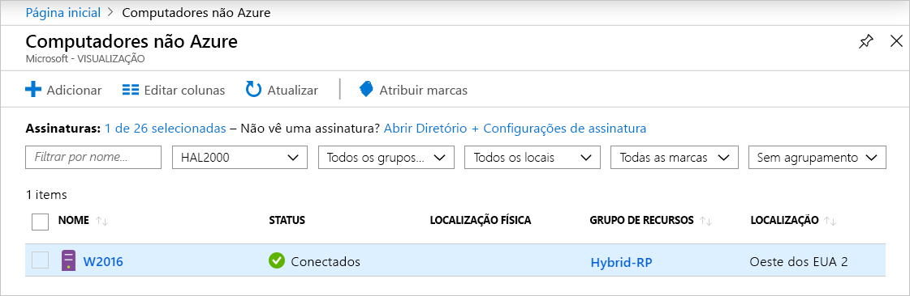

# <a name="quickstart-connect-machines-to-azure-using-azure-arc-for-servers---portal"></a>Início Rápido: Conectar computadores ao Azure usando o Azure Arc para servidores – Portal

Se você não tiver uma assinatura do Azure, crie uma [conta gratuita](https://azure.microsoft.com/free/?WT.mc_id=A261C142F) antes de começar.

## <a name="prerequisites"></a>Pré-requisitos

Examine os clientes compatíveis e a configuração de rede necessária na [Visão geral do Azure Arc para servidores](overview.md).

## <a name="generate-the-agent-install-script-using-the-azure-portal"></a>Gere o script de instalação do agente usando o portal do Azure

1. Inicie [https://aka.ms/hybridmachineportal ][aka_hybridmachineportal]
1. Clique em **+Adicionar**
1. Siga o assistente até o final
1. A última página tem um script gerado que você pode copiar (ou baixar).

O script deve ser executado na máquina de destino que você deseja conectar. Ele baixa o agente, instala e conecta a máquina como uma única operação.

Em servidores não Azure você deseja gerenciar:

1. O logon no servidor (usando o SSH, RDP ou comunicação remota do PowerShell)
1. Iniciar um shell: bash no Linux, PowerShell como administrador no Windows
1. Cole o script do portal e execute-o no servidor a ser conectado ao Azure.
1. A autenticação padrão para integração de um servidor individual é  *interativa* usando o 'login do dispositivo' do Azure. Ao executar o script, você verá uma mensagem semelhante a:

  ```none
  To sign in, use a web browser to open the page https://microsoft.com/devicelogin and enter the code B3V3NLWRF to authenticate.
  ```
  
   Abra um navegador e insira o código para autenticar. O navegador não precisa estar em execução no servidor que você está integrando, podendo estar em outro computador, como seu laptop.

1. Se você quiser autenticar de forma não interativa, siga as etapas em [Criar uma entidade de serviço](quickstart-onboard-powershell.md#create-a-service-principal-for-onboarding-at-scale) e modifique o script gerado no Portal.

> [!NOTE]
> Se você estiver usando o Internet Explorer no servidor pela primeira vez para fazer logon, ocorrerá um erro. Basta reabrir o navegador e fazer isso novamente.

## <a name="execute-the-script-on-target-nodes"></a>Executar o script nos nós de destino

Faça logon em cada nó e execute o script gerado no portal. Depois que o script for concluído com êxito, vá para o portal do Azure e verifique se o servidor foi conectado com êxito.



## <a name="clean-up"></a>Limpar

Para desconectar um computador do Azure Arc para servidores, você precisa executar duas etapas.

1. Selecione o computador no [portal](https://aka.ms/hybridmachineportal), clique no botão de reticências (`...`) e selecione **Excluir**.
1. Desinstale o agente do computador.

## <a name="next-steps"></a>Próximas etapas

> [!div class="nextstepaction"]
> [Atribua uma política a computadores conectados](../../governance/policy/assign-policy-portal.md)