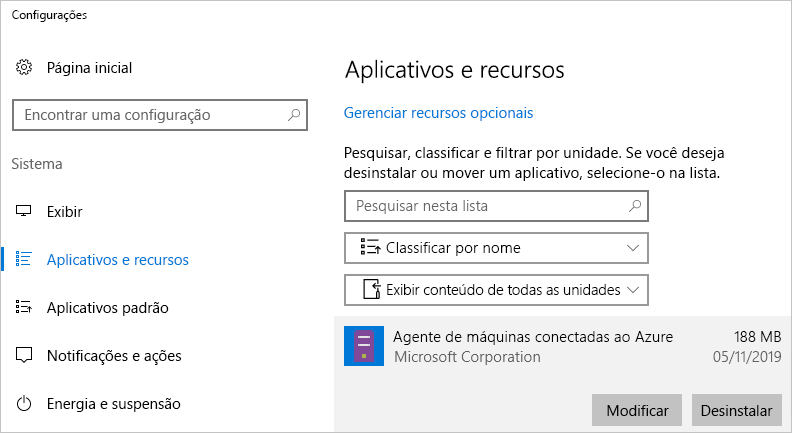

# <a name="quickstart-connect-machines-to-azure-using-azure-arc-for-servers---powershell"></a>Início Rápido: Conectar computadores ao Azure usando o Azure Arc para servidores – PowerShell

Se você não tiver uma assinatura do Azure, crie uma [conta gratuita](https://azure.microsoft.com/free/?WT.mc_id=A261C142F) antes de começar.

## <a name="prerequisites"></a>Pré-requisitos

Examine os clientes compatíveis e a configuração de rede necessária na [Visão geral do Azure Arc para servidores](overview.md).

## <a name="create-a-service-principal-for-onboarding-at-scale"></a>Criar uma entidade de serviço para integração em escala

Uma entidade de serviço é uma identidade de gerenciamento limitada especial que recebe apenas a permissão mínima necessária para conectar computadores ao Azure. Isso é mais seguro do que usar uma conta mais poderosa, tal como a de um Administrador de Locatários. A entidade de serviço é usada somente durante a integração. Você pode excluir com segurança a entidade de serviço depois de conectar os servidores desejados.

> [!NOTE]
> Essa etapa é recomendável, mas não obrigatória.

### <a name="steps-to-create-the-service-principal"></a>Etapas para criar a entidade de serviço

Neste exemplo, usaremos o [Azure PowerShell](/powershell/azure/install-az-ps) para criar um SPN (nome da entidade de serviço). Como alternativa, você pode seguir as etapas listadas em [Criar uma entidade de serviço usando o portal do Azure](../../active-directory/develop/howto-create-service-principal-portal.md) para essa tarefa.

A função `Azure Connected Machine Onboarding` contém apenas as permissões necessárias para a integração. Você pode definir a permissão de um SPN para permitir que seu escopo cubra um grupo de recursos ou uma assinatura.

Você deverá armazenar a saída do cmdlet [`New-AzADServicePrincipal`](/powershell/module/az.resources/new-azadserviceprincipal) ou não poderá recuperar a senha para usar em uma etapa posterior.

```azurepowershell-interactive
$sp = New-AzADServicePrincipal -DisplayName "Arc-for-servers" -Role "Azure Connected Machine Onboarding"
$sp
```

```output
Secret                : System.Security.SecureString
ServicePrincipalNames : {ad9bcd79-be9c-45ab-abd8-80ca1654a7d1, https://Arc-for-servers}
ApplicationId         : ad9bcd79-be9c-45ab-abd8-80ca1654a7d1
ObjectType            : ServicePrincipal
DisplayName           : Hybrid-RP
Id                    : 5be92c87-01c4-42f5-bade-c1c10af87758
Type                  :
```

Agora, recupere a senha usando o PowerShell.

```azurepowershell-interactive
$credential = New-Object pscredential -ArgumentList "temp", $sp.Secret
$credential.GetNetworkCredential().password
```

Na saída, copie a **senha** e a **ApplicationId** (da etapa anterior) e armazene-as para mais tarde em um local seguro, assim como o repositório secreto da ferramenta de configuração do servidor. Se esquecer ou perder sua senha de SPN, você poderá redefini-la usando o cmdlet [`New-AzADSpCredential`](/powershell/module/azurerm.resources/new-azurermadspcredential).

No script de integração do agente de instalação:

* A propriedade **ApplicationId** é usada para o parâmetro `--service-principal-id` usado no agente de instalação
* A propriedade **senha** é usada para o parâmetro `--service-principal-secret` no agente de instalação.

## <a name="manually-install-the-agent-and-connect-to-azure"></a>Instalar manualmente o agente e conectar-se ao Azure

O guia a seguir permite que você conecte um computador ao Azure fazendo logon no computador e executando as etapas. Você também pode conectar computadores ao Azure [por meio do portal](quickstart-onboard-portal.md).

### <a name="download-and-install-the-agent"></a>Baixe e instale o agente

A instalação do pacote do agente requer acesso de administrador local ou raiz no servidor de destino, mas não requer acesso ao Azure.

#### <a name="linux"></a>Linux

Para servidores **Linux**, o agente é distribuído por meio do [repositório de pacotes da Microsoft](https://packages.microsoft.com) usando o formato de pacote preferencial para a distribuição (.RPM ou .DEB).

> [!NOTE]
> Durante a versão prévia pública, apenas um pacote foi liberado, o que é adequado para o Ubuntu 16.04 ou 18.04.

<!-- What about this aks? -->
A opção mais simples é registrar o repositório de pacotes e, em seguida, instalar o pacote usando o gerenciador de pacotes da distribuição.
O script de Bash localizado em [https://aka.ms/azcmagent](https://aka.ms/azcmagent) executa as ações a seguir:

1. Configura o computador host para download de `packages.microsoft.com`.
2. Instala o pacote do provedor de recursos híbrido.
3. Opcionalmente, configura o agente para a operação de proxy, se você especificar `--proxy`.

O script também contém verificações de distribuições compatíveis e incompatíveis, bem como a detecção de permissões necessárias para a instalação.

O exemplo a seguir baixa o agente e o instala, sem nenhuma das verificações condicionais.

```bash
# Download the installation package
wget https://aka.ms/azcmagent -O ~/Install_linux_azcmagent.sh

# Install the connected machine agent. Omit the '--proxy "{proxy-url}"' parameters if proxy is not needed
bash ~/Install_linux_azcmagent.sh--proxy "{proxy-url}"
```

> [!NOTE]
> Se preferir não fazer referência ao repositório de pacotes da Microsoft, você poderá copiar o arquivo de pacote desse local para o repositório interno.

#### <a name="windows"></a>Windows

Para o **Windows**, o agente é empacotado em um arquivo do Windows Installer (`.MSI`) e pode ser baixado em [https://aka.ms/AzureConnectedMachineAgent](https://aka.ms/AzureConnectedMachineAgent), que está hospedado em [https://download.microsoft.com](https://download.microsoft.com).

```powershell
# Download the package
Invoke-WebRequest -Uri https://aka.ms/AzureConnectedMachineAgent -OutFile AzureConnectedMachineAgent.msi

# Install the package
msiexec /i AzureConnectedMachineAgent.msi /l*v installationlog.txt /qn | Out-String
```

> [!NOTE]
> No Linux, executar o script de instalação novamente atualizará automaticamente para a versão mais recente. No Windows, você deve desinstalar o "agente do computador conectado ao Azure" antes de executar o instalador novamente para atualizar.

### <a name="connecting-to-azure"></a>Como conectar-se ao Azure

Uma vez instalado, você pode gerenciar e configurar o agente usando uma ferramenta de linha de comando chamada `azcmagent.exe`. O agente está localizado em `/opt/azcmagent/bin` no Linux e em `$env:programfiles\AzureConnectedMachineAgent` no Windows.

No Windows, abra o PowerShell como administrador em um nó de destino e execute:

```powershell
& "$env:ProgramFiles\AzureConnectedMachineAgent\azcmagent.exe" connect `
  --service-principal-id "{your-spn-appid}" `
  --service-principal-secret "{your-spn-password}" `
  --resource-group "{your-resource-group-name}" `
  --tenant-id "{your-tenant-id}" `
  --location "{location-of-your-resource-group}" `
  --subscription-id "{your-subscription-id}"
```

No Linux, abra um shell e execute

<!-- Same command for linux?-->
```bash
azcmagent connect \
  --service-principal-id "{your-spn-appid}" \
  --service-principal-secret "{your-spn-password}" \
  --resource-group "{your-resource-group-name}" \
  --tenant-id "{your-tenant-id}" \
  --location "{location-of-your-resource-group}" \
  --subscription-id "{your-subscription-id}"
```

Parâmetros:

* `tenant-id`: A GUID do locatário. Você pode encontrá-lo no portal do Azure selecionando **Azure Active Directory** -> **Propriedades** -> **ID de Diretório**.
* `subscription-id`: O GUID da assinatura no Azure em que você deseja conectar seu computador.
* `resource-group`: O grupo de recursos em que você deseja conectar seu computador.
* `location`: Confira [Regiões e locais do Azure](https://azure.microsoft.com/global-infrastructure/regions/). Essa localização pode ser a mesmo ou uma diferente, assim como ocorre com a localização do grupo de recursos. Para a versão prévia pública, há suporte para o serviço em **WestUS2** e **Europa Ocidental**.
* `resource-name`:  (*Opcional*) Usado para a representação de recursos do Azure do seu computador local. Se você não especificar esse valor, o nome do host do computador será usado.

Você pode encontrar mais informações sobre a ferramenta 'azcmagent' em [Referência do Azcmagent](azcmagent-reference.md).
<!-- Isn't this still needed to view machines? -->

Após a conclusão bem-sucedida, o computador estará conectado ao Azure. Você pode exibir o computador no portal do Azure visitando [https://aka.ms/hybridmachineportal](https://aka.ms/hybridmachineportal).


### <a name="proxy-server-configuration"></a>Configuração do servidor proxy

#### <a name="linux"></a>Linux

<!-- New proxy name? -->

Para **Linux**, se o servidor exigir um servidor proxy, você poderá realizar uma das seguintes ações:

* Executar o script `install_linux_hybrid_agent.sh` na seção [Instalar o Agente](#download-and-install-the-agent) acima, com `--proxy`.
* Se você já tiver instalado o agente, executar o comando `/opt/azcmagent/bin/hybridrp_proxy add https://{proxy-url}:{proxy-port}`, que configura o proxy e reinicia o agente.

#### <a name="windows"></a>Windows

Para o **Windows**, se o servidor exigir o servidor proxy para acessar recursos da Internet, execute o comando a seguir para definir a variável de ambiente do servidor proxy. Isso permite que o agente use o servidor proxy para acesso à Internet.

```powershell
# If a proxy server is needed, execute these commands with actual proxy URL
[Environment]::SetEnvironmentVariable("https_proxy", "{https:\\proxy-url:proxyport}", "Machine")
$env:https_proxy = [System.Environment]::GetEnvironmentVariable("https_proxy","Machine")
# The agent service needs to be restarted after the proxy environment variable is set in order for the changes to take effect.
Restart-Service -Name himds
```

> [!NOTE]
> Proxies autenticados não são compatíveis com a versão prévia pública.

## <a name="clean-up"></a>Limpar

Para desconectar um computador do Azure Arc para servidores, você precisa executar duas etapas.

1. Selecione o computador no [portal](https://aka.ms/hybridmachineportal), clique no botão de reticências (`...`) e selecione **Excluir**.
1. Desinstale o agente do computador.

   No Windows, você pode usar o painel de controle "Aplicativos e Recursos" para desinstalar o agente.
  
  

   Se você quiser criar um script para a desinstalação, será possível usar o exemplo a seguir, que recupera o **PackageID** e desinstalar o agente usando `msiexec /X`.

   Examine a chave do registro `HKEY_LOCAL_MACHINE\Software\Microsoft\Windows\CurrentVersion\Uninstall` e localize o **PackageID**. Em seguida, você poderá desinstalar o agente usando `msiexec`.

   O exemplo a seguir demonstra a desinstalação do agente.

   ```powershell
   Get-ChildItem -Path HKLM:\Software\Microsoft\Windows\CurrentVersion\Uninstall | `
   Get-ItemProperty | `
   Where-Object {$_.DisplayName -eq "Azure Connected Machine Agent"} | `
   ForEach-Object {MsiExec.exe /Quiet /X "$($_.PsChildName)"}
   ```

   No Linux, execute o comando a seguir para desinstalar o agente.

   ```bash
   sudo apt purge hybridagent
   ```

## <a name="next-steps"></a>Próximas etapas

> [!div class="nextstepaction"]
> [Atribua uma política a computadores conectados](../../governance/policy/assign-policy-portal.md)
