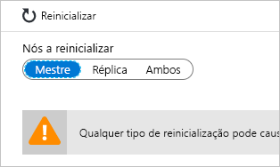
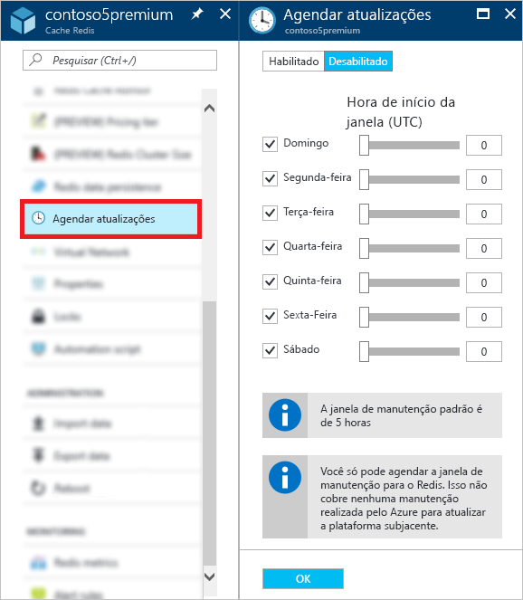

# Como administrar o Cache Redis do Azure
Este tópico descreve como executar tarefas administrativas, como [reinicializar](#reboot) e [agendar atualizações](#schedule-updates) para as instâncias do Cache Redis do Azure.

[!INCLUDE [updated-for-az](../../includes/updated-for-az.md)]

## Reboot
A folha **Reinicializar** permite a reinicialização de um ou mais nós do cache. Essa funcionalidade de reinicialização permite que você teste seu aplicativo para garantir a resiliência caso ocorra uma falha de um nó de cache.

Selecione os nós a serem reinicializados e clique em **Reinicializar**.

Se tiver um cache premium com clustering habilitado, você poderá selecionar quais fragmentos do cache serão reinicializados.

Para reinicializar um ou mais nós do cache, selecione os nós desejados e clique em **Reinicializar**. Se tiver um cache premium com clustering habilitado, escolha os fragmentos que deseja reinicializar e clique em **Reinicializar**. Depois de alguns minutos, os nós selecionados são reinicializados e voltam a ficar online alguns minutos mais tarde.

O impacto em aplicativos cliente varia de acordo com quais nós você reinicializa.

* **Mestre** -quando o nó primário é reinicializado, o cache do Azure para Redis faz failover para o nó de réplica e promove-o para o primário. Durante esse failover, pode haver um breve intervalo em que as conexões podem falhar para o cache.
* **Réplica** – quando o nó de réplica é reinicializado, normalmente não há impacto para os clientes de cache.
* **Primária e réplica** -quando ambos os nós de cache são reinicializados, todos os dados são perdidos no cache e as conexões com o cache falham até que o nó primário volte a ficar online. Se você tiver configurado [persistência de dados](cache-how-to-premium-persistence.md), o backup mais recente será restaurado quando o cache voltar a ficar online, mas quaisquer gravações em cache que tiverem ocorrido após o backup mais recente serão perdidas.
* **Nós de um cache Premium com cluster habilitado** – quando você reinicializa um ou mais nós de um cache Premium com clustering habilitado, o comportamento dos nós selecionados é o mesmo de quando você reinicializa o nó ou nós correspondentes de um cache não clusterizado.

## Perguntas frequentes sobre reinicialização
* [Qual nó devo reinicializar para testar o aplicativo?](#which-node-should-i-reboot-to-test-my-application)
* [Posso reinicializar o cache para limpar conexões de cliente?](#can-i-reboot-the-cache-to-clear-client-connections)
* [Perderei dados do cache se eu fizer uma reinicialização?](#will-i-lose-data-from-my-cache-if-i-do-a-reboot)
* [Posso reinicializar o cache usando o PowerShell, a CLI ou outras ferramentas de gerenciamento?](#can-i-reboot-my-cache-using-powershell-cli-or-other-management-tools)

### Qual nó devo reinicializar para testar o aplicativo?
Para testar a resiliência do aplicativo contra falhas do nó principal do cache, reinicialize o nó **Mestre** . Para testar a resiliência do seu aplicativo contra falha do nó da réplica, reinicialize o nó da **réplica** . Para testar a resiliência do aplicativo contra falha total do cache, reinicialize **Ambos** os nós.

### Posso reinicializar o cache para limpar conexões de cliente?
Sim, se você reinicializar o cache, todas as conexões de cliente serão limpas. Reinicializar pode ser útil quando todas as conexões de cliente são usadas, por exemplo, devido a um erro lógico ou um bug no aplicativo cliente. Cada tipo de preços tem diferentes [limites de conexão do cliente](cache-configure.md#default-redis-server-configuration) para os vários portes, e quando os limites são atingidos, não são mais aceitas mais conexões de cliente. Reinicializar o cache fornece uma maneira de limpar todas as conexões de cliente.

> [!IMPORTANT]
> Se você reinicializar o cache para limpar as conexões de cliente, o StackExchange.Redis se reconectará automaticamente quando o nó do Redis estiver online novamente. Se o problema subjacente não for resolvido, as conexões de cliente continuarão a ser usadas.
> 
> 

### Perderei dados do cache se eu fizer uma reinicialização?
Se você reinicializar os nós **mestre** e de **réplica** , todos os dados no cache (ou nesse fragmento, se você estiver usando um cache Premium com clustering habilitado), poderão ser perdidos, mas isso não será garantido. Se você tiver configurado [persistência de dados](cache-how-to-premium-persistence.md), o backup mais recente será restaurado quando o cache voltar a ficar online, mas quaisquer gravações em cache que tiverem ocorrido após o backup ter sido realizado serão perdidas.

Se você reinicializar apenas um dos nós, normalmente os dados não serão perdidos, mas isso ainda poderá ocorrer. Por exemplo, se o nó primário for reinicializado e uma gravação de cache estiver em andamento, os dados da gravação do cache serão perdidos. Outro cenário de perda de dados ocorre se você reinicializa um nó e o outro nó ocorre fica inoperante devido a uma falha ao mesmo tempo. Para saber mais sobre as possíveis causas da perda de dados, confira [What happened to my data in Redis?](https://gist.github.com/JonCole/b6354d92a2d51c141490f10142884ea4#file-whathappenedtomydatainredis-md) (O que aconteceu com meus dados no Redis?)

### Posso reinicializar o cache usando o PowerShell, a CLI ou outras ferramentas de gerenciamento?
Sim, para ver as instruções do PowerShell, consulte [Para reinicializar um Cache Redis do Azure](cache-how-to-manage-redis-cache-powershell.md#to-reboot-an-azure-cache-for-redis).

## Agende atualizações
A folha **agendar atualizações** permite designar uma janela de manutenção para sua instância de cache. Uma janela de manutenção permite que você controle os dias e as horas de uma semana durante as quais as VMs que hospedam o cache podem ser atualizadas. O cache do Azure para Redis fará um melhor esforço para iniciar e concluir a atualização do software do Redis Server na janela de tempo especificada que você definir.

> [!NOTE] 
> A janela de manutenção aplica-se a atualizações e atualizações do Redis Server para o sistema operacional das VMs que hospedam o cache. A janela de manutenção não se aplica às atualizações do sistema operacional do host aos hosts que hospedam as VMs de cache ou outros componentes de rede do Azure. Em casos raros, onde os caches são hospedados em modelos mais antigos (você pode saber se o cache está em um modelo mais antigo se o nome DNS do cache for resolvido para um sufixo de "cloudapp.net", "chinacloudapp.cn", "usgovcloudapi.net" ou "cloudapi.de"), a janela de manutenção também não se aplicará às atualizações do SO convidado.
>

Para especificar uma janela de manutenção, marque os dias desejados, especifique a hora de início da janela de manutenção para cada dia e clique em **OK**. Observe que o horário da janela de manutenção é em UTC. 

A janela de manutenção padrão e mínima para atualizações é de cinco horas. Esse valor não é configurável no portal do Azure, mas você pode configurá-lo no PowerShell usando o parâmetro `MaintenanceWindow` do cmdlet [New-AzRedisCacheScheduleEntry](/powershell/module/az.rediscache/new-azrediscachescheduleentry). Para saber mais, confira Posso gerenciar as atualizações agendadas usando o PowerShell, a CLI ou outras ferramentas de gerenciamento?

## Perguntas frequentes sobre agendamento de atualizações
* [Quando as atualizações ocorrerão se eu não usar o recurso de agendamento de atualizações?](#when-do-updates-occur-if-i-dont-use-the-schedule-updates-feature)
* [Que tipos de atualizações são feitas durante a janela de manutenção agendada?](#what-type-of-updates-are-made-during-the-scheduled-maintenance-window)
* [Posso gerenciar as atualizações agendadas usando o PowerShell, a CLI ou outras ferramentas de gerenciamento?](#can-i-managed-scheduled-updates-using-powershell-cli-or-other-management-tools)

### Quando as atualizações ocorrerão se eu não usar o recurso de agendamento de atualizações?
Se você não especificar uma janela de manutenção, as atualizações poderão ser feitas a qualquer momento.

### Que tipos de atualizações são feitas durante a janela de manutenção agendada?
Apenas as atualizações do servidor Redis são realizadas durante a janela de manutenção agendada. A janela de manutenção se aplica a atualizações do Azure ou do sistema operacional da VM.

### Posso gerenciar as atualizações agendadas usando o PowerShell, a CLI ou outras ferramentas de gerenciamento?
Sim, você pode gerenciar as atualizações agendadas usando os cmdlets do PowerShell a seguir:

* [Get-AzRedisCachePatchSchedule](/powershell/module/az.rediscache/get-azrediscachepatchschedule)
* [New-AzRedisCachePatchSchedule](/powershell/module/az.rediscache/new-azrediscachepatchschedule)
* [New-AzRedisCacheScheduleEntry](/powershell/module/az.rediscache/new-azrediscachescheduleentry)
* [Remove-AzRedisCachePatchSchedule](/powershell/module/az.rediscache/remove-azrediscachepatchschedule)

## Próximas etapas
Saiba mais sobre o cache do Azure para recursos do Redis.

* [Cache do Azure para camadas de serviço Redis](cache-overview.md#service-tiers)

