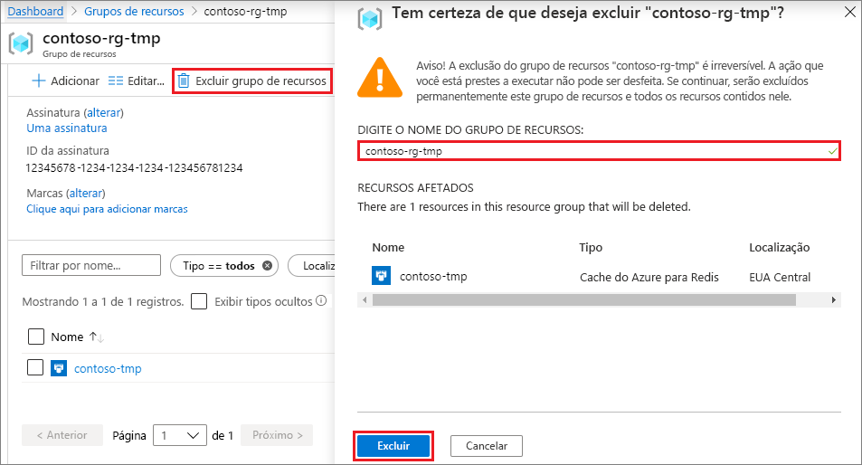

# <a name="quickstart-use-azure-cache-for-redis-in-python"></a>Início Rápido: Usar o Cache do Azure para Redis no Python

Neste artigo, você incorporará o Cache do Azure para Redis a um aplicativo Python para ter acesso a um cache seguro e dedicado que pode ser acessado de qualquer aplicativo no Azure.

## <a name="skip-to-the-code-on-github"></a>Pular para o código no GitHub

Se você quiser pular diretamente para o código, confira o [Guia de início rápido do Python](https://github.com/Azure-Samples/azure-cache-redis-samples/tree/main/quickstart/python) no GitHub.

## <a name="prerequisites"></a>Pré-requisitos

- Assinatura do Azure - [criar uma gratuitamente](https://azure.microsoft.com/free/)
- [Python 2 ou 3](https://www.python.org/downloads/)

## <a name="create-an-azure-cache-for-redis-instance"></a>Criar uma instância de Cache do Azure para Redis
[!INCLUDE [redis-cache-create](../../includes/redis-cache-create.md)]

[!INCLUDE [redis-cache-create](../../includes/redis-cache-access-keys.md)]

## <a name="install-redis-py"></a>Instale o redis-py

[Redis-py](https://github.com/andymccurdy/redis-py) é uma interface de Python para o Cache do Azure para Redis. Use a ferramenta de pacotes do Python, *pip*, para instalar o pacote *redis-py* com um prompt de comando. 

O exemplo a seguir usa *pip3* para Python 3 para instalar o *redis-py* no Windows 10 por meio de um prompt de comando do administrador.


## <a name="read-and-write-to-the-cache"></a>Ler e gravar no cache

Execute o Python na linha de comando e teste seu cache usando o código a seguir. Substitua `<Your Host Name>` e `<Your Access Key>` pelos valores da sua instância do Cache do Azure para Redis. O nome do seu host tem o formato *\<DNS name>.redis.cache.windows.net*.

```python
>>> import redis
>>> r = redis.StrictRedis(host='<Your Host Name>',
        port=6380, db=0, password='<Your Access Key>', ssl=True)
>>> r.set('foo', 'bar')
True
>>> r.get('foo')
b'bar'
```

> [!IMPORTANT]
> No caso do Cache do Azure para Redis versão 3.0 ou superior, a verificação do certificado TLS/SSL é aplicada. ssl_ca_certs deve ser definido explicitamente ao se conectar ao Cache do Azure para Redis. No caso do RedHat Linux, ssl_ca_certs está no módulo de certificado */etc/pki/tls/certs/ca-bundle.crt*.

## <a name="create-a-python-sample-app"></a>Criar um aplicativo de exemplo do Python

Crie um novo arquivo de texto, adicione o script a seguir e salve o arquivo como *PythonApplication1.py*. Substitua `<Your Host Name>` e `<Your Access Key>` pelos valores da sua instância do Cache do Azure para Redis. O nome do seu host tem o formato *\<DNS name>.redis.cache.windows.net*.

```python
import redis

myHostname = "<Your Host Name>"
myPassword = "<Your Access Key>"

r = redis.StrictRedis(host=myHostname, port=6380,
                      password=myPassword, ssl=True)

result = r.ping()
print("Ping returned : " + str(result))

result = r.set("Message", "Hello!, The cache is working with Python!")
print("SET Message returned : " + str(result))

result = r.get("Message")
print("GET Message returned : " + result.decode("utf-8"))

result = r.client_list()
print("CLIENT LIST returned : ")
for c in result:
    print("id : " + c['id'] + ", addr : " + c['addr'])
```

Execute o *PythonApplication1.py* com o Python. Você deve ver resultados como os do exemplo a seguir:


## <a name="clean-up-resources"></a>Limpar os recursos

Se você não pretende mais usar o grupo de recursos do Azure, ou os recursos criados neste início rápido, pode excluí-los para evitar encargos.

> [!IMPORTANT]
> A exclusão de um grupo de recursos é irreversível, e o que significa que todos os recursos nesse grupo são permanentemente excluídos. Se você criou sua instância do Cache do Azure para Redis em um grupo de recursos existente que deseja manter, poderá excluir apenas o cache selecionando **Excluir** na página **Visão geral** do cache. 

Para excluir o grupo de recursos e sua instância do Redis do Cache do Azure:

1. No [portal do Azure](https://portal.azure.com), procure e selecione **Grupos de recursos**.
1. Na caixa de texto **Filtrar por nome**, digite o nome do grupo de recursos que contém sua instância de cache e selecione-o nos resultados da pesquisa. 
1. Na página do grupo de recursos, selecione **Excluir grupo de recursos**.
1. Digite o nome do grupo de recursos e selecione **Excluir**.
   
   

## <a name="next-steps"></a>Próximas etapas

> [!div class="nextstepaction"]
> [Crie um aplicativo Web ASP.NET simples que usa um Cache do Azure para Redis.](./cache-web-app-howto.md)
