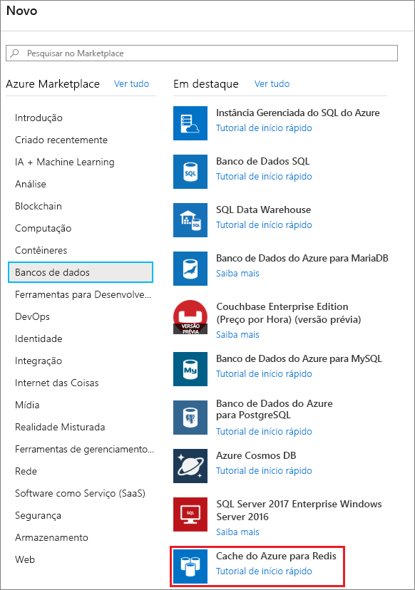
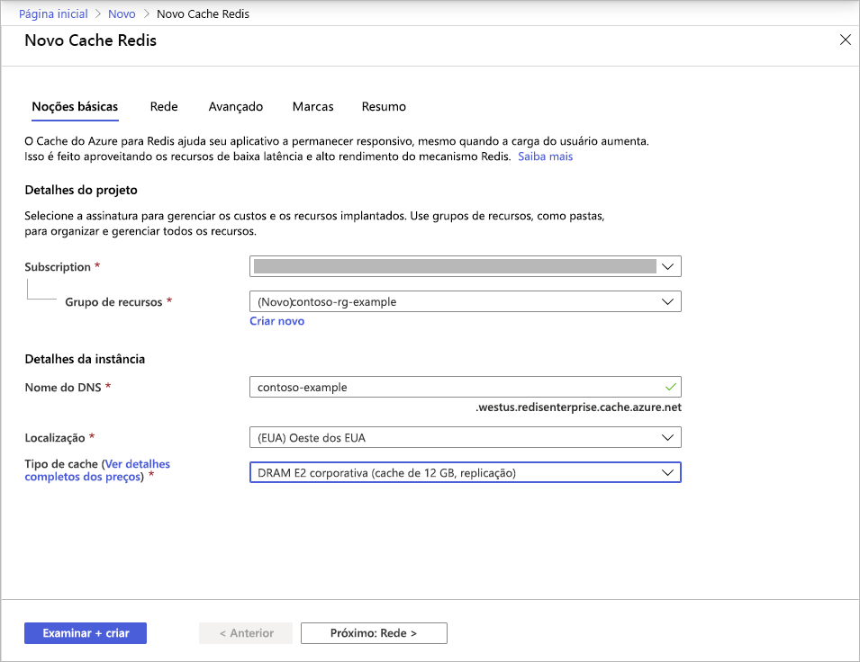
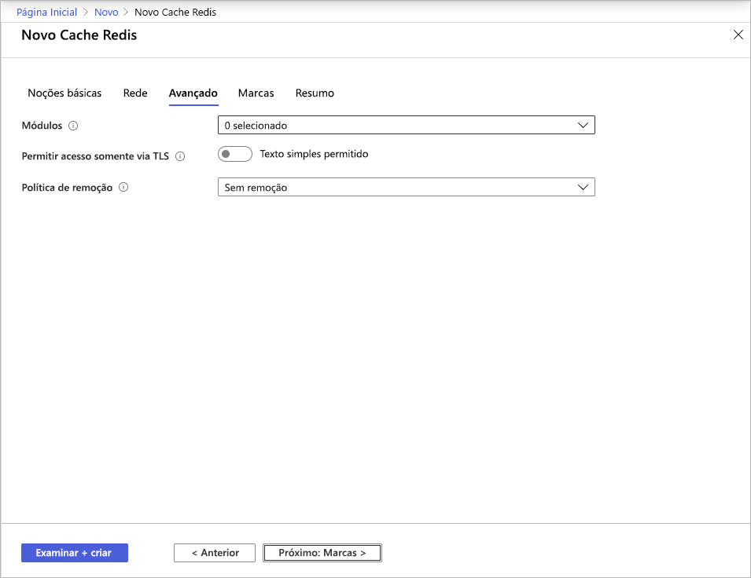
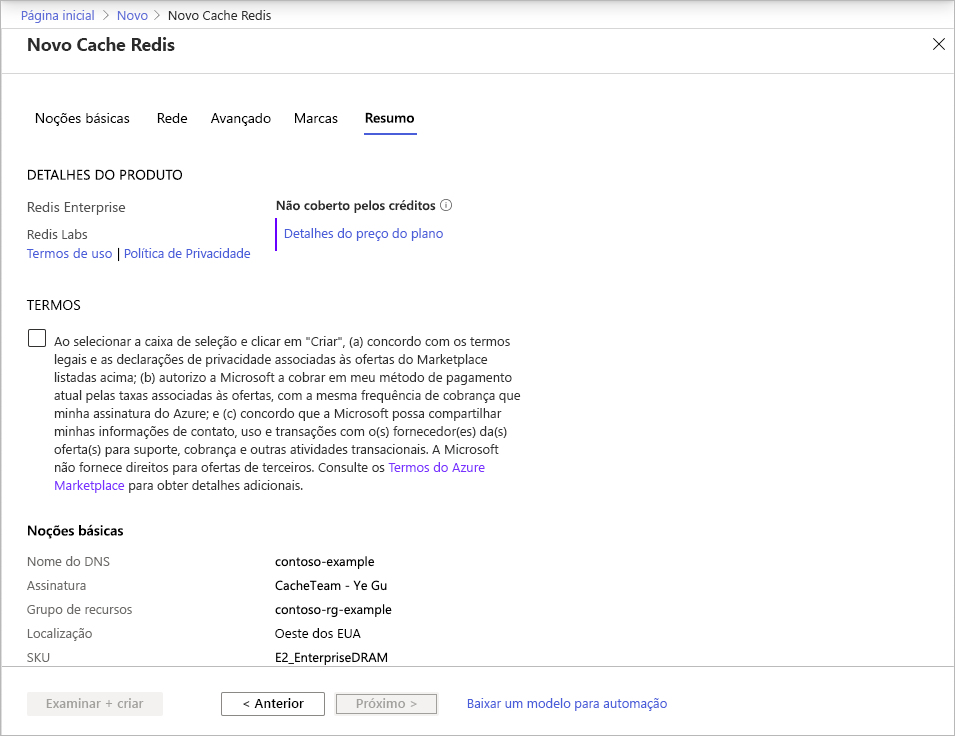

# Início Rápido: Criar um cache de camada Enterprise (versão prévia)

As camadas Enterprise do Cache do Azure para Redis fornecem [Redis Enterprise](https://redislabs.com/redis-enterprise/) totalmente integrado e gerenciado no Azure. No momento, elas estão disponíveis como uma versão prévia. Há duas novas camadas nessa versão prévia:
* Enterprise, que usa DRAM (memória volátil) em uma máquina virtual para armazenar dados
* Enterprise SSD, que usa NVMe (memória não volátil) e memória volátil para armazenar dados.

Não há nenhum custo para ingressar na versão prévia. Registre-se por meio do [Azure Marketplace](https://aka.ms/redispreviewsignup/) **Entre em contato comigo** se você estiver interessado. Temos um número muito limitado de vagas para participantes e não podemos garantir que você será aceito na versão prévia.

## Pré-requisitos

É necessário ter uma assinatura do Azure antes de começar. Se você não tiver uma, [crie uma conta gratuita](https://azure.microsoft.com/free/) primeiro.

## Criar um cache
1. Para criar um cache, entre no portal do Azure usando o link em seu convite de versão prévia e selecione **Criar um recurso**.

   > [!IMPORTANT] 
   > Não assine o *Cache do Azure para Redis, Camadas Enterprise* no Marketplace diretamente.
   > Esta etapa é executada automaticamente pela interface do usuário do portal do Cache do Azure para Redis.
   >
   
1. Na página **Novo**, selecione **Bancos de dados** e, em seguida, **Cache do Azure para Redis**.
   
   
   
1. Na página **Novo Cache Redis**, defina as configurações para o novo cache.
   
   | Configuração      | Valor sugerido  | Descrição |
   | ------------ |  ------- | -------------------------------------------------- |
   | **Assinatura** | Clique na lista suspensa e selecione sua assinatura. | A assinatura na qual essa nova instância do Cache do Azure para Redis será criada. | 
   | **Grupo de recursos** | Clique na lista suspensa e selecione um grupo de recursos ou selecione **Criar** e insira um novo nome de grupo de recursos. | Nome do grupo de recursos no qual o cache e outros recursos serão criados. Ao colocar todos os seus recursos de aplicativos em um só grupo de recursos, você pode gerenciá-los ou excluí-los juntos com facilidade. | 
   | **Nome DNS** | Insira um nome global exclusivo. | O nome de cache precisa ser uma cadeia de caracteres com 1 a 63 caracteres que contém somente números, letras ou hifens. O nome precisa começar e terminar com um número ou uma letra e não pode conter hifens consecutivos. O *nome do host* da instância de cache será *\<nome DNS>.<Azure region>.redisenterprise.cache.azure.net*. | 
   | **Localidade** | Clique na lista suspensa e selecione uma localização. | As camadas Enterprise estão disponíveis no Oeste dos EUA, no Leste dos EUA 2 e no Oeste da Europa. |
   | **Camada de cache** | Selecione no menu suspenso uma camada *Enterprise DRAM* ou *Enterprise SSD* e um tamanho. |  A camada determina o tamanho, o desempenho e os recursos disponíveis para o cache. |
   
    

1. Selecione **Avançar: Rede** e ignore.

   > [!NOTE] 
   > O suporte para o link privado será fornecido posteriormente.
   >

1. Selecione **Avançar: Avançado**.
   
   Você pode manter as configurações padrão ou alterá-las conforme apropriado. Ao ativar **Permitir acesso somente via TLS**, você deve usar o TLS para acessar o novo cache do aplicativo.

    

   > [!NOTE] 
   > Os Módulos Redis ainda não são compatíveis com a camada Enterprise SSD. Se você planeja usar um Módulo Redis, não se esqueça de escolher um cache de camada Enterprise.
   >
   
1. Selecione **Avançar: Marcas** e ignore.

1. Selecione **Avançar: Resumo**.

    

1. Clique na caixa de seleção em **Termos**, examine as configurações e, em seguida, selecione **Examinar + criar**.
   
   A criação do cache demora um pouco. Monitore o progresso na página **Visão Geral** do Cache do Azure para Redis. Quando o **Status** for mostrado como **Em execução**, o cache estará pronto para uso.

   > [!NOTE] 
   > Algum tempo após a criação do cache da camada Enterprise, você receberá um email de **Ação necessária** do Azure Marketplace para configurar o *Cache do Azure para Redis, Camadas Enterprise*. Essa ação não é necessária. Você pode ignorar esse email com segurança.
   >

## Próximas etapas

Neste guia de início rápido, você aprendeu a criar uma instância da camada Enterprise do Cache do Azure para Redis.

> [!div class="nextstepaction"]
> [Crie um aplicativo Web ASP.NET que usa um Cache do Azure para Redis.](./cache-web-app-howto.md)

