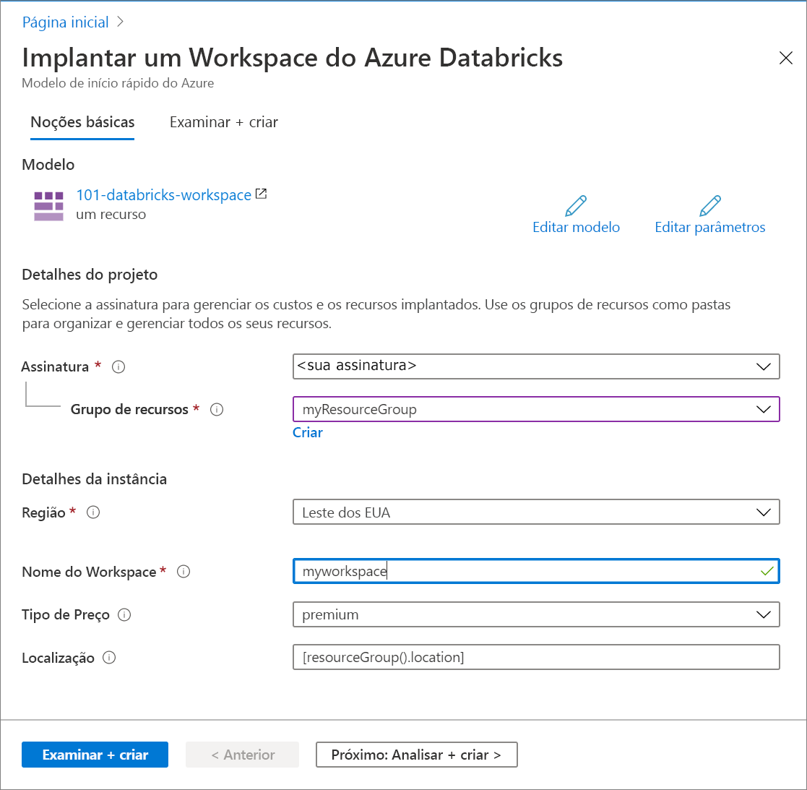

# <a name="quickstart-create-an-azure-databricks-workspace-by-using-the-azure-resource-manager-template"></a>Início Rápido: Criar um workspace do Azure Databricks usando um modelo do Azure Resource Manager

Neste início rápido, você usará um modelo do Azure Resource Manager para criar um workspace do Azure Databricks. Depois que o workspace for criado, valide a implantação.

[!INCLUDE [About Azure Resource Manager](../../includes/resource-manager-quickstart-introduction.md)]

## <a name="prerequisites"></a>Pré-requisitos

Para concluir este artigo, você precisará:

* Ter uma assinatura do Azure; [crie uma gratuitamente](https://azure.microsoft.com/free/)

## <a name="create-an-azure-databricks-workspace"></a>Criar um workspace do Azure Databricks

### <a name="review-the-template"></a>Examinar o modelo

O modelo usado neste início rápido é proveniente dos [modelos de Início Rápido do Azure](https://github.com/Azure/azure-quickstart-templates/tree/master/101-databricks-workspace).

:::code language="json" source="~/quickstart-templates/101-databricks-workspace/azuredeploy.json" range="1-53":::

O recurso do Azure definido no modelo é Microsoft.Databricks/workspaces: crie um workspace do Azure Databricks. 

## <a name="deploy-the-template"></a>Implantar o modelo

Nesta seção, você criará um workspace do Azure Databricks usando o modelo do Azure Resource Manager.

1. Selecione a imagem a seguir para entrar no Azure e abrir um modelo. O modelo cria um workspace do Azure Databricks.

   [](https://portal.azure.com/#create/Microsoft.Template/uri/https%3A%2F%2Fraw.githubusercontent.com%2FAzure%2Fazure-quickstart-templates%2Fmaster%2F101-databricks-workspace%2Fazuredeploy.json)

2. Forneça os valores necessários para criar seu workspace do Azure Databricks

   

   Forneça os seguintes valores:

   |Propriedade  |Descrição  |
   |---------|---------|
   |**Assinatura**     | Na lista suspensa, selecione sua assinatura do Azure.        |
   |**Grupo de recursos**     | Especifique se deseja criar um novo grupo de recursos ou usar um existente. Um grupo de recursos é um contêiner que mantém os recursos relacionados a uma solução do Azure. Para obter mais informações, consulte [Visão geral do Grupo de Recursos do Azure](../azure-resource-manager/management/overview.md). |
   |**Localidade**     | Selecione **Leste dos EUA 2**. Para outras regiões disponíveis, consulte [serviços do Azure por região](https://azure.microsoft.com/regions/services/).        |
   |**Nome do workspace**     | Forneça um nome para seu workspace do Databricks        |
   |**Tipo de preço**     |  Escolha entre o cluster **Standard** e o **Premium**. Para saber mais sobre essas camadas, confira [Página de preços do Databricks](https://azure.microsoft.com/pricing/details/databricks/).       |

3. Selecione **Examinar + Criar** e **Criar**.

4. A criação do workspace leva alguns minutos. Quando a implantação de um workspace falha, ele ainda é criado com estado de falha. Exclua o workspace com falha e crie um que resolva os erros de implantação. Quando você exclui o workspace com falha, o grupo de recursos gerenciado e todos os recursos implantados com êxito também são excluídos.

## <a name="review-deployed-resources"></a>Examinar os recursos implantados

Use o portal do Azure para verificar o workspace do Azure Databricks ou o script da CLI do Azure ou do Azure PowerShell a seguir para listar o recurso criado.

### <a name="azure-cli"></a>CLI do Azure

```azurecli-interactive
echo "Enter your Azure Databricks workspace name:" &&
read databricksWorkspaceName &&
echo "Enter the resource group where the Azure Databricks workspace exists:" &&
read resourcegroupName &&
az databricks workspace show -g $resourcegroupName -n $databricksWorkspaceName
```

### <a name="azure-powershell"></a>Azure PowerShell

```azurepowershell-interactive
$resourceGroupName = Read-Host -Prompt "Enter the resource group name where your Azure Databricks workspace exists"
(Get-AzResource -ResourceType "Microsoft.Databricks/workspaces" -ResourceGroupName $resourceGroupName).Name
 Write-Host "Press [ENTER] to continue..."
```

## <a name="clean-up-resources"></a>Limpar os recursos

Se você pretende prosseguir com os tutoriais seguintes, mantenha esses recursos em vigor. Quando o grupo de recursos não for mais necessário, exclua-o, o que excluirá o workspace do Azure Databricks e os recursos gerenciados relacionados. Para excluir o grupo de recursos usando a CLI do Azure ou o Azure PowerShell:

### <a name="azure-cli"></a>CLI do Azure

```azurecli-interactive
echo "Enter the Resource Group name:" &&
read resourceGroupName &&
az group delete --name $resourceGroupName &&
echo "Press [ENTER] to continue ..."
```

### <a name="azure-powershell"></a>Azure PowerShell

```azurepowershell-interactive
$resourceGroupName = Read-Host -Prompt "Enter the Resource Group name"
Remove-AzResourceGroup -Name $resourceGroupName
Write-Host "Press [ENTER] to continue..."
```

## <a name="next-steps"></a>Próximas etapas

Neste início rápido, você criou um workspace do Azure Databricks usando um modelo do Azure Resource Manager e validou a implantação. Siga até o próximo artigo para saber como executar uma operação de ETL (extração, transformação e carregamento de dados) usando o Azure Databricks.

> [!div class="nextstepaction"]
> [Extrair, transformar e carregar dados usando o Azure Databricks](databricks-extract-load-sql-data-warehouse.md)
