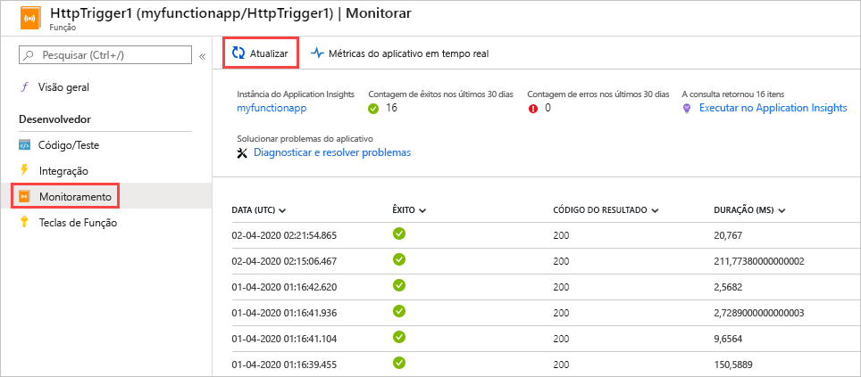
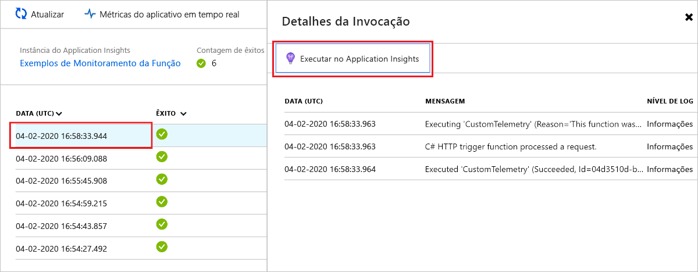
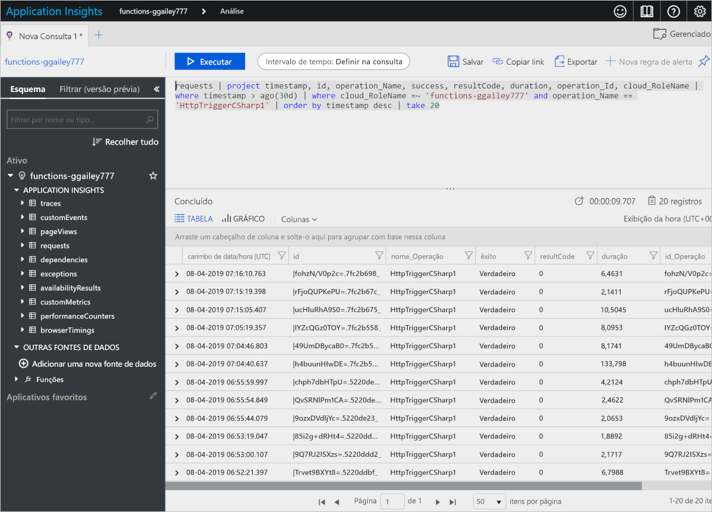
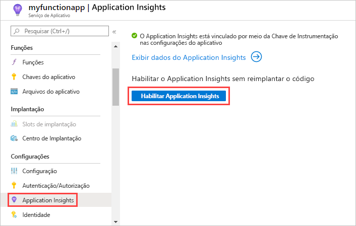
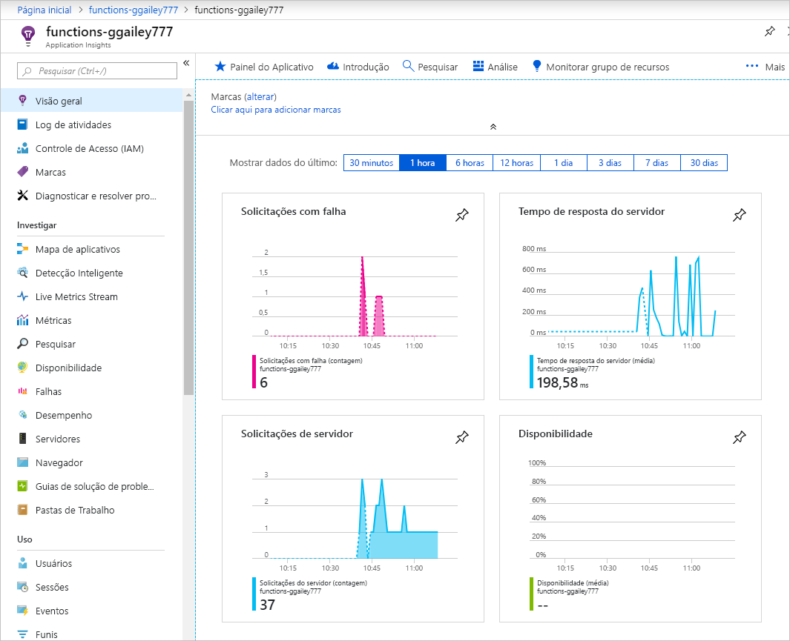
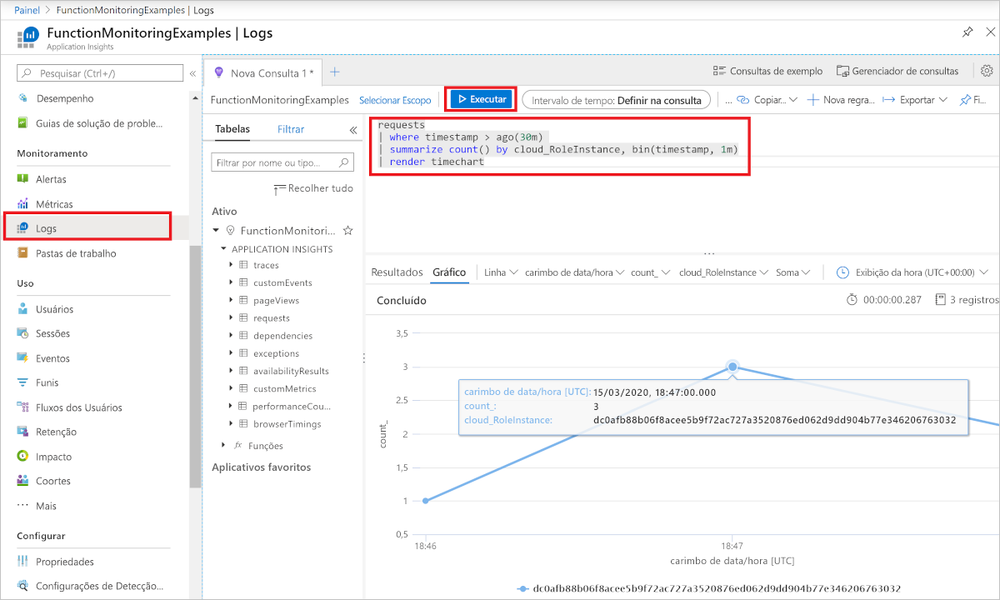

# <a name="analyze-azure-functions-telemetry-in-application-insights"></a>Analisar Azure Functions telemetria no Application Insights 

Azure Functions integra-se com o Application Insights para permitir melhor o monitoramento de seus aplicativos de funções. Application Insights coleta dados de telemetria gerados pelo seu aplicativo de funções, incluindo informações que seu aplicativo grava nos logs. A integração do Application Insights é normalmente habilitada quando seu aplicativo de funções é criado. Se seu aplicativo de funções não tiver o conjunto de chaves de instrumentação, você deverá primeiro [habilitar a integração de Application insights](configure-monitoring.md#enable-application-insights-integration). 

Por padrão, os dados coletados do seu aplicativo de funções são armazenados em Application Insights. Na [portal do Azure](https://portal.azure.com), Application insights fornece um amplo conjunto de visualizações de seus dados de telemetria. Você pode analisar logs de erros e consultar métricas e eventos. Este artigo fornece exemplos básicos de como exibir e consultar os dados coletados. Para saber mais sobre como explorar os dados do aplicativo de funções no Application Insights, confira [o que é Application insights?](../azure-monitor/app/app-insights-overview.md). 

Para saber mais sobre a retenção de dados e os custos de armazenamento em potencial, consulte [coleta de dados, retenção e armazenamento em Application insights](../azure-monitor/app/data-retention-privacy.md).   

## <a name="viewing-telemetry-in-monitor-tab"></a>Exibindo telemetria na guia monitor

Com [a integração do Application Insights habilitada](configure-monitoring.md#enable-application-insights-integration), você pode exibir dados de telemetria na guia **Monitor**.

1. Na página de aplicativo de funções, selecione uma função que tenha sido executada pelo menos uma vez depois que o Application Insights foi configurado. Em seguida, selecione **Monitor** no painel esquerdo. Selecione **Atualizar** periodicamente até que a lista de invocações de função seja exibida.

   

    > [!NOTE]
    > Pode levar até cinco minutos para que a lista seja exibida enquanto o cliente de telemetria empacota os dados para transmissão para o servidor. Esse atraso não se aplica ao [Live Metrics Stream](../azure-monitor/app/live-stream.md). Esse serviço se conecta ao host do Functions quando você carrega a página, logo os logs são transmitidos diretamente para a página.

1. Para ver os logs de uma invocação de função específica, selecione o link da coluna **Data (UTC)** para a invocação. A saída de logs para essa invocação aparece em uma nova página.

   

1. Escolha **Executar no Application Insights** para exibir a origem da consulta que recupera os dados do log de Azure Monitor no log do Azure. Se esta for a primeira vez que você usa o Azure Log Analytics na sua assinatura, será solicitado que ele seja habilitado.

1. Depois de habilitar o Log Analytics, a consulta a seguir é exibida. Você pode ver que os resultados da consulta são limitados aos últimos 30 dias ( `where timestamp > ago(30d)` ), e os resultados mostram, no máximo, 20 linhas ( `take 20` ). Por outro lado, a lista de detalhes de invocação para sua função é para os últimos 30 dias sem limite.

   

Para obter mais informações, consulte [Dados de telemetria da consulta](#query-telemetry-data) a seguir neste artigo.

## <a name="view-telemetry-in-application-insights"></a>Exibir a telemetria no Application Insights

Para abrir Application Insights de um aplicativo de funções no [portal do Azure](https://portal.azure.com):

1. Navegue até seu aplicativo de funções no Portal.

1. Selecione **Application insights** em **configurações** na página esquerda. 

1. Se esta for a primeira vez que você usa Application Insights com sua assinatura, você será solicitado a habilitá-la. Para fazer isso, selecione **ativar Application insights** e, em seguida, selecione **aplicar** na próxima página.



Para obter informações sobre como usar o Application Insights, consulte a [documentação do o Application Insights](/azure/application-insights/). Esta seção mostra alguns exemplos de como exibir dados no Application Insights. Se você já conhece bem o Application Insights, poderá ir diretamente para [as seções sobre como configurar e personalizar os dados de telemetria](configure-monitoring.md#configure-log-levels).



As seguintes áreas do Application Insights podem ser úteis ao avaliar o comportamento, o desempenho e os erros em suas funções:

| Investigar | Descrição |
| ---- | ----------- |
| **[Falhas](../azure-monitor/app/asp-net-exceptions.md)** |  Crie gráficos e alertas com base em falhas de função e de exceções do servidor. O **Nome da Operação** é o nome da função. Falhas nas dependências não são mostradas, a menos que você implemente telemetria personalizada para dependências. |
| **[Desempenho](../azure-monitor/app/performance-counters.md)** | Para analisar problemas de desempenho, veja a utilização de recursos e a taxa de transferência por **instâncias de função de nuvem**. Esses dados de desempenho podem ser úteis para cenários de depuração em que as funções estão sobrecarregarndo seus recursos subjacentes. |
| **[Métrica](../azure-monitor/essentials/metrics-charts.md)** | Crie gráficos e alertas baseados em métricas. As métricas incluem o número de invocações de função, tempo de execução e taxas de sucesso. |
| **[Métricas ao vivo](../azure-monitor/app/live-stream.md)** | Exiba os dados de métricas conforme eles são criados quase em tempo real. |

## <a name="query-telemetry-data"></a>Dados de telemetria da consulta

A [Análise do Application Insights](../azure-monitor/logs/log-query-overview.md) oferece acesso a todos os dados de telemetria em forma de tabelas em um banco de dados. A Análise fornece uma linguagem de consulta para extrair, manipular e visualizar os dados. 

Escolha **Logs** para explorar ou consultar eventos registrados.



Veja um exemplo de consulta que mostra a distribuição de solicitações por trabalhador nos últimos 30 minutos.

```kusto
requests
| where timestamp > ago(30m) 
| summarize count() by cloud_RoleInstance, bin(timestamp, 1m)
| render timechart
```

As tabelas disponíveis são mostradas na guia **Esquema** à esquerda. Você pode encontrar os dados gerados por invocações de função nas tabelas a seguir:

| Tabela | Descrição |
| ----- | ----------- |
| **traces** | Logs criados pelo tempo de execução, pelo controlador de escala e pelos rastreamentos do seu código de função. |
| **requests** | Uma solicitação para cada invocação de função. |
| **exceptions** | Todas as exceções geradas pelo runtime. |
| **customMetrics** | Contagem de invocações bem-sucedidas e com falha, taxa de sucesso e duração. |
| **customEvents** | Eventos rastreados pelo runtime, por exemplo: Solicitações HTTP que disparam uma função. |
| **performanceCounters** | Informações sobre o desempenho dos servidores em que as funções estão sendo executadas. |

As outras tabelas são para testes de disponibilidade e telemetria do cliente e navegador. Você pode implementar a telemetria personalizada para adicionar dados a ela.

Dentro de cada tabela, alguns dos dados específicos do Functions estão em um campo `customDimensions`.  Por exemplo, a consulta a seguir recupera todos os rastreamentos que têm o nível de log `Error`.

```kusto
traces 
| where customDimensions.LogLevel == "Error"
```

O runtime fornece os campos `customDimensions.LogLevel` e `customDimensions.Category`. Você pode fornecer campos adicionais nos logs que você grava em seu código de função. Para obter um exemplo em C#, consulte [registro em log estruturado](functions-dotnet-class-library.md#structured-logging) no guia do desenvolvedor da biblioteca de classes .net.

## <a name="query-scale-controller-logs"></a>Logs do controlador de escala de consulta

_Este recurso está em versão prévia._

Depois de habilitar o [registro em log do controlador de escala](configure-monitoring.md#configure-scale-controller-logs) e a integração de [Application insights](configure-monitoring.md#enable-application-insights-integration), você pode usar a pesquisa de log de Application insights para consultar os logs do controlador de escala emitido. Os logs do controlador de escala são salvos na `traces` coleção na categoria **ScaleControllerLogs** .

A consulta a seguir pode ser usada para pesquisar todos os logs do controlador de escala para o aplicativo de funções atual dentro do período de tempo especificado:

```kusto
traces 
| extend CustomDimensions = todynamic(tostring(customDimensions))
| where CustomDimensions.Category == "ScaleControllerLogs"
```

A consulta a seguir se expande na consulta anterior para mostrar como obter apenas os logs que indicam uma alteração na escala:

```kusto
traces 
| extend CustomDimensions = todynamic(tostring(customDimensions))
| where CustomDimensions.Category == "ScaleControllerLogs"
| where message == "Instance count changed"
| extend Reason = CustomDimensions.Reason
| extend PreviousInstanceCount = CustomDimensions.PreviousInstanceCount
| extend NewInstanceCount = CustomDimensions.CurrentInstanceCount
```

## <a name="consumption-plan-specific-metrics"></a>Métricas específicas do plano de consumo

Durante a execução em um [plano de consumo](consumption-plan.md), o *custo* de execução de uma única execução de função é medido em *GB-segundos*. O custo de execução é calculado pela combinação de seu uso de memória com o tempo de execução. Para saber mais, consulte [Estimando os custos do plano de consumo](functions-consumption-costs.md).

As consultas de telemetria a seguir são específicas para métricas que afetam o custo da execução de funções no plano de consumo.

[!INCLUDE [functions-consumption-metrics-queries](../../includes/functions-consumption-metrics-queries.md)]

## <a name="azure-monitor-metrics"></a>Métricas do Azure Monitor

Além dos dados de telemetria coletados pelo Application Insights, você também pode obter dados sobre como o aplicativo de funções está sendo executado de [métricas de Azure monitor](../azure-monitor/essentials/data-platform-metrics.md). Juntamente com as [métricas usuais disponíveis para aplicativos do serviço de aplicativo](../app-service/web-sites-monitor.md#understand-metrics), há duas métricas específicas para funções que são de interesse:

| Métrica | Descrição |
| ---- | ---- |
| **FunctionExecutionCount** | A contagem de execução de função indica o número de vezes que seu aplicativo de funções foi executado. Isso se correlaciona com o número de vezes que uma função é executada em seu aplicativo. Atualmente, essa métrica não tem suporte para planos Premium e dedicado (serviço de aplicativo) em execução no Linux. |
| **FunctionExecutionUnits** | As unidades de execução de função são uma combinação de tempo de execução e seu uso de memória.  Os dados de memória não são uma métrica atualmente disponível por meio de Azure Monitor. No entanto, se você quiser otimizar o uso de memória do seu aplicativo, o poderá usar os dados do contador de desempenho coletados pelo Application Insights. Atualmente, essa métrica não tem suporte para planos Premium e dedicado (serviço de aplicativo) em execução no Linux.|

Para saber mais sobre como calcular os custos de um plano de consumo usando dados Application Insights, consulte [Estimando os custos do plano de consumo](functions-consumption-costs.md). Para saber mais sobre como usar o Gerenciador de monitor para exibir as métricas, confira [introdução ao Azure Metrics Explorer](../azure-monitor/essentials/metrics-getting-started.md).


## <a name="next-steps"></a>Próximas etapas

Saiba mais sobre monitoramento Azure Functions:

+ [Monitorar Azure Functions](functions-monitoring.md)
+ [Como configurar o monitoramento para Azure Functions](configure-monitoring.md)