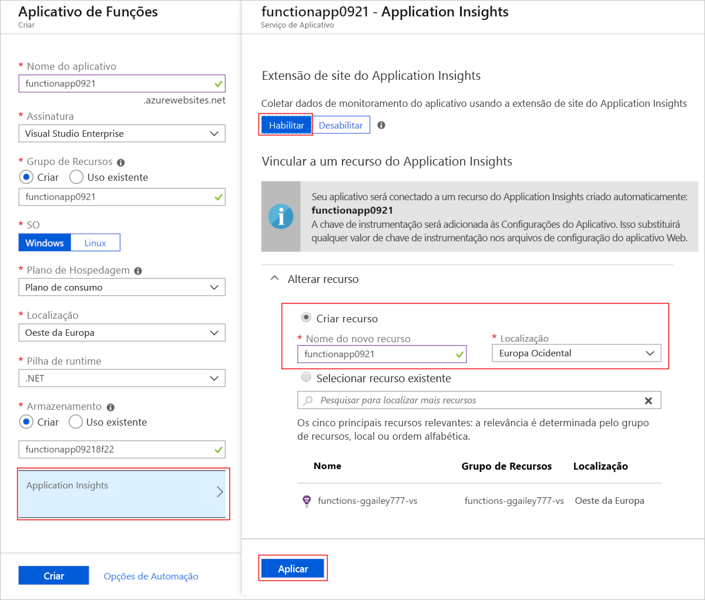

# <a name="how-to-configure-monitoring-for-azure-functions"></a>Como configurar o monitoramento para Azure Functions

Azure Functions integra-se com o Application Insights para permitir melhor o monitoramento de seus aplicativos de funções. Application Insights, um recurso do Azure Monitor, é um serviço de gerenciamento de desempenho de aplicativos (APM) extensível que coleta dados gerados pelo seu aplicativo de funções, incluindo informações que seu aplicativo grava nos logs. A integração do Application Insights é normalmente habilitada quando seu aplicativo de funções é criado. Se seu aplicativo não tiver o conjunto de chaves de instrumentação, você deverá primeiro [habilitar a integração de Application insights](#enable-application-insights-integration). 

Você pode usar Application Insights sem nenhuma configuração personalizada. A configuração padrão pode resultar em grandes volumes de dados. Se você estiver usando uma assinatura do Azure do Visual Studio, poderá ter atingido o limite de dados para o Application Insights. Para saber mais sobre os custos de Application Insights, consulte [gerenciar o uso e os custos para Application insights](../azure-monitor/app/pricing.md).

Este artigo mostra como configurar e personalizar os dados que suas funções enviam ao Application Insights. Para um aplicativo de funções, o registro em log é configurado no arquivo [host. JSON]. 

> [!NOTE]
> Você pode usar configurações de aplicativo especialmente configuradas para representar configurações específicas em um host.jsno arquivo para um ambiente específico. Isso permite que você altere efetivamente host.jsem configurações sem precisar republicar o host.jsno arquivo em seu projeto. Para saber mais, confira [substituir host.jsem valores](functions-host-json.md#override-hostjson-values).

## <a name="configure-categories"></a>Configurar categorias

O agente do Azure Functions inclui uma *categoria* para cada log. A categoria indica qual parte do código de runtime ou do seu código de função gravou o log. As categorias diferem entre a versão 1. x e versões posteriores. O gráfico a seguir descreve as principais categorias de logs que o runtime cria. 

# <a name="v2x"></a>[v2. x +](#tab/v2)

| Categoria | Tabela | Descrição |
| ----- | ----- | ----- |
| **`Function.<YOUR_FUNCTION_NAME>`** | **depend**| Os dados de dependência são coletados automaticamente para alguns serviços. Para execuções bem-sucedidas, esses logs estão no `Information` nível. Para saber mais, confira [dependências](functions-monitoring.md#dependencies). As exceções são registradas no `Error` nível. O tempo de execução também cria `Warning` logs de nível, como quando as mensagens de fila são enviadas para a [fila de suspeitas](functions-bindings-storage-queue-trigger.md#poison-messages). | 
| **`Function.<YOUR_FUNCTION_NAME>`** | **customMetrics**<br/>**customEvents** | Os SDKs do C# e do JavaScript permitem que você colete métricas personalizadas e registre eventos personalizados. Para saber mais, confira [dados de telemetria personalizados](functions-monitoring.md#custom-telemetry-data).|
| **`Function.<YOUR_FUNCTION_NAME>`** | **traces**| Inclui logs de função iniciados e concluídos para execuções de função específicas. Para execuções bem-sucedidas, esses logs estão no `Information` nível. As exceções são registradas no `Error` nível. O tempo de execução também cria `Warning` logs de nível, como quando as mensagens de fila são enviadas para a [fila de suspeitas](functions-bindings-storage-queue-trigger.md#poison-messages). | 
| **`Function.<YOUR_FUNCTION_NAME>.User`** | **traces**| Logs gerados pelo usuário, que podem ser qualquer nível de log. Para saber mais sobre como gravar logs de suas funções, consulte [gravando em logs](functions-monitoring.md#writing-to-logs). | 
| **`Host.Aggregator`** | **customMetrics** | Esses logs gerados pelo tempo de execução fornecem contagens e médias de invocações de função em um período de tempo [configurável](#configure-the-aggregator) . O período padrão é de 30 segundos ou 1.000 resultados, o que ocorrer primeiro. Exemplos são número de execuções, taxa de sucesso e duração. Todos esses logs são gravados no nível de `Information`. Se você filtrar `Warning` ou acima, não verá nenhum desses dados. |
| **`Host.Results`** | **requests** | Esses logs gerados pelo tempo de execução indicam êxito ou falha de uma função. Todos esses logs são gravados no nível de `Information`. Se você filtrar `Warning` ou acima, não verá nenhum desses dados. |
| **`Microsoft`** | **traces** | Categoria de log totalmente qualificada que reflete um componente de tempo de execução .NET invocado pelo host.  |
| **`Worker`** | **traces** | Logs gerados pelo processo de trabalho de idioma para idiomas non-.NET. Os logs de trabalho de idioma também podem ser registrados em uma `Microsoft.*` categoria, como `Microsoft.Azure.WebJobs.Script.Workers.Rpc.RpcFunctionInvocationDispatcher` . Esses logs são gravados no `Information` nível.|

> [!NOTE]
> Para funções de biblioteca de classes do .NET, essas categorias pressupõem que você está usando `ILogger` e não `ILogger<T>` . Para saber mais, consulte a [documentação do Functions ILogger](functions-dotnet-class-library.md#ilogger). 

# <a name="v1x"></a>[v1. x](#tab/v1)

| Categoria | Tabela | Descrição |
| ----- | ----- | ----- |
| **`Function`** | **traces**| Logs gerados pelo usuário, que podem ser qualquer nível de log. Para saber mais sobre como gravar logs de suas funções, consulte [gravando em logs](functions-monitoring.md#writing-to-logs). | 
| **`Host.Aggregator`** | **customMetrics** | Esses logs gerados pelo tempo de execução fornecem contagens e médias de invocações de função em um período de tempo [configurável](#configure-the-aggregator) . O período padrão é de 30 segundos ou 1.000 resultados, o que ocorrer primeiro. Exemplos são número de execuções, taxa de sucesso e duração. Todos esses logs são gravados no nível de `Information`. Se você filtrar `Warning` ou acima, não verá nenhum desses dados. |
| **`Host.Executor`** | **traces** | Inclui os logs de função **iniciada** e **função concluída** para execuções de função específicas. Para execuções bem-sucedidas, esses logs são `Information` nível. As exceções são registradas no nível `Error`. O tempo de execução também cria `Warning` logs de nível, como quando as mensagens de fila são enviadas para a [fila de suspeitas](functions-bindings-storage-queue-trigger.md#poison-messages).  |
| **`Host.Results`** | **requests** | Esses logs gerados pelo tempo de execução indicam êxito ou falha de uma função. Todos esses logs são gravados no nível de `Information`. Se você filtrar `Warning` ou acima, não verá nenhum desses dados. |

---

A coluna da **tabela** indica em qual tabela em Application insights log é gravado. 

## <a name="configure-log-levels"></a>Configurar níveis de log

[!INCLUDE [functions-log-levels](../../includes/functions-log-levels.md)]

Para cada categoria, você deve indicar o nível de log mínimo para enviar. As configurações de host.jsvariam dependendo da versão de [tempo de execução do Functions](functions-versions.md). 

O exemplo a seguir define o log com base nas seguintes regras:

+ Para logs do `Host.Results` ou `Function` , somente eventos de log em `Error` um nível superior. 
+ Para logs do `Host.Aggregator` , registre todas as métricas geradas ( `Trace` ).
+ Para todos os outros logs, incluindo logs de usuário, log apenas `Information` de nível e eventos mais altos.

# <a name="v2x"></a>[v2. x +](#tab/v2)

```json
{
  "logging": {
    "fileLoggingMode": "always",
    "logLevel": {
      "default": "Information",
      "Host.Results": "Error",
      "Function": "Error",
      "Host.Aggregator": "Trace"
    }
  }
}
```

# <a name="v1x"></a>[v1. x](#tab/v1) 

```json
{
  "logger": {
    "categoryFilter": {
      "defaultLevel": "Information",
      "categoryLevels": {
        "Host.Results": "Error",
        "Function": "Error",
        "Host.Aggregator": "Trace"
      }
    }
  }
}
```

---

Se [host.jsno] incluir vários logs que começam com a mesma cadeia de caracteres, os logs mais definidos serão correspondidos primeiro. Considere o exemplo a seguir que registra tudo no tempo de execução, exceto `Host.Aggregator` no `Error` nível:

# <a name="v2x"></a>[v2. x +](#tab/v2)

```json
{
  "logging": {
    "fileLoggingMode": "always",
    "logLevel": {
      "default": "Information",
      "Host": "Error",
      "Function": "Error",
      "Host.Aggregator": "Information"
    }
  }
}
```

# <a name="v1x"></a>[v1. x](#tab/v1) 

```json
{
  "logger": {
    "categoryFilter": {
      "defaultLevel": "Information",
      "categoryLevels": {
        "Host": "Error",
        "Function": "Error",
        "Host.Aggregator": "Information"
      }
    }
  }
}
```

---

Você pode usar uma configuração de nível de log de impedir que os `None` logs sejam gravados para uma categoria. 

## <a name="configure-the-aggregator"></a>Configurar o agregador

Conforme observado na seção anterior, o runtime agrega dados sobre as execuções de função em um período. O período padrão é de 30 segundos ou 1.000 execuções, o que ocorrer primeiro. Você pode definir essa configuração no arquivo [host. JSON].  Aqui está um exemplo:

```json
{
    "aggregator": {
      "batchSize": 1000,
      "flushTimeout": "00:00:30"
    }
}
```

## <a name="configure-sampling"></a>Configurar a amostragem

O Application Insights tem um recurso de [amostragem](../azure-monitor/app/sampling.md) que pode protegê-lo contra a produção de excesso de dados de telemetria em execuções concluídas em horários de pico de carregamento. Quando a taxa de execuções de entrada excede um limite especificado, o Application Insights começa a ignorar aleatoriamente algumas das execuções de entrada. A configuração padrão para o número máximo de execuções por segundo é 20 (cinco na versão 1.x). Você pode configurar a amostragem em [host. JSON](./functions-host-json.md#applicationinsights).  Aqui está um exemplo:

# <a name="v2x"></a>[v2. x +](#tab/v2)

```json
{
  "logging": {
    "applicationInsights": {
      "samplingSettings": {
        "isEnabled": true,
        "maxTelemetryItemsPerSecond" : 20,
        "excludedTypes": "Request;Exception"
      }
    }
  }
}
```


Você pode excluir determinados tipos de telemetria da amostragem. Neste exemplo, os dados do tipo `Request` e `Exception` são excluídos da amostragem. Isso garante que *todas as* execuções de função (solicitações) e exceções sejam registradas enquanto outros tipos de telemetria permanecem sujeitos à amostragem. 

# <a name="v1x"></a>[v1. x](#tab/v1)  

```json
{
  "applicationInsights": {
    "sampling": {
      "isEnabled": true,
      "maxTelemetryItemsPerSecond" : 5
    }
  }
}
```
---

Para saber mais, consulte [amostragem em Application insights](../azure-monitor/app/sampling.md).

## <a name="configure-scale-controller-logs"></a>Configurar logs do controlador de escala

_Este recurso está em versão prévia._ 

Você pode fazer com que o [controlador de escala de Azure Functions](./event-driven-scaling.md#runtime-scaling) emita logs para Application insights ou para o armazenamento de BLOBs para entender melhor as decisões que o controlador de escala está fazendo para seu aplicativo de funções.

Para habilitar esse recurso, você adiciona uma configuração de aplicativo chamada `SCALE_CONTROLLER_LOGGING_ENABLED` às configurações do aplicativo de funções. O valor dessa configuração deve ser do formato `<DESTINATION>:<VERBOSITY>` , com base no seguinte:

[!INCLUDE [functions-scale-controller-logging](../../includes/functions-scale-controller-logging.md)]

Por exemplo, o comando a seguir CLI do Azure ativa o log detalhado do controlador de escala para Application Insights:

```azurecli-interactive
az functionapp config appsettings set --name <FUNCTION_APP_NAME> \
--resource-group <RESOURCE_GROUP_NAME> \
--settings SCALE_CONTROLLER_LOGGING_ENABLED=AppInsights:Verbose
```

Neste exemplo, substitua `<FUNCTION_APP_NAME>` e `<RESOURCE_GROUP_NAME>` pelo nome do seu aplicativo de funções e o nome do grupo de recursos, respectivamente. 

O comando a seguir CLI do Azure desabilita o registro em log definindo o detalhamento como `None` :

```azurecli-interactive
az functionapp config appsettings set --name <FUNCTION_APP_NAME> \
--resource-group <RESOURCE_GROUP_NAME> \
--settings SCALE_CONTROLLER_LOGGING_ENABLED=AppInsights:None
```

Você também pode desabilitar o registro em log removendo a `SCALE_CONTROLLER_LOGGING_ENABLED` configuração usando o seguinte comando de CLI do Azure:

```azurecli-interactive
az functionapp config appsettings delete --name <FUNCTION_APP_NAME> \
--resource-group <RESOURCE_GROUP_NAME> \
--setting-names SCALE_CONTROLLER_LOGGING_ENABLED
```

Com o registro em log do controlador de escala habilitado, agora você pode [consultar os logs do controlador de escala](analyze-telemetry-data.md#query-scale-controller-logs). 

## <a name="enable-application-insights-integration"></a>Habilitar a integração do Application Insights

Para um aplicativo de funções enviar dados ao Application Insights, ele precisa saber a chave de instrumentação de um recurso do Application Insights. A chave deve estar em uma configuração de aplicativo chamada **APPINSIGHTS_INSTRUMENTATIONKEY**.

Ao criar seu aplicativo de funções [no portal do Azure](./functions-get-started.md), com a linha de comando usando o [Azure Functions Core Tools](./create-first-function-cli-csharp.md), ou usando o [Visual Studio Code](./create-first-function-vs-code-csharp.md), a integração do Application Insights é habilitada por padrão. O recurso do Application Insights tem o mesmo nome do seu aplicativo de funções e é criado na mesma região ou na região mais próxima.

### <a name="new-function-app-in-the-portal"></a>Novo aplicativo de funções no portal

Para examinar o recurso do Application Insights que está sendo criado, selecione-o para expandir a janela do **Application Insights**. Você pode alterar o **Novo nome do recurso** ou escolher um **Local** diferente em uma [geografia do Azure](https://azure.microsoft.com/global-infrastructure/geographies/) onde deseja armazenar seus dados.



Quando você escolhe **Criar**, um recurso de Application Insights é criado com seu aplicativo de funções, que tem `APPINSIGHTS_INSTRUMENTATIONKEY` definido nas configurações do aplicativo. Tudo está pronto para começar.

<a id="manually-connect-an-app-insights-resource"></a>
### <a name="add-to-an-existing-function-app"></a>Adicionar a um aplicativo de funções existente 

Se um recurso de Application Insights não foi criado com seu aplicativo de funções, use as etapas a seguir para criar o recurso. Em seguida, você pode adicionar a chave de instrumentação a partir desse recurso como uma [configuração de aplicativo](functions-how-to-use-azure-function-app-settings.md#settings) no seu aplicativo de funções.

1. Na [portal do Azure](https://portal.azure.com), procure e selecione aplicativo de **funções** e, em seguida, escolha seu aplicativo de funções. 

1. Selecione a faixa **O Application Insights não está configurado** na parte superior da janela. Caso não veja essa faixa, pode ser que o Application Insights já esteja habilitado no aplicativo.

    :::image type="content" source="media/configure-monitoring/enable-application-insights.png" alt-text="Habilitar o Application Insights no portal":::

1. Expanda a opção **Alterar seu recurso** e crie um recurso do Application Insights usando as configurações especificadas na tabela a seguir.  

    | Configuração      | Valor sugerido  | Descrição                                        |
    | ------------ |  ------- | -------------------------------------------------- |
    | **Nome de recurso novo** | Nome de aplicativo exclusivo | É mais fácil usar o mesmo nome que seu aplicativo de funções, que deve ser exclusivo em sua assinatura. | 
    | **Localidade** | Europa Ocidental | Se possível, use a mesma [região](https://azure.microsoft.com/regions/) que seu aplicativo de funções ou uma região próxima dela. |

    :::image type="content" source="media/configure-monitoring/ai-general.png" alt-text="Criar um recurso do Application Insights":::

1. Escolha **Aplicar**. 

   O recurso do Application Insights é criado no mesmo grupo de recursos e assinatura que seu aplicativo de funções. Depois que o recurso for criado, feche a janela do Application Insights.

1. Em seu aplicativo de funções, clique em **Configuração** na opção **Configurações** e selecione **Configurações do aplicativo**. Se você vir uma configuração chamada `APPINSIGHTS_INSTRUMENTATIONKEY`, isso significa que a integração do Application Insights está habilitada para seu aplicativo de funções em execução no Azure. Se, por algum motivo, essa configuração não existir, adicione-a usando sua chave de instrumentação de Application Insights como o valor.

> [!NOTE]
> As primeiras versões de Functions usavam o monitoramento interno, o que não é mais recomendado. Ao habilitar a integração do Application Insights para um aplicativo de funções como esse, você também deve [desabilitar o registro em log interno](#disable-built-in-logging).  

## <a name="disable-built-in-logging"></a>Desabilitar o registro em log interno

Ao ativar o Application Insights, desative o registro interno que usa o Armazenamento do Microsoft Azure. O registro em log interno é útil para testes com cargas de trabalho leves, mas não se destina ao uso em produção com carga alta. Para monitoramento de produção, o Application Insights é recomendado. Se o registro em log interno foi usado na produção, o registro de logs pode estar incompleto devido à limitação da largura de banda de rede no Armazenamento do Microsoft Azure.

Para desabilitar o registro em log interno, exclua a configuração de aplicativo `AzureWebJobsDashboard`. Para obter informações sobre como excluir configurações do aplicativo no portal do Azure, consulte a seção **Configurações do aplicativo** em [Como gerenciar um aplicativo de funções](functions-how-to-use-azure-function-app-settings.md#settings). Antes de excluir a configuração do aplicativo, veja se não existe nenhuma função no mesmo aplicativo de funções que use essa configuração para associações ou gatilhos do Armazenamento do Microsoft Azure.

## <a name="next-steps"></a>Próximas etapas

Para saber mais sobre monitoramento, consulte:

+ [Monitorar Azure Functions](functions-monitoring.md)
+ [Analisar Azure Functions dados de telemetria no Application Insights](analyze-telemetry-data.md)
+ [Application Insights](/azure/application-insights/)


[host. JSON]: functions-host-json.md
