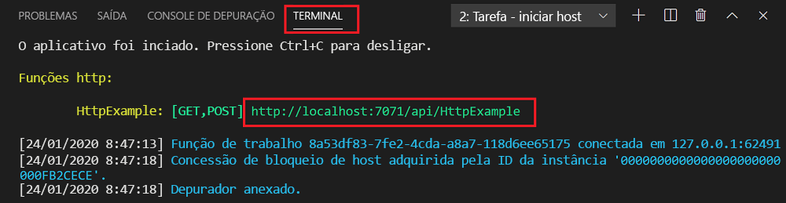
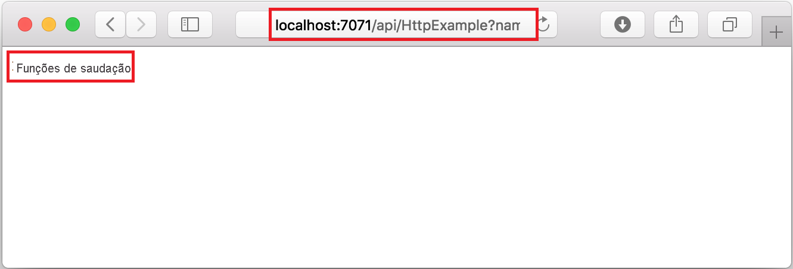
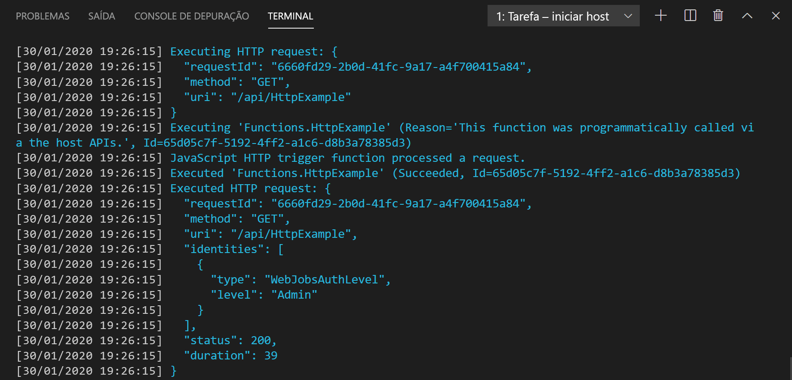
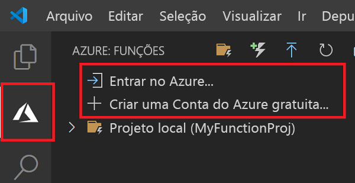
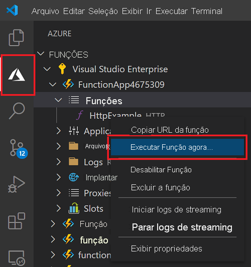

# Início rápido: criar uma função JavaScript no Azure usando o Visual Studio Code

> [!div class="op_single_selector" title1="Selecione a linguagem da função: "]
> - [JavaScript](create-first-function-vs-code-node.md)
> - [C#](create-first-function-vs-code-csharp.md)
> - [Java](create-first-function-vs-code-java.md)
> - [PowerShell](create-first-function-vs-code-powershell.md)
> - [Python](create-first-function-vs-code-python.md)
> - [TypeScript](create-first-function-vs-code-typescript.md)
> - [Outro (Go/Rust)](create-first-function-vs-code-other.md)

Use o Visual Studio Code para criar uma função de JavaScript que responda a solicitações HTTP. Teste o código localmente e implante-o no ambiente sem servidor do Azure Functions.

A realização deste início rápido gera um pequeno custo de alguns centavos de dólar ou menos em sua <abbr title="A conta do Azure é uma entidade global exclusiva que fornece acesso a serviços do Azure e a suas assinaturas do Azure.">Conta do Azure</abbr>.

## 1. Prepare o seu ambiente

Antes de começar, verifique se você tem os seguintes requisitos implementados:

+ Uma conta do Azure com uma <abbr title="Uma assinatura do Azure é um contêiner lógico usado para provisionar recursos no Azure. Ela contém os detalhes de todos os seus recursos, como VMs (máquinas virtuais), bancos de dados e muito mais.">assinatura ativa</abbr>. [Crie uma conta gratuitamente](https://azure.microsoft.com/free/?ref=microsoft.com&utm_source=microsoft.com&utm_medium=docs&utm_campaign=visualstudio).

+ [Node.js 10.14.1+](https://nodejs.org/)

+ [Visual Studio Code](https://code.visualstudio.com/)

+ [Extensão do Azure Functions](https://marketplace.visualstudio.com/items?itemName=ms-azuretools.vscode-azurefunctions) para Visual Studio Code.

+ [Azure Functions Core Tools](functions-run-local.md?tabs=linux%2Ccsharp%2Cbash#install-the-azure-functions-core-tools)

 

## 2. Criar o projeto local do Functions

1. Escolha o ícone do Azure na <abbr title="">Barra de atividades</abbr>Em seguida, na área **Azure: Functions**, selecione o ícone **Criar projeto...** .

    

1. **Escolha um local de diretório** para o workspace do projeto e escolha **Selecionar**. 

1. Forneça as seguintes informações nos prompts:

    + **Selecione uma linguagem de programação para o seu projeto de função**: Escolha `JavaScript`.

    + **Selecione um modelo para a primeira função do projeto**: Escolha `HTTP trigger`.

    + **Forneça um nome de função**: Digite `HttpExample`.

    + **Nível de autorização**: Escolha `Anonymous`, que permite que qualquer pessoa chame seu ponto de extremidade de função.

    + **Selecione como você gostaria de abrir seu projeto**: Escolha `Add to workspace`.

 

<strong>Não consegue criar um projeto de função?</strong>

Os problemas mais comuns a serem resolvidos ao criar um projeto local no Functions são:
* Você não tem a extensão do Azure Functions instalada. 

 

## 3. Executar a função localmente

1. Pressione <kbd>F5</kbd> para iniciar o projeto do aplicativo de funções. 

1. No **Terminal**, veja o ponto de extremidade da URL de sua função em execução no local.

    

1. Copie a URL a seguir, cole-a em um navegador da Web e pressione Enter.

    `http://localhost:7071/api/HttpExample?name=Functions`

1. Veja a resposta retornada.

    

1. Veja informações no painel do **Terminal** sobre a solicitação.

    

1. Pressione <kbd>Ctrl + C</kbd> para parar o Core Tools e desconectar o depurador.

 

<strong>Não consegue executar a função localmente?</strong>

Os problemas mais comuns a serem resolvidos ao executar um projeto local no Functions são:
* Você não tem as Core Tools instaladas. 
*  Se você tiver problemas com a execução no Windows, verifique se o shell do terminal padrão do Visual Studio Code não está definido como Bash WSL. 

 

## 4. Entrar no Azure

Para publicar o aplicativo, entre no Azure. Se você já tiver entrado, vá para a próxima seção.

1. Escolha o ícone do Azure na barra de Atividade e, na área **Azure: Functions**, escolha **Entrar no Azure...** .

    

1. Quando solicitado no navegador, **escolha sua conta do Azure** e **entre** usando as credenciais de sua conta do Azure.

1. Depois de entrar com êxito, feche a nova janela do navegador e volte para o Visual Studio Code. 

 

## 5. Publicar o projeto no Azure

A primeira implantação do código inclui a criação de um recurso de Função em sua assinatura do Azure. 

1. Escolha o ícone do Azure na Barra de atividade e, em seguida, na área **Azure: Functions**, escolha o botão **Implantar no aplicativo de funções...** .

    

1. Forneça as seguintes informações nos prompts:

    + **Selecionar pasta**: escolha a pasta que contém o aplicativo de funções. 

    + **Selecione a assinatura**: Escolha a assinatura a ser usada. Essa opção não será exibida caso você possua apenas uma assinatura.

    + **Selecione o aplicativo de funções no Azure**: Escolha `+ Create new Function App`.

    + **Insira um nome globalmente exclusivo para o aplicativo de funções**: digite um nome que seja exclusivo em todo o Azure em um caminho de URL. O nome digitado é validado para garantir a exclusividade global.

    + **Selecione um runtime**: Escolha a versão do Node.js em que você está executando localmente. É possível usar o comando `node --version` para verificar sua versão.

    + **Selecione uma localização para novos recursos**:  Para obter um melhor desempenho, escolha uma [região](https://azure.microsoft.com/regions/) perto de você. 

1. Uma notificação é exibida depois que seu aplicativo de funções é criado e o pacote de implantação é aplicado. Selecione **Exibir Saída** para ver os resultados da criação e da implantação. 
    
    

 

<strong>Não consegue publicar a função?</strong>

Esta seção criou os recursos do Azure e implantou o código local no aplicativo de funções. Se isso não foi executado com sucesso:

* Examine a saída para obter informações sobre o erro. O ícone de sino no canto inferior direito é outra maneira de ver a saída. 
* Você publicou em um aplicativo de funções existente? Essa ação substitui o conteúdo do aplicativo no Azure.

 

<strong>Quais recursos foram criados?</strong>

Quando concluído, os seguintes recursos do Azure serão criados em sua assinatura, usando nomes baseados em seu nome do aplicativo de funções: 
* **Grupo de recursos**: um grupo de recursos é um contêiner lógico para recursos relacionados na mesma região.
* **Conta de Armazenamento do Azure**: um recurso de armazenamento mantém o estado e outras informações sobre seu projeto.
* **Plano de consumo**: um plano de consumo define o host subjacente para o aplicativo de funções sem servidor.
* **Aplicativo de funções**: um aplicativo de funções fornece o ambiente para executar o código da função e as funções de grupo como uma unidade lógica.
* **Application Insights**: o Application Insights controla o uso da função sem servidor.

 

## 6. Executar a função no Azure
1. Na barra lateral **Azure: Functions**, expanda o novo aplicativo de funções. 
1. Expanda **Funções**, clique com o botão direito do mouse em **HttpExample** e escolha **Executar Função Agora...** .

    

1. **Pressione Enter** para enviar a mensagem de solicitação padrão à função. 

1. Uma notificação é gerada no Visual Studio Code quando a execução da função é concluída.

 

<strong>Não conseguiu executar o aplicativo de funções baseado em nuvem?</strong>

* Você se lembrou de adicionar a querystring ao final da URL?

 

## 7. Limpar os recursos

Exclua o aplicativo de funções e seus recursos para evitar incorrer em mais custos.

1. No Visual Studio Code, selecione o ícone do Azure na barra de Atividade e selecione a área Funções na barra lateral. 
1. Selecione o aplicativo de funções, clique com o botão direito do mouse e selecione **Excluir Aplicativo de funções...** .

 

## Próximas etapas

Expanda a função adicionando uma <abbr title="A associação a uma função é uma forma de conectar declarativamente outro recurso à função.">associação de saída</abbr>. Essa associação grava a cadeia de caracteres da solicitação HTTP em uma mensagem em uma fila do Armazenamento de Filas do Azure. 

> [!div class="nextstepaction"]
> [Conectar-se a uma fila do Armazenamento do Azure](functions-add-output-binding-storage-queue-vs-code.md?pivots=programming-language-javascript)

[Azure Functions Core Tools]: functions-run-local.md
[Azure Functions extension for Visual Studio Code]: https://marketplace.visualstudio.com/items?itemName=ms-azuretools.vscode-azurefunctions
