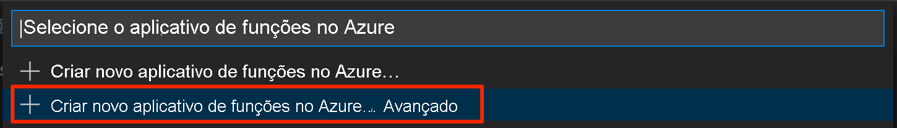

# <a name="quickstart-create-a-go-or-rust-function-in-azure-using-visual-studio-code"></a>Início rápido: Criar uma função Go ou Rust no Azure usando o Visual Studio Code

[!INCLUDE [functions-language-selector-quickstart-vs-code](../../includes/functions-language-selector-quickstart-vs-code.md)]

Neste artigo, você usará o Visual Studio Code para criar uma função de [manipulador personalizado](functions-custom-handlers.md) que responde a solicitações HTTP. Após testar o código localmente, implante-o no ambiente sem servidor do Azure Functions.

Os manipuladores personalizados podem ser usados para criar funções em qualquer linguagem ou runtime executando um processo do servidor HTTP. Este artigo dá suporte a [Go](create-first-function-vs-code-other.md?tabs=go) e [Rust](create-first-function-vs-code-other.md?tabs=rust).

A realização deste início rápido gera um pequeno custo de alguns centavos de dólar ou menos em sua conta do Azure.

## <a name="configure-your-environment"></a>Configurar seu ambiente

Antes de começar, verifique se você tem os seguintes requisitos implementados:

# <a name="go"></a>[Go](#tab/go)

+ Uma conta do Azure com uma assinatura ativa. [Crie uma conta gratuitamente](https://azure.microsoft.com/free/?ref=microsoft.com&utm_source=microsoft.com&utm_medium=docs&utm_campaign=visualstudio).

+ [Visual Studio Code](https://code.visualstudio.com/) em uma das [plataformas compatíveis](https://code.visualstudio.com/docs/supporting/requirements#_platforms).

+ A [Extensão Azure Functions](https://marketplace.visualstudio.com/items?itemName=ms-azuretools.vscode-azurefunctions) para Visual Studio Code.

+ [Azure Functions Core Tools](./functions-run-local.md#v2), versão 3.x. Use o comando `func --version` para verificar se ela está instalada corretamente.

+ [Go](https://golang.org/doc/install), versão mais recente recomendada. Use o comando `go version` para verificar sua versão.

# <a name="rust"></a>[Rust](#tab/rust)

+ Uma conta do Azure com uma assinatura ativa. [Crie uma conta gratuitamente](https://azure.microsoft.com/free/?ref=microsoft.com&utm_source=microsoft.com&utm_medium=docs&utm_campaign=visualstudio).

+ [Visual Studio Code](https://code.visualstudio.com/) em uma das [plataformas compatíveis](https://code.visualstudio.com/docs/supporting/requirements#_platforms).

+ A [Extensão Azure Functions](https://marketplace.visualstudio.com/items?itemName=ms-azuretools.vscode-azurefunctions) para Visual Studio Code.

+ [Azure Functions Core Tools](./functions-run-local.md#v2), versão 3.x. Use o comando `func --version` para verificar se ela está instalada corretamente.

+ Cadeia de ferramentas do Rust usando [rustup](https://www.rust-lang.org/tools/install). Use o comando `rustc --version` para verificar sua versão.

---

## <a name="create-your-local-project"></a><a name="create-an-azure-functions-project"></a>Criar seu projeto local

Nesta seção, você usará o Visual Studio Code para criar um projeto de manipuladores personalizados do Azure Functions local. Mais adiante neste artigo, você publicará o código de função no Azure.

1. Escolha o ícone do Azure na Barra de atividade e, em seguida, na área **Azure: Functions** e selecione o ícone **Criar projeto...** .

    

1. Escolha um local de diretório para o workspace do projeto e escolha **Selecionar**.

    > [!NOTE]
    > Estas etapas foram projetadas para serem concluídas fora de um workspace. Nesse caso, não selecione uma pasta de projeto que faz parte de um workspace.

1. Forneça as seguintes informações nos prompts:

    + **Selecione uma linguagem de programação para o seu projeto de função**: Escolha `Custom`.

    + **Selecione um modelo para a primeira função do projeto**: Escolha `HTTP trigger`.

    + **Forneça um nome de função**: Digite `HttpExample`.

    + **Nível de autorização**: Escolha `Anonymous`, que permite que qualquer pessoa chame seu ponto de extremidade de função. Para saber mais sobre o nível de autorização, confira [Chaves de autorização](functions-bindings-http-webhook-trigger.md#authorization-keys).

    + **Selecione como você gostaria de abrir seu projeto**: Escolha `Add to workspace`.

1. Usando essas informações, o Visual Studio Code gera um projeto do Azure Functions com uma função de gatilho HTTP. Você pode exibir os arquivos de projeto locais no Explorer. Para saber mais sobre os arquivos criados, confira [Arquivos de projeto gerados](functions-develop-vs-code.md#generated-project-files). 

## <a name="create-and-build-your-function"></a>Criar e compilar sua função

O arquivo *function.json* na pasta *HttpExample* declara uma função de gatilho HTTP. Conclua a função adicionando um manipulador e compilando-o em um executável.

# <a name="go"></a>[Go](#tab/go)

1. Pressione <kbd>Ctrl + N</kbd> (<kbd>Cmd + N</kbd> no macOS) para criar um arquivo. Salve-o como *handler.go* na raiz do aplicativo de funções (na mesma pasta que *host.json*).

1. Em *handler.go*, adicione o código a seguir e salve o arquivo. Este é o manipulador personalizado do Go.

    ```go
    package main
    
    import (
        "fmt"
        "log"
        "net/http"
        "os"
    )
    
    func helloHandler(w http.ResponseWriter, r *http.Request) {
        message := "This HTTP triggered function executed successfully. Pass a name in the query string for a personalized response.\n"
        name := r.URL.Query().Get("name")
        if name != "" {
            message = fmt.Sprintf("Hello, %s. This HTTP triggered function executed successfully.\n", name)
        }
        fmt.Fprint(w, message)
    }
    
    func main() {
        listenAddr := ":8080"
        if val, ok := os.LookupEnv("FUNCTIONS_CUSTOMHANDLER_PORT"); ok {
            listenAddr = ":" + val
        }
        http.HandleFunc("/api/HttpExample", helloHandler)
        log.Printf("About to listen on %s. Go to https://127.0.0.1%s/", listenAddr, listenAddr)
        log.Fatal(http.ListenAndServe(listenAddr, nil))
    }
    ```

1. Pressione <kbd>Ctrl + Shift + `</kbd> ou selecione *Novo Terminal* no menu *Terminal* para abrir um novo terminal integrado no VS Code.

1. Compile seu manipulador personalizado usando o comando a seguir. Um arquivo executável chamado `handler` (`handler.exe` no Windows) é gerado na pasta raiz do aplicativo de funções.

    ```bash
    go build handler.go
    ```

    

# <a name="rust"></a>[Rust](#tab/rust)

1. Pressione <kbd>Ctrl + Shift + `</kbd> ou selecione *Novo Terminal* no menu *Terminal* para abrir um novo terminal integrado no VS Code.

1. Na raiz do aplicativo de funções (a mesma pasta que *host.json*), inicialize um projeto do Rust chamado `handler`.

    ```bash
    cargo init --name handler
    ```

1. Em *Cargo.toml*, adicione as dependências a seguir, necessárias para concluir este guia de início rápido. O exemplo usa a estrutura de servidor Web [warp](https://docs.rs/warp/).

    ```toml
    [dependencies]
    warp = "0.3"
    tokio = { version = "1", features = ["rt", "macros", "rt-multi-thread"] }
    ```

1. Em *src/main.rs*, adicione o código a seguir e salve o arquivo. Este é o manipulador personalizado do Rust.

    ```rust
    use std::collections::HashMap;
    use std::env;
    use std::net::Ipv4Addr;
    use warp::{http::Response, Filter};

    #[tokio::main]
    async fn main() {
        let example1 = warp::get()
            .and(warp::path("api"))
            .and(warp::path("HttpExample"))
            .and(warp::query::<HashMap<String, String>>())
            .map(|p: HashMap<String, String>| match p.get("name") {
                Some(name) => Response::builder().body(format!("Hello, {}. This HTTP triggered function executed successfully.", name)),
                None => Response::builder().body(String::from("This HTTP triggered function executed successfully. Pass a name in the query string for a personalized response.")),
            });

        let port_key = "FUNCTIONS_CUSTOMHANDLER_PORT";
        let port: u16 = match env::var(port_key) {
            Ok(val) => val.parse().expect("Custom Handler port is not a number!"),
            Err(_) => 3000,
        };

        warp::serve(example1).run((Ipv4Addr::UNSPECIFIED, port)).await
    }
    ```

1. Compile um binário para seu manipulador personalizado. Um arquivo executável chamado `handler` (`handler.exe` no Windows) é gerado na pasta raiz do aplicativo de funções.

    ```bash
    cargo build --release
    cp target/release/handler .
    ```

    

---

## <a name="configure-your-function-app"></a>Configurar seu aplicativo de funções

O host de função precisa ser configurado para executar o binário do manipulador personalizado quando ele é iniciado.

1. Abra *host.json*.

1. Na seção `customHandler.description`, defina o valor de `defaultExecutablePath` como `handler` (no Windows, defina-o como `handler.exe`).

1. Na seção `customHandler`, adicione uma propriedade chamada `enableForwardingHttpRequest` e defina o valor dela como `true`. Para funções formadas apenas em um gatilho HTTP, essa configuração simplifica a programação, permitindo que você trabalhe com uma solicitação HTTP típica em vez do [conteúdo de solicitação](functions-custom-handlers.md#request-payload) do manipulador personalizado.

1. Confirme que a seção `customHandler` é semelhante a este exemplo. Salve o arquivo.

    ```
    "customHandler": {
      "description": {
        "defaultExecutablePath": "handler",
        "workingDirectory": "",
        "arguments": []
      },
      "enableForwardingHttpRequest": true
    }
    ```

O aplicativo de funções está configurado para iniciar o executável do manipulador personalizado.

## <a name="run-the-function-locally"></a>Executar a função localmente

Você pode executar este projeto em seu computador de desenvolvimento local antes de fazer a publicação no Azure.

1. No terminal integrado, inicie o aplicativo de funções usando o Azure Functions Core Tools.

    ```bash
    func start
    ```

1. Com o Core Tools em execução, navegue até a URL a seguir para executar uma solicitação GET, que inclui a cadeia de caracteres de consulta `?name=Functions`.

    `http://localhost:7071/api/HttpExample?name=Functions`

1. Uma resposta é retornada, semelhante ao seguinte em um navegador:

    

1. As informações sobre a solicitação são mostradas no painel **Terminal**.

    

1. Pressione <kbd>Ctrl + C</kbd> para interromper o Core Tools.

Após verificar se a função foi executada corretamente no computador local, é hora de usar o Visual Studio Code para publicar o projeto diretamente no Azure.

[!INCLUDE [functions-sign-in-vs-code](../../includes/functions-sign-in-vs-code.md)]

## <a name="compile-the-custom-handler-for-azure"></a>Compilar o manipulador personalizado para o Azure

Nesta seção, você publicará seu projeto no Azure em um aplicativo de funções que executa o Linux. Na maioria dos casos, você precisa recompilar o binário e ajustar sua configuração para corresponder à plataforma de destino antes de publicá-lo no Azure.

# <a name="go"></a>[Go](#tab/go)

1. No terminal integrado, compile o manipulador em Linux/x64. Um binário chamado `handler` é criado na raiz do aplicativo de funções.

    # <a name="macos"></a>[macOS](#tab/macos)

    ```bash
    GOOS=linux GOARCH=amd64 go build handler.go
    ```

    # <a name="linux"></a>[Linux](#tab/linux)

    ```bash
    GOOS=linux GOARCH=amd64 go build handler.go
    ```

    # <a name="windows"></a>[Windows](#tab/windows)
    ```cmd
    set GOOS=linux
    set GOARCH=amd64
    go build handler.go
    ```

    Altere o `defaultExecutablePath` em *host.json* de `handler.exe` para `handler`. Isso instrui o aplicativo de funções a executar o binário do Linux.
    
    ---

# <a name="rust"></a>[Rust](#tab/rust)

1. Crie um arquivo em *.cargo/config*. Adicione o conteúdo a seguir e salve o arquivo.

    ```
    [target.x86_64-unknown-linux-musl]
    linker = "rust-lld"
    ```

1. No terminal integrado, compile o manipulador em Linux/x64. Um binário chamado `handler` é criado. Copie-o para a raiz do aplicativo de funções.

    ```bash
    rustup target add x86_64-unknown-linux-musl
    cargo build --release --target=x86_64-unknown-linux-musl
    cp target/x86_64-unknown-linux-musl/release/handler .
    ```

1. Se estiver usando o Windows, altere o `defaultExecutablePath` em *host.json* de `handler.exe` para `handler`. Isso instrui o aplicativo de funções a executar o binário do Linux.

1. Adicione a seguinte linha ao arquivo *.funcignore*:

    ```
    target
    ```

    Isso impede a publicação do conteúdo da pasta *target*.

---

## <a name="publish-the-project-to-azure"></a>Publicar o projeto no Azure

Nesta seção, você criará um aplicativo de funções e os recursos relacionados em sua assinatura do Azure e, em seguida, implantará seu código. 

> [!IMPORTANT]
> Publicar em um aplicativo de funções existente substitui o conteúdo desse aplicativo no Azure. 


1. Escolha o ícone do Azure na Barra de atividade e, em seguida, na área **Azure: Functions**, escolha o botão **Implantar no aplicativo de funções...** .

    

1. Forneça as seguintes informações nos prompts:

    + **Selecione a pasta**: escolha uma pasta do seu workspace ou navegue até uma que contenha seu aplicativo de funções. Você não verá isso se já tiver um aplicativo de funções válido aberto.

    + **Selecione a assinatura**: Escolha a assinatura a ser usada. Essa opção não será exibida caso você possua apenas uma assinatura.

    + **Selecione o aplicativo de funções no Azure**: Escolha `+ Create new Function App (advanced)`. 
    
        > [!IMPORTANT]
        > A opção `advanced` permite escolher o sistema operacional específico no qual seu aplicativo de funções é executado no Azure, que nesse caso é o Linux.

        

    + **Insira um nome exclusivo globalmente para o aplicativo de funções**: Digite um nome que seja válido em um caminho de URL. O nome que você digitar é validado para ter certeza de que ele é exclusivo no Azure Functions.

    + **Selecione uma pilha de runtime**: Escolha `Custom Handler`.

    + **Selecione um sistema operacional**: Escolha `Linux`.

    + **Selecione um plano de hospedagem**: Escolha `Consumption`.

    + **Selecione um grupo de recursos**: Escolha `+ Create new resource group`. Insira um nome para o grupo de recursos. O nome precisa ser exclusivo em toda a sua assinatura do Azure. Você pode usar o nome sugerido no prompt.

    + **Selecione uma conta de armazenamento**: Escolha `+ Create new storage account`. O nome precisa ser globalmente exclusivo em todo o Azure. Você pode usar o nome sugerido no prompt.

    + **Selecione um recurso do Application Insights**: Escolha `+ Create Application Insights resource`. O nome precisa ser globalmente exclusivo em todo o Azure. Você pode usar o nome sugerido no prompt.

    + **Selecione uma localização para novos recursos**:  Para obter um melhor desempenho, escolha uma [região](https://azure.microsoft.com/regions/) perto de você. A extensão mostra o status de recursos individuais conforme eles são criados no Azure na área de notificação.

    :::image type="content" source="../../includes/media/functions-publish-project-vscode/resource-notification.png" alt-text="Notificação de criação de recurso do Azure":::

1. Quando concluído, os seguintes recursos do Azure serão criados em sua assinatura:

    [!INCLUDE [functions-vs-code-created-resources](../../includes/functions-vs-code-created-resources.md)]

    Uma notificação é exibida depois que seu aplicativo de funções é criado e o pacote de implantação é aplicado. 

4. Escolha **Exibir Saída** nessa notificação para exibir a criação e os resultados da implantação, incluindo os recursos do Azure que você criou. Se você perder a notificação, selecione o ícone de sino no canto inferior direito para vê-lo novamente.

    

[!INCLUDE [functions-vs-code-run-remote](../../includes/functions-vs-code-run-remote.md)]

[!INCLUDE [functions-cleanup-resources-vs-code.md](../../includes/functions-cleanup-resources-vs-code.md)]

## <a name="next-steps"></a>Próximas etapas

> [!div class="nextstepaction"]
> [Saiba mais sobre os manipuladores personalizados do Azure Functions](functions-custom-handlers.md)
