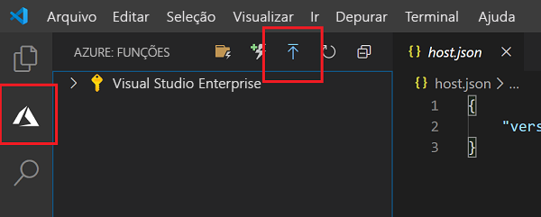

# Início rápido: criar uma função no Azure com o Python usando o Visual Studio Code

[!INCLUDE [functions-language-selector-quickstart-vs-code](../../includes/functions-language-selector-quickstart-vs-code.md)]

Neste artigo, você usará o Visual Studio Code para criar uma função do Python que responde a solicitações HTTP. Após testar o código localmente, implante-o no ambiente sem servidor do Azure Functions.

A realização deste início rápido gera um pequeno custo de alguns centavos de dólar ou menos em sua conta do Azure.

Também há uma [versão baseada na CLI](create-first-function-cli-python.md) deste artigo.

## Configurar seu ambiente

Antes de começar, verifique se você tem os seguintes requisitos implementados:

+ Uma conta do Azure com uma assinatura ativa. [Crie uma conta gratuitamente](https://azure.microsoft.com/free/?ref=microsoft.com&utm_source=microsoft.com&utm_medium=docs&utm_campaign=visualstudio).

+ [Azure Functions Core Tools](functions-run-local.md#install-the-azure-functions-core-tools), versão 3.x.

+ [Versões do Python com suporte do Azure Functions](supported-languages.md#languages-by-runtime-version)

+ [Visual Studio Code](https://code.visualstudio.com/) em uma das [plataformas compatíveis](https://code.visualstudio.com/docs/supporting/requirements#_platforms).

+ A [extensão do Python](https://marketplace.visualstudio.com/items?itemName=ms-python.python) para Visual Studio Code.  

+ A [Extensão Azure Functions](https://marketplace.visualstudio.com/items?itemName=ms-azuretools.vscode-azurefunctions) para Visual Studio Code.

## Criar seu projeto local

Nesta seção, você usará o Visual Studio Code para criar um projeto local do Azure Functions em Python. Mais adiante neste artigo, você publicará o código de função no Azure.

1. Escolha o ícone do Azure na Barra de atividade e, em seguida, na área **Azure: Functions** e selecione o ícone **Criar projeto...** .

    

1. Escolha um local de diretório para o workspace do projeto e escolha **Selecionar**.

    > [!NOTE]
    > Estas etapas foram projetadas para serem concluídas fora de um workspace. Nesse caso, não selecione uma pasta de projeto que faz parte de um workspace.

1. Forneça as seguintes informações nos prompts:

    + **Selecione uma linguagem de programação para o seu projeto de função**: Escolha `Python`.

    + **Selecione um alias do Python para criar um ambiente virtual**: Escolha a localização do seu interpretador do Python.  
    Se a localização não for mostrada, digite o caminho completo no binário do Python.  

    + **Selecione um modelo para a primeira função do projeto**: Escolha `HTTP trigger`.

    + **Forneça um nome de função**: Digite `HttpExample`.

    + **Nível de autorização**: Escolha `Anonymous`, que permite que qualquer pessoa chame seu ponto de extremidade de função. Para saber mais sobre o nível de autorização, confira [Chaves de autorização](functions-bindings-http-webhook-trigger.md#authorization-keys).

    + **Selecione como você gostaria de abrir seu projeto**: Escolha `Add to workspace`.

1. Usando essas informações, o Visual Studio Code gera um projeto do Azure Functions com um gatilho HTTP. Você pode exibir os arquivos de projeto locais no Explorer. Para saber mais sobre os arquivos criados, confira [Arquivos de projeto gerados](functions-develop-vs-code.md#generated-project-files).

[!INCLUDE [functions-run-function-test-local-vs-code](../../includes/functions-run-function-test-local-vs-code.md)]

Após verificar se a função foi executada corretamente no computador local, é hora de usar o Visual Studio Code para publicar o projeto diretamente no Azure.

[!INCLUDE [functions-sign-in-vs-code](../../includes/functions-sign-in-vs-code.md)]

## Publicar o projeto no Azure

Nesta seção, você criará um aplicativo de funções e os recursos relacionados em sua assinatura do Azure e, em seguida, implantará seu código. 

> [!IMPORTANT]
> Publicar em um aplicativo de funções existente substitui o conteúdo desse aplicativo no Azure. 

1. Escolha o ícone do Azure na Barra de atividade e, em seguida, na área **Azure: Functions**, escolha o botão **Implantar no aplicativo de funções...** .

    

1. Forneça as seguintes informações nos prompts:

    + **Selecione a pasta**: escolha uma pasta do seu workspace ou navegue até uma que contenha seu aplicativo de funções.   
    Você não verá isso se já tiver um aplicativo de funções válido aberto.

    + **Selecione a assinatura**: Escolha a assinatura a ser usada.  
    Essa opção não será exibida caso você possua apenas uma assinatura.

    + **Selecione o aplicativo de funções no Azure**: Escolha `+ Create new Function App`.  
    (Não escolha a opção `Advanced`, que não é abordada neste artigo.)

    + **Insira um nome exclusivo globalmente para o aplicativo de funções**: Digite um nome que seja válido em um caminho de URL. O nome que você digitar é validado para ter certeza de que ele é exclusivo no Azure Functions. 

    + **Selecione um runtime**: Escolha a versão do Python em que você está executando localmente. É possível usar o comando `python --version` para verificar sua versão.

    + **Selecione uma localização para novos recursos**:  Para obter um melhor desempenho, escolha uma [região](https://azure.microsoft.com/regions/) perto de você.

    A extensão mostra o status de recursos individuais conforme eles são criados no Azure na área de notificação.

    :::image type="content" source="../../includes/media/functions-publish-project-vscode/resource-notification.png" alt-text="Notificação de criação de recurso do Azure":::

1. Quando concluído, os seguintes recursos do Azure serão criados em sua assinatura, usando nomes baseados em seu nome do aplicativo de funções:

    [!INCLUDE [functions-vs-code-created-resources](../../includes/functions-vs-code-created-resources.md)]

    Uma notificação é exibida depois que seu aplicativo de funções é criado e o pacote de implantação é aplicado. 

    [!INCLUDE [functions-vs-code-create-tip](../../includes/functions-vs-code-create-tip.md)]

4. Escolha **Exibir Saída** nessa notificação para exibir a criação e os resultados da implantação, incluindo os recursos do Azure que você criou. Se você perder a notificação, selecione o ícone de sino no canto inferior direito para vê-lo novamente.

    

[!INCLUDE [functions-vs-code-run-remote](../../includes/functions-vs-code-run-remote.md)]

[!INCLUDE [functions-cleanup-resources-vs-code.md](../../includes/functions-cleanup-resources-vs-code.md)]

## Próximas etapas

Você usou o [Visual Studio Code](functions-develop-vs-code.md?tabs=python) para criar um aplicativo de funções com uma função simples disparada por HTTP. No próximo artigo, você expandirá essa função conectando-se ao Armazenamento do Azure. Para saber mais sobre como se conectar a outros serviços do Azure, confira [Adicionar associações a uma função existente no Azure Functions](add-bindings-existing-function.md?tabs=python). 

> [!div class="nextstepaction"]
> [Conectar-se a uma fila do Armazenamento do Azure](functions-add-output-binding-storage-queue-vs-code.md?pivots=programming-language-python)

[Está com problemas? Fale conosco.](https://aka.ms/python-functions-qs-survey)

[Azure Functions Core Tools]: functions-run-local.md
[Azure Functions extension for Visual Studio Code]: https://marketplace.visualstudio.com/items?itemName=ms-azuretools.vscode-azurefunctions
