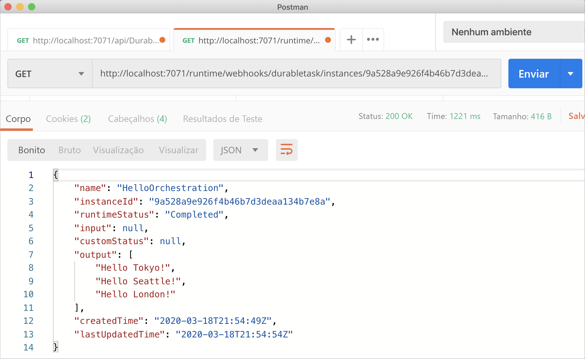
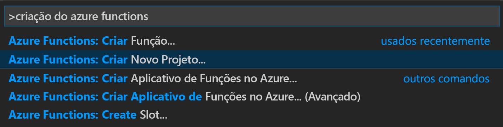
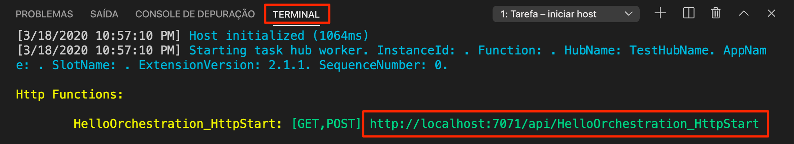
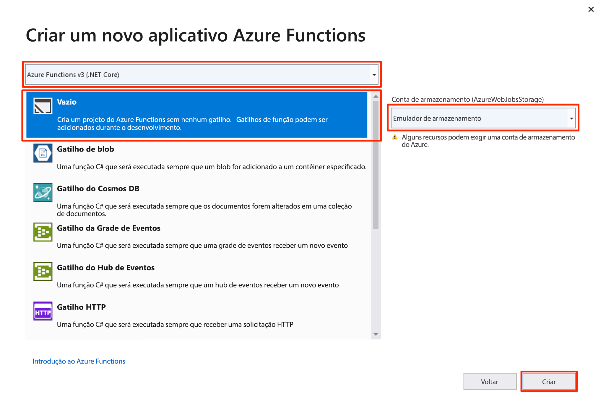
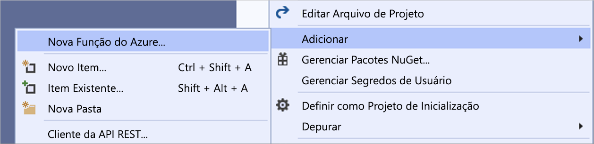

# <a name="create-your-first-durable-function-in-c"></a>Criar sua primeira função durável em C\#

*Durable Functions* são uma extensão do [Azure Functions](../functions-overview.md) que permitem que você escreva funções com estado em um ambiente sem servidor. A extensão gerencia estado, pontos de verificação e reinicializações para você.

::: zone pivot="code-editor-vscode"

Neste artigo, você aprenderá a usar o Visual Studio Code para criar e testar localmente uma função durável "olá, mundo".  Essa função orquestrará e encadeará chamadas para outras funções. Em seguida, você publicará o código de função no Azure. Essas ferramentas estão disponíveis como parte da [extensão do Azure Functions](https://marketplace.visualstudio.com/items?itemName=ms-azuretools.vscode-azurefunctions) do VS Code.



## <a name="prerequisites"></a>Pré-requisitos

Para concluir este tutorial:

* Instale o [Visual Studio Code](https://code.visualstudio.com/download).

* Instale as seguintes extensões do VS Code:
    - [Azure Functions](https://marketplace.visualstudio.com/items?itemName=ms-azuretools.vscode-azurefunctions)
    - [C#](https://marketplace.visualstudio.com/items?itemName=ms-dotnettools.csharp)

* Verifique se tem a versão mais recente do [Azure Functions Core Tools](../functions-run-local.md).

* As Durable Functions requerem uma conta de armazenamento do Azure. É necessária uma assinatura do Azure.

* Verifique se você tem a versão 3.1 ou posterior do [SDK do .NET Core](https://dotnet.microsoft.com/download) instalada.

[!INCLUDE [quickstarts-free-trial-note](../../../includes/quickstarts-free-trial-note.md)]

## <a name="create-your-local-project"></a><a name="create-an-azure-functions-project"></a>Criar seu projeto local 

Nesta seção, você usará o Visual Studio Code para criar um projeto local do Azure Functions. 

1. No Visual Studio Code, pressione F1 (ou Ctrl/Cmd+Shift+P) para abrir a paleta de comandos. Na paleta de comandos, pesquise e selecione `Azure Functions: Create New Project...`.

    

1. Escolha um local em uma pasta vazia para o projeto e escolha **Selecionar**.

1. Após os prompts, forneça as seguintes informações:

    | Prompt | Valor | Descrição |
    | ------ | ----- | ----------- |
    | Selecione uma linguagem de programação para o seu projeto de aplicativo de função. | C# | Criar um projeto local do Functions em C#. |
    | Selecione uma versão | Azure Functions v3 | Você verá essa opção somente quando o Core Tools ainda não estiver instalado. Nesse caso, o Core Tools é instalado na primeira vez em que você executa o aplicativo. |
    | Selecione um modelo para a primeira função do projeto | Ignorar por enquanto | |
    | Selecione como você gostaria de abrir seu projeto | Abrir na janela atual | Reabre o VS Code na pasta selecionada. |

O Visual Studio Code instalará o Azure Functions Core Tools se necessário. Ele também cria o projeto de aplicativo de funções em uma pasta. Este projeto contém os arquivos de configuração [host.json](../functions-host-json.md) e [local.settings.json](../functions-run-local.md#local-settings-file).

## <a name="add-functions-to-the-app"></a>Adicionar funções ao aplicativo

As etapas a seguir usam um modelo para criar o código da durable function no projeto.

1. Na paleta de comandos, pesquise e selecione `Azure Functions: Create Function...`.

1. Após os prompts, forneça as seguintes informações:

    | Prompt | Valor | Descrição |
    | ------ | ----- | ----------- |
    | Selecione um modelo para a função | DurableFunctionsOrchestration | Crie uma orquestração das Durable Functions |
    | Forneça um nome de função | HelloOrchestration | Nome da classe na qual as funções são criadas |
    | Forneça um namespace | Company.Function | Namespace da classe gerada |

1. Quando o VS Code solicitar que você selecione uma conta de armazenamento, escolha **Selecionar conta de armazenamento**. Seguindo os prompts, forneça as seguintes informações para criar uma conta de armazenamento no Azure.

    | Prompt | Valor | Descrição |
    | ------ | ----- | ----------- |
    | Selecionar uma assinatura | *nome da sua assinatura* | Selecionar sua assinatura do Azure |
    | Selecione uma conta de armazenamento | Criar uma nova conta de armazenamento |  |
    | Insira o nome da nova conta de armazenamento | *nome exclusivo* | Nome da conta de armazenamento a ser criada |
    | Selecionar um grupo de recursos | *nome exclusivo* | Nome do grupo de recursos a ser criado |
    | Selecione um local | *região* | Selecione uma região próxima de você |

Uma classe que contém as novas funções é adicionada ao projeto. O VS Code também adiciona a cadeia de conexão da conta de armazenamento a *local.settings.json* e uma referência ao pacote NuGet [`Microsoft.Azure.WebJobs.Extensions.DurableTask`](https://www.nuget.org/packages/Microsoft.Azure.WebJobs.Extensions.DurableTask) ao arquivo de projeto *.csproj*.

Abra o novo arquivo *HelloOrchestration.cs* para exibir o conteúdo. Essa durable function é um exemplo simples de encadeamento de funções com os seguintes métodos:  

| Método | FunctionName | Descrição |
| -----  | ------------ | ----------- |
| **`RunOrchestrator`** | `HelloOrchestration` | Gerencia a orquestração durável. Nesse caso, a orquestração é iniciada, cria uma lista e adiciona o resultado de três chamadas de função à lista.  Quando as três chamadas de função são concluídas, ela retorna a lista. |
| **`SayHello`** | `HelloOrchestration_Hello` | A função retorna uma saudação. É a função que contém a lógica de negócios que está sendo orquestrada. |
| **`HttpStart`** | `HelloOrchestration_HttpStart` | Uma [função disparada por HTTP](../functions-bindings-http-webhook.md) que inicia uma instância da orquestração e retorna uma resposta de status de verificação. |

Agora que você criou seu projeto de função e uma função durável, poderá testá-la em seu computador local.

## <a name="test-the-function-locally"></a>Testar a função localmente

As Ferramentas Principais do Azure Functions permitem executar um projeto do Azure Functions no seu computador de desenvolvimento local. É solicitado que você instale essas ferramentas na primeira vez em que inicia uma função no Visual Studio Code.

1. Para testar sua função, defina um ponto de interrupção no código da função de atividade `SayHello` e pressione F5 para iniciar o projeto do aplicativo de funções. A saída do Core Tools é exibida no painel **Terminal**.

    > [!NOTE]
    > Confira o [Diagnóstico das Durable Functions](durable-functions-diagnostics.md#debugging) para saber mais sobre a depuração.

1. No painel **Terminal**, copie o ponto de extremidade de URL da sua função disparada por HTTP.

    

1. Usando uma ferramenta como [Postman](https://www.getpostman.com/) ou [cURL](https://curl.haxx.se/), envie uma solicitação HTTP POST para o ponto de extremidade de URL.

   A resposta é o resultado inicial da função HTTP informando que a orquestração durável foi iniciada com êxito. A resposta ainda não é o resultado final da orquestração. A resposta inclui algumas URLs úteis. Por enquanto, vamos consultar o status da orquestração.

1. Copie o valor da URL para `statusQueryGetUri` e cole-o na barra de endereços do navegador e execute a solicitação. Como alternativa, você também pode continuar usando o Postman para emitir a solicitação GET.

   A solicitação consultará a instância de orquestração do status. Você deve obter uma resposta eventual, que nos mostra que a instância foi concluída e inclui as saídas ou os resultados da função durável. Ele tem esta aparência: 

    ```json
    {
        "name": "HelloOrchestration",
        "instanceId": "9a528a9e926f4b46b7d3deaa134b7e8a",
        "runtimeStatus": "Completed",
        "input": null,
        "customStatus": null,
        "output": [
            "Hello Tokyo!",
            "Hello Seattle!",
            "Hello London!"
        ],
        "createdTime": "2020-03-18T21:54:49Z",
        "lastUpdatedTime": "2020-03-18T21:54:54Z"
    }
    ```

1. Para interromper a depuração, pressione **Shift+F5** no VS Code.

Após verificar se a função foi executada corretamente no computador local, é hora de publicar o projeto no Azure.

[!INCLUDE [functions-create-function-app-vs-code](../../../includes/functions-sign-in-vs-code.md)]

[!INCLUDE [functions-publish-project-vscode](../../../includes/functions-publish-project-vscode.md)]

## <a name="test-your-function-in-azure"></a>Testar sua função no Azure

1. Copie a URL do gatilho de HTTP do painel **Saída**. A URL que chama a função HTTP disparada deve estar no seguinte formato:

    `https://<functionappname>.azurewebsites.net/api/HelloOrchestration_HttpStart`

1. Cole essa nova URL para a solicitação HTTP na barra de endereços do navegador. Ao usar o aplicativo publicado, você deve obter a mesma resposta de status como antes.

## <a name="next-steps"></a>Próximas etapas

Você usou o Visual Studio Code para criar e publicar um aplicativo de funções duráveis em C#.

> [!div class="nextstepaction"]
> [Saiba mais sobre os padrões comuns de função durável](durable-functions-overview.md#application-patterns)

::: zone-end

::: zone pivot="code-editor-visualstudio"

Neste artigo, você aprenderá a usar o Visual Studio 2019 para criar e testar localmente uma função durável "olá, mundo".  Essa função orquestrará e encadeará chamadas para outras funções. Em seguida, você publicará o código de função no Azure. Essas ferramentas estão disponíveis como parte da carga de trabalho de desenvolvimento do Azure no Visual Studio 2019.


## <a name="prerequisites"></a>Pré-requisitos

Para concluir este tutorial:

* Instalar o [Visual Studio 2019](https://visualstudio.microsoft.com/vs/). Garanta que a carga de trabalho de **desenvolvimento do Azure** também seja instalada. O Visual Studio 2017 também dá suporte ao desenvolvimento de Durable Functions, mas a interface do usuário e as etapas são diferentes.

* Verifique se você tem o [Emulador de Armazenamento do Azure](../../storage/common/storage-use-emulator.md) instalado e em execução.

[!INCLUDE [quickstarts-free-trial-note](../../../includes/quickstarts-free-trial-note.md)]

## <a name="create-a-function-app-project"></a>Crie um projeto de aplicativo de funções

O modelo do Azure Functions cria um projeto que pode ser publicado em um aplicativo de funções no Azure. Um aplicativo de funções lhe permite agrupar funções como uma unidade lógica para facilitar o gerenciamento, a implantação, o dimensionamento e o compartilhamento de recursos.

1. No Visual Studio, selecione **Novo** > **Projeto** no menu **Arquivo**.

1. Na caixa de diálogo **Criar um projeto**, pesquise por `functions`, escolha o modelo do **Azure Functions** e selecione **Avançar**. 

    

1. Digite um **Nome do projeto** e selecione **OK**. O nome do projeto deve ser válido como um namespace do C#, então não use hífens, sublinhados ou outros caracteres não alfanuméricos.

1. Em **Criar um Aplicativo do Azure Functions**, use as configurações especificadas na tabela após a imagem.

    

    | Configuração      | Valor sugerido  | Descrição                      |
    | ------------ |  ------- |----------------------------------------- |
    | **Versão** | Azure Functions 3.0 <br />(.NET Core) | Cria um projeto de função que usa o runtime versão 3.0 do Azure Functions, que dá suporte ao .NET Core 3.1. Para obter mais informações, consulte [Como direcionar para versões do Azure Functions runtime](../functions-versions.md).   |
    | **Modelo** | Vazio | Cria um aplicativo de funções vazio. |
    | **Conta de armazenamento**  | Emulador de Armazenamento | Uma conta de armazenamento é necessária para o gerenciamento de estado de uma função durável. |

4. Selecione **Criar** para criar um projeto de função vazio. Este projeto tem os arquivos de configuração básicos necessários para executar suas funções.

## <a name="add-functions-to-the-app"></a>Adicionar funções ao aplicativo

As etapas a seguir usam um modelo para criar o código da durable function no projeto.

1. Clique com o botão direito do mouse no Visual Studio e escolha **Adicionar** > **Novo Azure Function**.

    

1. Verifique se **Azure Function** está selecionado no menu de adição, digite um nome para o arquivo C# e selecione **Adicionar**.

1. Escolha o modelo **Orquestração de Durable Functions** e selecione **OK**

    

Uma nova durable function será adicionada ao aplicativo.  Abra o novo arquivo .cs para exibir o conteúdo. Essa durable function é um exemplo simples de encadeamento de funções com os seguintes métodos:  

| Método | FunctionName | Descrição |
| -----  | ------------ | ----------- |
| **`RunOrchestrator`** | `<file-name>` | Gerencia a orquestração durável. Nesse caso, a orquestração é iniciada, cria uma lista e adiciona o resultado de três chamadas de função à lista.  Quando as três chamadas de função são concluídas, ela retorna a lista. |
| **`SayHello`** | `<file-name>_Hello` | A função retorna uma saudação. É a função que contém a lógica de negócios que está sendo orquestrada. |
| **`HttpStart`** | `<file-name>_HttpStart` | Uma [função disparada por HTTP](../functions-bindings-http-webhook.md) que inicia uma instância da orquestração e retorna uma resposta de status de verificação. |

Agora que você criou seu projeto de função e uma função durável, poderá testá-la em seu computador local.

## <a name="test-the-function-locally"></a>Testar a função localmente

As Ferramentas Principais do Azure Functions permitem executar um projeto do Azure Functions no seu computador de desenvolvimento local. Você precisa instalar essas ferramentas na primeira vez em que inicia uma função no Visual Studio.

1. Para testar sua função, pressione F5. Se solicitado, aceite a solicitação do Visual Studio para baixar e instalar as ferramentas principais (CLI) do Azure Functions. Você também precisará habilitar a exceção de firewall de forma que as ferramentas possam lidar com solicitações HTTP.

2. Copie a URL da sua função da saída do Azure Functions runtime.

    

3. Cole a URL da solicitação HTTP na barra de endereços do navegador e execute a solicitação. O exemplo a seguir mostra a resposta no navegador à solicitação GET local retornada pela função:

    

    A resposta é o resultado inicial da função HTTP informando que a orquestração durável foi iniciada com êxito.  A resposta ainda não é o resultado final da orquestração.  A resposta inclui algumas URLs úteis.  Por enquanto, vamos consultar o status da orquestração.

4. Copie o valor da URL para `statusQueryGetUri`, cole-o na barra de endereços do navegador e execute a solicitação.

    A solicitação consultará a instância de orquestração do status. Uma resposta eventual deverá ser exibida e será semelhante ao seguinte.  Esse resultado mostra que a instância foi concluída e inclui os resultados ou saídas da função durável.

    ```json
    {
        "instanceId": "d495cb0ac10d4e13b22729c37e335190",
        "runtimeStatus": "Completed",
        "input": null,
        "customStatus": null,
        "output": [
            "Hello Tokyo!",
            "Hello Seattle!",
            "Hello London!"
        ],
        "createdTime": "2019-11-02T07:07:40Z",
        "lastUpdatedTime": "2019-11-02T07:07:52Z"
    }
    ```

5. Para interromper a depuração, pressione **Shift + F5**.

Após verificar se a função foi executada corretamente no computador local, é hora de publicar o projeto no Azure.

## <a name="publish-the-project-to-azure"></a>Publicar o projeto no Azure

Você deve ter um aplicativo de funções em sua assinatura do Azure antes de publicar seu projeto. Você pode criar um aplicativo de funções diretamente no Visual Studio.

[!INCLUDE [Publish the project to Azure](../../../includes/functions-vstools-publish.md)]

## <a name="test-your-function-in-azure"></a>Testar sua função no Azure

1. Copie a URL base do aplicativo de funções da página de perfil de publicação. Substitua a parte `localhost:port` da URL que você usou ao testar a função localmente pela nova URL base.

    A URL que chama a função HTTP durável deve estar no seguinte formato:

    `https://<APP_NAME>.azurewebsites.net/api/<FUNCTION_NAME>_HttpStart`

2. Cole essa nova URL para a solicitação HTTP na barra de endereços do navegador. Ao usar o aplicativo publicado, você deve obter a mesma resposta de status como antes.

## <a name="next-steps"></a>Próximas etapas

Você usou o Visual Studio Code para criar e publicar um aplicativo de funções C# durável.

> [!div class="nextstepaction"]
> [Saiba mais sobre os padrões comuns de função durável](durable-functions-overview.md#application-patterns)

::: zone-end
