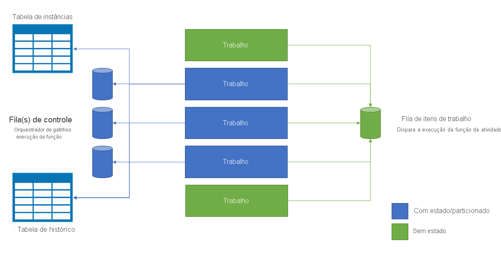

# <a name="performance-and-scale-in-durable-functions-azure-functions"></a>Desempenho e escala nas Funções Duráveis (Azure Functions)

Para otimizar o desempenho e escalabilidade, é importante entender as características únicas da colocação em escala nas [Funções Duráveis](durable-functions-overview.md).

Para entender o comportamento de escala, você precisa entender alguns dos detalhes do provedor subjacente do fornecedor do Armazenamento do Microsoft Azure.

## <a name="history-table"></a>Tabela de histórico

A tabela de **Histórico** é uma tabela do Armazenamento do Microsoft Azure que contém eventos de histórico de todas as instâncias de orquestração com um hub de tarefas. O nome da tabela está no formato *TaskHubName*histórico. Conforme as instâncias são executadas, novas linhas são adicionadas a essa tabela. A chave de partição da tabela é derivada da ID de instância da orquestração. Uma ID de instância é aleatória na maioria dos casos, o que garante a distribuição ideal das partições internas do Armazenamento do Microsoft Azure.

Quando uma instância de orquestração precisa ser executada, as linhas correspondentes da tabela de histórico são carregadas na memória. Esses *histórico de eventos* são, em seguida, copiados para o código de função do orquestrador para recuperá-lo em seu estado de ponto de verificação anteriormente. O uso do histórico de execução para recriar o estado dessa maneira é influenciado pelo [padrão de Fornecimento de Evento](https://docs.microsoft.com/azure/architecture/patterns/event-sourcing).

## <a name="instances-table"></a>Tabela de instâncias

The **Instances** table is another Azure Storage table that contains the statuses of all orchestration and entity instances within a task hub. Conforme as instâncias são criadas, novas linhas são adicionadas a essa tabela. The partition key of this table is the orchestration instance ID or entity key and the row key is a fixed constant. There is one row per orchestration or entity instance.

This table is used to satisfy instance query requests from the `GetStatusAsync` (.NET) and `getStatus` (JavaScript) APIs as well as the [status query HTTP API](durable-functions-http-api.md#get-instance-status). Isso é mantido finalmente consistente com o conteúdo da tabela **Histórico** mencionada anteriormente. O uso de uma tabela separada do Armazenamento do Microsoft Azure para atender com eficiência as operações de consulta de instância dessa maneira é influenciado pelo [padrão de Comando e Segregação de Reponsabilidade (CQRS)](https://docs.microsoft.com/azure/architecture/patterns/cqrs).

## <a name="internal-queue-triggers"></a>Gatilhos de fila interna

As funções de Orchestrator e as funções de atividade são disparadas por filas internas no hub de tarefas do aplicativo. Usar filas dessa maneira fornece garantias de entrega de mensagem “pelo menos uma vez”. Há dois tipos de filas nas Funções Duráveis: a **fila de controle** e a **fila de itens de trabalho**.

### <a name="the-work-item-queue"></a>A fila de item de trabalho

Há uma fila de itens de trabalho por hub de tarefas nas Funções Duráveis. Essa é uma fila básica, que se comporta da mesma forma que qualquer outra fila `queueTrigger` no Azure Functions. Essa fila é usada para disparar *funções de atividade* sem estado para remover da fila uma mensagem única por vez. Cada uma dessas mensagens contém entradas de função de atividades e metadados adicionais, como a função para executar. Quando um aplicativo de Funções Duráveis é expandido para várias VMs, todas essas VMs concorrem para obter trabalho da fila de itens de trabalho.

### <a name="control-queues"></a>Fila(s) de controle

Há várias *filas de controle* por hub de tarefa em Funções Duráveis. Uma *fila de controle* é mais sofisticada do que as filas de itens de trabalho mais simples. Control queues are used to trigger the stateful orchestrator and entity functions. Because the orchestrator and entity function instances are stateful singletons, it's not possible to use a competing consumer model to distribute load across VMs. Instead, orchestrator and entity messages are load-balanced across the control queues. Para obter mais detalhes sobre esse comportamento, verifique as seções subsequentes.

Filas de controle contêm uma variedade de tipos de mensagem de ciclo de vida de orquestração. Exemplos incluem [mensagens de controle de orquestrador](durable-functions-instance-management.md), mensagens de *resposta* de função de atividade e mensagens de temporizador. Até 32 mensagens serão removidas da fila de uma fila de controle em uma única chamada seletiva. Essas mensagens contêm dados de conteúdo, bem como metadados, incluindo qual instância de orquestração é destinada. Se várias mensagens removidas da fila destinam-se à mesma instância de orquestração, será processado como um lote.

### <a name="queue-polling"></a>Queue polling

The durable task extension implements a random exponential back-off algorithm to reduce the effect of idle-queue polling on storage transaction costs. When a message is found, the runtime immediately checks for another message; when no message is found, it waits for a period of time before trying again. After subsequent failed attempts to get a queue message, the wait time continues to increase until it reaches the maximum wait time, which defaults to 30 seconds.

The maximum polling delay is configurable via the `maxQueuePollingInterval` property in the [host.json file](../functions-host-json.md#durabletask). Setting this property to a higher value could result in higher message processing latencies. Higher latencies would be expected only after periods of inactivity. Setting this property to a lower value could result in higher storage costs due to increased storage transactions.

> [!NOTE]
> When running in the Azure Functions Consumption and Premium plans, the [Azure Functions Scale Controller](../functions-scale.md#how-the-consumption-and-premium-plans-work) will poll each control and work-item queue once every 10 seconds. This additional polling is necessary to determine when to activate function app instances and to make scale decisions. At the time of writing, this 10 second interval is constant and cannot be configured.

## <a name="storage-account-selection"></a>Seleção da conta de armazenamento

The queues, tables, and blobs used by Durable Functions are created in a configured Azure Storage account. The account to use can be specified using the `durableTask/storageProvider/connectionStringName` setting (or `durableTask/azureStorageConnectionStringName` setting in Durable Functions 1.x) in the **host.json** file.

### <a name="durable-functions-2x"></a>Durable Functions 2.x

```json
{
  "extensions": {
    "durableTask": {
      "storageProvider": {
        "connectionStringName": "MyStorageAccountAppSetting"
      }
    }
  }
}
```

### <a name="durable-functions-1x"></a>Durable Functions 1.x

```json
{
  "extensions": {
    "durableTask": {
      "azureStorageConnectionStringName": "MyStorageAccountAppSetting"
    }
  }
}
```

Se não estiver especificado, a conta de armazenamento `AzureWebJobsStorage` padrão é usada. Para cargas de trabalho afetadas pelo desempenho, no entanto, configurar uma conta de armazenamento padrão não é recomendável. Funções duráveis usam o Armazenamento do Microsoft Azure intensamente e usam uma conta de armazenamento dedicado que isola o uso do armazenamento de funções duráveis com o uso interno pelo host de Funções do Microsoft Azure.

## <a name="orchestrator-scale-out"></a>Expansão do orquestrador

As funções de atividade são sem estado e são expandidas automaticamente adicionando VMs. Orchestrator functions and entities, on the other hand, are *partitioned* across one or more control queues. O número de filas do controle é definido no arquivo **host.json**. The following example host.json snippet sets the `durableTask/storageProvider/partitionCount` property (or `durableTask/partitionCount` in Durable Functions 1.x) to `3`.

### <a name="durable-functions-2x"></a>Durable Functions 2.x

```json
{
  "extensions": {
    "durableTask": {
      "storageProvider": {
          "partitionCount": 3
      }
    }
  }
}
```

### <a name="durable-functions-1x"></a>Durable Functions 1.x

```json
{
  "extensions": {
    "durableTask": {
      "partitionCount": 3
    }
  }
}
```

Um hub de tarefa pode ser configurado com entre 1 e 16 partições. Se não for especificado, a contagem de participação padrão 4 **será usada**.

Ao expandir para várias instâncias de host de função (normalmente, em VMs diferentes), cada instância adquire um bloqueio de uma das filas de controle. These locks are internally implemented as blob storage leases and ensure that an orchestration instance or entity only runs on a single host instance at a time. If a task hub is configured with three control queues, orchestration instances and entities can be load-balanced across as many as three VMs. VMs adicionais podem ser adicionadas para aumentar a capacidade de execução da função de atividade.

O diagrama a seguir ilustra como o host do Azure Functions interage com as entidades de armazenamento em um ambiente expandido.



Conforme mostrado no diagrama anterior, todas as máquinas virtuais competem por mensagens na fila do item de trabalho. No entanto, apenas três VMs podem adquirir mensagens das filas de controle e cada VM bloqueia uma única fila de controle.

Orchestration instances and entities are distributed across all control queue instances. The distribution is done by hashing the instance ID of the orchestration or the entity name and key pair. Orchestration instance IDs by default are random GUIDs, ensuring that instances are equally distributed across all control queues.

De modo geral, as funções de orquestrador devem ser leves e não devem precisar de muita capacidade de computação. It is therefore not necessary to create a large number of control queue partitions to get great throughput for orchestrations. A maior parte do trabalho pesado será feita em funções de atividade sem monitoração de estado, que podem ser expandidas infinitamente.

## <a name="auto-scale"></a>Autoescala

As with all Azure Functions running in the Consumption and Elastic Premium plans, Durable Functions supports auto-scale via the [Azure Functions scale controller](../functions-scale.md#runtime-scaling). O Controlador de Escala monitora a latência de todas as filas periodicamente emitindo comandos de _inspeção_. Com base nas latências das mensagens inspecionadas, o controlador de escala irá decidir se deseja adicionar ou remover VMs.

Se o controlador de escala determina que as latências de mensagem de fila de controle são muito altas, ele irá adicionar instâncias de VM até que a latência de mensagem diminua em um nível aceitável ou atinja a contagem de partições de fila do controle. Da mesma forma, o controlador de escala continuamente adiciona instâncias de VM se as latências de fila de item de trabalho são alta, independentemente da contagem de partição.

> [!NOTE]
> Starting with Durable Functions 2.0, function apps can be configured to run within VNET-protected service endpoints in the Elastic Premium plan. In this configuration, the Durable Functions triggers initiate scale requests instead of the Scale Controller.

## <a name="thread-usage"></a>Uso de thread

As funções do Orchestrator são executadas em um único thread para assegurar que a execução pode ser determinística entre muitas repetições. Devido a essa execução de thread único, é importante que os threads de função do orquestrador não execute tarefas de uso intensivo de CPU, faça E/S ou bloqueie por algum motivo. Qualquer trabalho que possa exigir E/S, bloqueio ou vários threads deve ser movido para funções de atividade.

As funções de atividade têm os mesmos comportamentos que as funções disparadas por filas regulares. Elas podem, de maneira segura, fazer E/S, executar operações com uso intensivo de CPU e usar vários threads. Como os gatilhos de atividade são sem monitoração de estado, eles podem ser expandidos livremente para um número ilimitado de VMs.

Entity functions are also executed on a single thread and operations are processed one-at-a-time. However, entity functions do not have any restrictions on the type of code that can be executed.

## <a name="concurrency-throttles"></a>Restrições de simultaneidade

O Azure Functions suporta a execução de várias funções simultaneamente em uma instância de aplicativo único. Essa execução simultânea ajuda a aumentar o paralelismo e minimiza o número de "frios" que um aplicativo típico terá ao longo do tempo. However, high concurrency can exhaust per-VM system resources such network connections or available memory. Dependendo das necessidades do aplicativo de função, pode ser necessário aumentar a simultaneidade por instância para evitar a possibilidade de falta de memória em situações de carga alta.

Activity, orchestrator, and entity function concurrency limits can be configured in the **host.json** file. The relevant settings are `durableTask/maxConcurrentActivityFunctions` for activity functions and `durableTask/maxConcurrentOrchestratorFunctions` for both orchestrator and entity functions.

### <a name="functions-20"></a>Functions 2.0

```json
{
  "extensions": {
    "durableTask": {
      "maxConcurrentActivityFunctions": 10,
      "maxConcurrentOrchestratorFunctions": 10
    }
  }
}
```

### <a name="functions-1x"></a>Funções 1.x

```json
{
  "durableTask": {
    "maxConcurrentActivityFunctions": 10,
    "maxConcurrentOrchestratorFunctions": 10
  }
}
```

In the previous example, a maximum of 10 orchestrator or entity functions and 10 activity functions can run on a single VM concurrently. If not specified, the number of concurrent activity and orchestrator or entity function executions is capped at 10X the number of cores on the VM.

> [!NOTE]
> Essas configurações são úteis para ajudar a gerenciar o uso da memória e CPU em uma única VM. However, when scaled out across multiple VMs, each VM has its own set of limits. These settings can't be used to control concurrency at a global level.

## <a name="extended-sessions"></a>Extended sessions

Extended sessions is a setting that keeps orchestrations and entities in memory even after they finish processing messages. O efeito típico de habilitar sessões estendidas é E/S reduzidas em relação à conta de Armazenamento do Microsoft Azure e maior taxa de transferência geral.

You can enable extended sessions by setting `durableTask/extendedSessionsEnabled` to `true` in the **host.json** file. The `durableTask/extendedSessionIdleTimeoutInSeconds` setting can be used to control how long an idle session will be held in memory:

**Functions 2.0**
```json
{
  "extensions": {
    "durableTask": {
      "extendedSessionsEnabled": true,
      "extendedSessionIdleTimeoutInSeconds": 30
    }
  }
}
```

**Functions 1.0**
```json
{
  "durableTask": {
    "extendedSessionsEnabled": true,
    "extendedSessionIdleTimeoutInSeconds": 30
  }
}
```

There are two potential downsides of this setting to be aware of:

1. There's an overall increase in function app memory usage.
2. There can be an overall decrease in throughput if there are many concurrent, short-lived orchestrator or entity function executions.

As an example, if `durableTask/extendedSessionIdleTimeoutInSeconds` is set to 30 seconds, then a short-lived orchestrator or entity function episode that executes in less than 1 second still occupies memory for 30 seconds. It also counts against the `durableTask/maxConcurrentOrchestratorFunctions` quota mentioned previously, potentially preventing other orchestrator or entity functions from running.

The specific effects of extended sessions on orchestrator and entity functions are described in the next sections.

### <a name="orchestrator-function-replay"></a>Reprodução de função do Orchestrator

Conforme mencionado anteriormente, as funções do orquestrador são repetidas usando o conteúdo da tabela **Histórico**. Por padrão, o código de função do orquestrador é repetido sempre que um lote de mensagens for removido da fila de uma fila de controle. When extended sessions are enabled, orchestrator function instances are held in memory longer and new messages can be processed without a full history replay.

The performance improvement of extended sessions is most often observed in the following situations:

* When there are a limited number of orchestration instances running concurrently.
* When orchestrations have large number of sequential actions (e.g. hundreds of activity function calls) that complete quickly.
* When orchestrations fan-out and fan-in a large number of actions that complete around the same time.
* When orchestrator functions need to process large messages or do any CPU-intensive data processing.

In all other situations, there is typically no observable performance improvement for orchestrator functions.

> [!NOTE]
> Essas configurações só devem ser usadas depois que uma função do orquestrador for totalmente desenvolvida e testada. The default aggressive replay behavior can useful for detecting [orchestrator function code constraints](durable-functions-code-constraints.md) violations at development time, and is therefore disabled by default.

### <a name="entity-function-unloading"></a>Entity function unloading

Entity functions process up to 20 operations in a single batch. As soon as an entity finishes processing a batch of operations, it persists its state and unloads from memory. You can delay the unloading of entities from memory using the extended sessions setting. Entities continue to persist their state changes as before, but remain in memory for the configured period of time to reduce the number of loads from Azure Storage. This reduction of loads from Azure Storage can improve the overall throughput of frequently accessed entities.

## <a name="performance-targets"></a>Destinos de desempenho

Ao planejar usar funções duráveis para um aplicativo de produção, é importante considerar os requisitos de desempenho no início do processo de planejamento. Esta seção aborda alguns cenários de uso básico e os números de taxa de transferência máxima esperada.

* **Execução de atividades sequenciais**: este cenário descreve uma função do orquestrador que executa uma série de funções de atividade um após o outro. Ele é bastante semelhante ao exemplo de [Encadeamento de função](durable-functions-sequence.md).
* **Execução de atividade paralela**: este cenário descreve uma função do orquestrador que executa muitas funções de atividades em paralelo usando o padrão [Fan-out, Fan-in](durable-functions-cloud-backup.md).
* **Resposta de processamento paralelo**: esse cenário é a segunda metade do padrão [Fan-out, Fan-in](durable-functions-cloud-backup.md). Se concentra no desempenho de fan-in. É importante observar que ao contrário do tipo fan-out, fan-in é feito por uma instância de função do orchestrator único e, portanto, só pode executar em uma única VM.
* **Processamento de eventos externos**: esse cenário representa uma instância de função do orquestrador único que espera [eventos externos](durable-functions-external-events.md), um de cada vez.
* **Entity operation processing**: This scenario tests how quickly a _single_ [Counter entity](durable-functions-entities.md) can process a constant stream of operations.

> [!TIP]
> Ao contrário do tipo fan-out, as operações de consolidação são limitadas a uma única VM. Se seu aplicativo usa o padrão fan-out, fan-in e você estiver preocupado sobre o desempenho de fan-in, divida abaixo a divisão da função de atividade em várias [sub-orquestrações](durable-functions-sub-orchestrations.md).

A tabela a seguir mostra os números *máximos* de taxa de transferência para os cenários descritos anteriormente. "Instância" refere-se a uma única instância de uma função do orquestrador em execução em uma única pequena VM ([A1](../../virtual-machines/windows/sizes-previous-gen.md#a-series)) no Serviço do Aplicativo do Azure. Todos os casos, presume-se que [sessões estendidas](#orchestrator-function-replay) estão habilitadas. Os resultados reais podem variar dependendo do trabalho de CPU ou E/S executado pelo código da função.

| Cenário | Taxa de transferência máxima |
|-|-|
| Execução da atividade sequencial | 5 atividades por segundo, por instância |
| Execução de atividade paralela (fan-out) | 100 atividades por segundo, por instância |
| Processamento paralelo de resposta (fan-in) | 150 respostas por segunda, por instância |
| Processamento de evento externo | 50 eventos por segunda, por instância |
| Entity operation processing | 64 operations per second |

> [!NOTE]
> Esses números são atuais a partir da versão v1.4.0 (GA) da extensão de Funções Duráveis. Esses números podem alterar ao longo do tempo conforme o recurso amadurece e otimizações que são feitas.

Se você não estiver vendo os números de taxa de transferência esperada e a CPU e uso de memória aparece íntegra, verifique se a causa está relacionada à integridade [ de sua conta de armazenamento](../../storage/common/storage-monitoring-diagnosing-troubleshooting.md#troubleshooting-guidance). A extensão de Funções Duráveis pode colocar carga significativa em uma conta de Armazenamento do Microsoft Azure e carga suficientemente altas podem resultar na limitação da conta de armazenamento.

## <a name="next-steps"></a>Próximos passos

> [!div class="nextstepaction"]
> [Learn about disaster recovery and geo-distribution](durable-functions-disaster-recovery-geo-distribution.md)
