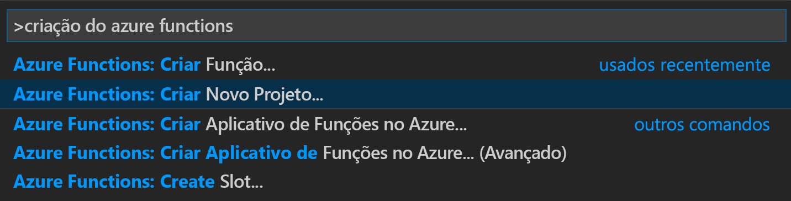
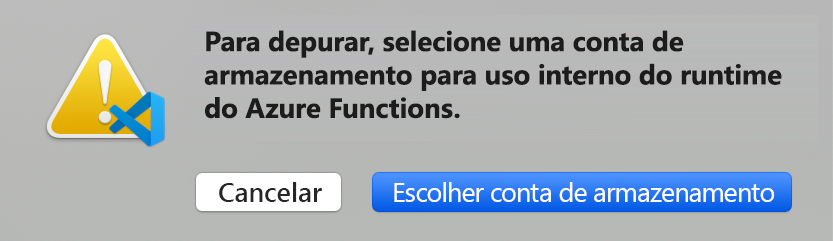
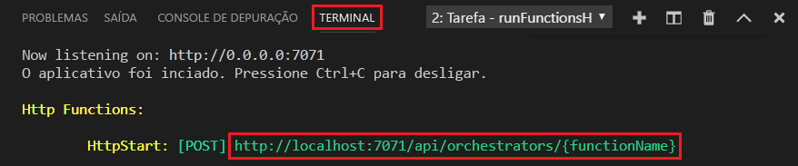

# <a name="create-your-first-durable-function-in-javascript"></a>Criar sua primeira função durável em JavaScript

*Durable Functions* são uma extensão do [Azure Functions](../functions-overview.md) que permitem que você escreva funções com estado em um ambiente sem servidor. A extensão gerencia estado, pontos de verificação e reinicializações para você.

Neste artigo, você aprenderá a usar a extensão do Azure Functions do Visual Studio Code para criar e testar localmente uma função durável "hello world".  Essa função orquestrará e encadeará chamadas para outras funções. Em seguida, você publicará o código de função no Azure.


## <a name="prerequisites"></a>Pré-requisitos

Para concluir este tutorial:

* Instale o [Visual Studio Code](https://code.visualstudio.com/download).

* Instale a extensão do VS Code do [Azure Functions](https://marketplace.visualstudio.com/items?itemName=ms-azuretools.vscode-azurefunctions)

* Verifique se tem a versão mais recente do [Azure Functions Core Tools](../functions-run-local.md).

* As Durable Functions requerem uma conta de armazenamento do Azure. É necessária uma assinatura do Azure.

* Verifique se você tem a versão 10.x ou 12.x do [Node.js](https://nodejs.org/) instalada.

[!INCLUDE [quickstarts-free-trial-note](../../../includes/quickstarts-free-trial-note.md)]

## <a name="create-your-local-project"></a><a name="create-an-azure-functions-project"></a>Criar seu projeto local 

Nesta seção, você usará o Visual Studio Code para criar um projeto local do Azure Functions. 

1. No Visual Studio Code, pressione F1 (ou Ctrl/Cmd+Shift+P) para abrir a paleta de comandos. Na paleta de comandos, pesquise e selecione `Azure Functions: Create New Project...`.

    

1. Escolha um local em uma pasta vazia para o projeto e escolha **Selecionar**.

1. Após os prompts, forneça as seguintes informações:

    | Prompt | Valor | Descrição |
    | ------ | ----- | ----------- |
    | Selecione uma linguagem de programação para o seu projeto de aplicativo de função. | JavaScript | Criar um projeto local do Functions em Node.js. |
    | Selecione uma versão | Azure Functions v3 | Você verá essa opção somente quando o Core Tools ainda não estiver instalado. Nesse caso, o Core Tools é instalado na primeira vez em que você executa o aplicativo. |
    | Selecione um modelo para a primeira função do projeto | Ignorar por enquanto | |
    | Selecione como você gostaria de abrir seu projeto | Abrir na janela atual | Reabre o VS Code na pasta selecionada. |

O Visual Studio Code instalará o Azure Functions Core Tools se necessário. Ele também cria o projeto de aplicativo de funções em uma pasta. Este projeto contém os arquivos de configuração [host.json](../functions-host-json.md) e [local.settings.json](../functions-run-local.md#local-settings-file).

Um arquivo package.json também é criado na pasta raiz.

## <a name="install-the-durable-functions-npm-package"></a>Instalar o pacote npm de Durable Functions

Para trabalhar com as Durable Functions em um aplicativo de funções Node.js, use uma biblioteca chamada `durable-functions`.

1. Use o menu *Exibir* ou Ctrl+Shift+` para abrir um novo terminal no VS Code.

1. Instale o pacote npm `durable-functions` executando `npm install durable-functions` no diretório raiz do aplicativo de funções.

## <a name="creating-your-functions"></a>Criando suas funções

O aplicativo Durable Functions mais básico contém três funções:

* *Função de orquestrador* – descreve um fluxo de trabalho que orquestra outras funções.
* *Função de atividade* – chamada pela função de orquestrador, executa o trabalho e, opcionalmente, retorna um valor.
* *Função de cliente* – uma Função do Azure regular que inicia uma função de orquestrador. Este exemplo usa uma função disparada por HTTP.

### <a name="orchestrator-function"></a>Função de orquestrador

Use um modelo para criar o código da função durável no projeto.

1. Na paleta de comandos, pesquise e selecione `Azure Functions: Create Function...`.

1. Após os prompts, forneça as seguintes informações:

    | Prompt | Valor | Descrição |
    | ------ | ----- | ----------- |
    | Selecione um modelo para a função | Orquestrador das Durable Functions | Crie uma orquestração das Durable Functions |
    | Forneça um nome de função | HelloOrchestrator | Nome da função durável |

Você adicionou um orquestrador para coordenar as funções de atividade. Abra *HelloOrchestrator/index.js* para ver a função de orquestrador. Cada chamada para `context.df.callActivity` invoca uma função de atividade chamada `Hello`.

A seguir, vamos adicionar a função de atividade `Hello` referenciada.

### <a name="activity-function"></a>Função de atividade

1. Na paleta de comandos, pesquise e selecione `Azure Functions: Create Function...`.

1. Após os prompts, forneça as seguintes informações:

    | Prompt | Valor | Descrição |
    | ------ | ----- | ----------- |
    | Selecione um modelo para a função | Atividade das Durable Functions | Crie uma função de atividade |
    | Forneça um nome de função | Olá | Nome da função de atividade |

Você adicionou a função de atividade `Hello`, que é invocada pelo orquestrador. Abra *Hello/index.js* para ver que ele está aceitando um nome como entrada e retornando uma saudação. Uma função de atividade é onde você executará ações como fazer uma chamada de banco de dados ou executar um cálculo.

Por fim, você adicionará uma função disparada por HTTP que inicia a orquestração.

### <a name="client-function-http-starter"></a>Função de cliente (iniciador de HTTP)

1. Na paleta de comandos, pesquise e selecione `Azure Functions: Create Function...`.

1. Após os prompts, forneça as seguintes informações:

    | Prompt | Valor | Descrição |
    | ------ | ----- | ----------- |
    | Selecione um modelo para a função | Iniciador de HTTP das Durable Functions | Crie uma função de iniciador de HTTP |
    | Forneça um nome de função | DurableFunctionsHttpStart | Nome da função de atividade |
    | Nível de autorização | Anônima | Para fins de demonstração, permita que a função seja chamada sem autenticação |

Você adicionou uma função disparada por HTTP que inicia uma orquestração. Abra *DurableFunctionsHttpStart/index.js* para ver que ela usa `client.startNew` para iniciar uma nova orquestração. Em seguida, ela usa `client.createCheckStatusResponse` para retornar uma resposta HTTP contendo URLs que podem ser usadas para monitorar e gerenciar a nova orquestração.

Agora, você tem um aplicativo das Durable Functions que pode ser executado localmente e implantado no Azure.

## <a name="test-the-function-locally"></a>Testar a função localmente

As Ferramentas Principais do Azure Functions permitem executar um projeto do Azure Functions no seu computador de desenvolvimento local. É solicitado que você instale essas ferramentas na primeira vez em que inicia uma função no Visual Studio Code.

1. Para testar a função, defina um ponto de interrupção no código da função de atividade `Hello` (*Hello/index.js*). Pressione F5 ou selecione `Debug: Start Debugging` na paleta de comandos para iniciar o projeto do aplicativo de funções. A saída do Core Tools é exibida no painel **Terminal**.

    > [!NOTE]
    > Confira o [Diagnóstico das Durable Functions](durable-functions-diagnostics.md#debugging) para saber mais sobre a depuração.

1. As Durable Functions requerem uma conta de Armazenamento do Azure para serem executadas. Quando o VS Code solicitar que você selecione uma conta de armazenamento, escolha **Selecionar conta de armazenamento**.

    

1. Seguindo os prompts, forneça as seguintes informações para criar uma conta de armazenamento no Azure.

    | Prompt | Valor | Descrição |
    | ------ | ----- | ----------- |
    | Selecionar uma assinatura | *nome da sua assinatura* | Selecionar sua assinatura do Azure |
    | Selecione uma conta de armazenamento | Criar uma nova conta de armazenamento |  |
    | Insira o nome da nova conta de armazenamento | *nome exclusivo* | Nome da conta de armazenamento a ser criada |
    | Selecionar um grupo de recursos | *nome exclusivo* | Nome do grupo de recursos a ser criado |
    | Selecione um local | *região* | Selecione uma região próxima de você |

1. No painel **Terminal**, copie o ponto de extremidade de URL da sua função disparada por HTTP.

    

1. Usando o navegador ou uma ferramenta como [Postman](https://www.getpostman.com/) ou [cURL](https://curl.haxx.se/), envie uma solicitação HTTP POST para o ponto de extremidade de URL. Substitua o último segmento pelo nome da função de orquestrador (`HelloOrchestrator`). A URL deve ser semelhante a `http://localhost:7071/api/orchestrators/HelloOrchestrator`.

   A resposta é o resultado inicial da função HTTP informando que a orquestração durável foi iniciada com êxito. A resposta ainda não é o resultado final da orquestração. A resposta inclui algumas URLs úteis. Por enquanto, vamos consultar o status da orquestração.

1. Copie o valor da URL para `statusQueryGetUri` e cole-o na barra de endereços do navegador e execute a solicitação. Como alternativa, você também pode continuar usando o Postman para emitir a solicitação GET.

   A solicitação consultará a instância de orquestração do status. Você deve obter uma resposta eventual, que nos mostra que a instância foi concluída e inclui as saídas ou os resultados da função durável. Ele tem esta aparência: 

    ```json
    {
        "name": "HelloOrchestrator",
        "instanceId": "9a528a9e926f4b46b7d3deaa134b7e8a",
        "runtimeStatus": "Completed",
        "input": null,
        "customStatus": null,
        "output": [
            "Hello Tokyo!",
            "Hello Seattle!",
            "Hello London!"
        ],
        "createdTime": "2020-03-18T21:54:49Z",
        "lastUpdatedTime": "2020-03-18T21:54:54Z"
    }
    ```

1. Para interromper a depuração, pressione **Shift+F5** no VS Code.

Após verificar se a função foi executada corretamente no computador local, é hora de publicar o projeto no Azure.

[!INCLUDE [functions-create-function-app-vs-code](../../../includes/functions-sign-in-vs-code.md)]

[!INCLUDE [functions-publish-project-vscode](../../../includes/functions-publish-project-vscode.md)]

## <a name="test-your-function-in-azure"></a>Testar sua função no Azure

1. Copie a URL do gatilho de HTTP do painel **Saída**. A URL que chama a função disparada por HTTP deve estar neste formato: `http://<functionappname>.azurewebsites.net/api/orchestrators/HelloOrchestrator`

2. Cole essa nova URL para a solicitação HTTP na barra de endereços do navegador. Ao usar o aplicativo publicado, você deve obter a mesma resposta de status como antes.

## <a name="next-steps"></a>Próximas etapas

Você usou o Visual Studio Code para criar e publicar um aplicativo de funções duráveis de JavaScript.

> [!div class="nextstepaction"]
> [Saiba mais sobre os padrões comuns de função durável](durable-functions-overview.md#application-patterns)
