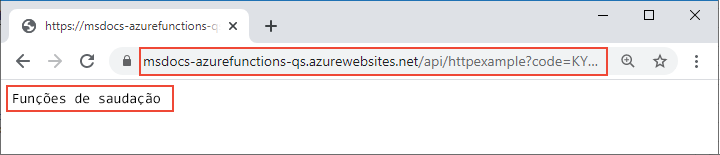

# <a name="connect-azure-functions-to-azure-storage-using-command-line-tools"></a>Conectar o Azure Functions ao armazenamento do Azure usando ferramentas de linha de comando

Neste artigo, você integra uma fila do Armazenamento do Azure à função e à conta de armazenamento criada no artigo de início rápido anterior. Obtenha essa integração usando uma *associação de saída* que grava os dados de uma solicitação HTTP em uma mensagem na fila. A conclusão deste artigo não gera nenhum custo adicional além dos primeiros centavos em US$ do início rápido anterior. Para saber mais sobre associações, confira [Conceitos de gatilhos e de associações do Azure Functions](functions-triggers-bindings.md).

## <a name="configure-your-local-environment"></a>Configurar o ambiente local

::: zone pivot="programming-language-csharp"  
Antes de começar, conclua o artigo [Início rápido: criar um projeto de Azure Functions da linha de comando](create-first-function-cli-csharp.md). Se você já limpou os recursos ao final daquele artigo, percorra as etapas novamente para recriar o aplicativo de funções e recursos relacionados no Azure.  
::: zone-end  
::: zone pivot="programming-language-javascript"  
Antes de começar, conclua o artigo [Início rápido: criar um projeto de Azure Functions da linha de comando](create-first-function-cli-node.md). Se você já limpou os recursos ao final daquele artigo, percorra as etapas novamente para recriar o aplicativo de funções e recursos relacionados no Azure.  
::: zone-end   
::: zone pivot="programming-language-java"  
Antes de começar, conclua o artigo [Início rápido: criar um projeto de Azure Functions da linha de comando](create-first-function-cli-java.md). Se você já limpou os recursos ao final daquele artigo, percorra as etapas novamente para recriar o aplicativo de funções e recursos relacionados no Azure.  
::: zone-end   
::: zone pivot="programming-language-typescript"  
Antes de começar, conclua o artigo [Início rápido: criar um projeto de Azure Functions da linha de comando](create-first-function-cli-typescript.md). Se você já limpou os recursos ao final daquele artigo, percorra as etapas novamente para recriar o aplicativo de funções e recursos relacionados no Azure.  
::: zone-end   
::: zone pivot="programming-language-python"  
Antes de começar, conclua o artigo [Início rápido: criar um projeto de Azure Functions da linha de comando](create-first-function-cli-python.md). Se você já limpou os recursos ao final daquele artigo, percorra as etapas novamente para recriar o aplicativo de funções e recursos relacionados no Azure.  
::: zone-end   
::: zone pivot="programming-language-powershell"  
Antes de começar, conclua o artigo [Início rápido: criar um projeto de Azure Functions da linha de comando](create-first-function-cli-powershell.md). Se você já limpou os recursos ao final daquele artigo, percorra as etapas novamente para recriar o aplicativo de funções e recursos relacionados no Azure.  
::: zone-end   

[!INCLUDE [functions-cli-get-storage-connection](../../includes/functions-cli-get-storage-connection.md)]

[!INCLUDE [functions-register-storage-binding-extension-csharp](../../includes/functions-register-storage-binding-extension-csharp.md)]

[!INCLUDE [functions-add-output-binding-cli](../../includes/functions-add-output-binding-cli.md)]

::: zone pivot="programming-language-csharp"  
[!INCLUDE [functions-add-storage-binding-csharp-library](../../includes/functions-add-storage-binding-csharp-library.md)]  
::: zone-end  
::: zone pivot="programming-language-java" 
[!INCLUDE [functions-add-output-binding-java-cli](../../includes/functions-add-output-binding-java-cli.md)]
::: zone-end   

Para obter mais informações sobre os detalhes das associações, confira [Conceitos de associações e gatilhos do Azure Functions](functions-triggers-bindings.md) e [configuração de saída da fila](functions-bindings-storage-queue-output.md#configuration).

## <a name="add-code-to-use-the-output-binding"></a>Adicionar código para usar a associação de saída

Com a associação de fila definida, agora você pode atualizar sua função para receber o parâmetro de saída `msg` e gravar mensagens na fila.

::: zone pivot="programming-language-python"     
[!INCLUDE [functions-add-output-binding-python](../../includes/functions-add-output-binding-python.md)]
::: zone-end  

::: zone pivot="programming-language-javascript"  
[!INCLUDE [functions-add-output-binding-js](../../includes/functions-add-output-binding-js.md)]
::: zone-end  

::: zone pivot="programming-language-typescript"  
[!INCLUDE [functions-add-output-binding-ts](../../includes/functions-add-output-binding-ts.md)]
::: zone-end  

::: zone pivot="programming-language-powershell"  
[!INCLUDE [functions-add-output-binding-powershell](../../includes/functions-add-output-binding-powershell.md)]  
::: zone-end

::: zone pivot="programming-language-csharp"  
[!INCLUDE [functions-add-storage-binding-csharp-library-code](../../includes/functions-add-storage-binding-csharp-library-code.md)]
::: zone-end 

::: zone pivot="programming-language-java"
[!INCLUDE [functions-add-output-binding-java-code](../../includes/functions-add-output-binding-java-code.md)]

[!INCLUDE [functions-add-output-binding-java-test-cli](../../includes/functions-add-output-binding-java-test-cli.md)]
::: zone-end

Observe que você *não* precisa escrever nenhum código para autenticação, obtenção de uma referência de fila ou gravação de dados. Todas essas tarefas de integração são convenientemente processadas no Azure Functions Runtime e na associação de saída da fila.

[!INCLUDE [functions-run-function-test-local-cli](../../includes/functions-run-function-test-local-cli.md)]

[!INCLUDE [functions-extension-bundles-info](../../includes/functions-extension-bundles-info.md)]

## <a name="view-the-message-in-the-azure-storage-queue"></a>Exibir a mensagem na fila do Armazenamento do Azure

[!INCLUDE [functions-add-output-binding-view-queue-cli](../../includes/functions-add-output-binding-view-queue-cli.md)]

## <a name="redeploy-the-project-to-azure"></a>Reimplantar o projeto no Azure

Agora que você verificou localmente que a função gravou uma mensagem na fila do Armazenamento do Azure, poderá reimplantar o projeto para atualizar o ponto de extremidade em execução no Azure.

::: zone pivot="programming-language-javascript,programming-language-typescript,programming-language-python,programming-language-powershell,programming-language-csharp" 
Na pasta *LocalFunctionsProj*, use o comando [`func azure functionapp publish`](functions-run-local.md#project-file-deployment) para reimplantar o projeto, substituindo`<APP_NAME>` pelo nome do aplicativo.

```
func azure functionapp publish <APP_NAME>
```
::: zone-end  

::: zone pivot="programming-language-java" 

Na pasta do projeto local, use o seguinte comando do Maven para republicar seu projeto:
```
mvn azure-functions:deploy
```
::: zone-end

## <a name="verify-in-azure"></a>Verificar no Azure

1. Como no início rápido anterior, use um navegador ou um cURL para testar a função reimplantada.

    # <a name="browser"></a>[Navegador](#tab/browser)
    
    Copie a **URL de Invocação** completa mostrada na saída do comando de publicação na barra de endereços de um navegador, acrescentando o parâmetro de consulta `&name=Functions`. O navegador deverá exibir uma saída semelhante à que foi exibida quando você executou a função localmente.

    

    # <a name="curl"></a>[curl](#tab/curl)
    
    Execute [`curl`](https://curl.haxx.se/) com a **URL de Invocação**, acrescentando o parâmetro `&name=Functions`. A saída do comando deverá ser o texto, "Olá, Functions".
    
    

    --- 

1. Examine a fila do Armazenamento novamente, conforme descrito na seção anterior, para verificar se ela contém a nova mensagem gravada na fila.

## <a name="clean-up-resources"></a>Limpar os recursos

Depois de terminar, use o comando a seguir para excluir o grupo de recursos e todos os recursos contidos nele para evitar custos adicionais.

```azurecli
az group delete --name AzureFunctionsQuickstart-rg
```

## <a name="next-steps"></a>Próximas etapas

Você atualizou sua função disparada por HTTP para gravar dados em uma Fila de armazenamento. Agora você pode aprender mais sobre o desenvolvimento de funções na linha de comando usando o Core Tools e a CLI do Azure:

+ [Trabalhar com o Azure Functions Core Tools](functions-run-local.md)  

+ [Gatilhos e associações de Azure Functions](functions-triggers-bindings.md)

::: zone pivot="programming-language-csharp"  
+ [Exemplos de projetos de função completos em C#](/samples/browse/?products=azure-functions&languages=csharp).

+ [Referência do desenvolvedor de C# do Azure Functions](functions-dotnet-class-library.md)  

[previous-quickstart]: create-first-function-cli-csharp.md

::: zone-end 
::: zone pivot="programming-language-javascript"  
+ [Exemplos de projetos de função completos em JavaScript](/samples/browse/?products=azure-functions&languages=javascript).

+ [Guia do desenvolvedor de JavaScript do Azure Functions](functions-reference-node.md)  

[previous-quickstart]: create-first-function-cli-javascript.md
::: zone-end  
::: zone pivot="programming-language-typescript"  
+ [Exemplos de projetos de função completos em TypeScript](/samples/browse/?products=azure-functions&languages=typescript).

+ [Guia do desenvolvedor de TypeScript do Azure Functions](functions-reference-node.md#typescript)  

[previous-quickstart]: create-first-function-cli-typescript.md
::: zone-end  
::: zone pivot="programming-language-python"  
+ [Exemplos de projetos de função completos no Python](/samples/browse/?products=azure-functions&languages=python).

+ [Guia do desenvolvedor do Python para o Azure Functions](functions-reference-python.md)  

[previous-quickstart]: create-first-function-cli-python.md
::: zone-end  
::: zone pivot="programming-language-powershell"  
+ [Exemplos de projetos de função completos no PowerShell](/samples/browse/?products=azure-functions&languages=azurepowershell).

+ [Guia do desenvolvedor do PowerShell do Azure Functions](functions-reference-powershell.md) 

[previous-quickstart]: create-first-function-cli-powershell.md
::: zone-end
