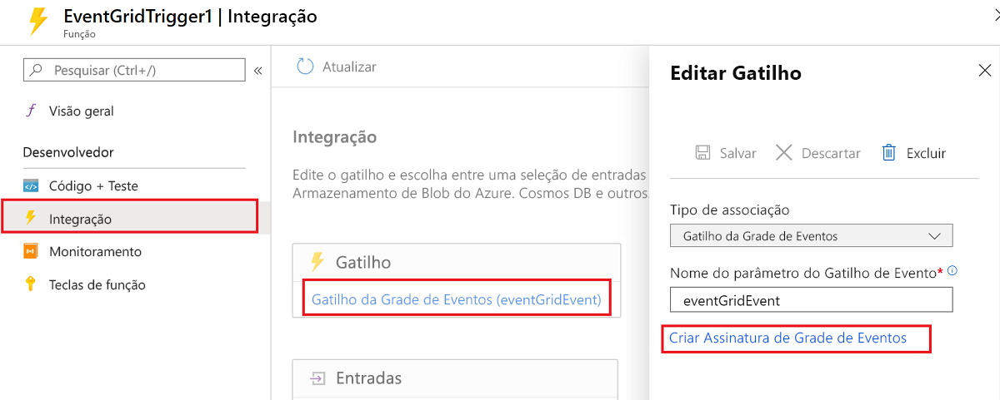
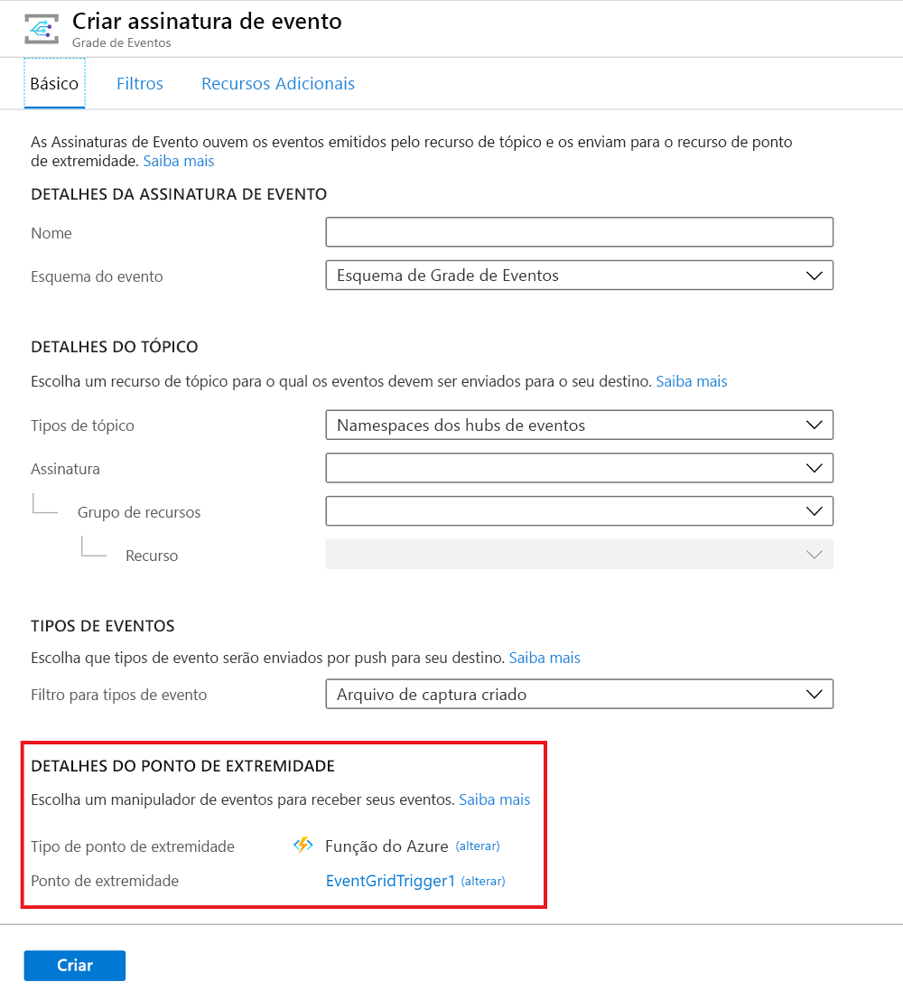

# <a name="azure-event-grid-bindings-for-azure-functions"></a>Associações da grade de eventos do Azure para Azure Functions

Este artigo explica como manipular com eventos de [Grade de Eventos](../event-grid/overview.md) no Azure Functions. Para obter detalhes sobre como lidar com mensagens de grade de eventos em um ponto de extremidade HTTP, leia [receber eventos para um ponto de extremidade http](../event-grid/receive-events.md).

A Grade de Eventos é um serviço do Azure que envia solicitações HTTP para notificá-lo sobre eventos que acontecem nos *publicadores*. Um publicador é o serviço ou recurso que origina o evento. Por exemplo, uma conta de armazenamento de Blobs do Azure é um publicador, e [uma exclusão ou upload de blob é um evento](../storage/blobs/storage-blob-event-overview.md). Alguns [serviços do Azure têm suporte interno para publicar eventos na Grade de Eventos](../event-grid/overview.md#event-sources).

Os *manipuladores* de eventos recebem e processam eventos. O Azure Functions é um dos vários serviços do[Azure que possuem suporte interno para manipular eventos da Grande de Eventos](../event-grid/overview.md#event-handlers). Neste artigo, você aprende a usar um gatilho de grade de eventos para invocar uma função quando um evento é recebido da grade de eventos e para usar a associação de saída para enviar eventos a um [tópico personalizado da grade de eventos](../event-grid/post-to-custom-topic.md).

Se preferir, você pode usar um gatilho HTTP para manipular eventos de grade de eventos; consulte [receber eventos para um ponto de extremidade http](../event-grid/receive-events.md). No momento, não é possível usar um gatilho da Grade de Eventos para um aplicativo do Azure Functions quando o evento é entregue no [esquema CloudEvents](../event-grid/cloudevents-schema.md#azure-functions). Em vez disso, use um gatilho HTTP.

[!INCLUDE [intro](../../includes/functions-bindings-intro.md)]

## <a name="packages---functions-2x-and-higher"></a>Pacotes-funções 2. x e superior

As associações da grade de eventos são fornecidas no pacote NuGet [Microsoft. Azure. webjobs. Extensions. EventGrid](https://www.nuget.org/packages/Microsoft.Azure.WebJobs.Extensions.EventGrid) , versão 2. x. O código-fonte do pacote está no repositório GitHub [azure-functions-eventgrid-extension](https://github.com/Azure/azure-functions-eventgrid-extension/tree/v2.x).

[!INCLUDE [functions-package-v2](../../includes/functions-package-v2.md)]

## <a name="packages---functions-1x"></a>Pacotes - Functions 1. x

O gatilho de grade de eventos é fornecido no [Microsoft.Azure.WebJobs.Extensions.EventGrid](https://www.nuget.org/packages/Microsoft.Azure.WebJobs.Extensions.EventGrid) pacote NuGet, versão 1. x. O código-fonte do pacote está no repositório GitHub [azure-functions-eventgrid-extension](https://github.com/Azure/azure-functions-eventgrid-extension/tree/master).

[!INCLUDE [functions-package](../../includes/functions-package.md)]

## <a name="trigger"></a>Gatilho

Use o gatilho de função para responder a um evento enviado a um tópico da grade de eventos.

## <a name="trigger---example"></a>Gatilho - exemplo

# <a name="ctabcsharp"></a>[C#](#tab/csharp)

Para um exemplo de gatilho HTTP, consulte [receber eventos para um ponto de extremidade http](../event-grid/receive-events.md).

### <a name="c-2x-and-higher"></a>C#(2. x e superior)

O exemplo a seguir mostra uma [função do C#](functions-dotnet-class-library.md) que associa para `EventGridEvent`:

```cs
using Microsoft.Azure.EventGrid.Models;
using Microsoft.Azure.WebJobs;
using Microsoft.Azure.WebJobs.Extensions.EventGrid;
using Microsoft.Azure.WebJobs.Host;
using Microsoft.Extensions.Logging;

namespace Company.Function
{
    public static class EventGridTriggerCSharp
    {
        [FunctionName("EventGridTest")]
        public static void EventGridTest([EventGridTrigger]EventGridEvent eventGridEvent, ILogger log)
        {
            log.LogInformation(eventGridEvent.Data.ToString());
        }
    }
}
```

Para obter mais informações, confira Pacotes, [Atributos](#trigger---attributes), [Configuração](#trigger---configuration) e [Uso](#trigger---usage).

### <a name="version-1x"></a>Versão 1.x

O exemplo a seguir mostra um funções 1. x [função C#](functions-dotnet-class-library.md) que associa a `JObject`:

```cs
using Microsoft.Azure.WebJobs;
using Microsoft.Azure.WebJobs.Extensions.EventGrid;
using Microsoft.Azure.WebJobs.Host;
using Newtonsoft.Json;
using Newtonsoft.Json.Linq;
using Microsoft.Extensions.Logging;

namespace Company.Function
{
    public static class EventGridTriggerCSharp
    {
        [FunctionName("EventGridTriggerCSharp")]
        public static void Run([EventGridTrigger]JObject eventGridEvent, ILogger log)
        {
            log.LogInformation(eventGridEvent.ToString(Formatting.Indented));
        }
    }
}
```

# <a name="c-scripttabcsharp-script"></a>[C#Prescritiva](#tab/csharp-script)

O exemplo a seguir mostra uma associação de gatilho em um arquivo *function.json* e uma [função de script de C#](functions-reference-csharp.md) que usa a associação.

Aqui estão os dados de associação no arquivo *function.json*:

```json
{
  "bindings": [
    {
      "type": "eventGridTrigger",
      "name": "eventGridEvent",
      "direction": "in"
    }
  ],
  "disabled": false
}
```

#### <a name="c-script-version-2x-and-higher"></a>C#script (versão 2. x e superior)

Aqui está um exemplo que é associado a `EventGridEvent`:

```csharp
#r "Microsoft.Azure.EventGrid"
using Microsoft.Azure.EventGrid.Models;
using Microsoft.Extensions.Logging;

public static void Run(EventGridEvent eventGridEvent, ILogger log)
{
    log.LogInformation(eventGridEvent.Data.ToString());
}
```

Para obter mais informações, confira Pacotes, [Atributos](#trigger---attributes), [Configuração](#trigger---configuration) e [Uso](#trigger---usage).

### <a name="version-1x"></a>Versão 1.x

Aqui está o código de script de 1. x C# funções que associa a `JObject`:

```cs
#r "Newtonsoft.Json"

using Newtonsoft.Json;
using Newtonsoft.Json.Linq;

public static void Run(JObject eventGridEvent, TraceWriter log)
{
    log.Info(eventGridEvent.ToString(Formatting.Indented));
}
```

# <a name="javascripttabjavascript"></a>[JavaScript](#tab/javascript)

O exemplo a seguir mostra uma associação de gatilho em um arquivo *function.json* e uma [função JavaScript](functions-reference-node.md) que usa a associação.

Aqui estão os dados de associação no arquivo *function.json*:

```json
{
  "bindings": [
    {
      "type": "eventGridTrigger",
      "name": "eventGridEvent",
      "direction": "in"
    }
  ],
  "disabled": false
}
```

Aqui está o código JavaScript:

```javascript
module.exports = function (context, eventGridEvent) {
    context.log("JavaScript Event Grid function processed a request.");
    context.log("Subject: " + eventGridEvent.subject);
    context.log("Time: " + eventGridEvent.eventTime);
    context.log("Data: " + JSON.stringify(eventGridEvent.data));
    context.done();
};
```

# <a name="pythontabpython"></a>[Python](#tab/python)

O exemplo a seguir mostra uma associação de gatilho em um arquivo *function.json* e uma [função Python](functions-reference-python.md) que usa a associação.

Aqui estão os dados de associação no arquivo *function.json*:

```json
{
  "bindings": [
    {
      "type": "eventGridTrigger",
      "name": "event",
      "direction": "in"
    }
  ],
  "disabled": false,
  "scriptFile": "__init__.py"
}
```

Aqui está o código Python:

```python
import json
import logging

import azure.functions as func

def main(event: func.EventGridEvent):

    result = json.dumps({
        'id': event.id,
        'data': event.get_json(),
        'topic': event.topic,
        'subject': event.subject,
        'event_type': event.event_type,
    })

    logging.info('Python EventGrid trigger processed an event: %s', result)
```

# <a name="javatabjava"></a>[Java](#tab/java)

Esta seção contém os seguintes exemplos:

* [Gatilho de grade de eventos, parâmetro de cadeia de caracteres](#event-grid-trigger-string-parameter)
* [Gatilho de grade de eventos, parâmetro POJO](#event-grid-trigger-pojo-parameter)

Os exemplos a seguir mostram a associação de gatilho em [Java](functions-reference-java.md) que usa a associação e imprime um evento, primeiro recebendo o evento como `String` e segundo como um POJO.

### <a name="event-grid-trigger-string-parameter"></a>Gatilho de grade de eventos, parâmetro de cadeia de caracteres

```java
  @FunctionName("eventGridMonitorString")
  public void logEvent(
    @EventGridTrigger(
      name = "event"
    ) 
    String content, 
    final ExecutionContext context) {
      context.getLogger().info("Event content: " + content);      
  }
```

### <a name="event-grid-trigger-pojo-parameter"></a>Gatilho de grade de eventos, parâmetro POJO

Este exemplo usa o POJO a seguir, que representa as propriedades de nível superior de uma grade de eventos:

```java
import java.util.Date;
import java.util.Map;

public class EventSchema {

  public String topic;
  public String subject;
  public String eventType;
  public Date eventTime;
  public String id;
  public String dataVersion;
  public String metadataVersion;
  public Map<String, Object> data;

}
```

Na chegada, o conteúdo JSON do evento fica sem serialização no POJO ```EventSchema``` para uso pela função. Isso permite que a função acesse as propriedades do evento de forma orientada a objeto.

```java
  @FunctionName("eventGridMonitor")
  public void logEvent(
    @EventGridTrigger(
      name = "event"
    ) 
    EventSchema event, 
    final ExecutionContext context) {
      context.getLogger().info("Event content: ");
      context.getLogger().info("Subject: " + event.subject);
      context.getLogger().info("Time: " + event.eventTime); // automatically converted to Date by the runtime
      context.getLogger().info("Id: " + event.id);
      context.getLogger().info("Data: " + event.data);
  }
```

No [biblioteca de runtime de funções Java](/java/api/overview/azure/functions/runtime), use o `EventGridTrigger` anotação em parâmetros cujo valor virá do EventGrid. Parâmetros com essas anotações fazem com que a função seja executada quando um evento é recebido.  Essa anotação pode ser usada com tipos nativos do Java, POJOs ou valores que permitem valor nulos usando `Optional<T>`.

---

## <a name="trigger---attributes"></a>Gatilho – atributos

# <a name="ctabcsharp"></a>[C#](#tab/csharp)

Em [bibliotecas de classes de C#](functions-dotnet-class-library.md), utilize o atributo [EventGridTrigger](https://github.com/Azure/azure-functions-eventgrid-extension/blob/master/src/EventGridExtension/TriggerBinding/EventGridTriggerAttribute.cs).

Aqui está um atributo `EventGridTrigger` em uma assinatura de método:

```csharp
[FunctionName("EventGridTest")]
public static void EventGridTest([EventGridTrigger] JObject eventGridEvent, ILogger log)
{
    ...
}
```

Para ver um exemplo completo, confira o exemplo de C#.

# <a name="c-scripttabcsharp-script"></a>[C#Prescritiva](#tab/csharp-script)

O script não dá suporte C# a atributos.

# <a name="javascripttabjavascript"></a>[JavaScript](#tab/javascript)

Não há suporte para atributos pelo JavaScript.

# <a name="pythontabpython"></a>[Python](#tab/python)

Não há suporte para atributos no Python.

# <a name="javatabjava"></a>[Java](#tab/java)

A anotação [EventGridTrigger](https://github.com/Azure/azure-functions-java-library/blob/master/src/main/java/com/microsoft/azure/functions/annotation/EventGridTrigger.java) permite configurar declarativamente uma associação de grade de eventos fornecendo valores de configuração. Consulte as seções [exemplo](#trigger---example) e [configuração](#trigger---configuration) para obter mais detalhes.

---

## <a name="trigger---configuration"></a>Gatilho – configuração

A tabela a seguir explica as propriedades de configuração de associação que você define no arquivo *function.json*. Não há parâmetros ou propriedades do construtor para definir o atributo `EventGridTrigger`.

|Propriedade function.json |DESCRIÇÃO|
|---------|---------|
| **tipo** | Obrigatório – deve ser definido como `eventGridTrigger`. |
| **direction** | Obrigatório – deve ser definido como `in`. |
| **name** | Obrigatório - o nome da variável usado no código de função para o parâmetro que recebe os dados de eventos. |

## <a name="trigger---usage"></a>Gatilho - uso

# <a name="ctabcsharp"></a>[C#](#tab/csharp)

No Azure Functions 1. x, você pode usar os seguintes tipos de parâmetro para o gatilho de grade de eventos:

* `JObject`
* `string`

No Azure Functions 2. x e superior, você também tem a opção de usar o seguinte tipo de parâmetro para o gatilho de grade de eventos:

* `Microsoft.Azure.EventGrid.Models.EventGridEvent`- Define propriedades para os campos comuns a todos os tipos de eventos.

> [!NOTE]
> Em funções v1 se você tentar associar ao `Microsoft.Azure.WebJobs.Extensions.EventGrid.EventGridEvent`, o compilador exibirá uma mensagem "substituído" e avisá-lo para usar `Microsoft.Azure.EventGrid.Models.EventGridEvent` em vez disso. Para usar o tipo mais recente, fazer referência a [Microsoft.Azure.EventGrid](https://www.nuget.org/packages/Microsoft.Azure.EventGrid) NuGet empacotar e qualificar totalmente o `EventGridEvent` nome do tipo, prefixando-o com `Microsoft.Azure.EventGrid.Models`.

# <a name="c-scripttabcsharp-script"></a>[C#Prescritiva](#tab/csharp-script)

No Azure Functions 1. x, você pode usar os seguintes tipos de parâmetro para o gatilho de grade de eventos:

* `JObject`
* `string`

No Azure Functions 2. x e superior, você também tem a opção de usar o seguinte tipo de parâmetro para o gatilho de grade de eventos:

* `Microsoft.Azure.EventGrid.Models.EventGridEvent`- Define propriedades para os campos comuns a todos os tipos de eventos.

> [!NOTE]
> Em funções v1 se você tentar associar ao `Microsoft.Azure.WebJobs.Extensions.EventGrid.EventGridEvent`, o compilador exibirá uma mensagem "substituído" e avisá-lo para usar `Microsoft.Azure.EventGrid.Models.EventGridEvent` em vez disso. Para usar o tipo mais recente, fazer referência a [Microsoft.Azure.EventGrid](https://www.nuget.org/packages/Microsoft.Azure.EventGrid) NuGet empacotar e qualificar totalmente o `EventGridEvent` nome do tipo, prefixando-o com `Microsoft.Azure.EventGrid.Models`. Para obter informações sobre como fazer referência a pacotes do NuGet em uma função de script C#, consulte [pacotes usando o NuGet](functions-reference-csharp.md#using-nuget-packages)

# <a name="javascripttabjavascript"></a>[JavaScript](#tab/javascript)

A instância da grade de eventos está disponível por meio do parâmetro configurado na propriedade `name` do arquivo *Function. JSON* .

# <a name="pythontabpython"></a>[Python](#tab/python)

A instância da grade de eventos está disponível por meio do parâmetro configurado na propriedade `name` do arquivo *Function. JSON* , digitada como `func.EventGridEvent`.

# <a name="javatabjava"></a>[Java](#tab/java)

A instância de evento da grade de eventos está disponível por meio do parâmetro associado ao atributo `EventGridTrigger`, digitado como um `EventSchema`. Consulte o [exemplo](#trigger---example) para obter mais detalhes.

---

## <a name="trigger---event-schema"></a>Gatilho-esquema de evento

Os dados de uma Grade de Eventos são recebidos como um objeto JSON no corpo de uma solicitação HTTP. O JSON é semelhante ao exemplo a seguir:

```json
[{
  "topic": "/subscriptions/{subscriptionid}/resourceGroups/eg0122/providers/Microsoft.Storage/storageAccounts/egblobstore",
  "subject": "/blobServices/default/containers/{containername}/blobs/blobname.jpg",
  "eventType": "Microsoft.Storage.BlobCreated",
  "eventTime": "2018-01-23T17:02:19.6069787Z",
  "id": "{guid}",
  "data": {
    "api": "PutBlockList",
    "clientRequestId": "{guid}",
    "requestId": "{guid}",
    "eTag": "0x8D562831044DDD0",
    "contentType": "application/octet-stream",
    "contentLength": 2248,
    "blobType": "BlockBlob",
    "url": "https://egblobstore.blob.core.windows.net/{containername}/blobname.jpg",
    "sequencer": "000000000000272D000000000003D60F",
    "storageDiagnostics": {
      "batchId": "{guid}"
    }
  },
  "dataVersion": "",
  "metadataVersion": "1"
}]
```

O exemplo mostrado é uma matriz de um elemento. A Grade de Eventos envia sempre uma matriz e pode enviar mais de um evento na matriz. O runtime invoca sua função uma vez para cada elemento da matriz.

As propriedades de nível superior nos dados JSON de evento serão as mesmas entre todos os tipos de eventos, enquanto os conteúdos da propriedade `data` estiverem especificados para cada tipo de evento. O exemplo mostrado é para um evento de armazenamento de Blobs.

Para obter explicações sobre as propriedades comuns e específicas de evento, consulte [Propriedades do evento](../event-grid/event-schema.md#event-properties) na documentação da Grade de Eventos.

O tipo `EventGridEvent` define apenas as propriedades de nível superior; a propriedade `Data` é um `JObject`.

## <a name="trigger---create-a-subscription"></a>Gatilho-criar uma assinatura

Para iniciar o recebimento de solicitações HTTP de Grade de Eventos, crie uma assinatura na Grade de Eventos que especifique a URL do ponto de extremidade que invoca a função.

### <a name="azure-portal"></a>Portal do Azure

Para as funções que você desenvolve no Portal do Azure com o gatilho de Grade de Eventos, selecione **Adicionar assinatura da Grade de Eventos**.



Ao selecionar esse link, o portal abrirá a página **Criar Assinatura de Evento**  com a URL do ponto de extremidade preenchida.



Para obter mais informações sobre como criar assinaturas usando o Portal do Azure, consulte [Criar evento personalizado - Portal do Azure](../event-grid/custom-event-quickstart-portal.md) na documentação da Grade de Eventos.

### <a name="azure-cli"></a>CLI do Azure

Para criar uma assinatura usando [a CLI do Azure](https://docs.microsoft.com/cli/azure/get-started-with-azure-cli?view=azure-cli-latest), use o comando [az eventgrid event-subscription create](https://docs.microsoft.com/cli/azure/eventgrid/event-subscription?view=azure-cli-latest#az-eventgrid-event-subscription-create).

O comando requer a URL do ponto de extremidade que invoca a função. O exemplo a seguir mostra o padrão de URL específico da versão:

#### <a name="version-2x-and-higher-runtime"></a>Tempo de execução da versão 2. x (e superior)

    https://{functionappname}.azurewebsites.net/runtime/webhooks/eventgrid?functionName={functionname}&code={systemkey}

#### <a name="version-1x-runtime"></a>runtime versão 1.x

    https://{functionappname}.azurewebsites.net/admin/extensions/EventGridExtensionConfig?functionName={functionname}&code={systemkey}

A chave do sistema é uma chave de autorização que deve ser incluída na URL do ponto de extremidade para um gatilho de Grade de Eventos. A seção a seguir explica como obter a chave do sistema.

Apresentamos aqui um exemplo que assina em uma conta de armazenamento de Blobs (com um espaço reservado para a chave do sistema):

#### <a name="version-2x-and-higher-runtime"></a>Tempo de execução da versão 2. x (e superior)

```azurecli
az eventgrid resource event-subscription create -g myResourceGroup \
--provider-namespace Microsoft.Storage --resource-type storageAccounts \
--resource-name myblobstorage12345 --name myFuncSub  \
--included-event-types Microsoft.Storage.BlobCreated \
--subject-begins-with /blobServices/default/containers/images/blobs/ \
--endpoint https://mystoragetriggeredfunction.azurewebsites.net/runtime/webhooks/eventgrid?functionName=imageresizefunc&code=<key>
```

#### <a name="version-1x-runtime"></a>runtime versão 1.x

```azurecli
az eventgrid resource event-subscription create -g myResourceGroup \
--provider-namespace Microsoft.Storage --resource-type storageAccounts \
--resource-name myblobstorage12345 --name myFuncSub  \
--included-event-types Microsoft.Storage.BlobCreated \
--subject-begins-with /blobServices/default/containers/images/blobs/ \
--endpoint https://mystoragetriggeredfunction.azurewebsites.net/admin/extensions/EventGridExtensionConfig?functionName=imageresizefunc&code=<key>
```

Para obter mais informações sobre como criar uma assinatura, consulte o [Guia de início rápido do armazenamento de blobs](../storage/blobs/storage-blob-event-quickstart.md#subscribe-to-your-storage-account) ou outros guias de início rápido da Grade de Eventos.

### <a name="get-the-system-key"></a>Obter a chave do sistema

Você pode obter a chave do sistema usando a seguinte API (HTTP GET):

#### <a name="version-2x-and-higher-runtime"></a>Tempo de execução da versão 2. x (e superior)

```
http://{functionappname}.azurewebsites.net/admin/host/systemkeys/eventgrid_extension?code={masterkey}
```

#### <a name="version-1x-runtime"></a>runtime versão 1.x

```
http://{functionappname}.azurewebsites.net/admin/host/systemkeys/eventgridextensionconfig_extension?code={masterkey}
```

Esta é uma API de administração, por isso, requer sua [chave mestre](functions-bindings-http-webhook-trigger.md#authorization-keys) do aplicativo. Não confunda a chave do sistema (para invocar uma função de gatilho de grade de eventos) com a chave mestra (para executar tarefas administrativas no aplicativo de funções). Ao assinar em um tópico da Grade de Eventos, certifique-se de usar a chave do sistema.

Aqui, está um exemplo da resposta que fornece a chave do sistema:

```
{
  "name": "eventgridextensionconfig_extension",
  "value": "{the system key for the function}",
  "links": [
    {
      "rel": "self",
      "href": "{the URL for the function, without the system key}"
    }
  ]
}
```

Você pode obter a chave mestra para seu aplicativo de função na guia **Configurações do aplicativo de função** no portal.

> [!IMPORTANT]
> A chave mestra fornece acesso de administrador para seu aplicativo de funções. Não compartilhe essa chave com terceiros ou distribua-a em aplicativos clientes nativos.

Para obter mais informações, consulte [Chaves de autorização](functions-bindings-http-webhook-trigger.md#authorization-keys) no artigo de referência de gatilho HTTP.

Como alternativa, você mesmo pode enviar uma HTTP PUT para especificar o valor da chave.

## <a name="trigger---local-testing-with-viewer-web-app"></a>Gatilho-teste local com o aplicativo Web do Visualizador

Para testar um gatilho de Grade de Eventos localmente, você deve receber solicitações HTTP de Grade de Eventos entre suas origens na nuvem para sua máquina local. Uma maneira de fazer isso é capturar solicitações online e manualmente reenviá-las em sua máquina local:

1. [Criar um aplicativo Web visualizador](#create-a-viewer-web-app) que captura as mensagens de evento.
1. [Criar uma assinatura da Grade de Eventos](#create-an-event-grid-subscription) que envia eventos para o aplicativo visualizador.
1. [Gerar uma solicitação](#generate-a-request) e copiar o corpo da solicitação do aplicativo visualizador.
1. [Postar manualmente a solicitação](#manually-post-the-request) para a URL localhost da sua função de gatilho da Grade de Eventos.

Quando terminar de testar, você poderá usar a mesma assinatura para a produção atualizando o ponto de extremidade. Use o comando da CLI do Azure[az eventgrid event-subscription update](https://docs.microsoft.com/cli/azure/eventgrid/event-subscription?view=azure-cli-latest#az-eventgrid-event-subscription-update).

### <a name="create-a-viewer-web-app"></a>Criar um aplicativo Web visualizador

Para simplificar as mensagens de evento de captura, implante um [aplicativo Web predefinido](https://github.com/Azure-Samples/azure-event-grid-viewer) que exibe as mensagens de evento. A solução implantada inclui um plano do Serviço de Aplicativo, um aplicativo Web do Aplicativo do Serviço de e o código-fonte do GitHub.

Selecione **Implantar no Azure** para implantar a solução na sua assinatura. No portal do Azure, forneça os valores para os parâmetros.

<a href="https://portal.azure.com/#create/Microsoft.Template/uri/https%3A%2F%2Fraw.githubusercontent.com%2FAzure-Samples%2Fazure-event-grid-viewer%2Fmaster%2Fazuredeploy.json" target="_blank"></a>

A implantação pode levar alguns minutos para ser concluída. Depois que a implantação for bem-sucedida, exiba seu aplicativo Web para garantir que ele esteja em execução. Em um navegador da Web, navegue até: `https://<your-site-name>.azurewebsites.net`

Você verá o site, mas nenhum evento ainda estará publicado.


### <a name="create-an-event-grid-subscription"></a>Criar uma assinatura na Grade de Eventos

Crie uma assinatura da Grade de Eventos do tipo que você deseja testar e forneça a ela a URL do aplicativo Web como o ponto de extremidade para a notificação de eventos. O ponto de extremidade para seu aplicativo Web deve incluir o sufixo `/api/updates/`. Portanto, a URL completa é `https://<your-site-name>.azurewebsites.net/api/updates`

Para obter mais informações sobre como criar assinaturas usando o portal do Azure, confira [Criar um evento personalizado – portal do Azure](../event-grid/custom-event-quickstart-portal.md) na documentação da Grade de Eventos.

### <a name="generate-a-request"></a>Gerar uma solicitação

Dispare um evento que gerará tráfego HTTP para o ponto de extremidade do aplicativo Web.  Por exemplo, se você criou uma assinatura de armazenamento de Blobs, faça upload ou exclua um blob. Quando uma solicitação for exibida no aplicativo Web, copie o corpo da solicitação.

A solicitação de validação de assinatura será recebida primeiro. Ignore quaisquer solicitações de validação e copie a solicitação de evento.


### <a name="manually-post-the-request"></a>Postar manualmente a solicitação

Execute sua função de Grade de Eventos localmente.

Use uma ferramenta como [Postman](https://www.getpostman.com/) ou [curl](https://curl.haxx.se/docs/httpscripting.html) para criar uma solicitação HTTP POST:

* Defina um cabeçalho `Content-Type: application/json`.
* Defina um cabeçalho `aeg-event-type: Notification`.
* Cole os dados RequestBin no corpo da solicitação.
* Poste para a URL da sua função de gatilho de grade de eventos.
  * Para 2. x e superior, use o seguinte padrão:

    ```
    http://localhost:7071/runtime/webhooks/eventgrid?functionName={FUNCTION_NAME}
    ```

  * Para uso de 1. x:

    ```
    http://localhost:7071/admin/extensions/EventGridExtensionConfig?functionName={FUNCTION_NAME}
    ```

O parâmetro `functionName` deverá ser o nome especificado no atributo `FunctionName`.

As capturas de tela a seguir mostram os cabeçalhos e o corpo da solicitação em Postman:


A função de gatilho da Grade de Eventos executa e mostra logs semelhantes ao exemplo a seguir:


## <a name="output"></a>Saída

Use a associação de saída da grade de eventos para gravar eventos em um tópico personalizado. Você deve ter uma [chave de acesso válida para o tópico personalizado](../event-grid/security-authentication.md#custom-topic-publishing).

> [!NOTE]
> A associação de saída da grade de eventos não oferece suporte a assinaturas de acesso compartilhado (tokens SAS). Você deve usar a tecla de acesso do tópico.

Verifique se as referências de pacote necessárias estão em vigor antes de tentar implementar uma associação de saída.

> [!IMPORTANT]
> A associação de saída da grade de eventos só está disponível para o Functions 2. x e superior.

# <a name="ctabcsharp"></a>[C#](#tab/csharp)

O exemplo a seguir mostra uma [ C# função](functions-dotnet-class-library.md) que grava uma mensagem em um tópico personalizado da grade de eventos, usando o valor de retorno do método como a saída:

```csharp
[FunctionName("EventGridOutput")]
[return: EventGrid(TopicEndpointUri = "MyEventGridTopicUriSetting", TopicKeySetting = "MyEventGridTopicKeySetting")]
public static EventGridEvent Run([TimerTrigger("0 */5 * * * *")] TimerInfo myTimer, ILogger log)
{
    return new EventGridEvent("message-id", "subject-name", "event-data", "event-type", DateTime.UtcNow, "1.0");
}
```

O exemplo a seguir mostra como usar a interface `IAsyncCollector` para enviar um lote de mensagens.

```csharp
[FunctionName("EventGridAsyncOutput")]
public static async Task Run(
    [TimerTrigger("0 */5 * * * *")] TimerInfo myTimer,
    [EventGrid(TopicEndpointUri = "MyEventGridTopicUriSetting", TopicKeySetting = "MyEventGridTopicKeySetting")]IAsyncCollector<EventGridEvent> outputEvents,
    ILogger log)
{
    for (var i = 0; i < 3; i++)
    {
        var myEvent = new EventGridEvent("message-id-" + i, "subject-name", "event-data", "event-type", DateTime.UtcNow, "1.0");
        await outputEvents.AddAsync(myEvent);
    }
}
```

# <a name="c-scripttabcsharp-script"></a>[C#Prescritiva](#tab/csharp-script)

O exemplo a seguir mostra os dados de associação de saída da grade de eventos no arquivo *Function. JSON* .

```json
{
    "type": "eventGrid",
    "name": "outputEvent",
    "topicEndpointUri": "MyEventGridTopicUriSetting",
    "topicKeySetting": "MyEventGridTopicKeySetting",
    "direction": "out"
}
```

Aqui está C# o código de script que cria um evento:

```cs
#r "Microsoft.Azure.EventGrid"
using System;
using Microsoft.Azure.EventGrid.Models;
using Microsoft.Extensions.Logging;

public static void Run(TimerInfo myTimer, out EventGridEvent outputEvent, ILogger log)
{
    outputEvent = new EventGridEvent("message-id", "subject-name", "event-data", "event-type", DateTime.UtcNow, "1.0");
}
```

Aqui está C# o código de script que cria vários eventos:

```cs
#r "Microsoft.Azure.EventGrid"
using System;
using Microsoft.Azure.EventGrid.Models;
using Microsoft.Extensions.Logging;

public static void Run(TimerInfo myTimer, ICollector<EventGridEvent> outputEvent, ILogger log)
{
    outputEvent.Add(new EventGridEvent("message-id-1", "subject-name", "event-data", "event-type", DateTime.UtcNow, "1.0"));
    outputEvent.Add(new EventGridEvent("message-id-2", "subject-name", "event-data", "event-type", DateTime.UtcNow, "1.0"));
}
```

# <a name="javascripttabjavascript"></a>[JavaScript](#tab/javascript)

O exemplo a seguir mostra os dados de associação de saída da grade de eventos no arquivo *Function. JSON* .

```json
{
    "type": "eventGrid",
    "name": "outputEvent",
    "topicEndpointUri": "MyEventGridTopicUriSetting",
    "topicKeySetting": "MyEventGridTopicKeySetting",
    "direction": "out"
}
```

Este é o código JavaScript que cria um único evento:

```javascript
module.exports = async function (context, myTimer) {
    var timeStamp = new Date().toISOString();

    context.bindings.outputEvent = {
        id: 'message-id',
        subject: 'subject-name',
        dataVersion: '1.0',
        eventType: 'event-type',
        data: "event-data",
        eventTime: timeStamp
    };
    context.done();
};
```

Este é o código JavaScript que cria vários eventos:

```javascript
module.exports = function(context) {
    var timeStamp = new Date().toISOString();

    context.bindings.outputEvent = [];

    context.bindings.outputEvent.push({
        id: 'message-id-1',
        subject: 'subject-name',
        dataVersion: '1.0',
        eventType: 'event-type',
        data: "event-data",
        eventTime: timeStamp
    });
    context.bindings.outputEvent.push({
        id: 'message-id-2',
        subject: 'subject-name',
        dataVersion: '1.0',
        eventType: 'event-type',
        data: "event-data",
        eventTime: timeStamp
    });
    context.done();
};
```

# <a name="pythontabpython"></a>[Python](#tab/python)

A associação de saída da grade de eventos não está disponível para Python.

# <a name="javatabjava"></a>[Java](#tab/java)

A associação de saída da grade de eventos não está disponível para Java.

---

## <a name="output---attributes-and-annotations"></a>Saída-atributos e anotações

# <a name="ctabcsharp"></a>[C#](#tab/csharp)

Para [ C# bibliotecas de classes](functions-dotnet-class-library.md), use o atributo [EventGridAttribute](https://github.com/Azure/azure-functions-eventgrid-extension/blob/dev/src/EventGridExtension/OutputBinding/EventGridAttribute.cs) .

O construtor do atributo usa o nome de uma configuração de aplicativo que contém o nome do tópico personalizado e o nome de uma configuração de aplicativo que contém a chave do tópico. Para obter mais informações sobre essas configurações, consulte [Saída - configuração](#output---configuration). Este é um `EventGrid` exemplo de atributo:

```csharp
[FunctionName("EventGridOutput")]
[return: EventGrid(TopicEndpointUri = "MyEventGridTopicUriSetting", TopicKeySetting = "MyEventGridTopicKeySetting")]
public static string Run([TimerTrigger("0 */5 * * * *")] TimerInfo myTimer, ILogger log)
{
    ...
}
```

Para ver um exemplo completo, consulte [Saída – exemplo de C#](#output).

# <a name="c-scripttabcsharp-script"></a>[C#Prescritiva](#tab/csharp-script)

O script não dá suporte C# a atributos.

# <a name="javascripttabjavascript"></a>[JavaScript](#tab/javascript)

Não há suporte para atributos pelo JavaScript.

# <a name="pythontabpython"></a>[Python](#tab/python)

A associação de saída da grade de eventos não está disponível para Python.

# <a name="javatabjava"></a>[Java](#tab/java)

A associação de saída da grade de eventos não está disponível para Java.

---

## <a name="output---configuration"></a>Saída - configuração

A tabela a seguir explica as propriedades de configuração de associação que você define no arquivo *function.json* e no atributo `EventGrid`.

|Propriedade function.json | Propriedade de atributo |DESCRIÇÃO|
|---------|---------|----------------------|
|**tipo** | n/d | Deve ser definido como "eventGrid". |
|**direction** | n/d | Deve ser definido como "out". Esse parâmetro é definido automaticamente quando você cria a associação no portal do Azure. |
|**name** | n/d | É o nome da variável usada no código da função que representa o evento. |
|**topicEndpointUri** |**TopicEndpointUri** | O nome de uma configuração de aplicativo que contém o URI para o tópico personalizado, como `MyTopicEndpointUri`. |
|**topicKeySetting** |**TopicKeySetting** | O nome de uma configuração de aplicativo que contém uma chave de acesso para o tópico personalizado. |

[!INCLUDE [app settings to local.settings.json](../../includes/functions-app-settings-local.md)]

> [!IMPORTANT]
> Certifique-se de definir o valor da propriedade de configuração `TopicEndpointUri` como o nome de uma configuração de aplicativo que contém o URI do tópico personalizado. Não especifique o URI do tópico personalizado diretamente nesta propriedade.

## <a name="output---usage"></a>Saída - uso

# <a name="ctabcsharp"></a>[C#](#tab/csharp)

Envie mensagens usando um parâmetro de método, como `out EventGridEvent paramName`. Para gravar várias mensagens, você pode usar `ICollector<EventGridEvent>` ou `IAsyncCollector<EventGridEvent>` no lugar de `out EventGridEvent`.

# <a name="c-scripttabcsharp-script"></a>[C#Prescritiva](#tab/csharp-script)

Envie mensagens usando um parâmetro de método, como `out EventGridEvent paramName`. No script do C#, `paramName` é o valor especificado na propriedade `name` de *function.json*. Para gravar várias mensagens, você pode usar `ICollector<EventGridEvent>` ou `IAsyncCollector<EventGridEvent>` no lugar de `out EventGridEvent`.

# <a name="javascripttabjavascript"></a>[JavaScript](#tab/javascript)

Acesse o evento de saída usando `context.bindings.<name>` em que `<name>` é o valor especificado na propriedade `name` de *Function. JSON*.

# <a name="pythontabpython"></a>[Python](#tab/python)

A associação de saída da grade de eventos não está disponível para Python.

# <a name="javatabjava"></a>[Java](#tab/java)

A associação de saída da grade de eventos não está disponível para Java.

---

## <a name="next-steps"></a>Próximas etapas

> [!div class="nextstepaction"]
> [Aprenda mais sobre gatilhos e de associações do Azure Functions](functions-triggers-bindings.md)

> [!div class="nextstepaction"]
> [Saiba mais sobre a Grade de Eventos](../event-grid/overview.md)
