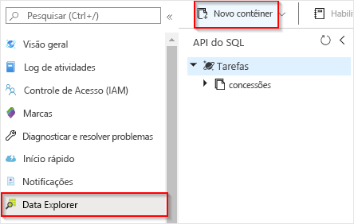
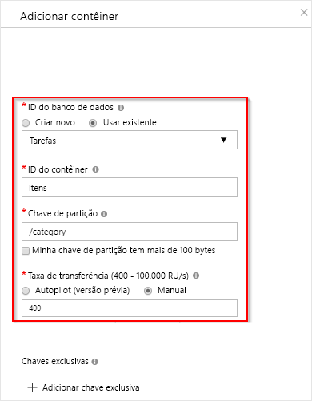

# <a name="create-a-function-triggered-by-azure-cosmos-db"></a>Criar uma função disparada pelo Azure Cosmos DB

Saiba como criar uma função disparada quando dados são adicionados ou alterados no Azure Cosmos DB. Para saber mais sobre o Azure Cosmos DB, confira [Azure Cosmos DB: computação de banco de dados sem servidor usando o Azure Functions](../cosmos-db/serverless-computing-database.md).

:::image type="content" source="./media/functions-create-cosmos-db-triggered-function/quickstart-completed.png" alt-text="Código do Azure Cosmos DB":::

## <a name="prerequisites"></a>Pré-requisitos

Para concluir este tutorial:

+ Se você não tiver uma assinatura do Azure, crie uma [conta gratuita](https://azure.microsoft.com/free/?WT.mc_id=A261C142F) antes de começar.

> [!NOTE]
> [!INCLUDE [SQL API support only](../../includes/functions-cosmosdb-sqlapi-note.md)]

## <a name="sign-in-to-azure"></a>Entrar no Azure

Entre no [portal do Azure](https://portal.azure.com/) com sua conta do Azure.

## <a name="create-an-azure-cosmos-db-account"></a>Criar uma conta do Azure Cosmos DB

Antes de criar o gatilho, você precisa ter uma conta do Azure Cosmos DB que use a API de SQL.

[!INCLUDE [cosmos-db-create-dbaccount](../../includes/cosmos-db-create-dbaccount.md)]

## <a name="create-a-function-app-in-azure"></a>Criar um aplicativo de funções no Azure

[!INCLUDE [Create function app Azure portal](../../includes/functions-create-function-app-portal.md)]

Em seguida, crie uma nova função no novo aplicativo de funções.

<a name="create-function"></a>

## <a name="create-azure-cosmos-db-trigger"></a>Criar gatilho do Azure Cosmos DB

1. Em seu aplicativo de funções, selecione **Funções** no menu à esquerda, em seguida, selecione **Adicionar** no menu superior. 

1. Na página **Nova Função**, insira `cosmos` no campo de pesquisa e, em seguida, escolha o modelo **gatilho do Azure Cosmos DB**.

   :::image type="content" source="./media/functions-create-cosmos-db-triggered-function/function-choose-cosmos.png" alt-text="Página de funções no portal do Azure":::


1. Configure o novo gatilho com as configurações conforme especificado na seguinte tabela:

    | Configuração      | Valor sugerido  | Descrição                                |
    | ------------ | ---------------- | ------------------------------------------ |
    | **Nova Função** | Aceite o nome padrão | O nome da função. |
    | **Conexão da conta do Cosmos DB** | Aceite o nome do novo padrão | Selecione **Novo**, a **Conta de Banco de Dados** criada anteriormente e depois **OK**. Essa ação cria uma configuração de aplicativo para sua conexão de conta. Essa configuração é usada pela associação para conexão com o banco de dados. |
    | **Nome do banco de dados** | Tarefas | Nome do banco de dados que inclui a coleção a ser monitorada. |
    | **Nome da coleção** | Itens | O nome da coleção a ser monitorada. |
    | **Nome da coleção para concessões** | concessões | O nome da coleção para armazenar as concessões. |
    | **Criar coleção de concessões se ela não existir** | Sim | Verifica a existência da coleção de concessões e cria-a automaticamente. |

    :::image type="content" source="./media/functions-create-cosmos-db-triggered-function/functions-cosmosdb-trigger-settings.png" alt-text="Criar a função disparada do Azure Cosmos DB":::

1. Selecione **Criar Função**. 

    O Azure cria a função de gatilho do Cosmos DB.

1. Para exibir o código de função baseado em modelo, selecione **Código + Teste**.

    :::image type="content" source="./media/functions-create-cosmos-db-triggered-function/function-cosmosdb-template.png" alt-text="Modelo de função do Cosmos DB em C#":::

    Esse modelo de função grava o número de documentos e a primeira ID de documento para os logs.

Em seguida, você se conecta à sua conta do Azure Cosmos DB e cria o contêiner `Items` no banco de dados `Tasks`.

## <a name="create-the-items-container"></a>Criar o contêiner Itens

1. Abra uma segunda instância do [portal do Azure](https://portal.azure.com) em uma nova guia no navegador.

1. No lado esquerdo do portal, expanda a barra de ícones, digite `cosmos` no campo de pesquisa e selecione **Azure Cosmos DB**.

    

1. Escolha sua conta do Azure Cosmos DB e selecione o **Data Explorer**. 

1. Em **API SQL**, escolha o banco de dados **Tarefas** e selecione **Novo Contêiner**.

    

1. Em **Adicionar Contêiner**, use as configurações mostradas na tabela embaixo da imagem. 

    

    | Configuração|Valor sugerido|Descrição |
    | ---|---|--- |
    | **ID do banco de dados** | Tarefas |O nome do novo banco de dados. Isso deve corresponder ao nome definido na sua associação de função. |
    | **ID do contêiner** | Itens | O nome do novo contêiner. Isso deve corresponder ao nome definido na sua associação de função.  |
    | **[Chave de partição](../cosmos-db/partitioning-overview.md)** | /category|Uma chave de partição que distribui dados uniformemente para cada partição. É importante selecionar a chave de partição correta ao criar um contêiner de alto desempenho. | 
    | **Taxa de transferência** |400 RU| Use o valor padrão. Se quiser reduzir a latência, você poderá escalar verticalmente a taxa de transferência mais tarde. |    

1. Clique em **OK** para criar o contêiner Itens. Pode levar alguns instantes para o contêiner ser criado.

Depois que o contêiner especificado na associação de função existir, você poderá testar a função adicionando itens a esse novo contêiner.

## <a name="test-the-function"></a>Testar a função

1. Expanda o novo contêiner **Itens** no Data Explorer, escolha **Itens** e selecione **Novo Item**.

    :::image type="content" source="./media/functions-create-cosmos-db-triggered-function/create-item-in-container.png" alt-text="Criar um item no contêiner Itens":::

1. Substitua o conteúdo do novo item pelo conteúdo a seguir e então escolha **Salvar**.

    ```yaml
    {
        "id": "task1",
        "category": "general",
        "description": "some task"
    }
    ```

1. Mude para a primeira guia do navegador que contém a função no portal. Expanda os logs de função e verifique se o novo documento disparou a função. Veja se o valor de ID do documento `task1` é gravado nos logs. 

    

1. (Opcional) Volte para o seu documento, faça uma alteração e, em seguida, clique em **Atualizar**. Em seguida, volte para os logs de função e verifique se a atualização também disparou a função.

## <a name="clean-up-resources"></a>Limpar os recursos

[!INCLUDE [Next steps note](../../includes/functions-quickstart-cleanup.md)]

## <a name="next-steps"></a>Próximas etapas

Você criou uma função que é executada quando um documento é adicionado ou modificado no Azure Cosmos DB. Para obter mais informações sobre gatilhos do Azure Cosmos DB, consulte [Associações do Azure Cosmos DB para Azure Functions](functions-bindings-cosmosdb.md).

[!INCLUDE [Next steps note](../../includes/functions-quickstart-next-steps.md)]
