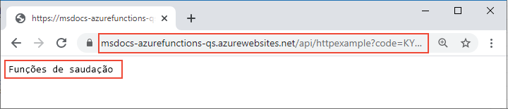

# <a name="quickstart-create-a-function-in-azure-that-responds-to-http-requests"></a>Início Rápido: Criar uma função no Azure que responda a solicitações HTTP

Neste artigo, você usará ferramentas de linha de comando para criar uma função que responde a solicitações HTTP. Após testar o código localmente, implante-o no ambiente sem servidor do Azure Functions. A realização deste início rápido gera um pequeno custo de alguns centavos de dólar ou menos em sua conta do Azure.

::: zone pivot="programming-language-csharp,programming-language-javascript,programming-language-typescript,programming-language-powershell,programming-language-python"  
Há também uma [versão baseada no Visual Studio Code](functions-create-first-function-vs-code.md) deste artigo.
::: zone-end  

::: zone pivot="programming-language-java"  
> [!NOTE]
> Se o Maven não for sua ferramenta de desenvolvimento preferida, confira nossos tutoriais semelhantes para desenvolvedores Java usando [Gradle](/azure/azure-functions/functions-create-first-java-gradle), [IntelliJ IDEA](/azure/developer/java/toolkit-for-intellij/quickstart-functions) e [VS Code](/azure/azure-functions/functions-create-first-function-vs-code?pivots=programming-language-java).
::: zone-end  

[!INCLUDE [functions-requirements-cli](../../includes/functions-requirements-cli.md)]

[!INCLUDE [functions-cli-verify-prereqs](../../includes/functions-cli-verify-prereqs.md)]

[!INCLUDE [functions-cli-create-venv](../../includes/functions-cli-create-venv.md)]

## <a name="create-a-local-function-project"></a>Criar um projeto de função local

No Azure Functions, um projeto de função é um contêiner para uma ou mais funções individuais que respondem, cada uma, a um gatilho específico. Todas as funções em um projeto compartilham as configurações locais e de hospedagem. Nesta seção, você cria um projeto de função que contém apenas uma função.

::: zone pivot="programming-language-csharp,programming-language-javascript,programming-language-typescript,programming-language-powershell,programming-language-python"  
Execute o comando `func init` da seguinte maneira para criar um projeto de funções em uma pasta chamada *LocalFunctionProj* com o runtime especificado:  
::: zone-end  
::: zone pivot="programming-language-python"  
```
func init LocalFunctionProj --python
```
::: zone-end  
::: zone pivot="programming-language-csharp"  
```
func init LocalFunctionProj --dotnet
```
::: zone-end  
::: zone pivot="programming-language-javascript"  
```
func init LocalFunctionProj --javascript
```
::: zone-end  
::: zone pivot="programming-language-typescript"  
```
func init LocalFunctionProj --typescript
```
::: zone-end  
::: zone pivot="programming-language-powershell"  
```
func init LocalFunctionProj --powershell
```
::: zone-end    
::: zone pivot="programming-language-java"  
Em uma pasta vazia, execute o seguinte comando para gerar o projeto do Functions a partir de um [arquétipo Maven](https://maven.apache.org/guides/introduction/introduction-to-archetypes.html).

# <a name="bash"></a>[Bash](#tab/bash)
```bash
mvn archetype:generate -DarchetypeGroupId=com.microsoft.azure -DarchetypeArtifactId=azure-functions-archetype 
```
# <a name="powershell"></a>[PowerShell](#tab/powershell)
```powershell
mvn archetype:generate "-DarchetypeGroupId=com.microsoft.azure" "-DarchetypeArtifactId=azure-functions-archetype" 
```
# <a name="cmd"></a>[Cmd](#tab/cmd)
```cmd
mvn archetype:generate "-DarchetypeGroupId=com.microsoft.azure" "-DarchetypeArtifactId=azure-functions-archetype" 
```
---

O Maven solicita os valores necessários para concluir a geração do projeto na implantação.   
Forneça os seguintes valores quando solicitado:

| Prompt | Valor | Descrição |
| ------ | ----- | ----------- |
| **groupId** | `com.fabrikam` | Um valor que identifica exclusivamente o projeto em todos os projetos, seguindo as [regras de nomenclatura do pacote](https://docs.oracle.com/javase/specs/jls/se6/html/packages.html#7.7) para Java. |
| **artifactId** | `fabrikam-functions` | Um valor que é o nome do jar, sem um número de versão. |
| **version** | `1.0-SNAPSHOT` | Escolha o valor padrão. |
| **package** | `com.fabrikam.functions` | Um valor que é o pacote Java para o código de função gerado. Use o padrão. |

Digite `Y` ou pressione Enter para confirmar.

O Maven cria os arquivos de projeto em uma nova pasta com o nome _artifactId_, que, neste exemplo, é `fabrikam-functions`. 
::: zone-end  
Navegue até a pasta do projeto:

::: zone pivot="programming-language-csharp,programming-language-javascript,programming-language-typescript,programming-language-powershell,programming-language-python"  
```
cd LocalFunctionProj
```
::: zone-end  
::: zone pivot="programming-language-java"  
```
cd fabrikam-functions
```
::: zone-end  
Essa pasta contém vários arquivos do projeto, incluindo arquivos de configuração chamados [local.settings.json](functions-run-local.md#local-settings-file) e [host.json](functions-host-json.md). Como *local.settings.json* pode conter segredos baixados do Azure, o arquivo é excluído do controle do código-fonte por padrão no arquivo *.gitignore*.

[!INCLUDE [functions-cli-add-function](../../includes/functions-cli-add-function.md)]

### <a name="optional-examine-the-file-contents"></a>(Opcional) Examinar o conteúdo do arquivo

Se preferir, você poderá ir diretamente para [Executar a função localmente](#run-the-function-locally) e examinar o conteúdo do arquivo mais tarde.

::: zone pivot="programming-language-csharp"
#### <a name="httpexamplecs"></a>HttpExample.cs

*HttpExample.cs* contém um método `Run` que recebe dados de solicitação na variável `req` é uma [HttpRequest](/dotnet/api/microsoft.aspnetcore.http.httprequest) decorada com o **HttpTriggerAttribute**, que define o comportamento do gatilho. 

:::code language="csharp" source="~/functions-docs-csharp/http-trigger-template/HttpExample.cs":::

O objeto de retorno é um [ActionResult](/dotnet/api/microsoft.aspnetcore.mvc.actionresult) que retorna uma mensagem de resposta como um [OkObjectResult](/dotnet/api/microsoft.aspnetcore.mvc.okobjectresult) (200) ou um [BadRequestObjectResult](/dotnet/api/microsoft.aspnetcore.mvc.badrequestobjectresult) (400). Para saber mais, confira [Gatilhos e associações HTTP do Azure Functions](/azure/azure-functions/functions-bindings-http-webhook?tabs=csharp).
::: zone-end

::: zone pivot="programming-language-java"
#### <a name="functionjava"></a>Function.java
O *Function.java* contém um método `run` que recebe dados de solicitação na variável `request`, que é uma [HttpRequestMessage](/java/api/com.microsoft.azure.functions.httprequestmessage) decorada com a anotação [HttpTrigger](/java/api/com.microsoft.azure.functions.annotation.httptrigger), que define o comportamento do gatilho. 

:::code language="java" source="~/functions-quickstart-java/functions-add-output-binding-storage-queue/src/main/java/com/function/Function.java":::

A mensagem de resposta é gerada pela API [HttpResponseMessage.Builder](/java/api/com.microsoft.azure.functions.httpresponsemessage.builder).

#### <a name="pomxml"></a>pom.xml

As configurações dos recursos do Azure criados para hospedar seu aplicativo são definidas no elemento **configuration** do plug-in com uma **groupId** igual a `com.microsoft.azure` no arquivo pom.xml gerado. Por exemplo, o elemento de configuração abaixo instrui uma implantação baseada em Maven para criar um aplicativo de funções no grupo de recursos `java-functions-group` na região `westus`. O próprio aplicativo de funções é executado no Windows hospedado no plano `java-functions-app-service-plan`, que, por padrão, é um plano de Consumo sem servidor.    

:::code language="java" source="~/functions-quickstart-java/functions-add-output-binding-storage-queue/pom.xml" range="116-155":::

Você pode alterar essas configurações para controlar como os recursos são criados no Azure, por exemplo, alterando `runtime.os` de `windows` para `linux` antes da implantação inicial. Para obter uma lista completa das configurações compatíveis com o plug-in do Maven, confira os [detalhes da configuração](https://github.com/microsoft/azure-maven-plugins/wiki/Azure-Functions:-Configuration-Details).

#### <a name="functiontestjava"></a>FunctionTest.java

O arquétipo também gera um teste de unidade para sua função. Ao alterar sua função para adicionar associações ou adicionar novas funções ao projeto, você também precisará modificar os testes no arquivo *FunctionTest.java*.
::: zone-end  
::: zone pivot="programming-language-python"
#### <a name="__init__py"></a>\_\_init\_\_.py

*\_\_init\_\_.py* contém uma função de Python `main()` que é disparada de acordo com a configuração em *function.json*.

:::code language="python" source="~/functions-quickstart-templates/Functions.Templates/Templates/HttpTrigger-Python/__init__.py":::

Para um gatilho HTTP, a função recebe dados de solicitação na variável `req`, conforme definido em *function.json*. `req` é uma instância da [classe azure.functions.HttpRequest](/python/api/azure-functions/azure.functions.httprequest). O objeto de retorno, definido como `$return` em *function.json*, é uma instância da [classe azure.functions.HttpResponse](/python/api/azure-functions/azure.functions.httpresponse). Para saber mais, confira [Gatilhos e associações HTTP do Azure Functions](/azure/azure-functions/functions-bindings-http-webhook?tabs=python).
::: zone-end

::: zone pivot="programming-language-javascript"
#### <a name="indexjs"></a>index.js

*index.js* exporta uma função que é disparada de acordo com a configuração em *function.json*.

:::code language="javascript" source="~/functions-quickstart-templates/Functions.Templates/Templates/HttpTrigger-JavaScript/index.js":::

Para um gatilho HTTP, a função recebe dados de solicitação na variável `req`, conforme definido em *function.json*. O objeto de retorno, definido como `$return` em *function.json*, é a resposta. Para saber mais, confira [Gatilhos e associações HTTP do Azure Functions](/azure/azure-functions/functions-bindings-http-webhook?tabs=javascript).
::: zone-end

::: zone pivot="programming-language-typescript"
#### <a name="indexts"></a>index.ts

*index.ts* exporta uma função que é disparada de acordo com a configuração em *function.json*.

:::code language="typescript" source="~/functions-quickstart-templates/Functions.Templates/Templates/HttpTrigger-TypeScript/index.ts":::

Para um gatilho HTTP, a função recebe dados de solicitação na variável `req` do tipo **HttpRequest**, conforme definido em *function.json*. O objeto de retorno, definido como `$return` em *function.json*, é a resposta. 
::: zone-end

::: zone pivot="programming-language-powershell"
#### <a name="runps1"></a>run.ps1

*run.ps1* contém um script de função que é disparado de acordo com a configuração em *function.json*.

:::code language="powershell" source="~/functions-quickstart-templates/Functions.Templates/Templates/HttpTrigger-PowerShell/run.ps1":::

Para um gatilho HTTP, a função recebe dados de solicitação transmitidos para o parâmetro `$Request` definido em *function.json*. O objeto de retorno, definido como `Response` em *function.json*, é transmitido para o cmdlet `Push-OutputBinding` como a resposta. 
::: zone-end

::: zone pivot="programming-language-javascript,programming-language-typescript,programming-language-python,programming-language-powershell"
#### <a name="functionjson"></a>function.json

*function.json* é um arquivo de configuração que define as `bindings` de entrada e de saída da função, incluindo o tipo de gatilho. 
::: zone-end

::: zone pivot="programming-language-python"
Se preferir, você poderá alterar `scriptFile` para invocar um arquivo Python diferente.

:::code language="json" source="~/functions-quickstart-templates/Functions.Templates/Templates/HttpTrigger-Python/function.json":::
::: zone-end

::: zone pivot="programming-language-javascript,programming-language-typescript"
:::code language="json" source="~/functions-quickstart-templates/Functions.Templates/Templates/HttpTrigger-JavaScript/function.json":::
::: zone-end

::: zone pivot="programming-language-powershell"
:::code language="json" source="~/functions-quickstart-templates/Functions.Templates/Templates/HttpTrigger-PowerShell/function.json":::
::: zone-end

::: zone pivot="programming-language-javascript,programming-language-typescript,programming-language-python,programming-language-powershell"  
Cada associação exige uma direção, um tipo e um nome exclusivo. O gatilho HTTP tem uma associação de entrada do tipo [`httpTrigger`](functions-bindings-http-webhook-trigger.md) e uma associação de saída do tipo [`http`](functions-bindings-http-webhook-output.md).
::: zone-end  

[!INCLUDE [functions-run-function-test-local-cli](../../includes/functions-run-function-test-local-cli.md)]

::: zone pivot="programming-language-javascript,programming-language-typescript,programming-language-python,programming-language-powershell,programming-language-csharp"    
## <a name="create-supporting-azure-resources-for-your-function"></a>Criar recursos de suporte do Azure para a função

Antes de poder implantar o código da função no Azure, você precisa criar três recursos:

- Um grupo de recursos, que é um contêiner lógico para recursos relacionados.
- Uma conta de armazenamento, que mantém o estado e outras informações sobre seus projetos.
- Um aplicativo de funções, que fornece o ambiente para a execução do código de função. Um aplicativo de funções é mapeado para seu projeto de função local e permite agrupar funções como uma unidade lógica para facilitar o gerenciamento, a implantação e o compartilhamento de recursos.

Use os comandos da CLI do Azure a seguir para criar esses itens. Cada comando fornece uma saída em JSON após a conclusão.

Se ainda não tiver feito isso, entre no Azure usando o comando [az login](/cli/azure/reference-index#az-login):

```azurecli
az login
```
    
Crie um grupo de recursos com o comando [az group create](/cli/azure/group#az-group-create). O exemplo a seguir cria um grupo de recursos chamado `AzureFunctionsQuickstart-rg` na região `westeurope`. (De modo geral, você cria o grupo de recursos e os recursos em uma região próxima a você usando uma região disponível com o comando `az account list-locations`.)

```azurecli
az group create --name AzureFunctionsQuickstart-rg --location westeurope
```

> [!NOTE]
> Você não pode hospedar aplicativos Windows e Linux no mesmo grupo de recursos. Se você tiver um grupo de recursos chamado `AzureFunctionsQuickstart-rg` com um aplicativo de funções ou um aplicativo Web do Windows, você precisará usar um grupo de recursos diferente.
 
    
Crie uma conta de armazenamento para uso geral em seu grupo de recursos e região usando o comando [az storage account create](/cli/azure/storage/account#az-storage-account-create). No exemplo a seguir, substitua `<STORAGE_NAME>` por um nome exclusivo globalmente que for adequado para você. Os nomes devem conter de 3 a 24 caracteres e podem conter somente números e letras minúsculas. `Standard_LRS` especifica uma conta de uso geral, que é [compatível com o Functions](storage-considerations.md#storage-account-requirements).

```azurecli
az storage account create --name <STORAGE_NAME> --location westeurope --resource-group AzureFunctionsQuickstart-rg --sku Standard_LRS
```

A conta de armazenamento gera apenas alguns centavos de dólar para este início rápido.
    
Crie o aplicativo de funções usando o comando [az functionapp create](/cli/azure/functionapp#az-functionapp-create). No exemplo a seguir, substitua `<STORAGE_NAME>` pelo nome da conta usada na etapa anterior e substitua `<APP_NAME>` por um nome globalmente exclusivo que seja adequado para você. O `<APP_NAME>` também é o domínio do DNS padrão para o aplicativo de funções. 
::: zone-end  

::: zone pivot="programming-language-python"  
Se estiver usando o Python 3.8, altere `--runtime-version` para `3.8` e `--functions_version` para `3`.

Se estiver usando o Python 3.6, altere `--runtime-version` para `3.6`.

```azurecli
az functionapp create --resource-group AzureFunctionsQuickstart-rg --os-type Linux --consumption-plan-location westeurope --runtime python --runtime-version 3.7 --functions-version 2 --name <APP_NAME> --storage-account <STORAGE_NAME>
```
::: zone-end  

::: zone pivot="programming-language-javascript,programming-language-typescript"  
Se estiver usando o Node.js 8, altere também a `--runtime-version` para `8`.


```azurecli
az functionapp create --resource-group AzureFunctionsQuickstart-rg --consumption-plan-location westeurope --runtime node --runtime-version 10 --functions-version 2 --name <APP_NAME> --storage-account <STORAGE_NAME>
```
::: zone-end  

::: zone pivot="programming-language-csharp"  
```azurecli
az functionapp create --resource-group AzureFunctionsQuickstart-rg --consumption-plan-location westeurope --runtime dotnet --functions-version 2 --name <APP_NAME> --storage-account <STORAGE_NAME>
```
::: zone-end  

::: zone pivot="programming-language-powershell"  
```azurecli
az functionapp create --resource-group AzureFunctionsQuickstart-rg --consumption-plan-location westeurope --runtime powershell --functions-version 2 --name <APP_NAME> --storage-account <STORAGE_NAME>
```
::: zone-end  

::: zone pivot="programming-language-javascript,programming-language-typescript,programming-language-python,programming-language-powershell,programming-language-csharp"  
Este comando cria um aplicativo de funções que executa o runtime da linguagem especificada no [Plano de Consumo do Azure Functions](functions-scale.md#consumption-plan), que é gratuito para o uso que você fará aqui. O comando também provisiona uma instância associada do Azure Application Insights no mesmo grupo de recursos, com a qual você pode monitorar seu aplicativo de funções e exibir logs. Para saber mais, consulte [Monitorar Azure Functions](functions-monitoring.md). A instância não gera nenhum custo até você ativá-la.
    
## <a name="deploy-the-function-project-to-azure"></a>Implantar o projeto de funções no Azure
::: zone-end  

::: zone pivot="programming-language-typescript"  
Antes de usar o Core Tools para implantar seu projeto no Azure, você criará um build pronto para produção de arquivos JavaScript com base nos arquivos de origem TypeScript.

O seguinte comando prepara seu projeto TypeScript para implantação:

```
npm run build:production 
```
::: zone-end  

::: zone pivot="programming-language-javascript,programming-language-typescript,programming-language-python,programming-language-powershell,programming-language-csharp"  
Com os recursos necessários configurados, você está pronto para implantar seu projeto de funções local no aplicativo de funções no Azure usando o comando [func azure functionapp publish](functions-run-local.md#project-file-deployment). No exemplo a seguir, substitua `<APP_NAME>` pelo nome do aplicativo.

```
func azure functionapp publish <APP_NAME>
```

Se vir o erro "Não é possível encontrar o aplicativo com o nome...", aguarde alguns segundos e tente novamente, pois o Azure pode não ter inicializado totalmente o aplicativo após o comando `az functionapp create` anterior.

O comando de publicação mostra resultados semelhantes à seguinte saída (truncado para fins de simplicidade):

<pre>
...

Getting site publishing info...
Creating archive for current directory...
Performing remote build for functions project.

...

Deployment successful.
Remote build succeeded!
Syncing triggers...
Functions in msdocs-azurefunctions-qs:
    HttpExample - [httpTrigger]
        Invoke url: https://msdocs-azurefunctions-qs.azurewebsites.net/api/httpexample?code=KYHrydo4GFe9y0000000qRgRJ8NdLFKpkakGJQfC3izYVidzzDN4gQ==
</pre>

::: zone-end  
::: zone pivot="programming-language-java"  
## <a name="deploy-the-function-project-to-azure"></a>Implantar o projeto de funções no Azure

Um aplicativo de funções e os recursos relacionados são criados no Azure quando você implanta o projeto de funções pela primeira vez. As configurações dos recursos do Azure criados para hospedar seu aplicativo são definidas no [arquivo pom.xml](#pomxml). Neste artigo, você aceitará os padrões.

> [!TIP]
> Para criar um aplicativo de funções para execução no Linux em vez do Windows, altere o elemento `runtime.os` no arquivo pom.xml de `windows` para `linux`. A execução do Linux em um plano de consumo é compatível com [essas regiões](https://github.com/Azure/azure-functions-host/wiki/Linux-Consumption-Regions). Você não pode ter aplicativos que são executados no Linux e aplicativos que são executados no Windows no mesmo grupo de recursos.

Para fazer a implantação, use o comando [az login](/cli/azure/authenticate-azure-cli) da CLI do Azure para entrar em sua assinatura do Azure. 

```azurecli
az login
```

Use o comando a seguir para implantar o projeto em um novo aplicativo de funções. 

```
mvn azure-functions:deploy
```

Isso cria os seguintes recursos no Azure:

+ Grupo de recursos. Nomeado como _java-functions-group_.
+ Conta de armazenamento. Necessária para o Functions. O nome é gerado aleatoriamente de acordo com os requisitos de nome da conta de armazenamento.
+ Plano de hospedagem. Hospedagem sem servidor para o aplicativo de funções na região _westus_. O nome é _java-functions-app-service-plan_.
+ Aplicativo de funções. Um aplicativo de funções é a unidade de implantação e execução para suas funções. O nome é gerado aleatoriamente com base no _artifactId_, anexado a um número gerado aleatoriamente. 

A implantação empacota os arquivos de projeto e implanta-os no novo aplicativo de funções usando [implantação zip](functions-deployment-technologies.md#zip-deploy). O código é executado no pacote de implantação no Azure.
::: zone-end

## <a name="invoke-the-function-on-azure"></a>Invocar a função no Azure

Como a função usa um gatilho HTTP, você a invoca fazendo uma solicitação HTTP para sua URL no navegador ou usando uma ferramenta como curl. Nos dois casos, o parâmetro da URL `code` é a [chave de função](functions-bindings-http-webhook-trigger.md#authorization-keys) exclusiva que autoriza a invocação do ponto de extremidade da função.

# <a name="browser"></a>[Navegador](#tab/browser)

Copie a **URL de Invocação** completa mostrada na saída do comando de publicação na barra de endereços de um navegador, acrescentando o parâmetro de consulta `&name=Functions`. O navegador deverá exibir uma saída semelhante à que foi exibida quando você executou a função localmente.




# <a name="curl"></a>[curl](#tab/curl)

Execute [`curl`](https://curl.haxx.se/) com a **URL de Invocação**, acrescentando o parâmetro `&name=Functions`. A saída do comando deverá ser o texto, "Olá, Functions".


---

> [!TIP]
> Para ver os logs quase em tempo real de um aplicativo de funções publicado, use o [Application Insights Live Metrics Stream](functions-monitoring.md#streaming-logs).

## <a name="clean-up-resources"></a>Limpar os recursos

Se prosseguir para a próxima etapa, [Adicionar uma associação de saída de fila do Armazenamento do Azure](functions-add-output-binding-storage-queue-cli.md), mantenha todos os seus recursos, pois você se baseará no que já fez.

Caso contrário, use o comando a seguir para excluir o grupo de recursos e todos os recursos contidos nele para evitar custos adicionais.

```azurecli
az group delete --name AzureFunctionsQuickstart-rg
```

## <a name="next-steps"></a>Próximas etapas

> [!div class="nextstepaction"]
> [Conectar-se a uma fila do Armazenamento do Azure](functions-add-output-binding-storage-queue-cli.md)
