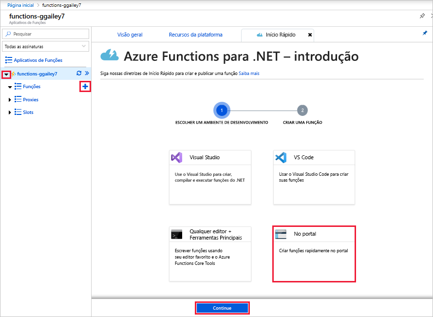

# Criar sua primeira função no portal do Azure

O Azure Functions lhe permite executar seu código em um ambiente sem servidor sem que seja preciso primeiro criar uma VM (máquina virtual) ou publicar um aplicativo Web. Neste artigo, você aprende a usar o Azure Functions para criar a função disparada por HTTP "Olá, Mundo" no portal do Azure.

[!INCLUDE [quickstarts-free-trial-note](../../includes/quickstarts-free-trial-note.md)]

Se você é um desenvolvedor de C#, considere [criar sua primeira função no Visual Studio 2019](functions-create-your-first-function-visual-studio.md) em vez de usar o portal. 

## Entrar no Azure

Entre no [portal do Azure](https://portal.azure.com) com sua conta do Azure.

## Criar um aplicativo de funções

Você deve ter um aplicativo de funções para hospedar a execução de suas funções. Um aplicativo de funções lhe permite agrupar funções como uma unidade lógica para facilitar o gerenciamento, a implantação, o dimensionamento e o compartilhamento de recursos.

[!INCLUDE [Create function app Azure portal](../../includes/functions-create-function-app-portal.md)]

Em seguida, crie uma função no novo aplicativo de funções.

## Criar uma função disparada por HTTP

1. Expanda seu novo aplicativo de funções e selecione o botão **+** ao lado de **Funções**, escolha **No portal** e, em seguida, selecione **Continuar**.

    

1. Escolha **WebHook + API** e, em seguida, selecione **Criar**.

    

   Uma função é criada usando um modelo específico a um idioma para uma função disparada por HTTP.

Agora você pode executar a nova função enviando uma solicitação HTTP.

## Testar a função

1. Em sua nova função, selecione **</> Obter URL da função** no canto superior direito. 

1. Na caixa de diálogo **Obter URL da função**, selecione **padrão (chave de função)** na lista suspensa e, em seguida, selecione **Copiar**. 

    

1. Cole a URL de função na barra de endereços do navegador. Adicione o valor da cadeia de caracteres de consulta `&name=<your_name>` ao final desta URL e pressione ENTER para executar a solicitação. 

    O exemplo a seguir mostra a resposta no navegador:

    

    A URL da solicitação inclui uma chave que é necessária, por padrão, para acessar sua função via HTTP.

1. Quando a função é executada, informações de rastreamento são gravadas nos logs. Para ver a saída do rastreamento da execução anterior, volte para sua função no portal e selecione a seta na parte inferior da tela para expandir os **Logs**.

   

## Limpar os recursos

[!INCLUDE [Clean-up resources](../../includes/functions-quickstart-cleanup.md)]

## Próximas etapas

[!INCLUDE [Next steps note](../../includes/functions-quickstart-next-steps.md)]

