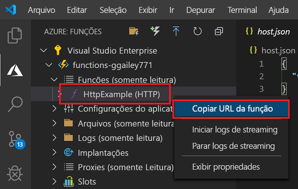
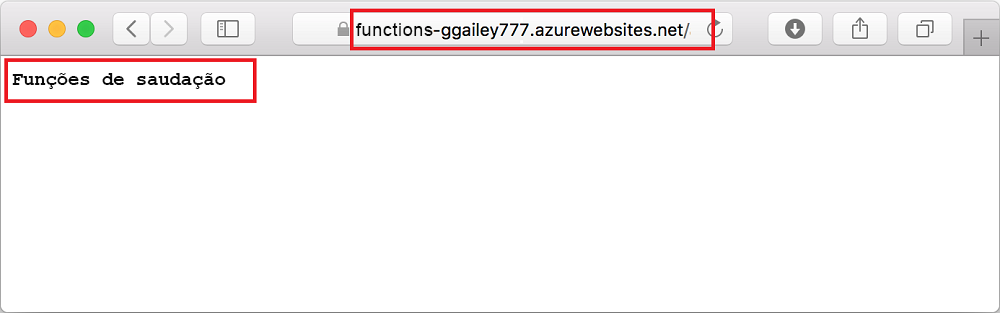

# <a name="quickstart-create-a-function-in-azure-using-visual-studio-code"></a>Início Rápido: Criar uma função no Azure usando o Visual Studio Code

::: zone pivot="programming-language-csharp"  
Neste artigo, você usará o Visual Studio Code para criar uma função baseada em biblioteca de classes C# que responde a solicitações HTTP. Após testar o código localmente, implante-o no ambiente sem servidor do Azure Functions. 
::: zone-end  
::: zone pivot="programming-language-javascript"
Neste artigo, você usará o Visual Studio Code para criar uma função do JavaScript que responde a solicitações HTTP. Após testar o código localmente, implante-o no ambiente sem servidor do Azure Functions. 
::: zone-end
::: zone pivot="programming-language-typescript"
Neste artigo, você usará o Visual Studio Code para criar uma função do TypeScript que responde a solicitações HTTP. Após testar o código localmente, implante-o no ambiente sem servidor do Azure Functions. 
::: zone-end   
::: zone pivot="programming-language-powershell"
Neste artigo, você usará o Visual Studio Code para criar uma função do PowerShell que responde a solicitações HTTP. Após testar o código localmente, implante-o no ambiente sem servidor do Azure Functions. 
::: zone-end  
::: zone pivot="programming-language-python" 
Neste artigo, você usará o Visual Studio Code para criar uma função do Python que responde a solicitações HTTP. Após testar o código localmente, implante-o no ambiente sem servidor do Azure Functions. 
::: zone-end  
::: zone pivot="programming-language-java" 
Neste artigo, você usará o Visual Studio Code para criar uma função do Java que responde a solicitações HTTP. Após testar o código localmente, implante-o no ambiente sem servidor do Azure Functions. 
::: zone-end

A realização deste início rápido gera um pequeno custo de alguns centavos de dólar ou menos em sua conta do Azure. 

::: zone pivot="programming-language-csharp,programming-language-javascript,programming-language-typescript,programming-language-powershell,programming-language-python"
Também há uma [versão baseada na CLI](functions-create-first-azure-function-azure-cli.md) deste artigo.
::: zone-end
::: zone pivot="programming-language-java"  
> [!NOTE]
> Se o Visual Studio Code não for sua ferramenta de desenvolvimento preferida, confira nossos tutoriais semelhantes para desenvolvedores Java usando [Maven](./functions-create-first-azure-function-azure-cli.md?pivots=programming-language-java), [Gradle](./functions-create-first-java-gradle.md) e [IntelliJ IDEA](/azure/developer/java/toolkit-for-intellij/quickstart-functions).
::: zone-end  

## <a name="configure-your-environment"></a>Configurar seu ambiente

Antes de começar, verifique se você tem os seguintes requisitos implementados:

+ Uma conta do Azure com uma assinatura ativa. [Crie uma conta gratuitamente](https://azure.microsoft.com/free/?ref=microsoft.com&utm_source=microsoft.com&utm_medium=docs&utm_campaign=visualstudio).

::: zone pivot="programming-language-csharp,programming-language-powershell,programming-language-python"  
+ [Node.js](https://nodejs.org/), exigido pelo Windows para npm. Apenas as [versões Active LTS e Maintenance LTS](https://nodejs.org/about/releases/). Use o comando `node --version` para verificar sua versão.
    Não é necessário para o desenvolvimento local no macOS e no Linux.   
::: zone-end  
::: zone pivot="programming-language-javascript,programming-language-typescript"  
+ [Node.js](https://nodejs.org/), versões Active LTS e versões LTS de manutenção (10.14.1 recomendada). Use o comando `node --version` para verificar sua versão.
::: zone-end 
::: zone pivot="programming-language-python"
+ Há suporte para o [Python 3.8](https://www.python.org/downloads/release/python-381/), o [Python 3.7](https://www.python.org/downloads/release/python-375/) e o [Python 3.6](https://www.python.org/downloads/release/python-368/) no Azure Functions (x64).
::: zone-end   
::: zone pivot="programming-language-powershell"
+ [PowerShell Core](/powershell/scripting/install/installing-powershell-core-on-windows)

+ O [SDK do .NET Core 2.2+](https://www.microsoft.com/net/download)  
::: zone-end  
::: zone pivot="programming-language-java"  
+ O [Java Developer Kit](https://aka.ms/azure-jdks), versão 8.

+ [Apache Maven](https://maven.apache.org), versão 3.0 ou posterior.
::: zone-end  
+ [Visual Studio Code](https://code.visualstudio.com/) em uma das [plataformas compatíveis](https://code.visualstudio.com/docs/supporting/requirements#_platforms).  
::: zone pivot="programming-language-csharp"  
+ A [Extensão do C#](https://marketplace.visualstudio.com/items?itemName=ms-dotnettools.csharp) para Visual Studio Code.  
::: zone-end  
::: zone pivot="programming-language-python"
+ A [extensão do Python](https://marketplace.visualstudio.com/items?itemName=ms-python.python) para Visual Studio Code.  
::: zone-end  
::: zone pivot="programming-language-powershell"
+ A [Extensão do PowerShell para Visual Studio Code](https://marketplace.visualstudio.com/items?itemName=ms-vscode.PowerShell). 
::: zone-end  
::: zone pivot="programming-language-java"  
+ O [pacote de extensão do Java](https://marketplace.visualstudio.com/items?itemName=vscjava.vscode-java-pack)
::: zone-end  

+ A [Extensão Azure Functions](https://marketplace.visualstudio.com/items?itemName=ms-azuretools.vscode-azurefunctions) para Visual Studio Code. 

## <a name="create-your-local-project"></a><a name="create-an-azure-functions-project"></a>Criar seu projeto local 

Nesta seção, você usará o Visual Studio Code para criar um projeto local do Azure Functions em sua linguagem escolhida. Mais adiante neste artigo, você publicará o código de função no Azure. 

1. Escolha o ícone do Azure na Barra de atividade e, em seguida, na área **Azure: Functions** e selecione o ícone **Criar projeto...** .

    

1. Escolha um local de diretório para o workspace do projeto e escolha **Selecionar**.

    > [!NOTE]
    > Estas etapas foram projetadas para serem concluídas fora de um workspace. Nesse caso, não selecione uma pasta de projeto que faz parte de um workspace.

1. Forneça as seguintes informações nos prompts:

    ::: zone pivot="programming-language-csharp"
    + **Selecione uma linguagem de programação para o seu projeto de função**: Escolha `C#`.
    ::: zone-end
    ::: zone pivot="programming-language-javascript"
    + **Selecione uma linguagem de programação para o seu projeto de função**: Escolha `JavaScript`.
    ::: zone-end
    ::: zone pivot="programming-language-typescript"
    + **Selecione uma linguagem de programação para o seu projeto de função**: Escolha `TypeScript`.
    ::: zone-end
    ::: zone pivot="programming-language-powershell"
    + **Selecione uma linguagem de programação para o seu projeto de função**: Escolha `PowerShell`.
    ::: zone-end
    ::: zone pivot="programming-language-python"
    + **Selecione uma linguagem de programação para o seu projeto de função**: Escolha `Python`.

    + **Selecione um alias do Python para criar um ambiente virtual**: Escolha a localização do seu interpretador do Python. Se a localização não for mostrada, digite o caminho completo no binário do Python.  
    ::: zone-end

    ::: zone pivot="programming-language-java"  
    + **Selecione uma linguagem de programação para o seu projeto de função**: Escolha `Java`.

    + **Forneça uma ID de grupo**: Escolha `com.function`.

    + **Forneça uma ID de artefato**: Escolha `myFunction`.

    + **Forneça uma versão**: Escolha `1.0-SNAPSHOT`.

    + **Forneça um nome de pacote**: Escolha `com.function`.

    + **Forneça um nome de aplicativo**: Escolha `myFunction-12345`.
    ::: zone-end  
    ::: zone pivot="programming-language-csharp,programming-language-javascript,programming-language-typescript,programming-language-powershell,programming-language-python"
    + **Selecione um modelo para a primeira função do projeto**: Escolha `HTTP trigger`.
    
    + **Forneça um nome de função**: Digite `HttpExample`.
    ::: zone-end  
    ::: zone pivot="programming-language-csharp"
    + **Forneça um namespace**: Digite `My.Functions`. 
    ::: zone-end  
    ::: zone pivot="programming-language-csharp,programming-language-javascript,programming-language-typescript,programming-language-powershell,programming-language-python"
    + **Nível de autorização**: Escolha `Anonymous`, que permite que qualquer pessoa chame seu ponto de extremidade de função. Para saber mais sobre o nível de autorização, confira [Chaves de autorização](functions-bindings-http-webhook-trigger.md#authorization-keys).
    ::: zone-end  
    + **Selecione como você gostaria de abrir seu projeto**: Escolha `Add to workspace`.

1. Usando essas informações, o Visual Studio Code gera um projeto do Azure Functions com um gatilho HTTP. Você pode exibir os arquivos de projeto locais no Explorer. Para saber mais sobre os arquivos criados, confira [Arquivos de projeto gerados](functions-develop-vs-code.md#generated-project-files). 

::: zone pivot="programming-language-csharp,programming-language-javascript,programming-language-python,programming-language-java"

[!INCLUDE [functions-run-function-test-local-vs-code](../../includes/functions-run-function-test-local-vs-code.md)]

::: zone-end

::: zone pivot="programming-language-powershell"

[!INCLUDE [functions-run-function-test-local-vs-code-ps](../../includes/functions-run-function-test-local-vs-code-ps.md)]

::: zone-end

Após verificar se a função foi executada corretamente no computador local, é hora de usar o Visual Studio Code para publicar o projeto diretamente no Azure. 

[!INCLUDE [functions-sign-in-vs-code](../../includes/functions-sign-in-vs-code.md)]

[!INCLUDE [functions-publish-project-vscode](../../includes/functions-publish-project-vscode.md)]

## <a name="run-the-function-in-azure"></a>Executar a função no Azure

1. De volta na área **Azure: Functions** na barra lateral, expanda o novo aplicativo de funções em sua assinatura. Expanda **Funções**, clique com o botão direito do mouse (Windows) ou Ctrl + clique (macOS) em **HttpExample** e escolha **Copiar URL de função**.

    

1. Cole essa URL para a solicitação HTTP na barra de endereços do navegador, adicione a cadeia de caracteres de consulta `name` como `?name=Functions` no final desta URL e, em seguida, execute a solicitação. A URL que chama a função HTTP disparada deve estar no seguinte formato:

    ```http
    http://<functionappname>.azurewebsites.net/api/httpexample?name=Functions
    ```
        
    O seguinte exemplo mostra a resposta no navegador à solicitação GET remota retornada pela função: 

    

## <a name="clean-up-resources"></a>Limpar os recursos

Quando você passar para a próxima etapa, [Adicionar uma associação de fila do Armazenamento do Azure à sua função](functions-add-output-binding-storage-queue-vs-code.md), você precisará manter todos os seus recursos em vigor para se basear no que você já fez.

Caso contrário, você poderá usar as etapas a seguir para excluir o aplicativo de funções e recursos relacionados para evitar incorrer em custos adicionais.

[!INCLUDE [functions-cleanup-resources-vs-code.md](../../includes/functions-cleanup-resources-vs-code.md)]

Para saber mais sobre os custos do Functions, confira [Estimar os custos do plano de consumo](functions-consumption-costs.md).

## <a name="next-steps"></a>Próximas etapas

Você usou o Visual Studio Code para criar um aplicativo de funções com uma função disparada por HTTP simples. No próximo artigo, você pode expandir essa função adicionando uma associação de saída. Essa associação grava a cadeia de caracteres da solicitação HTTP em uma mensagem em uma fila do Armazenamento de Filas do Azure. 

> [!div class="nextstepaction"]
> [Adicionar uma associação de fila do Armazenamento do Azure à sua função](functions-add-output-binding-storage-queue-vs-code.md)

[Azure Functions Core Tools]: functions-run-local.md
[Azure Functions extension for Visual Studio Code]: https://marketplace.visualstudio.com/items?itemName=ms-azuretools.vscode-azurefunctions
