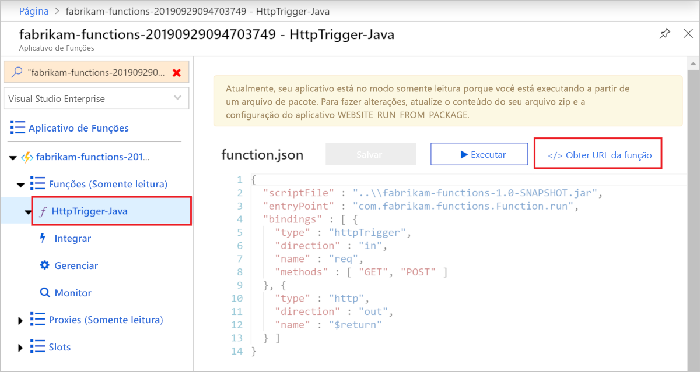

# <a name="quickstart-use-java-and-maven-to-create-and-publish-a-function-to-azure"></a>Início Rápido: Usar o Java e o Maven para criar e publicar uma função no Azure

Este artigo mostra como criar e publicar uma função Java no Azure Functions com a ferramenta de linha de comando Maven. Quando você terminar, o código de função será executado no Azure em um [plano de hospedagem sem servidor](functions-scale.md#consumption-plan) e será disparado por uma solicitação HTTP.

<!--
> [!NOTE] 
> You can also create a Kotlin-based Azure Functions project by using the azure-functions-kotlin-archetype instead. Visit the [GitHub repository](https://github.com/microsoft/azure-maven-archetypes/tree/develop/azure-functions-kotlin-archetype) for more information.
-->

## <a name="prerequisites"></a>Pré-requisitos

Para desenvolver funções usando Java, você deve ter o seguinte instalado:

- [Java Developer Kit](https://aka.ms/azure-jdks), versão 8
- [Apache Maven](https://maven.apache.org), versão 3.0 ou posterior
- [CLI do Azure]
- [Azure Functions Core Tools](./functions-run-local.md#v2) versão 2.6.666 ou posterior
- Uma assinatura do Azure.

[!INCLUDE [quickstarts-free-trial-note](../../includes/quickstarts-free-trial-note.md)]


> [!IMPORTANT]
> A variável de ambiente JAVA_HOME deve ser definida como o local de instalação do JDK para concluir este guia de início rápido.

## <a name="generate-a-new-functions-project"></a>Gerar um novo projeto do Functions

Em uma pasta vazia, execute o seguinte comando para gerar o projeto do Functions a partir de um [arquétipo Maven](https://maven.apache.org/guides/introduction/introduction-to-archetypes.html).

### <a name="linuxmacos"></a>Linux/macOS

```bash
mvn archetype:generate \
    -DarchetypeGroupId=com.microsoft.azure \
    -DarchetypeArtifactId=azure-functions-archetype 
```

> [!NOTE]
> Se você estiver com problemas com a execução do comando, verifique qual versão do `maven-archetype-plugin` é usada. Como você está executando o comando em um diretório vazio sem nenhum arquivo `.pom`, ele pode estar tentando usar um plug-in da versão mais antiga do `~/.m2/repository/org/apache/maven/plugins/maven-archetype-plugin`, se você atualizou o Maven de uma versão anterior. Nesse caso, tente excluir o diretório `maven-archetype-plugin` e executar novamente o comando.

### <a name="windows"></a>Windows

```powershell
mvn archetype:generate `
    "-DarchetypeGroupId=com.microsoft.azure" `
    "-DarchetypeArtifactId=azure-functions-archetype"
```

```cmd
mvn archetype:generate ^
    "-DarchetypeGroupId=com.microsoft.azure" ^
    "-DarchetypeArtifactId=azure-functions-archetype"
```

O Maven solicita os valores necessários para concluir a geração do projeto na implantação. Forneça os seguintes valores quando solicitado:

| Valor | DESCRIÇÃO |
| ----- | ----------- |
| **groupId** | Um valor que identifica exclusivamente o projeto em todos os projetos, seguindo as [regras de nomenclatura do pacote](https://docs.oracle.com/javase/specs/jls/se6/html/packages.html#7.7) para Java. Os exemplos deste início rápido usam `com.fabrikam.functions`. |
| **artifactId** | Um valor que é o nome do jar, sem um número de versão. Os exemplos deste início rápido usam `fabrikam-functions`. |
| **version** | Escolha o valor padrão `1.0-SNAPSHOT`. |
| **package** | Um valor que é o pacote Java para o código de função gerado. Use o padrão. Os exemplos deste início rápido usam `com.fabrikam.functions`. |
| **appName** | Nome global exclusivo que identifica seu novo aplicativo de funções no Azure. Use o padrão, que é a _artifactId_ acrescentada a um número aleatório. Anote esse valor; você precisará dele mais tarde. |
| **appRegion** | Escolha uma [região](https://azure.microsoft.com/regions/) perto de você ou perto de outros serviços que suas funções acessam. O padrão é `westus`. Execute este comando da [CLI do Azure] para obter uma lista de todas as regiões:<br/>`az account list-locations --query '[].{Name:name}' -o tsv` |
| **resourceGroup** | Nome do novo [grupo de recursos](../azure-resource-manager/resource-group-overview.md) no qual o aplicativo de funções será criado. Use `myResourceGroup`, que é usado pelos exemplos neste início rápido. Um grupo de recursos precisa ser exclusivo em sua assinatura do Azure.|

Digite `Y` ou pressione Enter para confirmar.

O Maven cria os arquivos de projeto em uma nova pasta com o nome _artifactId_, que, neste exemplo, é `fabrikam-functions`. 

Abra o novo arquivo Function.java do caminho *src/main/java* em um editor de texto e examine o código gerado. Esse código é uma função [disparada por HTTP](functions-bindings-http-webhook.md) que ecoa o corpo da solicitação. 

## <a name="run-the-function-locally"></a>Executar a função localmente

Execute o seguinte comando, que altera o diretório para a pasta de projeto recém-criada e, em seguida, compila e executa o projeto de função:

```console
cd fabrikam-function
mvn clean package 
mvn azure-functions:run
```

Você verá uma saída semelhante à seguinte no Azure Functions Core Tools quando executar o projeto localmente:

```Output
...

Now listening on: http://0.0.0.0:7071
Application started. Press Ctrl+C to shut down.

Http Functions:

    HttpTrigger-Java: [GET,POST] http://localhost:7071/api/HttpTrigger-Java
...
```

Dispare a função na linha de comando usando o cURL em uma nova janela de terminal:

```CMD
curl -w "\n" http://localhost:7071/api/HttpTrigger-Java --data AzureFunctions
```

```Output
Hello AzureFunctions!
```
A [chave de função](functions-bindings-http-webhook.md#authorization-keys) não é necessária na execução local. Use `Ctrl+C` no terminal para interromper o código da função.

## <a name="deploy-the-function-to-azure"></a>Implantar a função no Azure

Um aplicativo de funções e os recursos relacionados são criados no Azure quando você implanta o aplicativo de funções pela primeira vez. Para fazer a implantação, use o comando [az login](/cli/azure/authenticate-azure-cli) da CLI do Azure para entrar em sua assinatura do Azure. 

```azurecli
az login
```

> [!TIP]
> Caso a sua conta possa acessar várias assinaturas, use [az account set](/cli/azure/account#az-account-set) para definir a assinatura padrão para essa sessão. 

Use o comando do Maven a seguir para implantar o projeto em um novo aplicativo de funções. 

```azurecli
mvn azure-functions:deploy
```

Este destino `azure-functions:deploy` do Maven cria os seguintes recursos no Azure:

+ Grupo de recursos. Nomeado com o _resourceGroup_ fornecido.
+ Conta de armazenamento. Necessária para o Functions. O nome é gerado aleatoriamente de acordo com os requisitos de nome da conta de armazenamento.
+ Plano do Serviço de Aplicativo. Hospedagem sem servidor para o aplicativo de funções na _appRegion_ especificada. O nome é gerado aleatoriamente.
+ Aplicativo de funções. Um aplicativo de funções é a unidade de implantação e execução para suas funções. O nome é o _appName_, acrescentado a um número gerado aleatoriamente. 

A implantação também empacota os arquivos de projeto e implanta-os no novo aplicativo de funções usando [zip deployment](functions-deployment-technologies.md#zip-deploy), com o modo run-from-package habilitado.

Após a conclusão da implantação, você verá a URL que poderá usar para acessar os pontos de extremidade do aplicativo de funções. Como o gatilho HTTP que publicamos usa `authLevel = AuthorizationLevel.FUNCTION`, você precisa obter a chave de função para chamar o ponto de extremidade da função via HTTP. A maneira mais fácil de obter a chave de função é no [portal do Azure].

## <a name="get-the-http-trigger-url"></a>Obter a URL do gatilho HTTP

<!--- We can updates this to remove portal dependency after the Maven archetype returns the full URLs with keys on publish (https://github.com/microsoft/azure-maven-plugins/issues/571). -->

Obtenha a URL necessária para disparar a função, com a chave de função, no portal do Azure. 

1. Navegue até o [portal do Azure], entre nele, digite o _appName_ do aplicativo de funções em **Pesquisar** na parte superior da página e pressione Enter.
 
1. No aplicativo de funções, expanda **Funções (Somente Leitura)** , selecione a função e, em seguida, selecione **</> Obter URL da função** no canto superior direito. 

    

1. Escolha **padrão (Chave de função)** e selecione **Copiar**. 

Agora você pode usar a URL copiada para acessar a função.

## <a name="verify-the-function-in-azure"></a>Verificar a função no Azure

Para verificar o aplicativo de funções em execução no Azure usando `cURL`, substitua a URL da amostra abaixo pela URL copiada do portal.

```azurecli
curl -w "\n" https://fabrikam-functions-20190929094703749.azurewebsites.net/api/HttpTrigger-Java?code=zYRohsTwBlZ68YF.... --data AzureFunctions
```

Isso envia uma solicitação POST ao ponto de extremidade da função com `AzureFunctions` no corpo da solicitação. Você verá a resposta a seguir.

```Output
Hello AzureFunctions!
```

## <a name="next-steps"></a>Próximas etapas

Você criou um projeto de funções Java com uma função disparada por HTTP, executou-o no computador local e implantou-o no Azure. Agora, estenda sua função por meio da...

> [!div class="nextstepaction"]
> [Adição de uma associação de saída de fila do Armazenamento do Azure](functions-add-output-binding-storage-queue-java.md)


[CLI do Azure]: /cli/azure
[Portal do Azure]: https://portal.azure.com