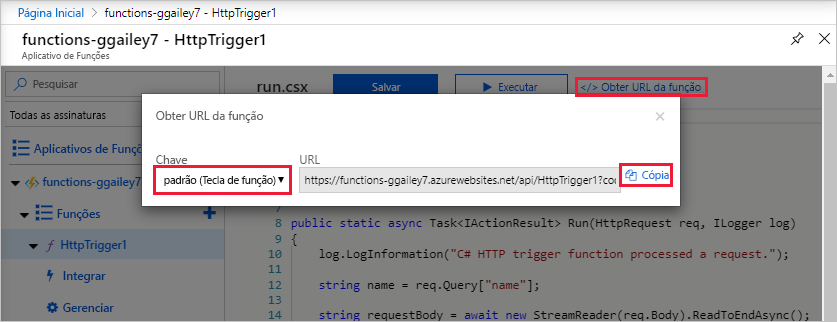
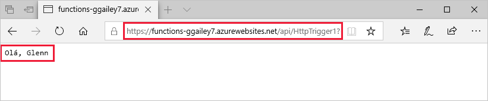
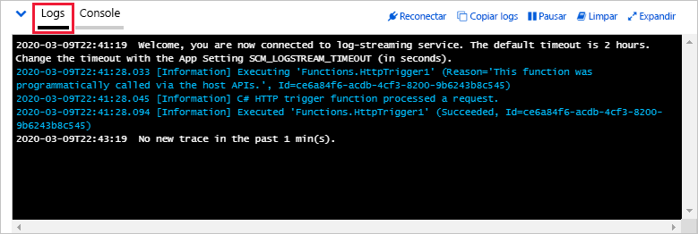

# Criar sua primeira função no portal do Azure

O Azure Functions permite que você execute seu código em um ambiente sem servidor que não precise primeiro criar uma VM (máquina virtual) ou publicar um aplicativo Web. Neste artigo, você aprenderá a usar o Azure Functions para criar uma função de gatilho HTTP "Olá, mundo" no portal do Azure.

>[!NOTE]
>A edição no portal só tem suporte para as funções de script JavaScript, PowerShell, TypeScript e C#.  Para as funções de biblioteca de classes C#, Java e Python, você pode criar o aplicativo de funções no portal, mas você também deve criar as funções localmente e, em seguida, publicá-las no Azure. 

Em vez disso, recomendamos que você [desenvolva suas funções localmente](functions-develop-local.md) e publique em um aplicativo de funções no Azure.  
Use um dos links a seguir para começar com o idioma e o ambiente de desenvolvimento local escolhidos:

| Visual Studio Code | Terminal/prompt de comando | Visual Studio |
| --- | --- | --- |
|  &bull;&nbsp;[Introdução ao C #](./create-first-function-vs-code-csharp.md) &bull;&nbsp;[Introdução ao Java](./create-first-function-vs-code-java.md) &bull;&nbsp;[Introdução ao JavaScript](./create-first-function-vs-code-node.md) &bull;&nbsp;[Introdução ao PowerShell](./create-first-function-vs-code-powershell.md) &bull;&nbsp;[Introdução ao Python](./create-first-function-vs-code-python.md) |&bull;&nbsp;[Introdução ao C #](./create-first-function-cli-csharp.md) &bull;&nbsp;[Introdução ao Java](./create-first-function-cli-java.md) &bull;&nbsp;[Introdução ao JavaScript](./create-first-function-cli-node.md) &bull;&nbsp;[Introdução ao PowerShell](./create-first-function-cli-powershell.md) &bull;&nbsp;[Introdução ao Python](./create-first-function-cli-python.md) | [Introdução ao C#](functions-create-your-first-function-visual-studio.md) |

[!INCLUDE [quickstarts-free-trial-note](../../includes/quickstarts-free-trial-note.md)]

## Entrar no Azure

Entre no [portal do Azure](https://portal.azure.com) com sua conta do Azure.

## Criar um aplicativo de funções

Você deve ter um aplicativo de funções para hospedar a execução de suas funções. Um aplicativo de funções lhe permite agrupar funções como uma unidade lógica para facilitar o gerenciamento, a implantação, o dimensionamento e o compartilhamento de recursos.

[!INCLUDE [Create function app Azure portal](../../includes/functions-create-function-app-portal.md)]

Em seguida, crie uma função no novo aplicativo de funções.

## Criar uma função de gatilho HTTP

1. No menu esquerdo da janela **Funções**, selecione **Funções** e depois selecione **Adicionar** no menu superior. 
 
1. Na janela **Nova Função**, selecione **Gatilho HTTP**.

    

1. Na janela **Nova Função**, aceite o nome padrão para **Nova Função** ou insira um novo nome. 

1. Escolha **Anônimo** na lista suspensa **Nível de autorização** e, em seguida, selecione **Criar Função**.

    O Azure cria a função de gatilho HTTP. Agora você pode executar a nova função enviando uma solicitação HTTP.

## Testar a função

1. Em sua nova função de gatilho HTTP, selecione **Codificar + Testar** no menu esquerdo e, em seguida, **Obter URL da função** no menu superior.

    

1. Na caixa de diálogo **Obter URL da função**, selecione **padrão** na lista suspensa e, em seguida, selecione **Copiar para a área de transferência**. 

    

1. Cole a URL de função na barra de endereços do navegador. Adicione o valor da cadeia de caracteres de consulta `?name=<your_name>` ao final desta URL e pressione ENTER para executar a solicitação. 

    O exemplo a seguir mostra a resposta no navegador:

    

    Se a URL de solicitação tiver incluído uma [chave de acesso](functions-bindings-http-webhook-trigger.md#authorization-keys) ( `?code=...` ), isso significa que você escolherá a **função** em vez do nível de acesso **anônimo** ao criar a função. Nesse caso, você deve anexar `&name=<your_name>` .

1. Quando a função é executada, informações de rastreamento são gravadas nos logs. Para ver a saída do rastreamento, retorne à página **Codificar + Testar** no portal e expanda a seta **Logs** na parte inferior da página.

   

## Limpar os recursos

[!INCLUDE [Clean-up resources](../../includes/functions-quickstart-cleanup.md)]

## Próximas etapas

[!INCLUDE [Next steps note](../../includes/functions-quickstart-next-steps.md)]
