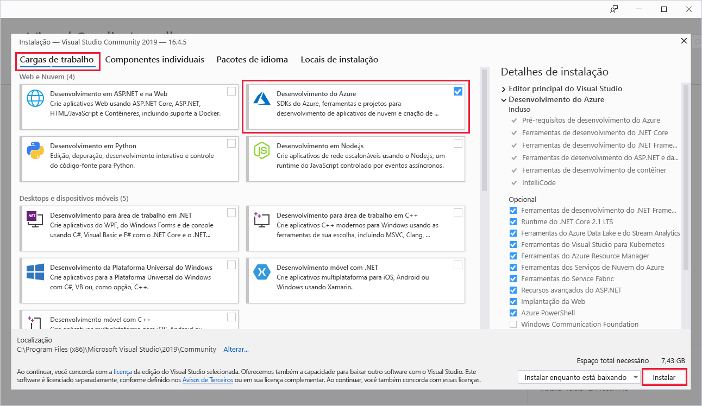

# Início Rápido: Criar sua primeira função no Azure usando o Visual Studio

Neste artigo, você usará o Visual Studio para criar uma função baseada em biblioteca de classes C# que responde a solicitações HTTP. Após testar o código localmente, implante-o no ambiente sem servidor do Azure Functions.  

A realização deste início rápido gera um pequeno custo de alguns centavos de dólar ou menos em sua conta do Azure.

## Pré-requisitos

Para concluir este tutorial, instale primeiro o [Visual Studio 2019](https://azure.microsoft.com/downloads/). Selecione a carga de trabalho de **desenvolvimento do Azure** durante a instalação. Se você quiser criar um projeto do Azure Functions usando o Visual Studio 2017, primeiro deve instalar as [ferramentas mais recentes do Azure Functions](functions-develop-vs.md#check-your-tools-version).

Se você não tiver uma [assinatura do Azure](../guides/developer/azure-developer-guide.md#understanding-accounts-subscriptions-and-billing), crie uma [conta gratuita](https://azure.microsoft.com/free/dotnet/) antes de começar.

## Crie um projeto de aplicativo de funções

[!INCLUDE [Create a project using the Azure Functions template](../../includes/functions-vstools-create.md)]

O Visual Studio cria um projeto e uma classe que contém o código clichê do tipo de função do gatilho HTTP. O código padronizado envia uma resposta HTTP que inclui um valor do corpo de solicitação ou da cadeia de consulta. O atributo `HttpTrigger` especifica que a função é disparada por uma solicitação HTTP. 

## Renomear a função

O atributo do método `FunctionName` define o nome da função, que por padrão é gerado como `Function1`. Como as ferramentas não permitem que você substitua o nome padrão da função quando cria seu projeto, dedique um minuto a criar um nome melhor para a classe da função, o arquivo e os metadados.

1. No **Explorador de Arquivos**, clique com o botão direito do mouse no arquivo Function1.cs e renomeie-o como `HttpExample.cs`.

1. No código, renomeie a classe Function1 como 'HttpExample'.

1. No método `HttpTrigger` chamado `Run`, renomeie o atributo do método `FunctionName` como `HttpExample`.

Agora que renomeou a função, você pode testá-la no computador local.

## Executar a função localmente

O Visual Studio integra-se ao Azure Functions Core Tools para que você possa testar suas funções localmente usando o runtime completo do Azure Functions.  

[!INCLUDE [functions-run-function-test-local-vs](../../includes/functions-run-function-test-local-vs.md)]

Após verificar se a função foi executada corretamente no computador local, é hora de publicar o projeto no Azure.

## Publicar o projeto no Azure

Antes de publicar o projeto, você deve ter um aplicativo de funções em sua assinatura do Azure. A publicação do Visual Studio cria um aplicativo de funções para você na primeira vez que você publica seu projeto.

[!INCLUDE [Publish the project to Azure](../../includes/functions-vstools-publish.md)]

## Testar sua função no Azure

1. No Cloud Explorer, seu novo aplicativo de funções deve estar selecionado. Caso contrário, expanda sua assinatura > **Serviços de Aplicativos** e selecione seu novo aplicativo de funções.

1. Clique com o botão direito do mouse no aplicativo de funções e escolha **Abrir no navegador**. Isso abre a raiz do aplicativo de funções no navegador da Web padrão e exibe a página que indica que o aplicativo de funções está em execução. 

    :::image type="content" source="media/functions-create-your-first-function-visual-studio/function-app-running-azure.png" alt-text="Aplicativo de funções em execução":::

1. Na barra de endereços no navegador, acrescente a cadeia de caracteres `/api/HttpExample?name=Functions` à URL base e execute a solicitação.

    A URL que chama a função de gatilho HTTP está no seguinte formato:

    `http://<APP_NAME>.azurewebsites.net/api/HttpExample?name=Functions`

2. Vá para essa URL e você verá uma resposta no navegador à solicitação GET remota retornada pela função, que é semelhante ao seguinte exemplo:

    :::image type="content" source="media/functions-create-your-first-function-visual-studio/functions-create-your-first-function-visual-studio-browser-azure.png" alt-text="Resposta da função no navegador":::

## Limpar os recursos

Outros inícios rápidos nessa coleção aproveitam esse início rápido. Se você planeja trabalhar com guias de início rápido subsequentes, tutoriais ou com qualquer serviço criado por você nesse início rápido, não limpe os recursos.

Os *Recursos* no Azure se referem a aplicativos de funções, funções, contas de armazenamento e assim por diante. Eles são agrupados em *grupos de recursos* e você pode excluir tudo junto ao excluir o grupo. 

Você criou recursos para concluir esses guias de início rápido. Você pode ser cobrado por esses recursos, dependendo do [status de conta](https://azure.microsoft.com/account/) e [preços do serviço](https://azure.microsoft.com/pricing/). Caso não precise mais dos recursos, é possível excluí-los desta maneira:

1. No Cloud Explorer, expanda sua assinatura > **Serviços de Aplicativos**, clique com o botão direito do mouse no aplicativo de funções e escolha **Abrir no Portal**. 

1. Na página do aplicativo de funções, selecione a guia **Visão geral** e depois selecione o link em **Grupo de recursos**.

   :::image type="content" source="media/functions-create-your-first-function-visual-studio/functions-app-delete-resource-group.png" alt-text="Selecione o grupo de recursos a ser excluído da página do aplicativo de funções":::

2. Na página **Grupo de recursos**, examine a lista de recursos incluídos e verifique se eles são aqueles que deseja excluir.
 
3. Selecione **Excluir grupo de recursos** e siga as instruções.

   A exclusão poderá levar alguns minutos. Ao ser concluída, uma notificação será exibida por alguns segundos. Também é possível selecionar o ícone de sino na parte superior da página para exibir a notificação.

## Próximas etapas

Neste início rápido, você usou o Visual Studio para criar e publicar um aplicativo de funções em C# no Azure com uma função de gatilho HTTP simples. 

Avance para o próximo artigo para saber como adicionar uma associação de fila do Armazenamento do Azure à sua função:
> [!div class="nextstepaction"]
> [Adicionar uma associação de fila do Armazenamento do Azure à sua função](functions-add-output-binding-storage-queue-vs.md)

