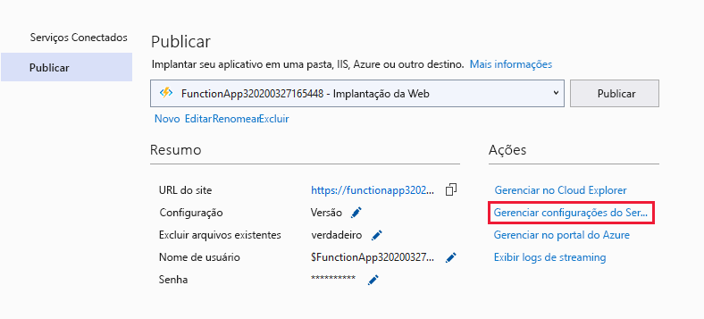

# <a name="develop-azure-functions-using-visual-studio"></a>Desenvolver o Azure Functions usando o Visual Studio  

Visual Studio lets you develop, test, and deploy C# class library functions to Azure. Se esta for sua primeira experiência com o Azure Functions, você pode aprender mais em [Uma introdução ao Azure Functions](functions-overview.md).

Visual Studio provides the following benefits when develop your functions: 

* Editar, criar e executar funções em seu computador de desenvolvimento local. 
* Publish your Azure Functions project directly to Azure, and create Azure resources as needed. 
* Use C# attributes to declare function bindings directly in the C# code.
* Desenvolver e implantar funções de pré-compiladas C#. Funções pré-compiladas fornecem um desempenho de inicialização a frio melhor que funções baseadas em script C#. 
* Codificar suas funções em C# tendo todos os benefícios de desenvolvimento do Visual Studio. 

This article provides details about how to use Visual Studio to develop C# class library functions and publish them to Azure. Antes de ler este artigo, você deve concluir o início rápido das [Funções para o Visual Studio](functions-create-your-first-function-visual-studio.md). 

Unless otherwise noted, procedures and examples shown are for Visual Studio 2019. 

## <a name="prerequisites"></a>Pré-requisitos

Azure Functions Tools is included in the Azure development workload of Visual Studio starting with Visual Studio 2017. Make sure you include the **Azure development** workload in your Visual Studio installation.

[!INCLUDE [quickstarts-free-trial-note](../../includes/quickstarts-free-trial-note.md)]

Other resources that you need, such as an Azure Storage account, are created in your subscription during the publishing process.

> [!NOTE]
> In Visual Studio 2017, the Azure development workload installs the Azure Functions Tools as a separate extension. When you update your Visual Studio 2017, also make sure that you are using the [most recent version](#check-your-tools-version) of the Azure Functions tools. The following sections show you how to check and (if needed) update your Azure Functions Tools extension in Visual Studio 2017. 
>
> Please skip these section when using Visual Studio 2019.

### <a name="check-your-tools-version"></a>Check your tools version in Visual Studio 2017

1. No menu **Ferramentas**, clique em **Extensões e Atualizações**. Expanda as **Ferramentas** > **Instaladas** e escolha **Azure Functions e Ferramentas de Trabalhos da Web** .

    

1. Observe a **Versão** instalada. Você pode comparar esta versão com a versão mais recente listada [nas notas de versão](https://github.com/Azure/Azure-Functions/blob/master/VS-AzureTools-ReleaseNotes.md). 

1. Se a sua versão for mais antiga, atualize suas ferramentas no Visual Studio conforme mostrado na seção a seguir.

### <a name="update-your-tools-in-visual-studio-2017"></a>Update your tools in Visual Studio 2017

1. Na caixa de diálogo **Extensões e Atualizações**, expanda **Atualizações** > **Visual Studio Marketplace**, escolha **Azure Functions e Ferramentas de Trabalhos da Web**  e selecione **Atualizar**.

       

1. Depois de fazer o download da atualização das ferramentas, feche o Visual Studio para disparar a atualização das ferramentas usando o instalador VSIX.

1. No instalador, escolha **OK** para iniciar e depois **Modificar** para atualizar as ferramentas. 

1. Depois que a atualização for concluída, escolha **Fechar** e reinicie o Visual Studio.

> [!NOTE]  
In Visual Studio 2019 and later, the Azure Functions tools extension is updated as part of Visual Studio.  

## <a name="create-an-azure-functions-project"></a>Criar um projeto do Azure Functions

[!INCLUDE [Create a project using the Azure Functions](../../includes/functions-vstools-create.md)]

O modelo de projeto cria um projeto C#, instala o pacote NuGet `Microsoft.NET.Sdk.Functions` e define a estrutura de destino. O novo projeto contém os seguintes arquivos:

* **host.json**: Permite que você configure o host do Functions. Essas configurações se aplicam para execução local e no Azure. Para obter mais informações, consulte a [referência para host.json](functions-host-json.md).

* **local.Settings.json**: Mantém as configurações usadas ao executar as funções localmente. These settings aren't used when running in Azure. For more information, see [Local settings file](#local-settings-file).

    >[!IMPORTANT]
    >Como o arquivo Settings pode conter segredos, ele devem ser excluídos do seu controle de origem do projeto. A configuração **Cópia para o diretório de saída** desse arquivo deve ser sempre **Copiar se for mais recente**. 

Para saber mais, confira [Projeto de biblioteca de classe de funções](functions-dotnet-class-library.md#functions-class-library-project).

[!INCLUDE [functions-local-settings-file](../../includes/functions-local-settings-file.md)]

Settings in local.settings.json aren't uploaded automatically when you publish the project. To make sure that these settings also exist in your function app in Azure, you must upload them after you publish your project. To learn more, see [Function app settings](#function-app-settings).

Os valores em **ConnectionStrings** nunca são publicados.

Os valores de configuração do aplicativo de funções também podem ser lidos em seu código como variáveis de ambiente. For more information, see [Environment variables](functions-dotnet-class-library.md#environment-variables).

## <a name="configure-the-project-for-local-development"></a>Configurar seu projeto para desenvolvimento local

O runtime do Functions usa internamente uma conta de Armazenamento do Azure. Para todos os tipos de gatilhos diferentes de HTTP e webhooks, você deve definir a chave **Values.AzureWebJobsStorage** para uma cadeia de conexão de conta de Armazenamento do Azure válida. O aplicativo de funções também pode usar o [Emulador de Armazenamento do Microsoft Azure](../storage/common/storage-use-emulator.md) para a configuração de conexão **AzureWebJobsStorage** exigida pelo projeto. Para usar o emulador, defina o valor de **AzureWebJobsStorage** para `UseDevelopmentStorage=true`. Change this setting to an actual storage account connection string before deployment.

Para definir a cadeia de conexão da conta de armazenamento:

1. In Visual Studio, open **Cloud Explorer**, expand **Storage Account** > **Your Storage Account**, then in the **Properties** tab copy the **Primary Connection String** value.

2. Em seu projeto, abra o arquivo local.settings.json e defina o valor da chave **AzureWebJobsStorage** na cadeia de conexão que você copiou.

3. Repita a etapa anterior para adicionar as chaves exclusivas para a matriz de **Valores** para todas as outras conexões necessárias para as suas funções. 

## <a name="add-a-function-to-your-project"></a>Adicionar uma função ao projeto

In C# class library functions, the bindings used by the function are defined by applying attributes in the code. When you create your function triggers from the provided templates, the trigger attributes are applied for you. 

1. No **Gerenciador de Soluções**, clique com o botão direito do mouse no nó do projeto e selecione **Adicionar** > **Novo Item**. Selecione **Azure Function**, digite um **Nome** para a classe e clique em **Adicionar**.

2. Escolha o gatilho, defina as propriedades de associação e clique em **Criar**. O exemplo a seguir mostra as configurações ao criar uma função disparada por armazenamento de filas. 

    

    Este exemplo de gatilho usa uma cadeia de conexão com uma chave chamada **QueueStorage**. Essa configuração de cadeia de conexão deve ser definida no [arquivo local.settings.json](functions-run-local.md#local-settings-file).

3. Examine a classe recém-adicionada. Você verá um método estático **Run**, que é atribuído ao atributo **FunctionName**. Esse atributo indica que o método é o ponto de entrada para a função.

    Por exemplo, a classe C# a seguir representa uma função básica disparada pelo armazenamento de filas:

    ```csharp
    using System;
    using Microsoft.Azure.WebJobs;
    using Microsoft.Azure.WebJobs.Host;
    using Microsoft.Extensions.Logging;

    namespace FunctionApp1
    {
        public static class Function1
        {
            [FunctionName("QueueTriggerCSharp")]
            public static void Run([QueueTrigger("myqueue-items", 
                Connection = "QueueStorage")]string myQueueItem, ILogger log)
            {
                log.LogInformation($"C# Queue trigger function processed: {myQueueItem}");
            }
        }
    }
    ```

    Um atributo específico de associação é aplicado a cada parâmetro de associação fornecido ao método do ponto de entrada. O atributo utiliza as informações de associação como parâmetros. No exemplo anterior, o primeiro parâmetro tem um atributo **QueueTrigger** aplicado, que indica a função disparada por fila. O nome da fila e o nome de configuração da cadeia de conexão são passadas como parâmetros ao atributo **QueueTrigger**. Para obter mais informações, veja [Associações do armazenamento de Fila do Azure para o Azure Functions](functions-bindings-storage-queue.md#trigger---c-example).

Você pode usar o procedimento acima para adicionar mais funções a seu projeto de aplicativo de funções. Cada função no projeto pode ter um gatilho diferente, mas uma função deve ter apenas um gatilho. Para obter mais informações, consulte [Gatilhos e conceitos de associações do Azure Functions](functions-triggers-bindings.md).

## <a name="add-bindings"></a>Adicionar associações

Assim como acontece com gatilhos, as associações de entrada e saída são adicionadas à sua função como atributos de associação. Adicione associações a uma função da seguinte maneira:

1. Make sure you've [configured the project for local development](#configure-the-project-for-local-development).

2. Adicione o pacote de extensão do NuGet pertinente para a associação. Para saber mais, confira [Desenvolvimento Local em C# usando o Visual Studio](./functions-bindings-register.md#local-csharp) no artigo Gatilhos e associações. Os requisitos de pacote NuGet específicos da associação estão no artigo de referência da associação. Por exemplo, encontre os requisitos do pacote para o gatilho dos Hubs de Eventos no [artigo de referência da associação dos Hubs de Eventos](functions-bindings-event-hubs.md).

3. Se houver configurações de aplicativo exigidas pela associação, adicione-as à coleção **Valores** no [arquivo de configuração local](functions-run-local.md#local-settings-file). Esses valores são usados quando a função é executada localmente. Quando a função é executada no aplicativo de funções no Azure, as [configurações do aplicativo de funções](#function-app-settings) são usadas.

4. Adicione o atributo de associação apropriado para a assinatura do método. No exemplo a seguir, uma mensagem da fila dispara a função e a associação de saída cria uma nova mensagem de fila com o mesmo texto em uma fila diferente.

    ```csharp
    public static class SimpleExampleWithOutput
    {
        [FunctionName("CopyQueueMessage")]
        public static void Run(
            [QueueTrigger("myqueue-items-source", Connection = "AzureWebJobsStorage")] string myQueueItem, 
            [Queue("myqueue-items-destination", Connection = "AzureWebJobsStorage")] out string myQueueItemCopy,
            ILogger log)
        {
            log.LogInformation($"CopyQueueMessage function processed: {myQueueItem}");
            myQueueItemCopy = myQueueItem;
        }
    }
    ```
   A conexão com o Armazenamento de filas é obtida na configuração `AzureWebJobsStorage`. Para saber mais, confira o artigo de referência da associação específica. 

[!INCLUDE [Supported triggers and bindings](../../includes/functions-bindings.md)]

## <a name="testing-functions"></a>Funções de teste

As Ferramentas Principais do Azure Functions permitem executar o projeto do Azure Functions no seu computador de desenvolvimento local. Você precisa instalar essas ferramentas na primeira vez em que inicia uma função no Visual Studio.

Para testar sua função, pressione F5. Se solicitado, aceite a solicitação do Visual Studio para baixar e instalar as ferramentas principais (CLI) do Azure Functions. Você também precisará habilitar a exceção de firewall de forma que as ferramentas possam lidar com solicitações HTTP.

Com o projeto em execução, você pode testar seu código da mesma forma que você testaria a função implantada. Para saber mais informações, consulte [Estratégias para testar seu código no Azure Functions](functions-test-a-function.md). Quando em execução no modo de depuração, os pontos de interrupção são atingidos no Visual Studio, conforme o esperado. 

<!---
For an example of how to test a queue triggered function, see the [queue triggered function quickstart tutorial](functions-create-storage-queue-triggered-function.md#test-the-function).  
-->

Para saber mais sobre o uso das Ferramentas Básicas do Azure Functions, consulte [Codificar e testar o Azure Functions localmente](functions-run-local.md).

## <a name="publish-to-azure"></a>Publicar no Azure

When publishing from Visual Studio, one of two deployment methods are used:

* [Web Deploy](functions-deployment-technologies.md#web-deploy-msdeploy): packages and deploys Windows apps to any IIS server.
* [Zip Deploy with Run-From-Package enabled](functions-deployment-technologies.md#zip-deploy): recommended for Azure Functions deployments.

Use the following steps to publish your project to a function app in Azure.

[!INCLUDE [Publish the project to Azure](../../includes/functions-vstools-publish.md)]

## <a name="function-app-settings"></a>Configurações do aplicativo de funções

As configurações que você adicionou no local.settings.json também devem ser adicionadas ao aplicativo de funções no Azure. These settings aren't uploaded automatically when you publish the project.

A maneira mais fácil para carregar as configurações necessárias para o seu aplicativo de função no Azure é usar o link **Gerenciar configurações de aplicativo...**  que é exibido depois que você publica seu projeto com êxito.



Isso exibe a caixa de diálogo **Configurações de aplicativo** para o aplicativo de função, onde você pode adicionar novas configurações do aplicativo ou modificar as existentes.


**Local** representa um valor de configuração no arquivo local.settings.json e **Remoto** é a configuração atual no aplicativo de funções no Azure.  Escolha **Adicionar configuração** para criar uma nova configuração de aplicativo. Use o link **Inserir valor do local** para copiar um valor de configuração para o campo **Remoto**. As alterações pendentes serão gravadas no arquivo de configurações local e no aplicativo de funções quando você selecionar **OK**.

> [!NOTE]
> By default, the local.settings.json file is not checked into source control. This means that when you clone a local Functions project from source control, the project doesn't have a local.settings.json file. In this case, you need to manually create the local.settings.json file in the project root so that the **Application Settings** dialog works as expected. 

Você também pode gerenciar as configurações de aplicativo em um desses outros modos:

* [Usando o Portal do Azure](functions-how-to-use-azure-function-app-settings.md#settings).
* [Usando a opção de publicação `--publish-local-settings` nas ferramentas básicas do Azure Functions](functions-run-local.md#publish).
* [Usando a CLI do Azure](/cli/azure/functionapp/config/appsettings#az-functionapp-config-appsettings-set).

## <a name="monitoring-functions"></a>Funções de monitoramento

A maneira recomendada de monitorar a execução de suas funções é a integração do aplicativo de funções com o Azure Application Insights. Ao criar um aplicativo de funções no portal do Azure, essa integração é realizada por padrão. No entanto, ao criar o aplicativo de funções durante a publicação do Visual Studio, a integração no aplicativo de funções no Azure não é realizada.

Para habilitar o Application Insights no aplicativo de funções:

[!INCLUDE [functions-connect-new-app-insights.md](../../includes/functions-connect-new-app-insights.md)]

Para saber mais, consulte [Monitorar Azure Functions](functions-monitoring.md).

## <a name="next-steps"></a>Próximos passos

Para saber mais sobre as Ferramentas Básicas do Azure Functions, consulte [Codificar e testar o Azure Functions localmente](functions-run-local.md).

Para saber mais sobre como desenvolver funções como bibliotecas de classes do .NET, consulte [Referência do desenvolvedor de C# do Azure Functions](functions-dotnet-class-library.md). Este tópico também fornece links para exemplos de como usar atributos para declarar os vários tipos de associações com suporte pelo Azure Functions.    
