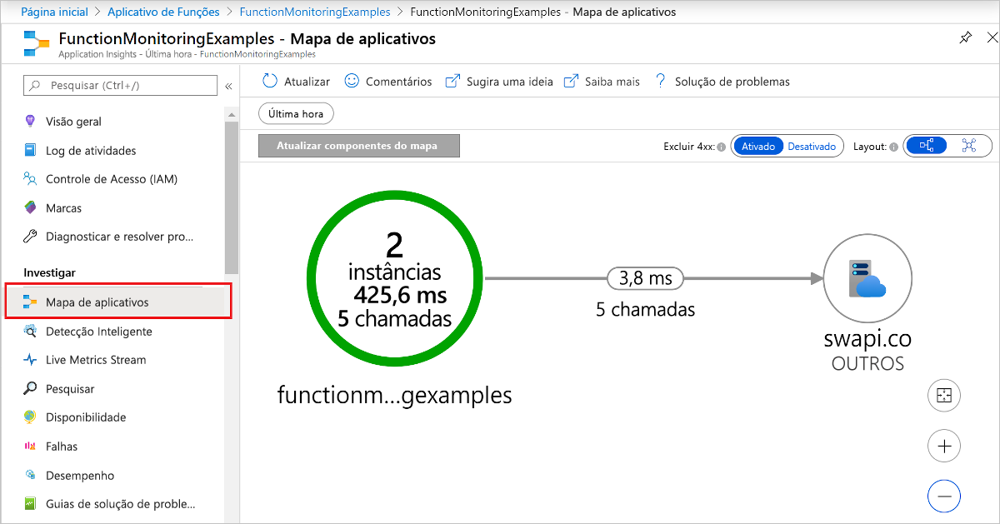

# Monitorar Azure Functions

O [Azure Functions](functions-overview.md) oferece integração interna com o [Azure Application Insights](../azure-monitor/app/app-insights-overview.md) para monitorar funções. Este artigo fornece uma visão geral dos recursos de monitoramento fornecidos pelo Azure para monitoramento Azure Functions.

Application Insights coleta dados de log, desempenho e erro. Detectando automaticamente anomalias de desempenho e apresentando poderosas ferramentas de análise, você pode diagnosticar problemas com mais facilidade e entender melhor como suas funções são usadas. Essas ferramentas foram projetadas para ajudá-lo a melhorar continuamente o desempenho e a usabilidade de suas funções. Você pode até mesmo usar Application Insights durante o desenvolvimento do projeto de aplicativo de funções local. Para obter mais informações, confira [O que é o Application Insights?](../azure-monitor/app/app-insights-overview.md).

À medida que Application Insights instrumentação é criada no Azure Functions, você precisa de uma chave de instrumentação válida para conectar seu aplicativo de funções a um recurso de Application Insights. A chave de instrumentação é adicionada às configurações do aplicativo à medida que você cria o recurso do aplicativo de funções no Azure. Se seu aplicativo de funções ainda não tiver essa chave, você poderá [defini-la manualmente](configure-monitoring.md#enable-application-insights-integration).  

## Preços e limites do Application Insights

Você pode experimentar Application Insights integração com Azure Functions gratuitamente, apresentando um limite diário para a quantidade de dados processada gratuitamente.

Se você habilitar o Application insights durante o desenvolvimento, poderá atingir esse limite durante o teste. O Azure fornece o portal e notificações por email quando está se aproximando do limite diário. Mas, se você perder esses alertas e atingir o limite, nenhum log novo aparecerá para as consultas do Application Insights. Lembre-se do limite para evitar desperdiçar tempo com solução de problemas. Para obter mais informações, consulte [Gerenciar o preço e o volume de dados no Application Insights](../azure-monitor/app/pricing.md).

> [!IMPORTANT]
> O Application Insights tem um recurso de [amostragem](../azure-monitor/app/sampling.md) que pode protegê-lo contra a produção de excesso de dados de telemetria em execuções concluídas em horários de pico de carregamento. A amostragem é habilitada por padrão. Se parecer que faltam dados, talvez seja necessário ajustar as configurações de amostragem para se adequarem ao seu cenário de monitoramento específico. Para obter mais informações, consulte [Configurar amostragem](configure-monitoring.md#configure-sampling).

A lista completa de recursos de Application Insights disponíveis para seu aplicativo de funções é detalhada em [Recursos suportados do Application Insights para o Azure Functions](../azure-monitor/app/azure-functions-supported-features.md).

## Integração do Application Insights

Normalmente, você cria uma instância de Application Insights ao criar seu aplicativo de funções. Nesse caso, a chave de instrumentação necessária para a integração já está definida como uma configuração de aplicativo chamada *APPINSIGHTS_INSTRUMENTATIONKEY*. Se, por algum motivo, seu aplicativo de funções não tiver o conjunto de chaves de instrumentação, você precisará [habilitar a integração de Application insights](configure-monitoring.md#enable-application-insights-integration).  

## Coletando dados de telemetria

Com a integração do Application Insights habilitada, os dados de telemetria são enviados para sua instância de Application Insights conectada. Esses dados incluem logs gerados pelo host do functions, rastreamentos gravados do seu código de funções e dados de desempenho. 

>[!NOTE]
>Além dos dados de suas funções e do host do functions, você também pode coletar dados do [controlador de escala de funções](#scale-controller-logs).   

### Níveis de log e categorias

Ao gravar rastreamentos do código do aplicativo, você deve atribuir um nível de log aos rastreamentos. Os níveis de log fornecem uma maneira de limitar a quantidade de dados coletados de seus rastreamentos.  

[!INCLUDE [functions-log-levels](../../includes/functions-log-levels.md)]

Para saber mais sobre os níveis de log, consulte [configurar níveis de log](configure-monitoring.md#configure-log-levels).

Ao atribuir itens registrados a uma categoria, você tem mais controle sobre a telemetria gerada de fontes específicas em seu aplicativo de funções. As categorias facilitam a execução da análise sobre os dados coletados. Os rastreamentos gravados do seu código de função são atribuídos a categorias individuais com base no nome da função. Para saber mais sobre categorias, consulte [Configurar categorias](configure-monitoring.md#configure-categories).

### Dados de telemetria personalizados

Em [C#](functions-dotnet-class-library.md#log-custom-telemetry-in-c-functions) e [JavaScript](functions-reference-node.md#log-custom-telemetry), você pode usar um SDK Application insights para gravar dados de telemetria personalizados.

### Dependências

A partir da versão 2. x das funções, o tempo de execução coleta automaticamente dados sobre dependências para associações que usam determinados SDKs de cliente. Application Insights coleta dados sobre as seguintes dependências:

+ Azure Cosmos DB 
+ Hubs de Eventos do Azure
+ Barramento de Serviço do Azure
+ Serviços de armazenamento do Azure (BLOB, fila e tabela)

Solicitações HTTP e chamadas de banco de dados usando `SqlClient` também são capturadas. Para obter a lista completa de dependências com suporte pelo Application Insights, consulte [dependências rastreadas automaticamente](../azure-monitor/app/asp-net-dependencies.md#automatically-tracked-dependencies).

Application Insights gera um _mapa de aplicativo_ dos dados de dependência coletados. Veja a seguir um exemplo de um mapa de aplicativo de uma função de gatilho HTTP com uma associação de saída de armazenamento de filas.  

As dependências são gravadas no `Information` nível. Se você filtrar em `Warning` ou acima, não verá os dados de dependência. Além disso, a coleta automática de dependências ocorre em um escopo que não é de usuário. Para capturar dados de dependência, verifique se o nível está definido como pelo menos `Information` fora do escopo do usuário ( `Function.<YOUR_FUNCTION_NAME>.User` ) em seu host.

Além da coleta automática de dados de dependência, você também pode usar um dos SDKs de Application Insights específicos do idioma para gravar informações de dependência personalizadas nos logs. Para obter um exemplo de como escrever dependências personalizadas, consulte um dos seguintes exemplos específicos de idioma:

+ [Telemetria personalizada em funções C#](functions-dotnet-class-library.md#log-custom-telemetry-in-c-functions)
+ [Telemetria personalizada em funções JavaScript](functions-reference-node.md#log-custom-telemetry) 

## Gravando em logs 

A maneira como você grava nos logs e as APIs que você usa dependem do idioma do seu projeto de aplicativo de funções.   
Consulte o guia do desenvolvedor para sua linguagem para saber mais sobre como gravar logs de suas funções.

+ [C# (biblioteca de classes .NET)](functions-dotnet-class-library.md#logging)
+ [Java](functions-reference-java.md#logger)
+ [JavaScript](functions-reference-node.md#write-trace-output-to-logs) 
+ [PowerShell](functions-reference-powershell.md#logging)
+ [Python](functions-reference-python.md#logging)

## Analisar dados

Por padrão, os dados coletados do seu aplicativo de funções são armazenados em Application Insights. Na [portal do Azure](https://portal.azure.com), Application insights fornece um amplo conjunto de visualizações de seus dados de telemetria. Você pode analisar logs de erros e consultar métricas e eventos. Para saber mais, incluindo exemplos básicos de como exibir e consultar os dados coletados, consulte [analisar Azure Functions telemetria no Application insights](analyze-telemetry-data.md). 

## Logs de streaming

Ao desenvolver um aplicativo, muitas vezes você deseja ver o que está sendo gravado nos logs quase em tempo real durante a execução no Azure.

Há duas maneiras de exibir um fluxo dos dados de log que estão sendo gerados por suas execuções de função.

* **Streaming de log interno**: a plataforma do Serviço de Aplicativo permite exibir um fluxo dos arquivos de log do aplicativo. Esse fluxo é equivalente à saída vista quando você depura suas funções durante o [desenvolvimento local](functions-develop-local.md) e quando você usa a guia **teste** no Portal. Todas as informações baseadas em log são exibidas. Para obter mais informações, consulte [Streaming de logs](../app-service/troubleshoot-diagnostic-logs.md#stream-logs). Esse método de streaming é compatível com apenas uma única instância e não pode ser usado com um aplicativo executado no Linux em um plano de Consumo.

* **Live Metrics Stream**: quando seu aplicativo de funções está [conectado ao Application insights](configure-monitoring.md#enable-application-insights-integration), você pode exibir dados de log e outras métricas quase em tempo real no portal do Azure usando [Live Metrics Stream](../azure-monitor/app/live-stream.md). Use esse método ao monitorar funções em execução em várias instâncias ou no Linux em um plano de Consumo. Esse método usa [dados amostrados](configure-monitoring.md#configure-sampling).

Os fluxos de log podem ser exibidos no portal e na maioria dos ambientes de desenvolvimento local. Para saber como habilitar fluxos de log, consulte [Habilitar logs de execução de streaming no Azure Functions](streaming-logs.md).

## Logs de diagnóstico

_Este recurso está em versão prévia._ 

Application Insights permite exportar dados de telemetria para o armazenamento de longo prazo ou outros serviços de análise.  

Como as funções também se integram com o Azure Monitor, você também pode usar as configurações de diagnóstico para enviar dados de telemetria para vários destinos, incluindo Azure Monitor logs. Para saber mais, confira [Monitoramento do Azure Functions com Logs do Azure Monitor](functions-monitor-log-analytics.md).

## Dimensionar logs do controlador

_Este recurso está em versão prévia._ 

O [controlador de escala de Azure Functions](./event-driven-scaling.md#runtime-scaling) monitora instâncias do host Azure Functions no qual seu aplicativo é executado. Esse controlador toma decisões sobre quando adicionar ou remover instâncias com base no desempenho atual. Você pode fazer com que o controlador de escala emita logs para Application Insights para entender melhor as decisões que o controlador de escala está fazendo para seu aplicativo de funções. Você também pode armazenar os logs gerados no armazenamento de BLOBs para análise por outro serviço. 

Para habilitar esse recurso, você adiciona uma configuração de aplicativo chamada `SCALE_CONTROLLER_LOGGING_ENABLED` às configurações do aplicativo de funções. Para saber como, consulte [Configurar Logs do controlador de escala](configure-monitoring.md#configure-scale-controller-logs).

## Relatar problemas

Para relatar um problema com a integração do Application Insights em Functions ou para fazer sugestões ou uma solicitação, [crie um problema no GitHub](https://github.com/Azure/Azure-Functions/issues/new).

## Próximas etapas

Para saber mais, consulte os recursos a seguir:

* [Application Insights](/azure/application-insights/)
* [Registro em log de ASP.NET Core](/aspnet/core/fundamentals/logging/)
