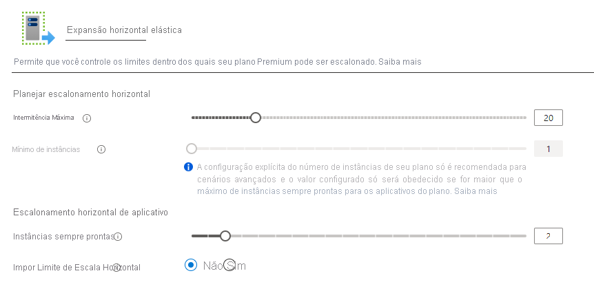

# <a name="azure-functions-premium-plan"></a>Azure Functions plano Premium

O plano Azure Functions Premium (às vezes chamado de plano Premium elástico) é uma opção de hospedagem para aplicativos de funções. Para outras opções do plano de hospedagem, consulte o [artigo plano de hospedagem](functions-scale.md).

A hospedagem do plano Premium fornece os seguintes benefícios para suas funções:

* Evitar inícios frios com instâncias passivas perpétuas
* Conectividade de rede virtual.
* Duração de execução ilimitada, com 60 minutos de garantia.
* Tamanhos de instância Premium: um núcleo, duas principais e quatro instâncias de núcleo.
* Preços mais previsíveis, em comparação com o plano de consumo.
* Alocação de aplicativo de alta densidade para planos com vários aplicativos de funções.

Quando você estiver usando o plano Premium, as instâncias do host Azure Functions serão adicionadas e removidas com base no número de eventos de entrada, assim como o [plano de consumo](consumption-plan.md). Vários aplicativos de funções podem ser implantados no mesmo plano Premium e o plano permite que você configure o tamanho da instância de computação, o tamanho do plano base e o tamanho máximo do plano. 

## <a name="billing"></a>Cobrança

A cobrança do plano Premium é baseada no número de segundos de núcleo e na memória alocada entre instâncias. Essa cobrança difere do plano de consumo, que é cobrado por execução e a memória consumida. Não há nenhum encargo de execução com o plano Premium. Pelo menos uma instância deve ser alocada em todos os momentos por plano. Essa cobrança resulta em um custo mensal mínimo por plano ativo, independentemente de se a função estiver ativa ou ociosa. Tenha em mente que todos os aplicativos de funções em um plano Premium compartilham instâncias alocadas. Para saber mais, consulte a [página de preços do Azure Functions](https://azure.microsoft.com/pricing/details/functions/).

## <a name="create-a-premium-plan"></a>Criar um plano Premium

Quando você cria um aplicativo de funções no portal do Azure, o plano de consumo é o padrão. Para criar um aplicativo de funções que é executado em um plano Premium, você deve criar explicitamente um plano do serviço de aplicativo usando uma das SKUs _Premium do elástico_ . O aplicativo de funções que você cria é hospedado neste plano. O portal do Azure facilita a criação do plano Premium e do aplicativo de funções ao mesmo tempo. Você pode executar mais de um aplicativo de funções no mesmo plano Premium, mas eles são executados no mesmo sistema operacional (Windows ou Linux). 

Os artigos a seguir mostram como criar um aplicativo de funções com um plano Premium, seja de forma programática ou na portal do Azure:

+ [Azure portal](create-premium-plan-function-app-portal.md)
+ [CLI do Azure](scripts/functions-cli-create-premium-plan.md)
+ [Modelo do Azure Resource Manager](functions-infrastructure-as-code.md#deploy-on-premium-plan)

## <a name="eliminate-cold-starts"></a>Eliminar inícios frios

Quando eventos ou execuções não ocorrem no plano de consumo, seu aplicativo pode ser dimensionado para nenhuma instância. Quando novos eventos chegam, uma nova instância com seu aplicativo em execução deve ser especializada. A especialização de novas instâncias pode levar algum tempo, dependendo do aplicativo. Essa latência adicional na primeira chamada geralmente é chamada de _inicialização a frio_ do aplicativo.

O plano Premium fornece dois recursos que trabalham juntos para eliminar efetivamente o trabalho de inicialização a frio em suas funções: _instâncias do Always Ready_ e _instâncias pré-configuradas_. 

### <a name="always-ready-instances"></a>Instâncias sempre prontas

No plano Premium, você pode ter seu aplicativo sempre pronto em um número especificado de instâncias. O número máximo de instâncias sempre prontas é 20. Quando os eventos começam a disparar o aplicativo, eles são primeiro roteados para as instâncias do Always Ready. À medida que a função se torna ativa, as instâncias adicionais serão quentes como um buffer. Esse buffer impede a inicialização a frio para novas instâncias necessárias durante a escala. Essas instâncias em buffer são chamadas de [instâncias pré-configuradas](#pre-warmed-instances). Com a combinação das instâncias Always Ready e um buffer pré-configurado, seu aplicativo pode efetivamente eliminar a inicialização a frio.

> [!NOTE]
> Todo plano Premium tem pelo menos uma instância ativa (cobrada) em todos os momentos.

# <a name="portal"></a>[Portal](#tab/portal)

Você pode configurar o número de instâncias do Always Ready no portal do Azure selecionando sua **aplicativo de funções**, acessando a guia **recursos da plataforma** e selecionando as opções de **scale out** . Na janela Editar do aplicativo de funções, as instâncias sempre prontas são específicas para esse aplicativo.



# <a name="azure-cli"></a>[CLI do Azure](#tab/azurecli)

Você também pode configurar instâncias do Always Ready para um aplicativo com o CLI do Azure.

```azurecli-interactive
az resource update -g <resource_group> -n <function_app_name>/config/web --set properties.minimumElasticInstanceCount=<desired_always_ready_count> --resource-type Microsoft.Web/sites
```
---

### <a name="pre-warmed-instances"></a>Instâncias pré-passivas

Instâncias pré-configuradas são instâncias ativadas como um buffer durante eventos de escala e ativação. As instâncias pré-configuradas continuam no buffer até que o limite máximo de expansão seja atingido. A contagem de instâncias pré-passiva padrão é 1 e, para a maioria dos cenários, esse valor deve permanecer como 1.

Quando um aplicativo tem um longo tempo de aquecimento (como uma imagem de contêiner personalizada), talvez seja necessário aumentar esse buffer. Uma instância pré-configurada torna-se ativa somente depois que todas as instâncias ativas forem usadas o suficiente.

Considere este exemplo de como as instâncias do Always Ready e as instâncias pré-configuradas funcionam juntas. Um aplicativo de funções Premium tem cinco instâncias sempre prontas configuradas e o padrão de uma instância pré-configurada. Quando o aplicativo está ocioso e nenhum evento está sendo disparado, o aplicativo é provisionado e executado com cinco instâncias. Neste momento, você não é cobrado por uma instância pré-configurada, já que as instâncias do Always Ready não são usadas e nenhuma instância pré-configurada é alocada.

Assim que o primeiro gatilho chega, as cinco instâncias sempre prontas se tornam ativas e uma instância pré-configurada é alocada. Agora, o aplicativo está em execução com seis instâncias provisionadas: as cinco instâncias do Always Ready estão ativas e o sexto buffer pré-configurado e inativo. Se a taxa de execuções continuar aumentando, as cinco instâncias ativas serão usadas eventualmente. Quando a plataforma decide Dimensionar para além de cinco instâncias, ela é dimensionada para a instância pré-configurada. Quando isso acontece, agora há seis instâncias ativas e uma sétima instância é provisionada instantaneamente e preenche o buffer pré-configurado. Essa sequência de dimensionamento e aquecimento continua até que a contagem máxima de instâncias do aplicativo seja atingida. Nenhuma instância é pré-configurada ou ativada além do máximo.

Você pode modificar o número de instâncias pré-configuradas para um aplicativo usando o CLI do Azure.

```azurecli-interactive
az resource update -g <resource_group> -n <function_app_name>/config/web --set properties.preWarmedInstanceCount=<desired_prewarmed_count> --resource-type Microsoft.Web/sites
```

### <a name="maximum-function-app-instances"></a>Máximo de instâncias do aplicativo de funções

Além da [contagem máxima de instâncias do plano](#plan-and-sku-settings), você pode configurar um máximo por aplicativo. O máximo do aplicativo pode ser configurado usando o [limite de escala do aplicativo](./event-driven-scaling.md#limit-scale-out).

## <a name="private-network-connectivity"></a>Conectividade de rede privada

Os aplicativos de funções implantados em um plano Premium podem aproveitar a [integração VNet para aplicativos Web](../app-service/web-sites-integrate-with-vnet.md). Quando configurado, seu aplicativo pode se comunicar com recursos em sua VNet ou protegidos por meio de pontos de extremidade de serviço. As restrições de IP também estão disponíveis no aplicativo para restringir o tráfego de entrada.

Ao atribuir uma sub-rede ao seu aplicativo de funções em um plano Premium, você precisa de uma sub-rede com endereços IP suficientes para cada instância em potencial. Exigimos um bloco de IP com pelo menos 100 endereços disponíveis.

Para obter mais informações, consulte [integrar seu aplicativo de funções a uma VNet](functions-create-vnet.md).

## <a name="rapid-elastic-scale"></a>Escala elástica rápida

Instâncias de computação adicionais são adicionadas automaticamente para seu aplicativo usando a mesma lógica de dimensionamento rápido que o plano de consumo. Os aplicativos no mesmo plano do serviço de aplicativo são dimensionados independentemente um do outro com base nas necessidades de um aplicativo individual. No entanto, os aplicativos do Functions no mesmo plano do serviço de aplicativo compartilham recursos da VM para ajudar a reduzir os custos, quando possível. O número de aplicativos associados a uma VM depende da superfície de cada aplicativo e do tamanho da VM.

Para saber mais sobre como o dimensionamento funciona, consulte [dimensionamento controlado por eventos em Azure Functions](event-driven-scaling.md).

## <a name="longer-run-duration"></a>Duração de execução mais longa

Azure Functions em um plano de consumo são limitados a 10 minutos para uma única execução. No plano Premium, o padrão de duração da execução é de 30 minutos para evitar execuções de fuga. No entanto, você pode [Modificar o host.jsna configuração](./functions-host-json.md#functiontimeout) para tornar a duração desassociada para aplicativos de plano Premium. Quando definido como uma duração não vinculada, é garantido que seu aplicativo de funções seja executado por pelo menos 60 minutos. 

## <a name="plan-and-sku-settings"></a>Configurações de plano e SKU

Quando você cria o plano, há duas configurações de tamanho de plano: o número mínimo de instâncias (ou o tamanho do plano) e o limite máximo de intermitência.

Se seu aplicativo exigir instâncias além das instâncias sempre prontas, ele poderá continuar a escalar horizontalmente até que o número de instâncias atinja o limite máximo de intermitência. Você será cobrado por instâncias além do tamanho do plano somente enquanto eles estiverem em execução e alocados a você, por segundo. A plataforma torna o melhor esforço em dimensionar seu aplicativo para o limite máximo definido.

Você pode configurar o tamanho do plano e os máximos no portal do Azure selecionando as opções de **scale out** no plano ou um aplicativo de funções implantado nesse plano (em **recursos da plataforma**).

Você também pode aumentar o limite máximo de intermitência do CLI do Azure:

```azurecli-interactive
az functionapp plan update -g <resource_group> -n <premium_plan_name> --max-burst <desired_max_burst>
```

O mínimo para cada plano será pelo menos uma instância. O número mínimo real de instâncias será configurado para você com base nas instâncias do Always Ready solicitadas por aplicativos no plano. Por exemplo, se o aplicativo A solicitar cinco instâncias sempre prontas e o aplicativo B solicitar duas instâncias do Always Ready no mesmo plano, o tamanho mínimo do plano será calculado como cinco. O aplicativo A será executado em todos os 5, e o aplicativo B só será executado em 2.

> [!IMPORTANT]
> Você é cobrado por cada instância alocada na contagem mínima de instâncias, independentemente de as funções serem executadas ou não.

Na maioria das circunstâncias, esse mínimo calculado é suficiente. No entanto, o dimensionamento além do mínimo ocorre com um melhor esforço. É possível, embora improvável, que, em uma escala horizontal de tempo horizontal, possa ser atrasada se instâncias adicionais não estiverem disponíveis. Ao definir um mínimo maior que o mínimo autocalculado, você reserva instâncias com antecedência da escala horizontal.

O aumento do mínimo calculado para um plano pode ser feito usando o CLI do Azure.

```azurecli-interactive
az functionapp plan update -g <resource_group> -n <premium_plan_name> --min-instances <desired_min_instances>
```

### <a name="available-instance-skus"></a>SKUs da instância disponível

Ao criar ou dimensionar seu plano, você pode escolher entre três tamanhos de instância. Você será cobrado pelo número total de núcleos e memória provisionados, por segundo, que cada instância é alocada para você. Seu aplicativo pode ser dimensionado automaticamente para várias instâncias, conforme necessário.

|SKU|Núcleos|Memória|Armazenamento|
|--|--|--|--|
|EP1|1|3,5 GB|250GB|
|EP2|2|7 GB|250GB|
|EP3|4|14 GB|250GB|

### <a name="memory-usage-considerations"></a>Considerações sobre o uso de memória

A execução em um computador com mais memória nem sempre significa que seu aplicativo de funções usa toda a memória disponível.

Por exemplo, um aplicativo de funções JavaScript é restrito pelo limite de memória padrão em Node.js. Para aumentar esse limite de memória fixa, adicione a configuração `languageWorkers:node:arguments` do aplicativo com um valor de `--max-old-space-size=<max memory in MB>` .

E para planos com mais de 4 GB de memória, verifique se a configuração de plataforma de bits está definida `64 Bit` em [configurações gerais](/azure/app-service/configure-common#configure-general-settings).

## <a name="region-max-scale-out"></a>Scale Out máxima da região

Abaixo estão os valores máximos de expansão com suporte no momento para um único plano em cada região e configuração de so. Para solicitar um aumento, você pode abrir um tíquete de suporte.

Consulte a disponibilidade regional completa de funções no [site do Azure](https://azure.microsoft.com/global-infrastructure/services/?products=functions).

|Região| Windows | Linux |
|--| -- | -- |
|Austrália Central| 100 | Não disponível |
|Austrália Central 2| 100 | Não disponível |
|Leste da Austrália| 100 | 20 |
|Australia Southeast | 100 | 20 |
|Brazil South| 100 | 20 |
|Canadá Central| 100 | 20 |
|Centro dos EUA| 100 | 20 |
|Leste da China 2| 100 | 20 |
|Norte da China 2| 100 | 20 |
|Leste da Ásia| 100 | 20 |
|Leste dos EUA | 100 | 20 |
|Leste dos EUA 2| 100 | 20 |
|França Central| 100 | 20 |
|Centro-Oeste da Alemanha| 100 | Não disponível |
|Japan East| 100 | 20 |
|Oeste do Japão| 100 | 20 |
|Coreia Central| 100 | 20 |
|Sul da Coreia| Não disponível | 20 |
|Centro-Norte dos EUA| 100 | 20 |
|Norte da Europa| 100 | 20 |
|Leste da Noruega| 100 | 20 |
|Centro-Sul dos Estados Unidos| 100 | 20 |
|Sul da Índia | 100 | Não disponível |
|Sudeste Asiático| 100 | 20 |
|Norte da Suíça| 100 | Não disponível |
|Oeste da Suíça| 100 | Não disponível |
|Sul do Reino Unido| 100 | 20 |
|Oeste do Reino Unido| 100 | 20 |
|Gov. EUA – Arizona| 100 | 20 |
|Gov. EUA – Virgínia| 100 | 20 |
|Leste USNat| 100 | Não disponível |
|Oeste do USNat| 100 | Não disponível |
|Europa Ocidental| 100 | 20 |
|Oeste da Índia| 100 | 20 |
|Centro-Oeste dos EUA| 100 | 20 |
|Oeste dos EUA| 100 | 20 |
|Oeste dos EUA 2| 100 | 20 |

## <a name="next-steps"></a>Próximas etapas

> [!div class="nextstepaction"]
> [Entender Azure Functions opções de hospedagem](functions-scale.md)
