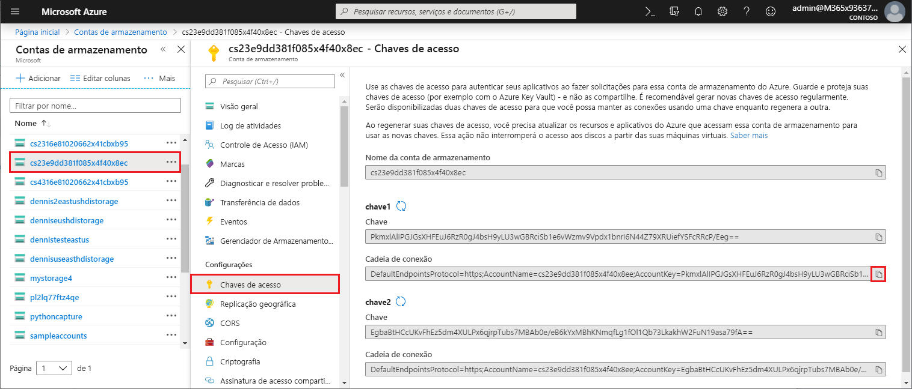
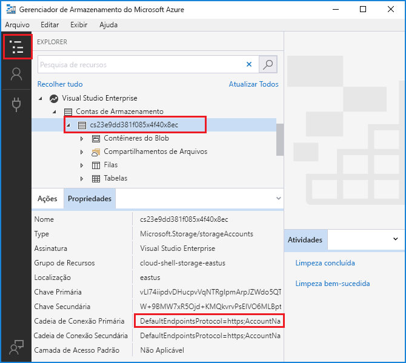

# <a name="work-with-azure-functions-core-tools"></a>Trabalhar com Azure Functions Core Tools

Azure Functions Core Tools permite desenvolver e testar suas funções no computador local no prompt de comando ou terminal. Suas funções locais podem se conectar aos serviços do Azure ao vivo e você pode depurar suas funções em seu computador local usando o tempo de execução de funções completas. Você pode até mesmo implantar um aplicativo de funções em sua assinatura do Azure.

[!INCLUDE [Don't mix development environments](../../includes/functions-mixed-dev-environments.md)]

Desenvolver funções em seu computador local e publicá-las no Azure usando ferramentas básicas segue estas etapas básicas:

> [!div class="checklist"]
> * [Instale as principais ferramentas e dependências.](#v2)
> * [Crie um projeto de aplicativo de funções de um modelo específico de idioma.](#create-a-local-functions-project)
> * [Registrar extensões de gatilho e de associação.](#register-extensions)
> * [Defina o armazenamento e outras conexões.](#local-settings-file)
> * [Crie uma função de um gatilho e de um modelo específico ao idioma.](#create-func)
> * [Executar a função localmente](#start)
> * [Publicar o projeto no Azure](#publish)

## <a name="core-tools-versions"></a>Versões de ferramentas principais

Há duas versões do Azure Functions Core Tools. A versão usada depende do seu ambiente de desenvolvimento local, [da escolha do idioma](supported-languages.md)e do nível de suporte necessário:

+ Versão 1. x: dá suporte à versão 1. x do tempo de execução. Esta versão das ferramentas só tem suporte em computadores Windows e é instalada a partir de um [pacote NPM](https://docs.npmjs.com/getting-started/what-is-npm). Com essa versão, você pode criar funções em linguagens experimentais que não são oficialmente suportadas. Para obter mais informações, consulte [idiomas com suporte no Azure Functions](supported-languages.md)

+ [Versão 2. x](#v2): dá suporte à [versão 2. x do tempo de execução](functions-versions.md). Esta versão dá suporte para [Windows](#windows-npm), [MacOS](#brew)e [Linux](#linux). Usa gerenciadores de pacotes específicos da plataforma ou NPM para instalação.

Salvo indicação em contrário, os exemplos neste artigo são para a versão 2. x.

## <a name="install-the-azure-functions-core-tools"></a>Instalar o Azure Functions Core Tools

[Azure Functions Core Tools] inclui uma versão do mesmo tempo de execução que alimenta Azure Functions tempo de execução que você pode executar em seu computador de desenvolvimento local. Ele também fornece comandos para criar funções, conectar-se ao Azure e implantar projetos de funções.

### <a name="v2"></a>Versão 2. x

A versão 2. x das ferramentas usa o Azure Functions Runtime 2. x criado no .NET Core. Esta versão tem suporte em todas as plataformas que o .NET Core 2. x dá suporte, incluindo [Windows](#windows-npm), [MacOS](#brew)e [Linux](#linux). 

> [!IMPORTANT]
> Você pode ignorar o requisito de instalação do SDK do .NET Core 2. x usando [extensão].

#### <a name="windows-npm"></a>Windows

As etapas a seguir usam o NPM para instalar as ferramentas principais no Windows. Você também pode usar [Chocolatey](https://chocolatey.org/). Para obter mais informações, consulte o [Leiame das ferramentas principais](https://github.com/Azure/azure-functions-core-tools/blob/master/README.md#windows).

1. Instale o [Node.js], que inclui NPM. Para a versão 2. x das ferramentas, somente o Node. js 8,5 e versões posteriores têm suporte.

1. Instale o pacote de ferramentas principais:

    ```bash
    npm install -g azure-functions-core-tools
    ```

   Pode levar alguns minutos para que o NPM Baixe e instale o pacote de ferramentas principais.

1. Se você não planeja usar pacotes de [extensão], instale o SDK do [.NET Core 2. x para Windows](https://www.microsoft.com/net/download/windows).

#### <a name="brew"></a>MacOS com homebrew

As etapas a seguir usam o homebrew para instalar as ferramentas principais no macOS.

1. Instale o [homebrew](https://brew.sh/), se ele ainda não estiver instalado.

1. Instale o pacote de ferramentas principais:

    ```bash
    brew tap azure/functions
    brew install azure-functions-core-tools
    ```

1. Se você não planeja usar pacotes de [extensão], instale o [SDK do .NET Core 2. x para MacOS](https://www.microsoft.com/net/download/macos).


#### <a name="linux"></a>Linux (Ubuntu/Debian) com APT

As etapas a seguir usam a [apt](https://wiki.debian.org/Apt) para instalar as ferramentas principais em sua distribuição do Linux Ubuntu/Debian. Para outras distribuições do Linux, consulte o [Leiame das ferramentas principais](https://github.com/Azure/azure-functions-core-tools/blob/master/README.md#linux).

1. Instale a chave GPG do repositório de pacotes da Microsoft para validar a integridade do pacote:

    ```bash
    curl https://packages.microsoft.com/keys/microsoft.asc | gpg --dearmor > microsoft.gpg
    sudo mv microsoft.gpg /etc/apt/trusted.gpg.d/microsoft.gpg
    ```

1. Configure a lista de origem de desenvolvimento do .NET antes de fazer uma atualização de APT.

   Para configurar a lista de origem APT para o Ubuntu, execute este comando:

    ```bash
    sudo sh -c 'echo "deb [arch=amd64] https://packages.microsoft.com/repos/microsoft-ubuntu-$(lsb_release -cs)-prod $(lsb_release -cs) main" > /etc/apt/sources.list.d/dotnetdev.list'
    ```

   Para configurar a lista de origem APT para Debian, execute este comando:

    ```bash
    sudo sh -c 'echo "deb [arch=amd64] https://packages.microsoft.com/debian/$(lsb_release -rs)/prod $(lsb_release -cs) main" > /etc/apt/sources.list.d/dotnetdev.list'
    ```

1. Verifique o arquivo de `/etc/apt/sources.list.d/dotnetdev.list` para uma das cadeias de caracteres de versão do Linux apropriadas listadas abaixo:

    | Distribuição do Linux | Versão |
    | --------------- | ----------- |
    | Debian 10 | `buster` |
    | Debian 9 | `stretch` |
    | Debian 8 | `jessie` |
    | Ubuntu 18,10    | `cosmic`    |
    | Ubuntu 18, 4    | `bionic`    |
    | Ubuntu 17, 4    | `zesty`     |
    | Ubuntu 16.04/Linux menta 18    | `xenial`  |

1. Inicie a atualização da fonte APT:

    ```bash
    sudo apt-get update
    ```

1. Instale o pacote de ferramentas principais:

    ```bash
    sudo apt-get install azure-functions-core-tools
    ```

1. Se você não planeja usar pacotes de [extensão], instale o [SDK do .NET Core 2. x para Linux](https://www.microsoft.com/net/download/linux).

## <a name="create-a-local-functions-project"></a>Criar um projeto de funções locais

Um diretório de projeto do Functions contém os arquivos [host. JSON](functions-host-json.md) e [local. Settings. JSON](#local-settings-file), juntamente com as subpastas que contêm o código para funções individuais. Esse diretório é o equivalente a um aplicativo de funções no Azure. Para saber mais sobre a estrutura de pastas do functions, consulte o [Guia do Azure Functions Developers](functions-reference.md#folder-structure).

A versão 2. x exige que você selecione um idioma padrão para seu projeto quando ele é inicializado e todas as funções adicionadas usam modelos de idioma padrão. Na versão 1. x, você especifica o idioma cada vez que cria uma função.

Na janela do terminal ou em um prompt de comando, execute o seguinte comando para criar o projeto e o repositório git local:

```bash
func init MyFunctionProj
```

Quando você fornece um nome de projeto, uma nova pasta com esse nome é criada e inicializada. Caso contrário, a pasta atual será inicializada.  
Na versão 2. x, quando você executa o comando, deve escolher um tempo de execução para seu projeto. 

```output
Select a worker runtime:
dotnet
node
python (preview)
powershell (preview)
```

Use as teclas de seta para cima/para baixo para escolher um idioma e pressione Enter. Se você planeja desenvolver funções JavaScript ou TypeScript, escolha **nó**e, em seguida, selecione o idioma. O TypeScript tem [alguns requisitos adicionais](functions-reference-node.md#typescript). 

A saída é semelhante ao exemplo a seguir para um projeto JavaScript:

```output
Select a worker runtime: node
Writing .gitignore
Writing host.json
Writing local.settings.json
Writing C:\myfunctions\myMyFunctionProj\.vscode\extensions.json
Initialized empty Git repository in C:/myfunctions/myMyFunctionProj/.git/
```

o `func init` dá suporte às seguintes opções, que são apenas a versão 2. x, salvo indicação em contrário:

| Opção     | Descrição                            |
| ------------ | -------------------------------------- |
| **`--csx`** | Inicializa um C# projeto de script (. CSX). Você deve especificar `--csx` em comandos subsequentes. |
| **`--docker`** | Crie um Dockerfile para um contêiner usando uma imagem base com base no `--worker-runtime` escolhido. Use esta opção quando você planeja publicar em um contêiner personalizado do Linux. |
| **`--force`** | Inicializar o projeto mesmo quando houver arquivos existentes no projeto. Essa configuração substitui os arquivos existentes com o mesmo nome. Outros arquivos na pasta do projeto não são afetados. |
| **`--no-source-control -n`** | Impede a criação padrão de um repositório git na versão 1. x. Na versão 2. x, o repositório git não é criado por padrão. |
| **`--source-control`** | Controla se um repositório Git é criado. Por padrão, um repositório não é criado. Quando `true`, um repositório é criado. |
| **`--worker-runtime`** | Define o tempo de execução de linguagem para o projeto. Os valores com suporte são `dotnet`, `node` (JavaScript), `java` e `python`. Quando não estiver definido, você será solicitado a escolher o tempo de execução durante a inicialização. |

> [!IMPORTANT]
> Por padrão, a versão 2. x das ferramentas principais cria projetos de aplicativo de funções para o tempo de execução do .net como [ C# projetos de classe](functions-dotnet-class-library.md) (. csproj). Esses C# projetos, que podem ser usados com o Visual Studio ou o Visual Studio Code, são compilados durante o teste e ao publicar no Azure. Se, em vez disso, você quiser criar e trabalhar C# com os mesmos arquivos de script (. CSX) criados na versão 1. x e no portal, deverá incluir o parâmetro `--csx` ao criar e implantar funções.

[!INCLUDE [functions-core-tools-install-extension](../../includes/functions-core-tools-install-extension.md)]

[!INCLUDE [functions-local-settings-file](../../includes/functions-local-settings-file.md)]

Por padrão, essas configurações não são migradas automaticamente quando o projeto é publicado no Azure. Use a opção `--publish-local-settings` [ao publicar](#publish) para garantir que essas configurações sejam adicionadas ao aplicativo de funções no Azure. Observe que os valores em **connectionStrings** nunca são publicados.

Os valores das configurações do aplicativo de funções também podem ser lidos em seu código como variáveis de ambiente. Para obter mais informações, consulte a seção variáveis de ambiente nestes tópicos de referência específicos a um idioma:

* [C#pré-compilado](functions-dotnet-class-library.md#environment-variables)
* [C#script (. CSX)](functions-reference-csharp.md#environment-variables)
* [Java](functions-reference-java.md#environment-variables)
* [JavaScript](functions-reference-node.md#environment-variables)

Quando nenhuma cadeia de conexão de armazenamento válida é definida para [`AzureWebJobsStorage`] e o emulador não está sendo usado, a seguinte mensagem de erro é mostrada:

> Valor ausente para AzureWebJobsStorage em local. Settings. JSON. Isso é necessário para todos os gatilhos diferentes de HTTP. Você pode executar ' Func Azure functionapp FETCH-app-Settings \<functionAppName \> ' ou especificar uma cadeia de conexão em local. Settings. JSON.

### <a name="get-your-storage-connection-strings"></a>Obter suas cadeias de conexão de armazenamento

Mesmo ao usar o emulador de armazenamento para desenvolvimento, talvez você queira testar com uma conexão de armazenamento real. Supondo que você já tenha [criado uma conta de armazenamento](../storage/common/storage-create-storage-account.md), você pode obter uma cadeia de conexão de armazenamento válida de uma das seguintes maneiras:

+ No [portal do Azure]. Navegue até sua conta de armazenamento, selecione **chaves de acesso** em **configurações**e, em seguida, copie um dos valores da cadeia de **conexão** .

  

+ Use [Gerenciador de armazenamento do Azure](https://storageexplorer.com/) para se conectar à sua conta do Azure. No **Gerenciador**, expanda sua assinatura, selecione sua conta de armazenamento e copie a cadeia de conexão primária ou secundária.

  

+ Use as ferramentas principais para baixar a cadeia de conexão do Azure com um dos seguintes comandos:

  + Baixar todas as configurações de um aplicativo de funções existente:

    ```bash
    func azure functionapp fetch-app-settings <FunctionAppName>
    ```
  + Obter a cadeia de conexão para uma conta de armazenamento específica:

    ```bash
    func azure storage fetch-connection-string <StorageAccountName>
    ```

    Quando você ainda não tiver entrado no Azure, será solicitado a fazê-lo.

## <a name="create-func"></a>Criar uma função

Para criar uma função, execute o seguinte comando:

```bash
func new
```

Na versão 2. x, ao executar `func new` será solicitado que você escolha um modelo no idioma padrão do seu aplicativo de funções e, em seguida, você também será solicitado a escolher um nome para a função. Na versão 1. x, você também será solicitado a escolher o idioma.

```output
Select a language: Select a template:
Blob trigger
Cosmos DB trigger
Event Grid trigger
HTTP trigger
Queue trigger
SendGrid
Service Bus Queue trigger
Service Bus Topic trigger
Timer trigger
```

O código de função é gerado em uma subpasta com o nome de função fornecido, como você pode ver na saída do gatilho de fila a seguir:

```output
Select a language: Select a template: Queue trigger
Function name: [QueueTriggerJS] MyQueueTrigger
Writing C:\myfunctions\myMyFunctionProj\MyQueueTrigger\index.js
Writing C:\myfunctions\myMyFunctionProj\MyQueueTrigger\readme.md
Writing C:\myfunctions\myMyFunctionProj\MyQueueTrigger\sample.dat
Writing C:\myfunctions\myMyFunctionProj\MyQueueTrigger\function.json
```

Você também pode especificar essas opções no comando usando os seguintes argumentos:

| Argumento     | Descrição                            |
| ------------------------------------------ | -------------------------------------- |
| **`--csx`** | (Versão 2. x) Gera os mesmos C# modelos de script (. CSX) usados na versão 1. x e no Portal. |
| **`--language -l`**| A linguagem de programação de modelo, C#como F#, ou JavaScript. Essa opção é necessária na versão 1. x. Na versão 2. x, não use essa opção ou escolha um idioma que corresponda ao tempo de execução do trabalho. |
| **`--name -n`** | O nome da função. |
| **`--template -t`** | Use o comando `func templates list` para ver a lista completa de modelos disponíveis para cada idioma com suporte.   |

Por exemplo, para criar um gatilho JavaScript HTTP em um único comando, execute:

```bash
func new --template "Http Trigger" --name MyHttpTrigger
```

Para criar uma função disparada por fila em um único comando, execute:

```bash
func new --template "Queue Trigger" --name QueueTriggerJS
```

## <a name="start"></a>Executar funções localmente

Para executar um projeto do functions, execute o host do functions. O host habilita gatilhos para todas as funções no projeto. 

### <a name="version-2x"></a>Versão 2. x

Na versão 2. x do tempo de execução, o comando Start varia, dependendo da linguagem do seu projeto.

#### <a name="c"></a>@No__t_0 de C

```command
func start --build
```

#### <a name="javascript"></a>JavaScript

```command
func start
```

#### <a name="typescript"></a>TypeScript

```command
npm install
npm start     
```

### <a name="version-1x"></a>Versão 1. x

A versão 1. x do tempo de execução do Functions requer o comando `host`, como no exemplo a seguir:

```command
func host start
```

o `func start` dá suporte às seguintes opções:

| Opção     | Descrição                            |
| ------------ | -------------------------------------- |
| **`--no-build`** | Não compilar projeto atual antes de executar. Somente para projetos dotnet. O padrão é definido como false. Somente a versão 2. x. |
| **`--cert`** | O caminho para um arquivo. pfx que contém uma chave privada. Usado somente com `--useHttps`. Somente a versão 2. x. |
| **`--cors-credentials`** | Permitir solicitações autenticadas entre origens (ou seja, cookies e o cabeçalho de autenticação) versão 2. x somente. |
| **`--cors`** | Uma lista separada por vírgulas de origens CORS, sem espaços. |
| **`--language-worker`** | Argumentos para configurar o operador de idioma. Somente a versão 2. x. |
| **`--nodeDebugPort -n`** | A porta para o depurador de nó usar. Padrão: um valor de Launch. JSON ou 5858. Somente versão 1. x. |
| **`--password`** | A senha ou um arquivo que contém a senha para um arquivo. pfx. Usado somente com `--cert`. Somente a versão 2. x. |
| **`--port -p`** | A porta local a ser escutada. Valor padrão: 7071. |
| **`--pause-on-error`** | Pause para obter informações adicionais antes de sair do processo. Usado somente ao iniciar as ferramentas básicas de um ambiente de desenvolvimento integrado (IDE).|
| **`--script-root --prefix`** | Usado para especificar o caminho para a raiz do aplicativo de funções que deve ser executado ou implantado. Isso é usado para projetos compilados que geram arquivos de projeto em uma subpasta. Por exemplo, quando você cria um C# projeto de biblioteca de classes, os arquivos host. JSON, local. Settings. JSON e function. JSON são gerados em uma subpasta *raiz* com um caminho como `MyProject/bin/Debug/netstandard2.0`. Nesse caso, defina o prefixo como `--script-root MyProject/bin/Debug/netstandard2.0`. Esta é a raiz do aplicativo de funções durante a execução no Azure. |
| **`--timeout -t`** | O tempo limite para o host do Functions iniciar, em segundos. Padrão: 20 segundos.|
| **`--useHttps`** | Associar a `https://localhost:{port}` em vez de `http://localhost:{port}`. Por padrão, essa opção cria um certificado confiável em seu computador.|

Quando o host do Functions é iniciado, ele gera a URL das funções disparadas por HTTP:

```output
Found the following functions:
Host.Functions.MyHttpTrigger

Job host started
Http Function MyHttpTrigger: http://localhost:7071/api/MyHttpTrigger
```

>[!IMPORTANT]
>Ao executar localmente, a autenticação não é imposta para pontos de extremidade HTTP. Isso significa que todas as solicitações HTTP locais são tratadas como `authLevel = "anonymous"`. Para obter mais informações, consulte o [artigo Associação http](functions-bindings-http-webhook.md#authorization-keys).

### <a name="passing-test-data-to-a-function"></a>Passando dados de teste para uma função

Para testar suas funções localmente, você [inicia o host do Functions](#start) e chama os pontos de extremidade no servidor local usando solicitações HTTP. O ponto de extremidade chamado depende do tipo de função.

>[!NOTE]
> Os exemplos neste tópico usam a ferramenta de rotação para enviar solicitações HTTP do terminal ou de um prompt de comando. Você pode usar uma ferramenta de sua escolha para enviar solicitações HTTP para o servidor local. A ferramenta de rotação está disponível por padrão em sistemas baseados em Linux e no Windows 10 Build 17063 e posterior. No Windows mais antigo, você deve primeiro baixar e instalar a [ferramenta de rotação](https://curl.haxx.se/).

Para obter mais informações gerais sobre as funções de teste, consulte [estratégias para testar seu código no Azure Functions](functions-test-a-function.md).

#### <a name="http-and-webhook-triggered-functions"></a>Funções disparadas por HTTP e webhook

Você chama o ponto de extremidade a seguir para executar localmente as funções disparadas por HTTP e webhook:

    http://localhost:{port}/api/{function_name}

Certifique-se de usar o mesmo nome de servidor e porta em que o host do Functions está escutando. Você verá isso na saída gerada ao iniciar o host de função. Você pode chamar essa URL usando qualquer método HTTP com suporte no gatilho.

O comando de rotação a seguir dispara a função de início rápido `MyHttpTrigger` de uma solicitação GET com o parâmetro _Name_ passado na cadeia de caracteres de consulta.

```bash
curl --get http://localhost:7071/api/MyHttpTrigger?name=Azure%20Rocks
```

O exemplo a seguir é a mesma função chamada de uma solicitação POST passando _nome_ no corpo da solicitação:

```bash
curl --request POST http://localhost:7071/api/MyHttpTrigger --data '{"name":"Azure Rocks"}'
```

Você pode fazer solicitações GET de um navegador passando dados na cadeia de caracteres de consulta. Para todos os outros métodos HTTP, você deve usar ondulação, Fiddler, postmaster ou uma ferramenta de teste HTTP semelhante.

#### <a name="non-http-triggered-functions"></a>Funções disparadas não HTTP

Para todos os tipos de funções diferentes de gatilhos HTTP e WebHooks, você pode testar suas funções localmente chamando um ponto de extremidade de administração. Chamar esse ponto de extremidade com uma solicitação HTTP POST no servidor local dispara a função. Opcionalmente, você pode passar dados de teste para a execução no corpo da solicitação POST. Essa funcionalidade é semelhante à guia **teste** na portal do Azure.

Você chama o seguinte ponto de extremidade de administrador para disparar funções não HTTP:

    http://localhost:{port}/admin/functions/{function_name}

Para passar dados de teste para o ponto de extremidade de administrador de uma função, você deve fornecer os dados no corpo de uma mensagem de solicitação POST. O corpo da mensagem deve ter o seguinte formato JSON:

```JSON
{
    "input": "<trigger_input>"
}
```

O valor de `<trigger_input>` contém dados em um formato esperado pela função. O exemplo de ondulação a seguir é uma POSTAgem em uma função `QueueTriggerJS`. Nesse caso, a entrada é uma cadeia de caracteres equivalente à mensagem esperada para ser encontrada na fila.

```bash
curl --request POST -H "Content-Type:application/json" --data '{"input":"sample queue data"}' http://localhost:7071/admin/functions/QueueTriggerJS
```

#### <a name="using-the-func-run-command-in-version-1x"></a>Usando o comando `func run` na versão 1. x

>[!IMPORTANT]
> Não há suporte para o comando `func run` na versão 2. x das ferramentas. Para obter mais informações, consulte o tópico [como direcionar Azure Functions versões de tempo de execução](set-runtime-version.md).

Você também pode invocar uma função diretamente usando `func run <FunctionName>` e fornecer dados de entrada para a função. Esse comando é semelhante à execução de uma função usando a guia **testar** na portal do Azure.

o `func run` dá suporte às seguintes opções:

| Opção     | Descrição                            |
| ------------ | -------------------------------------- |
| **`--content -c`** | Conteúdo embutido. |
| **`--debug -d`** | Anexe um depurador ao processo do host antes de executar a função.|
| **`--timeout -t`** | Tempo de espera (em segundos) até que o host do Functions local esteja pronto.|
| **`--file -f`** | O nome do arquivo a ser usado como conteúdo.|
| **`--no-interactive`** | Não solicita a entrada. Útil para cenários de automação.|

Por exemplo, para chamar uma função disparada por HTTP e passar o corpo do conteúdo, execute o seguinte comando:

```bash
func run MyHttpTrigger -c '{\"name\": \"Azure\"}'
```

## <a name="publish"></a>Publicar no Azure

O Azure Functions Core Tools dá suporte a dois tipos de implantação: Implantando arquivos de projeto de função diretamente em seu aplicativo de funções por meio da [implantação de zip](functions-deployment-technologies.md#zip-deploy) e [implantando um contêiner do Docker personalizado](functions-deployment-technologies.md#docker-container). Você já deve ter [criado um aplicativo de funções em sua assinatura do Azure](functions-cli-samples.md#create), no qual você implantará seu código. Projetos que exigem compilação devem ser criados para que os binários possam ser implantados.

Uma pasta de projeto pode conter arquivos e diretórios específicos do idioma que não devem ser publicados. Itens excluídos são listados em um arquivo. funcignore na pasta raiz do projeto.     

### <a name="project-file-deployment"></a>Implantação (arquivos de projeto)

Para publicar seu código local em um aplicativo de funções no Azure, use o comando `publish`:

```bash
func azure functionapp publish <FunctionAppName>
```

Esse comando é publicado em um aplicativo de funções existente no Azure. Você receberá um erro se tentar publicar em um `<FunctionAppName>` que não existe em sua assinatura. Para saber como criar um aplicativo de funções no prompt de comando ou na janela do terminal usando o CLI do Azure, consulte [criar um aplicativo de funções para execução sem servidor](./scripts/functions-cli-create-serverless.md). Por padrão, esse comando usa a [compilação remota](functions-deployment-technologies.md#remote-build) e implanta seu aplicativo para ser [executado a partir do pacote de implantação](run-functions-from-deployment-package.md). Para desabilitar esse modo de implantação recomendado, use a opção `--nozip`.

>[!IMPORTANT]
> Quando você cria um aplicativo de funções no portal do Azure, ele usa a versão 2. x do tempo de execução da função por padrão. Para fazer com que o aplicativo de funções use a versão 1. x do tempo de execução, siga as instruções em [executar na versão 1. x](functions-versions.md#creating-1x-apps).
> Não é possível alterar a versão de tempo de execução de um aplicativo de funções que tem as função existentes.

As opções de publicação a seguir se aplicam a ambas as versões, 1. x e 2. x:

| Opção     | Descrição                            |
| ------------ | -------------------------------------- |
| **`--publish-local-settings -i`** |  Publique as configurações em local. Settings. JSON no Azure, solicitando a substituição se a configuração já existir. Se você estiver usando o emulador de armazenamento, primeiro altere a configuração do aplicativo para uma [conexão de armazenamento real](#get-your-storage-connection-strings). |
| **`--overwrite-settings -y`** | Suprimir o prompt para substituir as configurações do aplicativo quando `--publish-local-settings -i` for usado.|

As seguintes opções de publicação têm suporte apenas na versão 2. x:

| Opção     | Descrição                            |
| ------------ | -------------------------------------- |
| **`--publish-settings-only -o`** |  Somente publique as configurações e ignore o conteúdo. O padrão é prompt. |
|**`--list-ignored-files`** | Exibe uma lista de arquivos que são ignorados durante a publicação, que se baseia no arquivo. funcignore. |
| **`--list-included-files`** | Exibe uma lista de arquivos que são publicados, que se baseiam no arquivo. funcignore. |
| **`--nozip`** | Desativa o modo de `Run-From-Package` padrão. |
| **`--build-native-deps`** | Ignora a geração da pasta. Wheels ao publicar aplicativos de funções do Python. |
| **`--build [-b]`** | Executa a ação de compilação ao implantar em um aplicativo de funções do Linux. (aceita: remoto, local) |
| **`--additional-packages`** | Lista de pacotes a serem instalados ao criar dependências nativas. Por exemplo: `python3-dev libevent-dev`. |
| **`--force`** | Ignorar a verificação de pré-inicialização em determinados cenários. |
| **`--csx`** | Publicar um C# projeto de script (. CSX). |
| **`--no-build`** | Ignorar a criação de funções dotnet. |
| **`--dotnet-cli-params`** | Ao publicar funções C# compiladas (. csproj), as ferramentas principais chamam ' dotnet Build--bin de saída/publish '. Todos os parâmetros passados para isso serão anexados à linha de comando. |

### <a name="deployment-custom-container"></a>Implantação (contêiner personalizado)

Azure Functions permite que você implante seu projeto de função em um [contêiner do Docker personalizado](functions-deployment-technologies.md#docker-container). Para obter mais informações, consulte [criar uma função no Linux usando uma imagem personalizada](functions-create-function-linux-custom-image.md). Os contêineres personalizados devem ter um Dockerfile. Para criar um aplicativo com um Dockerfile, use a opção--Dockerfile em `func init`.

```bash
func deploy
```

As opções de implantação de contêiner personalizadas a seguir estão disponíveis:

| Opção     | Descrição                            |
| ------------ | -------------------------------------- |
| **`--registry`** | O nome de um registro do Docker ao qual o usuário atual se conectou. |
| **`--platform`** | Plataforma de hospedagem para o aplicativo de funções. As opções válidas são `kubernetes` |
| **`--name`** | Nome do aplicativo de funções. |
| **`--max`**  | Opcionalmente, define o número máximo de instâncias do aplicativo de funções a serem implantadas. |
| **`--min`**  | Opcionalmente, define o número mínimo de instâncias do aplicativo de funções a serem implantadas. |
| **`--config`** | Define um arquivo de configuração de implantação opcional. |

## <a name="monitoring-functions"></a>Funções de monitoramento

A maneira recomendada para monitorar a execução de suas funções é integrar-se com o Aplicativo Azure insights. Você também pode transmitir logs de execução para o computador local. Para saber mais, consulte [monitorar Azure Functions](functions-monitoring.md).

### <a name="enable-application-insights-integration"></a>Habilitar integração de Application Insights

Quando você cria um aplicativo de funções no portal do Azure, a integração Application Insights é feita para você por padrão. No entanto, quando você cria seu aplicativo de funções usando o CLI do Azure, a integração em seu aplicativo de funções no Azure não é feita.

[!INCLUDE [functions-connect-new-app-insights.md](../../includes/functions-connect-new-app-insights.md)]

### <a name="enable-streaming-logs"></a>Habilitar logs de streaming

Você pode exibir um fluxo de arquivos de log que estão sendo gerados por suas funções em uma sessão de linha de comando em seu computador local. 

#### <a name="native-streaming-logs"></a>Logs de streaming nativos

[!INCLUDE [functions-streaming-logs-core-tools](../../includes/functions-streaming-logs-core-tools.md)]

Esse tipo de logs de streaming requer que você [habilite a integração de Application insights](#enable-application-insights-integration) para seu aplicativo de funções.   


## <a name="next-steps"></a>Próximos passos

Azure Functions Core Tools é software livre [e hospedado no GitHub](https://github.com/azure/azure-functions-cli).  
Para arquivar uma solicitação de bug ou recurso, [abra um problema do GitHub](https://github.com/azure/azure-functions-cli/issues).

<!-- LINKS -->

[Azure Functions Core Tools]: https://www.npmjs.com/package/azure-functions-core-tools
[Portal do Azure]: https://portal.azure.com 
[Node.js]: https://docs.npmjs.com/getting-started/installing-node#osx-or-windows
[`FUNCTIONS_WORKER_RUNTIME`]: functions-app-settings.md#functions_worker_runtime
[AzureWebJobsStorage]: functions-app-settings.md#azurewebjobsstorage
[extensão]: functions-bindings-register.md#extension-bundles
