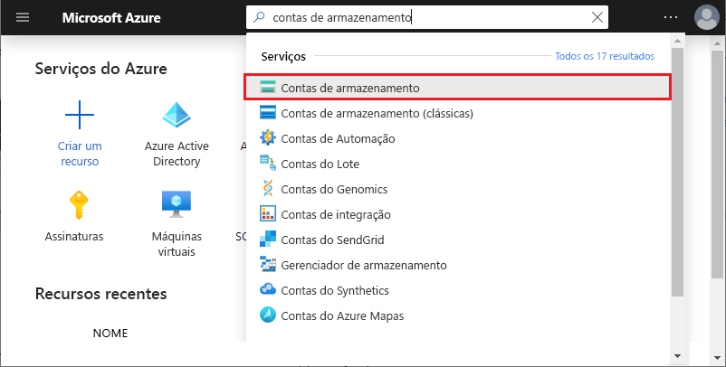

# <a name="work-with-azure-functions-core-tools"></a>Trabalhar com o Azure Functions Core Tools

O Azure Functions Core Tools permite desenvolver e testar as funções no computador local por meio do prompt de comando ou do terminal. Suas funções locais podem se conectar a serviços do Azure em tempo real e você pode depurar as suas funções em seu computador local usando o runtime total do Functions. Você ainda pode implantar um aplicativo de funções para sua assinatura do Azure.

[!INCLUDE [Don't mix development environments](../../includes/functions-mixed-dev-environments.md)]

Desenvolver funções em seu computador local e publicá-las no Azure usando ferramentas básicas segue estas etapas básicas:

> [!div class="checklist"]
> * [Instale as principais ferramentas e dependências.](#v2)
> * [Crie um projeto de aplicativo de funções de um modelo específico de idioma.](#create-a-local-functions-project)
> * [Registrar extensões de gatilho e de associação.](#register-extensions)
> * [Defina o armazenamento e outras conexões.](#local-settings-file)
> * [Crie uma função de um gatilho e de um modelo específico ao idioma.](#create-func)
> * [Execute a função localmente.](#start)
> * [Publique o projeto no Azure.](#publish)

## <a name="core-tools-versions"></a>Versões de Core Tools

Há três versões do Azure Functions Core Tools. A versão usada depende do seu ambiente de desenvolvimento local, [da escolha do idioma](supported-languages.md)e do nível de suporte necessário:

+ A [**versão 3. x/2. x**](#v2): oferece suporte à [versão 3. x ou 2. x do tempo de execução de Azure Functions](functions-versions.md). Essas versões dão suporte ao [Windows](?tabs=windows#v2), [MacOS](?tabs=macos#v2)e [Linux](?tabs=linux#v2) e usam gerenciadores de pacotes específicos da plataforma ou NPM para instalação.

+ **Versão 1. x**: dá suporte à versão 1. x do tempo de execução de Azure functions. Esta versão das ferramentas só tem suporte em computadores Windows e é instalada por meio de um [pacote npm](https://www.npmjs.com/package/azure-functions-core-tools).

Você só pode instalar uma versão das ferramentas principais em um determinado computador. Salvo indicação em contrário, os exemplos neste artigo são para a versão 3. x.

## <a name="prerequisites"></a>Pré-requisitos

Atualmente, Azure Functions Core Tools depende do [CLI do Azure](/cli/azure/install-azure-cli) ou [Azure PowerShell](/powershell/azure/install-az-ps) para autenticação com sua conta do Azure. Isso significa que você deve instalar uma dessas ferramentas para poder [publicar no Azure](#publish) de Azure Functions Core Tools. 

## <a name="install-the-azure-functions-core-tools"></a>Instalação das ferramentas básicas do Azure Functions

O [Azure Functions Core Tools] é uma versão local do Azure Functions runtime que pode ser executada no computador local de desenvolvimento. Ele também fornece comandos para criar funções, se conectar ao Azure e implantar projetos de função.

### <a name="version-3x-and-2x"></a><a name="v2"></a>Versão 3. x e 2. x

A versão 3. x/2. x das ferramentas usa o Azure Functions Runtime criado no .NET Core. Esta versão tem suporte em todas as plataformas que o .NET Core dá suporte, incluindo [Windows](?tabs=windows#v2), [MacOS](?tabs=macos#v2)e [Linux](?tabs=linux#v2). 

> [!IMPORTANT]
> Você pode ignorar o requisito de instalação do SDK do .NET Core usando [pacotes de extensão].

# <a name="windows"></a>[Windows](#tab/windows)

As etapas a seguir usam um MSI (Windows Installer) para instalar as ferramentas principais v3. x. Para obter mais informações sobre outros instaladores baseados em pacote, que são necessários para instalar as ferramentas principais v2. x, consulte o [Leiame das ferramentas principais](https://github.com/Azure/azure-functions-core-tools/blob/master/README.md#windows).

1. Baixe e execute o instalador das ferramentas principais, com base em sua versão do Windows:

    - [v3. x-Windows 64-bit](https://go.microsoft.com/fwlink/?linkid=2135274) (recomendado. A [depuração de Visual Studio Code](functions-develop-vs-code.md#debugging-functions-locally) requer 64 bits.)
    - [v3. x-Windows 32-bit](https://go.microsoft.com/fwlink/?linkid=2135275)

1. Se você não planeja usar [pacotes de extensão](functions-bindings-register.md#extension-bundles), instale o [SDK do .NET Core 3. x para Windows](https://dotnet.microsoft.com/download).

# <a name="macos"></a>[macOS](#tab/macos)

As etapas a seguir usam o Homebrew para instalar as ferramentas principais em macOS.

1. Instale o [Homebrew](https://brew.sh/), se ele ainda não estiver instalado.

1. Instale o pacote de ferramentas principais:

    ##### <a name="v3x-recommended"></a>v3. x (recomendado)

    ```bash
    brew tap azure/functions
    brew install azure-functions-core-tools@3
    # if upgrading on a machine that has 2.x installed
    brew link --overwrite azure-functions-core-tools@3
    ```
    
    ##### <a name="v2x"></a>v2.x

    ```bash
    brew tap azure/functions
    brew install azure-functions-core-tools@2
    ```
    
1. Se você não planeja usar [pacotes de extensão](functions-bindings-register.md#extension-bundles), instale o [SDK do .NET Core 3. x para MacOS](https://dotnet.microsoft.com/download).

# <a name="linux"></a>[Linux](#tab/linux)

As etapas a seguir usma [APT](https://wiki.debian.org/Apt) para instalar as ferramentas principais em sua distribuição Ubuntu/Debian Linux. Para outras distribuições do Linux, confira o [arquivo Leiame das ferramentas principais](https://github.com/Azure/azure-functions-core-tools/blob/master/README.md#linux).

1. Instale a chave GPG do repositório de pacotes da Microsoft para validar a integridade do pacote:

    ```bash
    curl https://packages.microsoft.com/keys/microsoft.asc | gpg --dearmor > microsoft.gpg
    sudo mv microsoft.gpg /etc/apt/trusted.gpg.d/microsoft.gpg
    ```

1. Configure a lista de origem APT antes de fazer uma atualização de APT.

    ##### <a name="ubuntu"></a>Ubuntu

    ```bash
    sudo sh -c 'echo "deb [arch=amd64] https://packages.microsoft.com/repos/microsoft-ubuntu-$(lsb_release -cs)-prod $(lsb_release -cs) main" > /etc/apt/sources.list.d/dotnetdev.list'
    ```

    ##### <a name="debian"></a>Debian

    ```bash
    sudo sh -c 'echo "deb [arch=amd64] https://packages.microsoft.com/debian/$(lsb_release -rs | cut -d'.' -f 1)/prod $(lsb_release -cs) main" > /etc/apt/sources.list.d/dotnetdev.list'
    ```

1. Verifique o `/etc/apt/sources.list.d/dotnetdev.list` arquivo para uma das cadeias de caracteres de versão do Linux apropriadas listadas abaixo:

    | Distribuição do Linux | Versão |
    | --------------- | ----------- |
    | Debian 10 | `buster`  |
    | Debian 9  | `stretch` |
    | Ubuntu 20.04    | `focal`     |
    | Ubuntu 19.04    | `disco`     |
    | Ubuntu 18.10    | `cosmic`    |
    | Ubuntu 18.04    | `bionic`    |
    | Ubuntu 17.04    | `zesty`     |
    | Ubuntu 16.04/Linux Mint 18    | `xenial`  |

1. Inicie a atualização da fonte APT:

    ```bash
    sudo apt-get update
    ```

1. Instale o pacote de ferramentas principais:

    ##### <a name="v3x-recommended"></a>v3. x (recomendado)
    ```bash
    sudo apt-get update
    sudo apt-get install azure-functions-core-tools-3
    ```
    
    ##### <a name="v2x"></a>v2.x
    ```bash
    sudo apt-get update
    sudo apt-get install azure-functions-core-tools-2
    ```

1. Se você não planeja usar [pacotes de extensão](functions-bindings-register.md#extension-bundles), instale o [SDK do .NET Core 3. x para Linux](https://dotnet.microsoft.com/download).

---

## <a name="create-a-local-functions-project"></a>Criar um projeto de funções local

Um diretório de projeto do Functions contém os arquivos [host.js](functions-host-json.md) e [local.settings.jsem](#local-settings-file), juntamente com as subpastas que contêm o código para funções individuais. Esse diretório é o equivalente ao de um aplicativo de funções no Azure. Para saber mais sobre a estrutura de pastas do Functions, consulte o [guia de desenvolvedores do Azure Functions](functions-reference.md#folder-structure).

A versão 3. x/2. x exige que você selecione um idioma padrão para seu projeto quando ele for inicializado. Na versão 3. x/2. x, todas as funções adicionadas usam modelos de idioma padrão. Na versão 1.x, você especifica a linguagem cada vez que você criar uma função.

Na janela do terminal ou em um prompt de comando, execute o seguinte comando para criar o projeto e o repositório Git local:

```
func init MyFunctionProj
```

>[!IMPORTANT]
> O Java usa um arquétipo Maven para criar o projeto de funções locais, juntamente com sua primeira função disparada por HTTP. Use o seguinte comando para criar seu projeto Java: `mvn archetype:generate -DarchetypeGroupId=com.microsoft.azure -DarchetypeArtifactId=azure-functions-archetype` . Para obter um exemplo usando o arquétipo do Maven, consulte o guia de [início rápido da linha de comando](./create-first-function-cli-java.md).  

Quando você fornece um nome de projeto, uma nova pasta com esse nome é criada e inicializada. Caso contrário, a pasta atual é inicializada.  
Na versão 3. x/2. x, ao executar o comando, você deve escolher um tempo de execução para seu projeto. 

<pre>
Select a worker runtime:
dotnet
node
python 
powershell
</pre>

Use cima/para baixo de teclas de direção para escolher um idioma, em seguida, pressione Enter. Se você planeja desenvolver funções JavaScript ou TypeScript, escolha **nó** e, em seguida, selecione o idioma. O TypeScript tem [alguns requisitos adicionais](functions-reference-node.md#typescript). 

A saída se parece com o seguinte exemplo para um projeto JavaScript:

<pre>
Select a worker runtime: node
Writing .gitignore
Writing host.json
Writing local.settings.json
Writing C:\myfunctions\myMyFunctionProj\.vscode\extensions.json
Initialized empty Git repository in C:/myfunctions/myMyFunctionProj/.git/
</pre>

`func init` o oferece suporte às seguintes opções, que são a versão 3. x/2. x-only, salvo indicação em contrário:

| Opção     | Descrição                            |
| ------------ | -------------------------------------- |
| **`--csx`** | Cria funções do .NET como script C#, que é o comportamento da versão 1. x. Válido somente com `--worker-runtime dotnet` . |
| **`--docker`** | Cria um Dockerfile para um contêiner usando uma imagem base com base no escolhido `--worker-runtime` . Use esta opção quando planejar publicar em um contêiner do Linux personalizado. |
| **`--docker-only`** |  Adiciona um Dockerfile a um projeto existente. Solicita o tempo de execução de trabalho se não for especificado ou definido em local.settings.jsem. Use esta opção quando você planeja publicar um projeto existente para um contêiner personalizado do Linux. |
| **`--force`** | Inicializa o projeto mesmo quando há arquivos existentes no projeto. Essa configuração substitui os arquivos existentes pelo mesmo nome. Os outros arquivos na pasta do projeto não serão afetados. |
| **`--language`** | Inicializa um projeto específico de idioma. Atualmente com suporte quando `--worker-runtime` definido como `node` . As opções são `typescript` e `javascript` . Você também pode usar o `--worker-runtime javascript` ou o `--worker-runtime typescript` .  |
| **`--managed-dependencies`**  | Instala dependências gerenciadas. Atualmente, somente o tempo de execução do operador do PowerShell dá suporte a essa funcionalidade. |
| **`--source-control`** | Controla se um repositório git é criado. Por padrão, não é criado um repositório. Quando `true`, um repositório é criado. |
| **`--worker-runtime`** | Define o runtime de linguagem para o projeto. Os valores com suporte são: `csharp` , `dotnet` , `javascript` , `node` (JavaScript), `powershell` , `python` e `typescript` . Para Java, use o [Maven](functions-reference-java.md#create-java-functions). Quando não estiver definido, você será solicitado a escolher o tempo de execução durante a inicialização. |
|
> [!IMPORTANT]
> Por padrão, a versão 2. x e versões posteriores das ferramentas principais criam projetos de aplicativo de funções para o tempo de execução do .NET como [projetos de classe C#](functions-dotnet-class-library.md) (. csproj). Esses projetos C#, que podem ser usados com o Visual Studio ou com Visual Studio Code, são compilados durante o teste e ao publicar no Azure. Se você deseja criar e trabalhar com o os mesmos arquivos de script C# (. CSx) criados na versão 1. x e no portal, você deve incluir o `--csx` parâmetro ao criar e implantar funções.

## <a name="register-extensions"></a>Extensões de registro

Com exceção dos gatilhos HTTP e Timer, as associações de funções no tempo de execução versão 2. x e superiores são implementadas como pacotes de extensão. Associações HTTP e gatilhos de temporizador não exigem extensões. 

Para reduzir as incompatibilidades entre os vários pacotes de extensão, o Functions permite que você referencie um pacote de extensão em seu host.jsno arquivo de projeto. Se você optar por não usar pacotes de extensão, também precisará instalar o SDK do .NET Core 2. x localmente e manter um Extensions. csproj com seu projeto do functions.  

Na versão 2. x e além do tempo de execução de Azure Functions, você precisa registrar explicitamente as extensões para os tipos de associação usados em suas funções. Você pode optar por instalar as extensões de associação individualmente ou pode adicionar uma referência de pacote de extensão ao host.jsno arquivo de projeto. Os pacotes de extensão eliminam a possibilidade de haver problemas de compatibilidade de pacote ao usar vários tipos de associação. É a abordagem recomendada para registrar extensões de associação. Os pacotes de extensão também eliminam a necessidade de instalar o SDK do .NET Core 2. x. 

### <a name="use-extension-bundles"></a>Usar pacotes de extensão

[!INCLUDE [Register extensions](../../includes/functions-extension-bundles.md)]

Para saber mais, consulte [registrar Azure Functions extensões de associação](functions-bindings-register.md#extension-bundles). Você deve adicionar pacotes de extensão ao host.jsno antes de adicionar associações ao function.jsno arquivo.

### <a name="explicitly-install-extensions"></a>Instalar extensões explicitamente

[!INCLUDE [functions-extension-register-core-tools](../../includes/functions-extension-register-core-tools.md)]

[!INCLUDE [functions-local-settings-file](../../includes/functions-local-settings-file.md)]

Por padrão, essas configurações não são migradas automaticamente quando o projeto é publicado no Azure. Use a opção `--publish-local-settings`[quando publicar](#publish) para se certificar de que essas configurações serão adicionadas ao aplicativo de funções no Azure. Observe que os valores em **ConnectionStrings** nunca são publicados.

Os valores de configuração do aplicativo de funções também podem ser lidos em seu código como variáveis de ambiente. Para obter mais informações, confira a seção de variáveis de Ambiente desses tópicos de referência específicos de linguagem:

* [C# pré-compilado](functions-dotnet-class-library.md#environment-variables)
* [Script do C# (.csx)](functions-reference-csharp.md#environment-variables)
* [Java](functions-reference-java.md#environment-variables)
* [JavaScript](functions-reference-node.md#environment-variables)
* [PowerShell](functions-reference-powershell.md#environment-variables)
* [Python](functions-reference-python.md#environment-variables)

Quando nenhuma cadeia de conexão de armazenamento válida é definida para [`AzureWebJobsStorage`] e o emulador não está sendo usado, a seguinte mensagem de erro é mostrada:

> Valor ausente para AzureWebJobsStorage em local.settings.json. Isso é necessário para todos os gatilhos diferentes de HTTP. É possível executar 'func azure functionapp fetch-app-settings \<functionAppName\>' ou especificar uma cadeia de conexão em local.settings.json.

### <a name="get-your-storage-connection-strings"></a>Obter suas cadeias de conexão de armazenamento

Mesmo ao usar o Emulador de Armazenamento do Microsoft Azure para desenvolvimento, talvez você queira testar com uma conexão de armazenamento real. Supondo que você já tenha [criado uma conta de armazenamento](../storage/common/storage-account-create.md), será possível obter uma cadeia de conexão de armazenamento válida de uma destas maneiras:

- No [portal do Azure], procure e selecione contas de **armazenamento**. 
  
  
  Selecione sua conta de armazenamento, selecione **chaves de acesso** em **configurações** e, em seguida, copie um dos valores da cadeia de **conexão** .
  

- Use o [Gerenciador de Armazenamento do Azure](https://storageexplorer.com/) para conectar-se à sua conta do Azure. No **Gerenciador**, expanda sua assinatura, expanda **contas de armazenamento**, selecione sua conta de armazenamento e copie a cadeia de conexão primária ou secundária.

  

+ Use as ferramentas básicas da raiz do projeto para baixar a cadeia de conexão do Azure com um dos seguintes comandos:

  + Baixe todas as configurações de um aplicativo de funções existente:

    ```
    func azure functionapp fetch-app-settings <FunctionAppName>
    ```

  + Obtenha a cadeia de conexão para uma conta de armazenamento específica:

    ```
    func azure storage fetch-connection-string <StorageAccountName>
    ```

    Quando você ainda não tiver entrado no Azure, você será solicitado a fazê-lo. Esses comandos substituem as configurações existentes no local.settings.jsno arquivo. 

## <a name="create-a-function"></a><a name="create-func"></a>Criar uma função

Para criar uma função, execute o seguinte comando:

```
func new
```

Na versão 3. x/2. x, quando você executar, será `func new` solicitado que você escolha um modelo no idioma padrão do seu aplicativo de funções e, em seguida, você também será solicitado a escolher um nome para a função. Na versão 1.x, você também precisará escolher o idioma.

<pre>
Select a language: Select a template:
Blob trigger
Cosmos DB trigger
Event Grid trigger
HTTP trigger
Queue trigger
SendGrid
Service Bus Queue trigger
Service Bus Topic trigger
Timer trigger
</pre>

Código de função é gerado em uma subpasta com o nome da função fornecido, como você pode ver na seguinte saída do gatilho de fila:

<pre>
Select a language: Select a template: Queue trigger
Function name: [QueueTriggerJS] MyQueueTrigger
Writing C:\myfunctions\myMyFunctionProj\MyQueueTrigger\index.js
Writing C:\myfunctions\myMyFunctionProj\MyQueueTrigger\readme.md
Writing C:\myfunctions\myMyFunctionProj\MyQueueTrigger\sample.dat
Writing C:\myfunctions\myMyFunctionProj\MyQueueTrigger\function.json
</pre>

Você também pode especificar essas opções no comando usando os seguintes argumentos:

| Argumento     | Descrição                            |
| ------------------------------------------ | -------------------------------------- |
| **`--csx`** | (Versão 2. x e versões posteriores.) Gera os mesmos modelos de script C# (. CSX) usados na versão 1. x e no Portal. |
| **`--language`**, **`-l`**| A linguagem de programação modelo, como C#, F# ou JavaScript. Essa opção é necessária na versão 1.x. Na versão 2. x e versões posteriores, não use essa opção ou escolha um idioma que corresponda ao tempo de execução do trabalho. |
| **`--name`**, **`-n`** | O nome da função. |
| **`--template`**, **`-t`** | Use o `func templates list` comando para ver a lista completa de modelos disponíveis para cada idioma com suporte.   |


Por exemplo, para criar um gatilho de HTTP de JavaScript em um único comando, execute:

```
func new --template "Http Trigger" --name MyHttpTrigger
```

Para criar uma função ativada por fila em um único comando, execute:

```
func new --template "Queue Trigger" --name QueueTriggerJS
```

## <a name="run-functions-locally"></a><a name="start"></a>Executar funções localmente

Para executar um projeto de funções, execute o host de funções. O host habilita gatilhos para todas as funções no projeto. O comando start varia, dependendo da linguagem do projeto.

# <a name="c"></a>[C\#](#tab/csharp)

```
func start --build
```

# <a name="java"></a>[Java](#tab/java)

```
mvn clean package 
mvn azure-functions:run
```

# <a name="javascript"></a>[JavaScript](#tab/node)

```
func start
```

# <a name="python"></a>[Python](#tab/python)

```
func start
```
Esse comando deve ser [executado em um ambiente virtual](./create-first-function-cli-python.md).

# <a name="typescript"></a>[TypeScript](#tab/ts)

```
npm install
npm start     
```

---

>[!NOTE]  
> A versão 1. x do tempo de execução do Functions requer o `host` comando, como no exemplo a seguir:
>
> ```
> func host start
> ```

`func start` dá suporte para as seguintes opções:

| Opção     | Descrição                            |
| ------------ | -------------------------------------- |
| **`--no-build`** | Não compile o projeto atual antes da execução. Somente para projetos dotnet. O padrão é definido como false. Sem suporte para a versão 1. x. |
| **`--cors-credentials`** | Permitir solicitações autenticadas entre origens (ou seja, cookies e o cabeçalho de autenticação) sem suporte para a versão 1. x. |
| **`--cors`** | Uma lista separada por vírgulas de origens CORS, sem espaços. |
| **`--language-worker`** | Argumentos para configurar o trabalhador de idioma. Por exemplo, você pode habilitar a depuração para o trabalho de idioma fornecendo a [porta de depuração e outros argumentos necessários](https://github.com/Azure/azure-functions-core-tools/wiki/Enable-Debugging-for-language-workers). Sem suporte para a versão 1. x. |
| **`--cert`** | O caminho para um arquivo .pfx que contém uma chave privada. Usado somente com `--useHttps`. Sem suporte para a versão 1. x. |
| **`--password`** | A senha ou um arquivo que contém a senha para um arquivo .pfx. Usado somente com `--cert`. Sem suporte para a versão 1. x. |
| **`--port`**, **`-p`** | A porta local na qual escutar. Valor Padrão: 7071. |
| **`--pause-on-error`** | Pausar para entrada adicional antes de encerrar o processo. Usado apenas ao iniciar as Core Tools de um IDE (ambiente de desenvolvimento integrado).|
| **`--script-root`**, **`--prefix`** | Usado para especificar o caminho para a raiz do aplicativo de funções que deve ser executado ou implantado. Usado para projetos compilados que geram arquivos de projeto para uma subpasta. Por exemplo, quando você cria um projeto de biblioteca de classes C#, os arquivos host.json, local.settings.json e function.json são gerados em uma subpasta *raiz* com um caminho como `MyProject/bin/Debug/netstandard2.0`. Nesse caso, defina o prefixo como `--script-root MyProject/bin/Debug/netstandard2.0`. Essa é a raiz do aplicativo de funções durante a execução no Azure. |
| **`--timeout`**, **`-t`** | O tempo limite para o host de funções ser iniciado, em segundos. Padrão: 20 segundos.|
| **`--useHttps`** | Associar a `https://localhost:{port}` em vez de `http://localhost:{port}`. Por padrão, essa opção cria um certificado confiável no computador.|

Quando o host de funções é iniciado, ele gera as funções acionadas por URL de HTTP:

<pre>
Found the following functions:
Host.Functions.MyHttpTrigger

Job host started
Http Function MyHttpTrigger: http://localhost:7071/api/MyHttpTrigger
</pre>

>[!IMPORTANT]
>Ao executar localmente, a autorização não é imposta para pontos de extremidade HTTP. Isso significa que todas as solicitações HTTP locais são tratadas como `authLevel = "anonymous"`. Para obter mais informações, confira o [artigo de associação HTTP](functions-bindings-http-webhook-trigger.md#authorization-keys).

### <a name="passing-test-data-to-a-function"></a>Transferência dos dados de teste para uma função

Para testar as funções localmente, [inicie o host do Functions](#start) e chame os pontos de extremidade no servidor local usando solicitações HTTP. O ponto de extremidade que você chama depende do tipo de função.

>[!NOTE]
> Os exemplos neste tópico usam a ferramenta cURL para enviar solicitações HTTP do terminal ou de um prompt de comando. Você pode usar uma ferramenta de sua escolha para enviar solicitações HTTP para o servidor local. A ferramenta de rotação está disponível por padrão em sistemas baseados em Linux e no Windows 10 Build 17063 e posterior. No Windows mais antigo, você deve primeiro baixar e instalar a [ferramenta de rotação](https://curl.haxx.se/).

Para ter informações mais gerais sobre o teste de funções, confira [Estratégias para testar seu código no Azure Functions](functions-test-a-function.md).

#### <a name="http-and-webhook-triggered-functions"></a>Funções disparadas por HTTP e webhook

Chame o seguinte ponto de extremidade para executar localmente funções disparadas por HTTP e webhook:

```
http://localhost:{port}/api/{function_name}
```

Use o mesmo nome de servidor e porta no qual o host do Functions está escutando. Veja isso na saída gerada ao iniciar o host do Function. Chame essa URL usando qualquer método HTTP com suporte do disparador.

O seguinte comando cURL dispara a função de início rápido `MyHttpTrigger` de uma solicitação GET com o parâmetro _name_ transmitido na cadeia de consulta.

```
curl --get http://localhost:7071/api/MyHttpTrigger?name=Azure%20Rocks
```

O exemplo a seguir é a mesma função chamada a partir de uma solicitação POST passando _name_ no corpo da solicitação:

# <a name="bash"></a>[Bash](#tab/bash)
```bash
curl --request POST http://localhost:7071/api/MyHttpTrigger --data '{"name":"Azure Rocks"}'
```
# <a name="cmd"></a>[Cmd](#tab/cmd)
```cmd
curl --request POST http://localhost:7071/api/MyHttpTrigger --data "{'name':'Azure Rocks'}"
```
---

Você pode fazer solicitações GET de um navegador passando dados na cadeia de consulta. Para todos os outros métodos HTTP, você deve usar cURL, Fiddler, Postman ou uma ferramenta de teste HTTP semelhante.

#### <a name="non-http-triggered-functions"></a>Funções disparadas por algo diferente de HTTP

Para todos os tipos de funções que não sejam gatilhos HTTP e gatilhos de grade de eventos, você pode testar suas funções localmente chamando um ponto de extremidade de administração. Chamar esse ponto de extremidade com uma solicitação HTTP POST no servidor local dispara a função. 

Para testar as funções disparadas pela grade de eventos localmente, consulte [teste local com aplicativo Web do visualizador](functions-bindings-event-grid-trigger.md#local-testing-with-viewer-web-app).

Como alternativa, é possível passar dados de teste para a execução no corpo da solicitação POST. Essa funcionalidade é semelhante á guia **Teste** no Portal do Azure.

Chame o seguinte ponto de extremidade de administrador para disparar funções que não são HTTP:

```
http://localhost:{port}/admin/functions/{function_name}
```

Para passar dados de teste para o ponto de extremidade administrador de uma função, é necessário fornecer os dados no corpo de uma mensagem de solicitação POST. O corpo da mensagem deve ter o seguinte formato JSON:

```JSON
{
    "input": "<trigger_input>"
}
```

O valor `<trigger_input>` contém dados em um formato esperado pela função. O exemplo de cURL a seguir é um POST para uma função `QueueTriggerJS`. Nesse caso, a entrada é uma cadeia de caracteres equivalente à mensagem esperada na fila.

# <a name="bash"></a>[Bash](#tab/bash)
```bash
curl --request POST -H "Content-Type:application/json" --data '{"input":"sample queue data"}' http://localhost:7071/admin/functions/QueueTrigger
```
# <a name="cmd"></a>[Cmd](#tab/cmd)
```bash
curl --request POST -H "Content-Type:application/json" --data "{'input':'sample queue data'}" http://localhost:7071/admin/functions/QueueTrigger
```
---

#### <a name="using-the-func-run-command-version-1x-only"></a>Usando o `func run` comando (somente versão 1. x)

>[!IMPORTANT]
> `func run`Só há suporte para o comando na versão 1. x das ferramentas. Para saber mais, consulte o tópico [Como direcionar para versões do Azure Functions runtime](set-runtime-version.md).

Na versão 1. x, você também pode invocar uma função diretamente usando `func run <FunctionName>` e fornecer dados de entrada para a função. Esse comando é semelhante à execução de uma função usando a guia **Testar** no Portal do Azure.

`func run` dá suporte para as seguintes opções:

| Opção     | Descrição                            |
| ------------ | -------------------------------------- |
| **`--content`**, **`-c`** | Conteúdo embutido. |
| **`--debug`**, **`-d`** | Anexe um depurador ao processo de host antes de executar a função.|
| **`--timeout`**, **`-t`** | Tempo de espera (em segundos) até que o host local de funções esteja pronto.|
| **`--file`**, **`-f`** | O nome do arquivo a ser usado como conteúdo.|
| **`--no-interactive`** | Não solicitará a entrada. Útil para cenários de automação.|

Por exemplo, para chamar uma função ativada por HTTP e passar o corpo do conteúdo, execute o seguinte comando:

```
func run MyHttpTrigger -c '{\"name\": \"Azure\"}'
```

## <a name="publish-to-azure"></a><a name="publish"></a>Publicar no Azure

O Azure Functions Core Tools dá suporte a dois tipos de implantação: Implantando arquivos de projeto de função diretamente em seu aplicativo de funções por meio da [implantação de zip](functions-deployment-technologies.md#zip-deploy) e [implantando um contêiner do Docker personalizado](functions-deployment-technologies.md#docker-container). Você já deve ter [criado um aplicativo de funções em sua assinatura do Azure](functions-cli-samples.md#create), no qual você implantará seu código. Os projetos que exigem build devem ser compilados para que os binários possam ser implantados.

>[!IMPORTANT]
>Você deve ter o [CLI do Azure](/cli/azure/install-azure-cli) ou [Azure PowerShell](/powershell/azure/install-az-ps) instalado localmente para poder publicar no Azure por meio das ferramentas principais.  

Uma pasta de projeto pode conter arquivos e diretórios específicos do idioma que não devem ser publicados. Itens excluídos são listados em um arquivo. funcignore na pasta raiz do projeto.     

### <a name="deploy-project-files"></a><a name="project-file-deployment"></a>Implantar arquivos de projeto

Para publicar seu código local para um aplicativo de funções no Azure, use o comando `publish`:

```
func azure functionapp publish <FunctionAppName>
```

>[!IMPORTANT]
> O Java usa o Maven para publicar seu projeto local no Azure. Use o seguinte comando para publicar no Azure: `mvn azure-functions:deploy` . Os recursos do Azure são criados durante a implantação inicial.

Esse comando publica a um aplicativo de funções existente no Azure. Você receberá um erro se tentar publicar em um `<FunctionAppName>` que não existe em sua assinatura. Para saber como criar um aplicativo de funções no prompt de comando ou na janela do terminal usando o CLI do Azure ou Azure PowerShell, consulte [criar um aplicativo de funções para execução sem servidor](./scripts/functions-cli-create-serverless.md). Por padrão, esse comando usa a [compilação remota](functions-deployment-technologies.md#remote-build) e implanta seu aplicativo para ser [executado a partir do pacote de implantação](run-functions-from-deployment-package.md). Para desabilitar esse modo de implantação recomendado, use a `--nozip` opção.

>[!IMPORTANT]
> Quando você cria um aplicativo de funções no portal do Azure, ele usa a versão 3. x do tempo de execução da função por padrão. Para que o aplicativo de funções use a versão 1.x do runtime, siga as instruções em [Executar na versão 1.x](functions-versions.md#creating-1x-apps).
> Você não pode alterar a versão do runtime de um aplicativo de funções que tenha funções existentes.

As seguintes opções de publicação se aplicam a todas as versões:

| Opção     | Descrição                            |
| ------------ | -------------------------------------- |
| **`--publish-local-settings -i`** |  Configurações de publicação em local.settings.json do Azure, a solicitação para substituir se a configuração já existe. Se você estiver usando a Emulador de Armazenamento do Microsoft Azure, primeiro altere a configuração do aplicativo para uma [conexão de armazenamento real](#get-your-storage-connection-strings). |
| **`--overwrite-settings -y`** | Suprima o prompt para substituir as configurações do aplicativo quando `--publish-local-settings -i` for usado.|

As opções de publicação a seguir têm suporte apenas para a versão 2. x e versões posteriores:

| Opção     | Descrição                            |
| ------------ | -------------------------------------- |
| **`--publish-settings-only`**, **`-o`** |  Somente publicar as configurações e ignorar o conteúdo. O padrão é solicitado. |
|**`--list-ignored-files`** | Exibe uma lista de arquivos que são ignorados durante a publicação, que é baseada no arquivo .funcignore. |
| **`--list-included-files`** | Exibe uma lista de arquivos que são publicados, que é baseada no arquivo .funcignore. |
| **`--nozip`** | Transforma o padrão de `Run-From-Package` modo desativado. |
| **`--build-native-deps`** | Ignora a geração da pasta. Wheels ao publicar aplicativos de funções do Python. |
| **`--build`**, **`-b`** | Executa a ação de compilação ao implantar em um aplicativo de funções do Linux. Aceita: `remote` e `local` . |
| **`--additional-packages`** | Lista de pacotes para instalar ao compilar dependências nativas. Por exemplo: `python3-dev libevent-dev`. |
| **`--force`** | Ignorar a verificação de pré-publicação em determinados cenários. |
| **`--csx`** | Publicar um projeto de script (.csx) C#. |
| **`--no-build`** | O projeto não é compilado durante a publicação. Para Python, `pip install` não é executado. |
| **`--dotnet-cli-params`** | Durante a publicação de funções C# (.csproj), o Core Tools chama 'dotnet build --output bin/publish'. Todos os parâmetros passados para isso serão acrescentados à linha de comando. |

### <a name="deploy-custom-container"></a>Implantar contêiner personalizado

Azure Functions permite que você implante seu projeto de função em um [contêiner do Docker personalizado](functions-deployment-technologies.md#docker-container). Para obter mais informações, confira [Criar uma função no Linux usando uma imagem personalizada](functions-create-function-linux-custom-image.md). Os contêineres personalizados precisam ter um Dockerfile. Para criar um aplicativo com um Dockerfile, use a opção--Dockerfile em `func init` .

```
func deploy
```

As seguintes opções de implantação de contêiner personalizado estão disponíveis:

| Opção     | Descrição                            |
| ------------ | -------------------------------------- |
| **`--registry`** | O nome de um Registro do Docker ao qual o usuário atual está conectado. |
| **`--platform`** | A plataforma de hospedagem do aplicativo de funções. As opções válidas são `kubernetes` |
| **`--name`** | Nome do aplicativo de funções. |
| **`--max`**  | Opcionalmente, define o número máximo de instâncias do aplicativo de funções a serem implantadas. |
| **`--min`**  | Opcionalmente, define o número mínimo de instâncias do aplicativo de funções a serem implantadas. |
| **`--config`** | Define um arquivo de configuração de implantação opcional. |

## <a name="monitoring-functions"></a>Funções de monitoramento

A maneira recomendada para monitorar a execução de suas funções é integrar-se com o Aplicativo Azure insights. Você também pode transmitir logs de execução para o computador local. Para saber mais, consulte [Monitorar Azure Functions](functions-monitoring.md).

### <a name="application-insights-integration"></a>Integração do Application Insights

Application Insights integração deve ser habilitada quando você cria seu aplicativo de funções no Azure. Se, por algum motivo, seu aplicativo de funções não estiver conectado a uma instância de Application Insights, será fácil fazer essa integração no portal do Azure. Para saber mais, confira [habilitar a integração de Application insights](configure-monitoring.md#enable-application-insights-integration).

### <a name="enable-streaming-logs"></a>Habilitar logs de streaming

Você pode exibir um fluxo de arquivos de log que estão sendo gerados por suas funções em uma sessão de linha de comando em seu computador local. 

[!INCLUDE [functions-streaming-logs-core-tools](../../includes/functions-streaming-logs-core-tools.md)]

Esse tipo de logs de streaming requer que Application Insights integração seja habilitada para seu aplicativo de funções.   


## <a name="next-steps"></a>Próximas etapas

Saiba como desenvolver, testar e publicar Azure Functions usando Azure Functions Core Tools [módulo do Microsoft learn](/learn/modules/develop-test-deploy-azure-functions-with-core-tools/) Azure Functions Core Tools é software livre [e hospedado no GitHub](https://github.com/azure/azure-functions-cli).  
Para arquivar uma solicitação de bug ou recurso, [abra um problema do GitHub](https://github.com/azure/azure-functions-cli/issues).

<!-- LINKS -->

[Azure Functions Core Tools]: https://www.npmjs.com/package/azure-functions-core-tools
[Portal do Azure]: https://portal.azure.com 
[Node.js]: https://docs.npmjs.com/getting-started/installing-node#osx-or-windows
[`FUNCTIONS_WORKER_RUNTIME`]: functions-app-settings.md#functions_worker_runtime
[`AzureWebJobsStorage`]: functions-app-settings.md#azurewebjobsstorage
[pacotes de extensão]: functions-bindings-register.md#extension-bundles
