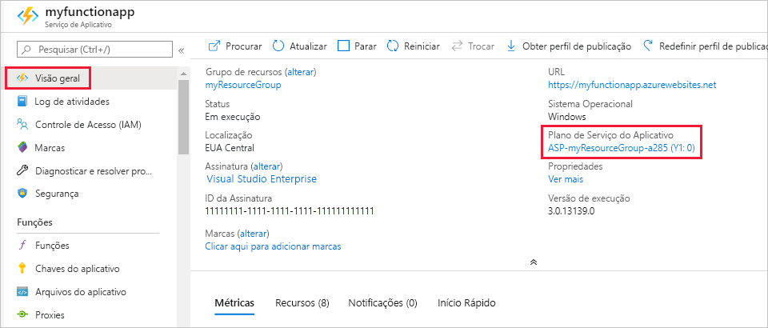

# <a name="azure-functions-scale-and-hosting"></a>Escala e Hospedagem de Azure Functions

Ao criar um aplicativo de funções no Azure, você deve escolher um plano de hospedagem para seu aplicativo. Há três planos de hospedagem disponíveis para Azure Functions: [plano de consumo](#consumption-plan), [plano Premium](#premium-plan)e [plano do serviço de aplicativo](#app-service-plan).

O plano de hospedagem que você escolher ditará os seguintes comportamentos:

* Como seu aplicativo de funções é dimensionado.
* Os recursos disponíveis para cada instância do aplicativo de funções.
* Suporte para recursos avançados, como conectividade VNET.

Os planos de consumo e Premium adicionam capacidade de computação automaticamente quando seu código está em execução. Seu aplicativo é escalado horizontalmente quando necessário para lidar com a carga e diminuído verticalmente quando o código para de ser executado. Para o plano de consumo, você também não precisa pagar por VMs ociosas ou reservar a capacidade antecipadamente.  

O plano Premium fornece recursos adicionais, como instâncias de computação Premium, a capacidade de manter instâncias quentes indefinidamente e conectividade VNet.

O plano do serviço de aplicativo permite que você aproveite a infraestrutura dedicada, que você gerencia. Seu aplicativo de funções não é dimensionado com base em eventos, o que significa que nunca é dimensionado para zero. (Requer que o [Always on](#always-on) esteja habilitado.)

> [!NOTE]
> Você pode alternar entre consumo e planos Premium alterando a propriedade Plan do recurso de aplicativo de funções.

## <a name="hosting-plan-support"></a>Suporte ao plano de hospedagem

O suporte a recursos se enquadra nas duas categorias a seguir:

* Disponibilidade _geral (GA)_ : suporte completo e aprovado para uso em produção.
* Versão _prévia_: ainda não há suporte total e aprovado para uso em produção.

A tabela a seguir indica o nível de suporte atual para os três planos de hospedagem, quando executado no Windows ou no Linux:

| | Plano de consumo | Plano Premium | Plano dedicado |
|-|:----------------:|:------------:|:----------------:|
| Windows | GA | versão prévia | GA |
| Linux | GA | versão prévia | GA |

## <a name="consumption-plan"></a>Plano de consumo

Quando você estiver usando o plano de consumo, as instâncias do host Azure Functions serão adicionadas e removidas dinamicamente com base no número de eventos de entrada. Esse plano sem servidor é dimensionado automaticamente e você é cobrado pelos recursos de computação somente quando suas funções estão em execução. Em um plano de consumo, uma execução de função atinge o tempo limite após um período configurável.

A cobrança é baseada no número de execuções, no tempo de execução e na memória usada. A cobrança é agregada em todas as funções em um aplicativo de funções. Para obter mais informações, consulte a [página de preços do Azure Functions](https://azure.microsoft.com/pricing/details/functions/).

O plano de consumo é o plano de hospedagem padrão e oferece os seguintes benefícios:

* Pague somente quando suas funções estiverem em execução
* Escalar horizontalmente automaticamente, mesmo durante períodos de alta carga

Os aplicativos de funções na mesma região podem ser atribuídos ao mesmo plano de consumo. Não há nenhuma desvantagem ou impacto para ter vários aplicativos em execução no mesmo plano de consumo. A atribuição de vários aplicativos ao mesmo plano de consumo não afeta a resiliência, a escalabilidade ou a confiabilidade de cada aplicativo.

Para saber mais sobre como estimar os custos durante a execução em um plano de consumo, consulte [noções básicas sobre custos do plano de consumo](functions-consumption-costs.md).

## <a name="premium-plan"></a>Plano Premium (visualização)

Quando você estiver usando o plano Premium, as instâncias do host Azure Functions serão adicionadas e removidas com base no número de eventos de entrada, assim como o plano de consumo.  O plano Premium dá suporte aos seguintes recursos:

* Instâncias passivas perpétuas para evitar qualquer início frio
* Conectividade VNet
* Duração de execução ilimitada
* Tamanhos de instância Premium (um núcleo, duas principais e quatro instâncias de núcleo)
* Preços mais previsíveis
* Alocação de aplicativo de alta densidade para planos com vários aplicativos de funções

Informações sobre como você pode configurar essas opções podem ser encontradas no [documento Azure Functions plano Premium](functions-premium-plan.md).

Em vez de cobrança por execução e memória consumida, a cobrança pelo plano Premium é baseada no número de segundos de núcleo e na memória usada nas instâncias necessárias e pré-configuradas. Pelo menos uma instância deve estar sempre em espera por plano. Isso significa que há um custo mensal mínimo por plano ativo, independentemente do número de execuções. Tenha em mente que todos os aplicativos de funções em um plano Premium compartilham instâncias ativas e pré-configuradas.

Considere o plano Azure Functions Premium nas seguintes situações:

* Seus aplicativos de funções são executados continuamente ou quase continuamente.
* Você tem um número alto de execuções pequenas e tem uma cobrança de alta execução, mas a cobrança de baixo GB por segundo no plano de consumo.
* Você precisa de mais opções de CPU ou memória do que o fornecido pelo plano de consumo.
* Seu código precisa ser executado por mais tempo do que o [máximo permitido](#timeout) no plano de consumo.
* Você precisa de recursos que estão disponíveis apenas em um plano Premium, como conectividade VNET/VPN.

Ao executar funções de JavaScript em um plano Premium, você deve escolher uma instância que tenha menos vCPUs. Para obter mais informações, consulte [escolher planos Premium de núcleo único](functions-reference-node.md#considerations-for-javascript-functions).  

## <a name="app-service-plan"></a>Plano dedicado (serviço de aplicativo)

Seus aplicativos de funções também podem ser executados nas mesmas VMs dedicadas que outros aplicativos do serviço de aplicativo (SKUs Basic, Standard, Premium e Isolated).

Considere um plano do serviço de aplicativo nas seguintes situações:

* Você tem VMs subutilizadas existentes que já estão executando outras instâncias do serviço de aplicativo.
* Você deseja fornecer uma imagem personalizada na qual executar suas funções.

Você paga o mesmo para aplicativos de funções em um plano do serviço de aplicativo como faria para outros recursos do serviço de aplicativo, como aplicativos Web. Para obter detalhes sobre como o plano do serviço de aplicativo funciona, consulte a [visão geral detalhada dos planos de serviço Azure app](../app-service/overview-hosting-plans.md).

Com um plano do serviço de aplicativo, você pode escalar horizontalmente manualmente Adicionando mais instâncias de VM. Você também pode habilitar o dimensionamento automático. Para obter mais informações, consulte [dimensionar a contagem de instâncias manual ou automaticamente](../azure-monitor/platform/autoscale-get-started.md?toc=%2fazure%2fapp-service%2ftoc.json). Você também pode escalar verticalmente escolhendo um plano do serviço de aplicativo diferente. Para obter mais informações, consulte [escalar verticalmente um aplicativo no Azure](../app-service/manage-scale-up.md). 

Ao executar funções de JavaScript em um plano do serviço de aplicativo, você deve escolher um plano que tenha menos vCPUs. Para obter mais informações, consulte [escolher planos de serviço de aplicativo de núcleo único](functions-reference-node.md#choose-single-vcpu-app-service-plans). 
<!-- Note: the portal links to this section via fwlink https://go.microsoft.com/fwlink/?linkid=830855 --> 

### <a name="always-on"></a>Always On

Se você executar em um plano do serviço de aplicativo, habilite a configuração **Always on** para que seu aplicativo de funções seja executado corretamente. Em um plano do serviço de aplicativo, o tempo de execução do Functions fica ocioso após alguns minutos de inatividade, portanto, somente os gatilhos HTTP "despertam" suas funções. O AlwaysOn está disponível somente em um plano do serviço de aplicativo. Em um plano de consumo, a plataforma ativa os aplicativos de função automaticamente.

[!INCLUDE [Timeout Duration section](../../includes/functions-timeout-duration.md)]


Mesmo com Always On habilitado, o tempo limite de execução para funções individuais é controlado pela configuração de `functionTimeout` no arquivo de projeto [host. JSON](functions-host-json.md#functiontimeout) .

## <a name="determine-the-hosting-plan-of-an-existing-application"></a>Determinar o plano de Hospedagem de um aplicativo existente

Para determinar o plano de hospedagem usado pelo seu aplicativo de funções, consulte **tipo de preço/plano do serviço de aplicativo** na guia **visão geral** do aplicativo de funções no [portal do Azure](https://portal.azure.com). Para planos do serviço de aplicativo, o tipo de preço também é indicado.



Você também pode usar o CLI do Azure para determinar o plano, da seguinte maneira:

```azurecli-interactive
appServicePlanId=$(az functionapp show --name <my_function_app_name> --resource-group <my_resource_group> --query appServicePlanId --output tsv)
az appservice plan list --query "[?id=='$appServicePlanId'].sku.tier" --output tsv
```  

Quando a saída desse comando for `dynamic`, seu aplicativo de funções estará no plano de consumo. Quando a saída desse comando for `ElasticPremium`, seu aplicativo de funções estará no plano Premium. Todos os outros valores indicam diferentes camadas de um plano do serviço de aplicativo.

## <a name="storage-account-requirements"></a>Requisitos da conta de armazenamento

Em qualquer plano, um aplicativo de funções requer uma conta de armazenamento do Azure geral, que dá suporte ao blob do Azure, à fila, aos arquivos e ao armazenamento de tabelas. Isso ocorre porque as funções dependem do armazenamento do Azure para operações como gerenciar gatilhos e registrar execuções de função, mas algumas contas de armazenamento não dão suporte a filas e tabelas. Essas contas, que incluem contas de armazenamento somente BLOB (incluindo o armazenamento Premium) e contas de armazenamento de uso geral com replicação de armazenamento com redundância de zona, são filtradas de suas seleções de **conta de armazenamento** existentes quando você cria um aplicativo de funções.

A mesma conta de armazenamento usada por seu aplicativo de funções também pode ser usada por seus gatilhos e associações para armazenar os dados do aplicativo. No entanto, para operações com uso intensivo de armazenamento, você deve usar uma conta de armazenamento separada.   

<!-- JH: Does using a Premium Storage account improve perf? -->

Para saber mais sobre os tipos de conta de armazenamento, consulte [apresentando os serviços de armazenamento do Azure](../storage/common/storage-introduction.md#azure-storage-services).

## <a name="how-the-consumption-and-premium-plans-work"></a>Como funcionam os planos de consumo e Premium

Nos planos de consumo e Premium, a infraestrutura de Azure Functions escala recursos de CPU e memória adicionando instâncias adicionais do host do functions, com base no número de eventos em que suas funções são disparadas. Cada instância do host do Functions no plano de consumo é limitada a 1,5 GB de memória e uma CPU.  Uma instância do host é o aplicativo de funções inteiro, o que significa que todas as funções em um aplicativo de funções compartilham recursos dentro de uma instância e são dimensionadas ao mesmo tempo. Os aplicativos de funções que compartilham o mesmo plano de consumo são dimensionados de forma independente.  No plano Premium, o tamanho do plano determinará a memória disponível e a CPU para todos os aplicativos nesse plano nessa instância.  

Os arquivos de código de função são armazenados em compartilhamentos de arquivos do Azure na conta de armazenamento principal da função. Quando você exclui a conta de armazenamento principal do aplicativo de funções, os arquivos de código de função são excluídos e não podem ser recuperados.

### <a name="runtime-scaling"></a>Dimensionamento de tempo de execução

Azure Functions usa um componente chamado *controlador de escala* para monitorar a taxa de eventos e determinar se deseja escalar horizontalmente ou reduzir horizontalmente. O controlador de escala usa heurística para cada tipo de gatilho. Por exemplo, quando você estiver usando um gatilho de armazenamento de filas do Azure, ele será dimensionado com base no comprimento da fila e na idade da mensagem da fila mais antiga.

A unidade de escala para Azure Functions é o aplicativo de funções. Quando o aplicativo de funções é escalado horizontalmente, recursos adicionais são alocados para executar várias instâncias do host de Azure Functions. Por outro lado, à medida que a demanda de computação é reduzida, o controlador de escala remove as instâncias de host de função. O número de instâncias é eventualmente reduzido para zero quando não há funções em execução em um aplicativo de funções.


### <a name="understanding-scaling-behaviors"></a>Entendendo os comportamentos de dimensionamento

O dimensionamento pode variar em vários fatores e escalar de maneira diferente com base no gatilho e no idioma selecionados. Há algumas complexidades de comportamentos de dimensionamento a serem considerados:

* Um único aplicativo de funções só pode ser dimensionado para um máximo de 200 instâncias. No entanto, uma única instância pode processar mais de uma mensagem ou solicitação por vez, portanto, não há um limite definido no número de execuções simultâneas.
* Para gatilhos HTTP, novas instâncias só serão alocadas no máximo uma vez a cada 1 segundo.
* Para gatilhos não HTTP, novas instâncias só serão alocadas no máximo uma vez a cada 30 segundos.

Gatilhos diferentes também podem ter limites de dimensionamento diferentes, bem como documentados abaixo:

* [Hub de Evento](functions-bindings-event-hubs.md#trigger---scaling)

### <a name="best-practices-and-patterns-for-scalable-apps"></a>Práticas recomendadas e padrões para aplicativos escalonáveis

Há muitos aspectos de um aplicativo de funções que afetarão o quão bem ele será dimensionado, incluindo a configuração do host, o espaço de tempo de execução e a eficiência dos recursos.  Para obter mais informações, consulte a [seção escalabilidade do artigo considerações sobre desempenho](functions-best-practices.md#scalability-best-practices). Você também deve estar ciente de como as conexões se comportam conforme seu aplicativo de funções é dimensionado. Para obter mais informações, consulte [como gerenciar conexões no Azure Functions](manage-connections.md).

### <a name="billing-model"></a>Modelo de cobrança

A cobrança pelos diferentes planos é descrita em detalhes na [página de preços de Azure Functions](https://azure.microsoft.com/pricing/details/functions/). O uso é agregado no nível do aplicativo de funções e conta apenas a hora em que o código de função é executado. A seguir estão as unidades para cobrança:

* **Consumo de recursos em gigabytes-segundos (GB-s)** . Calculado como uma combinação de tamanho da memória e tempo de execução para todas as funções em um aplicativo de funções. 
* **Execuções**. Contado toda vez que uma função é executada em resposta a um gatilho de evento.

Consultas e informações úteis sobre como entender sua fatura de consumo podem ser encontradas [nas perguntas frequentes sobre cobrança](https://github.com/Azure/Azure-Functions/wiki/Consumption-Plan-Cost-Billing-FAQ).

[Azure Functions pricing page]: https://azure.microsoft.com/pricing/details/functions

## <a name="service-limits"></a>Limites de serviço

A tabela a seguir indica os limites que se aplicam a aplicativos de funções ao serem executados em vários planos de hospedagem:

[!INCLUDE [functions-limits](../../includes/functions-limits.md)]
