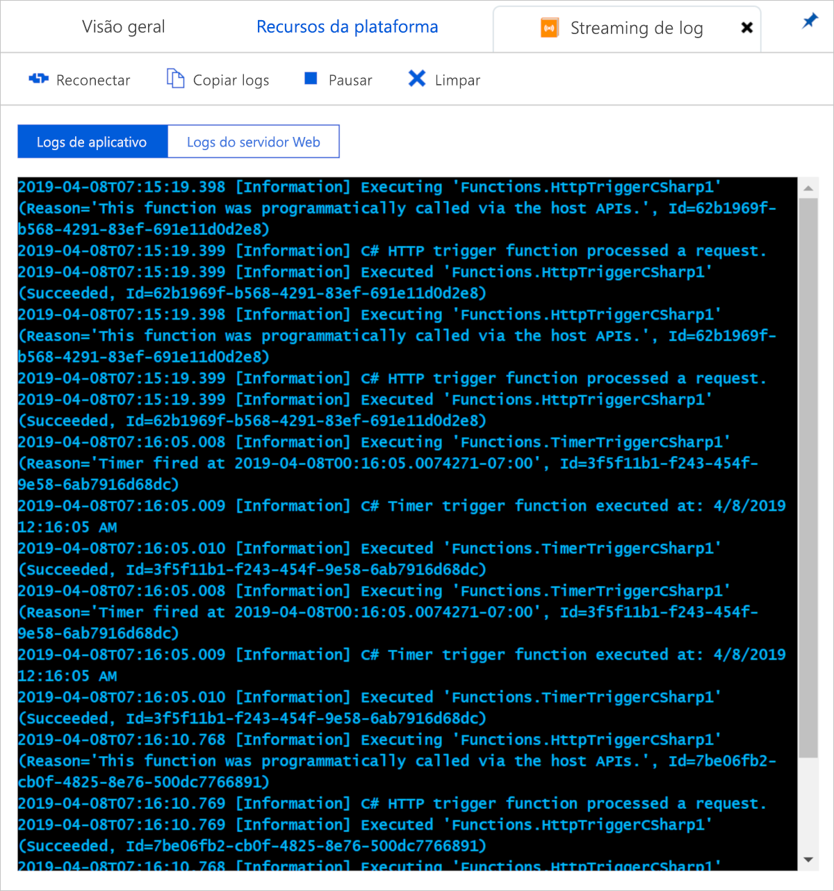
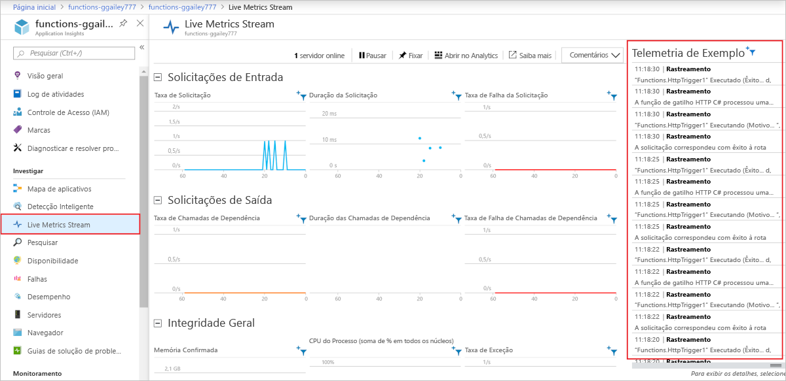

# <a name="enable-streaming-execution-logs-in-azure-functions"></a>Habilitar logs de execução de streaming no Azure Functions

Ao desenvolver um aplicativo, muitas vezes você deseja ver o que está sendo gravado nos logs quase em tempo real durante a execução no Azure.

Há duas maneiras de exibir um fluxo de arquivos de log que está sendo gerado por suas execuções de funções.

* **Streaming de log interno**: a plataforma do Serviço de Aplicativo permite exibir um fluxo dos arquivos de log do aplicativo. Isso é equivalente à saída que aparece ao depurar suas funções durante o [desenvolvimento local](functions-develop-local.md) e ao usar a guia **Teste** no portal. Todas as informações baseadas em log são exibidas. Para obter mais informações, consulte [Streaming de logs](../app-service/troubleshoot-diagnostic-logs.md#stream-logs). Esse método de streaming é compatível com apenas uma única instância e não pode ser usado com um aplicativo executado no Linux em um plano de Consumo.

* **Live Metrics Stream**: quando seu aplicativo de funções está [conectado ao Application Insights](configure-monitoring.md#enable-application-insights-integration), você pode exibir dados de log e outras métricas quase em tempo real no portal do Azure usando [Live Metrics Stream](../azure-monitor/app/live-stream.md). Use esse método ao monitorar funções em execução em várias instâncias ou no Linux em um plano de Consumo. Esse método usa [dados amostrados](configure-monitoring.md#configure-sampling).

Os fluxos de log podem ser exibidos no portal e na maioria dos ambientes de desenvolvimento local. 

## <a name="portal"></a>Portal

Você pode exibir os dois tipos de fluxos de log no portal.

### <a name="built-in-log-streaming"></a>Streaming de log interno

Para exibir os logs de streaming no portal, selecione a guia **Recursos da plataforma** no seu aplicativo de funções. Em seguida, em **Monitoramento**, escolha **Streaming de log**.


Isso conecta seu aplicativo ao serviço de streaming de log e os logs de aplicativo são exibidos na janela. Você pode alternar entre **Logs de aplicativo** e **Logs do servidor Web**.  



### <a name="live-metrics-stream"></a>Live Metrics Stream

Para exibir o Live Metrics Stream para seu aplicativo, selecione a guia **Visão geral** do seu aplicativo de funções. Quando tiver Application Insights habilitado, você verá um link **Application Insights** em **Recursos configurados**. Esse link leva até a página de Application Insights para seu aplicativo.

No Application Insights, selecione **Live Metrics Stream**. [As entradas de log amostradas](configure-monitoring.md#configure-sampling) são exibidas em **Telemetria da amostra**.

 

## <a name="visual-studio-code"></a>Visual Studio Code

[!INCLUDE [functions-enable-log-stream-vs-code](../../includes/functions-enable-log-stream-vs-code.md)]

## <a name="core-tools"></a>Ferramentas do Core

[!INCLUDE [functions-streaming-logs-core-tools](../../includes/functions-streaming-logs-core-tools.md)]

## <a name="azure-cli"></a>CLI do Azure

Você pode habilitar streaming de logs usando a [CLI do Azure](/cli/azure/install-azure-cli). Use os comandos a seguir para entrar, escolha sua assinatura e transmita os arquivos de log:

```azurecli
az login
az account list
az account set --subscription <subscriptionNameOrId>
az webapp log tail --resource-group <RESOURCE_GROUP_NAME> --name <FUNCTION_APP_NAME>
```

## <a name="azure-powershell"></a>Azure PowerShell

Você pode habilitar streaming de logs usando [Azure PowerShell](/powershell/azure/). Para o PowerShell, use o comando [set-AzWebApp](/powershell/module/az.websites/set-azwebapp) para habilitar o registro em log no aplicativo de funções, conforme mostrado no trecho a seguir: 

:::code language="powershell" source="~/powershell_scripts/app-service/monitor-with-logs/monitor-with-logs.ps1" range="19-20":::

Para obter mais informações, consulte o [exemplo de código completo](../app-service/scripts/powershell-monitor.md#sample-script). 

## <a name="next-steps"></a>Próximas etapas

+ [Monitorar Azure Functions](functions-monitoring.md)
+ [Analisar Azure Functions telemetria no Application Insights](analyze-telemetry-data.md)
