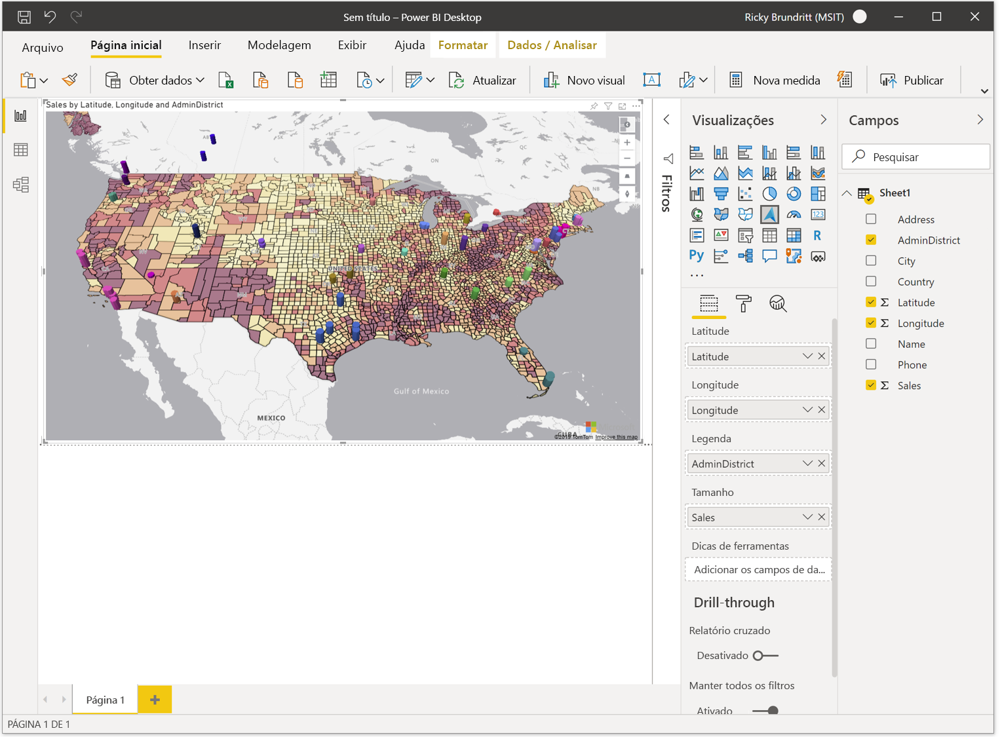

# Introdução ao Visual do Azure Maps Power BI

<Token>**aplica-se a:**  Serviço do Power BI para **_consumidores_* _  Serviço do Power BI para designers &  Power BI Desktop  Requer licença pro ou Premium</Token>

Este artigo mostra como usar o Visual do Microsoft Azure Maps para Power BI.

> [!NOTE]
> Esse visual pode ser criado e exibido tanto no Power BI Desktop quanto no serviço do Power BI. As etapas e ilustrações deste artigo são do Power BI Desktop.

O visual do Azure Mapas para Power BI fornece um rico conjunto de visualizações de dados para dados espaciais sobre um mapa. É estimado que mais de 80% dos dados corporativos tenham um contexto de localização. O Visual Maps do Azure pode ser usado para obter informações sobre como esse contexto de local se relaciona e influencia seus dados corporativos.

## O que é enviado para o Azure?

O Visual do mapas do Azure se conecta ao serviço de nuvem hospedado no Azure para recuperar dados de localização, como imagens de mapa e coordenadas que são usadas para criar a visualização de mapa. 

-   Os detalhes sobre a área em que o mapa está focalizado são enviados ao Azure para recuperar as imagens necessárias para renderizar a tela de mapa (também conhecida como blocos de mapa). 
-   Os dados nos buckets local, latitude e longitude podem ser enviados ao Azure para recuperar coordenadas de mapa (um processo chamado geocodificação). 
-   Os dados de telemetria podem ser coletados na integridade do Visual (ou seja, relatórios de falha), se a opção de telemetria no Power BI estiver habilitada.

Além dos cenários descritos acima, nenhum outro dado sobreposto no mapa é enviado aos servidores do Azure Maps. Toda a renderização de dados ocorre localmente no cliente.

Você, ou seu administrador, talvez precise atualizar seu firewall para permitir o acesso à plataforma mapas do Azure que usa a URL a seguir.

> `https://atlas.microsoft.com`

Para saber mais, sobre privacidade e termos de uso relacionados ao Visual do Azure Maps, consulte [Microsoft Azure informações legais](https://azure.microsoft.com/support/legal/).

## Comportamento e requisitos do Visual do Azure Maps (visualização)

Há algumas considerações e requisitos para o Visual *Maps * do Azure*. :

-   O Visual do **mapas do Azure** (visualização) deve estar habilitado no Power bi desktop. Para habilitar o Visual **do Azure Maps** , selecione **File** &gt; **Opções de arquivo e configurações** &gt; **Opções** de &gt; **Visualização recursos** e marque a caixa de seleção **Visual do Azure Maps** . Se o Visual do Azure Maps não estiver disponível depois de fazer isso, é provável que uma opção de administrador de locatários no portal de administração precise ser habilitada.
-   O conjunto de dados deve ter campos que contenham informações de **latitude** e **longitude** . A codificação geográfica de campos de localização será adicionada em uma atualização futura.
-   O controle de legenda interno para Power BI não aparece atualmente nesta visualização. Ele será adicionado em uma atualização futura.

## Usar o Visual do Azure Maps (visualização)

Depois que o Visual do **Azure Maps** estiver habilitado, selecione o ícone **mapas do Azure** no painel **visualizações** .

Power BI cria uma tela de Design Visual do Azure Maps vazia. Durante a visualização, um aviso adicional é exibido.

Execute as seguintes etapas para carregar o Visual do Azure Maps:

1.  No painel **campos** , arraste os campos de dados que contêm informações de coordenadas de latitude e longitude nos buckets de **latitude** e/ou **longitude** . Estes são os dados mínimos necessários para carregar o Visual do Azure Maps.
    
    > [!div class="mx-imgBorder"]
    > 

2.  Para colorir os dados com base na categorização, arraste um campo categórico para o Bucket de **legenda** do painel **campos** . Neste exemplo, estamos usando a coluna **AdminDistrict** (também conhecida como estado ou província).  
    
    > [!div class="mx-imgBorder"]
    > 

    > [!NOTE]
    > O controle de legenda interno para Power BI não aparece atualmente nesta visualização. Ele será adicionado em uma atualização futura.

3.  Para dimensionar os dados relativamente, arraste uma medida para o Bucket **tamanho** do painel **campos** . Neste exemplo, estamos usando a coluna **Sales** .  
    
    > [!div class="mx-imgBorder"]
    > 

4.  Use as opções no painel **Formatar** para personalizar como os dados são renderizados. A imagem a seguir é o mesmo mapa acima, mas com a opção de transparência preenchimento de camadas de bolha definida como 50% e a opção de estrutura de tópicos de alto contraste habilitada.  
    
    > [!div class="mx-imgBorder"]
    > 

## Buckets de painel de campos

Os seguintes buckets de dados estão disponíveis no painel **campos** do Visual mapas do Azure.

| Campo     | Descrição  |
|-----------|--------------|
| Latitude  | O campo usado para especificar o valor de latitude dos pontos de dados. Os valores de latitude devem estar entre-90 e 90 no formato decimal graus.  |
| Longitude | O campo usado para especificar o valor de longitude dos pontos de dados. Os valores de longitude devem estar entre-180 e 180 no formato decimal graus.  |
| Legenda    | O campo usado para categorizar os dados e atribuir uma cor exclusiva para pontos de dados em cada categoria. Quando esse Bucket for preenchido, uma seção **cores de dados** será exibida no painel **formato** , que permite ajustes nas cores. |
| Tamanho      | A medida usada para o dimensionamento relativo de pontos de dados no mapa.   |
| Dicas de ferramenta  | Campos de dados adicionais que são exibidos em dicas de ferramenta quando as formas são focalizadas. |

## Configurações de mapa

A seção **configurações do mapa** do painel Formatar fornece opções para personalizar como o mapa é exibido e reage às atualizações.

| Configuração             | Descrição  |
|---------------------|--------------|
| Zoom automático           | Amplia automaticamente o mapa nos dados carregados por meio do painel **campos** do Visual. À medida que os dados são alterados, o mapa atualizará sua posição de acordo. Quando o controle deslizante está na posição **desativado** , as configurações de exibição de mapa adicionais são exibidas para a exibição de mapa padrão. |
| Quebra automática de mundo          | Permite ao usuário deslocar o mapa horizontalmente infinitamente. |
| Seletor de estilo        | Adiciona um botão ao mapa que permite que os leitores de relatório alterem o estilo do mapa. |
| Controles de navegação | Adiciona botões ao mapa como outro método para permitir que os leitores de relatório apliquem zoom, giram e alterem o timbre do mapa. Para obter mais informações, consulte este documento sobre como [navegar no mapa](map-accessibility.md#navigating-the-map) para obter detalhes sobre todas as diferentes maneiras que os usuários podem navegar no mapa. |
| Estilo de mapa           | O estilo do mapa. Para obter mais informações, consulte este documento para obter mais informações sobre os [estilos de mapa com suporte](supported-map-styles.md). |

### Configurações de exibição do mapa

Se o controle deslizante de **zoom automático** estiver na posição **desativado** , as configurações a seguir serão exibidas e permitirão que o usuário especifique as informações de exibição do mapa padrão.

| Configuração          | Descrição   |
|------------------|---------------|
| Zoom             | O nível de zoom padrão do mapa. Pode ser um número entre 0 e 22. |
| Latitude do centro  | A latitude padrão no centro do mapa. |
| Longitude do centro | A longitude padrão no centro do mapa. |
| Direcionamento          | A orientação padrão do mapa em graus, em que 0 é norte, 90 é leste, 180 é Sul e 270 é oeste. Pode ser qualquer número entre 0 e 360. |
| Densidade            | A inclinação padrão do mapa em graus entre 0 e 60, em que 0 está olhando diretamente para o mapa. |

## Considerações e limitações

O Visual Maps do Azure está disponível nos seguintes serviços e aplicativos:

| Serviço/Aplicativo                              | Disponibilidade |
|------------------------------------------|--------------|
| Power BI Desktop                         | Sim          |
| Serviço do Power BI (app.powerbi.com)       | Sim          |
| Aplicativos móveis do Power BI             | Sim          |
| Publicar na Web do Power BI                  | Não           |
| Power BI Embedded                        | Não           |
| Incorporação do serviço do Power BI (PowerBI.com) | Sim          |

O suporte para serviços/aplicativos Power BI adicionais será adicionado em atualizações futuras.

**Onde o Azure Maps está disponível?**

Neste momento, o mapas do Azure está disponível atualmente em todos os países e regiões, exceto o seguinte:

- China
- Coreia do Sul

Para obter detalhes de cobertura para os diferentes serviços do Azure Maps que capacitam esse visual, consulte o documento [informações de cobertura geográfica](geographic-coverage.md) .

**Quais navegadores da Web têm suporte no Visual Maps do Azure?**

Consulte esta documentação para obter informações sobre os [navegadores com suporte do SDK Web do Azure Maps](supported-browsers.md).

**Quantos pontos de dados posso Visualizar?**

Este Visual dá suporte a até 30.000 pontos de dados.

**Os endereços ou outras cadeias de caracteres de localização podem ser usados neste Visual?**

A visualização inicial desse visual só dá suporte a valores de latitude e longitude em graus decimais. Uma atualização futura adicionará suporte para endereços e outras cadeias de caracteres de local.

## Próximas etapas

Saiba mais sobre o Visual do Azure Maps Power BI:

> [!div class="nextstepaction"]
> [Noções básicas sobre camadas no Azure Maps Power BI Visual](power-bi-visual-understanding-layers.md)

> [!div class="nextstepaction"]
> [Gerenciar o Visual do Azure Maps em sua organização](power-bi-visual-manage-access.md)

Personalize o Visual:

> [!div class="nextstepaction"]
> [Dicas e truques para formatação com cores no Power BI](/power-bi/visuals/service-tips-and-tricks-for-color-formatting)

> [!div class="nextstepaction"]
> [Personalizar títulos, telas de fundo e legendas de visualizações](/power-bi/visuals/power-bi-visualization-customize-title-background-and-legend)