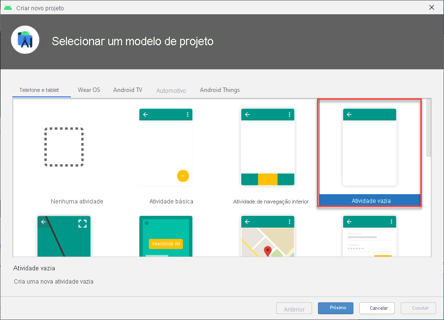

# <a name="quickstart-create-an-android-app-with-azure-maps"></a>Início Rápido: Criar um aplicativo Android com o Azure Mapas

Este artigo mostra como adicionar o Azure Mapas a um aplicativo Android. Ele apresenta e explica as seguintes etapas básicas:

* Configurar seu ambiente de desenvolvimento.
* Criar sua conta do Azure Mapas.
* Obter a chave primária do Azure Mapas para usar no aplicativo.
* Referenciar as bibliotecas do Azure Mapas no projeto.
* Adicionar um controle do Azure Mapas ao aplicativo.

## <a name="prerequisites"></a>Pré-requisitos

1. Crie uma conta do Azure Mapas entrando no [portal do Azure](https://portal.azure.com). Se você não tiver uma assinatura do Azure, crie uma [conta gratuita](https://azure.microsoft.com/free/) antes de começar.
2. [Faça uma conta do Azure Mapas](quick-demo-map-app.md#create-an-azure-maps-account)
3. [Obtenha uma chave de assinatura primária](quick-demo-map-app.md#get-the-primary-key-for-your-account), também conhecida como a chave primária ou a chave de assinatura. Para obter mais informações sobre a autenticação nos Azure Mapas, confira [Gerenciar a autenticação nos Azure Mapas](how-to-manage-authentication.md).
4. [Baixar o Android Studio](https://developer.android.com/studio/) gratuitamente pelo Google.

## <a name="create-an-azure-maps-account"></a>Criar uma conta dos Mapas do Azure

Crie uma conta do Azure Mapas seguindo as etapas abaixo:

1. No canto superior esquerdo do [portal do Azure](https://portal.azure.com), clique em **Criar um recurso**.
2. Na caixa *Pesquisar no Marketplace*, digite **Azure Mapas**.
3. Em *Resultados*, selecione **Azure Mapas**. Clique no botão **Criar** que aparece abaixo do mapa.
4. Na página **Criar Conta dos Mapas**, insira os seguintes valores:
    * A *Assinatura* que você deseja usar para a conta.
    * O nome do *Grupo de recursos* para a conta. Você pode optar por *Criar novo* ou *Usar existente* em relação ao grupo de recursos.
    * O *Nome* da sua nova conta.
    * A *Camada de preços* para essa conta.
    * Leia a *Política de Privacidade* e de *Licença* e marque a caixa de seleção para aceitar os termos.
    * Selecione o botão **Criar**.

    

## <a name="get-the-primary-key-for-your-account"></a>Obter a chave primária de sua conta

Depois de criar com êxito sua conta dos Mapas, recupere a chave primária que permite consultar as APIs dos Mapas.

1. Abra a sua conta dos Mapas no portal.
2. Na seção de configurações, selecione **Autenticação**.
3. Copie a **Chave Primária** para sua área de transferência. Salve-a localmente para usar depois neste tutorial.

>[!NOTE]
> Se você usar a chave de assinatura do Azure em vez da chave primária do Azure Mapas, seu mapa não será renderizado corretamente. Além disso, para fins de segurança, é recomendável que você faça a rotação entre as chaves primária e secundária. Para fazer a rotação das chaves, atualize seu aplicativo para usar a chave secundária, implante, em seguida, pressione o botão ciclo/atualizar ao lado da chave primária para gerar uma nova chave primária. A chave primária antiga será desabilitada. Para obter mais informações sobre a rotação de chaves, confira [Configurar o Azure Key Vault com a rotação de chaves e auditoria](../key-vault/secrets/tutorial-rotation-dual.md)


## <a name="create-a-project-in-android-studio"></a>Criar um projeto no Android Studio

Primeiro, crie um novo projeto com uma atividade vazia. Conclua estas etapas para criar um projeto do Android Studio:

1. Em **Escolher o projeto**, selecione **Telefone e Tablet**. O aplicativo será executado neste fator forma.
2. Na guia **Telefone e Tablet**, selecione **Atividade Vazia** e depois selecione **Próximo**.
3. Em **Configurar seu projeto**, selecione `API 21: Android 5.0.0 (Lollipop)` como o SDK mínimo. Esta é a versão mais antiga com suporte pelo SDK do Android do Azure Mapas.
4. Aceite o padrão `Activity Name` e `Layout Name` e selecione **Concluir**.

Consulte a [documentação do Android Studio](https://developer.android.com/studio/intro/) para obter mais ajuda com a instalação do Android Studio e criação de um novo projeto.



## <a name="set-up-a-virtual-device"></a>Configurar um dispositivo virtual

O Android Studio permite configurar um dispositivo Android virtual no computador. Esse procedimento pode ajudar a testar o aplicativo durante o desenvolvimento. Para configurar um dispositivo virtual, selecione o ícone do Gerenciador de Dispositivo Virtual Android (AVD) no canto superior direito da tela do projeto e, em seguida, selecione **Criar Dispositivo Virtual**. Você também pode acessar o Gerenciador de AVD selecionando **Ferramentas** > **Android** > **Gerenciador de AVD** na barra de ferramentas. Na categoria **Telefones**, selecione **Nexus 5X** e clique em **Avançar**.

Você pode aprender mais sobre a configuração de um AVD na [documentação do Android Studio](https://developer.android.com/studio/run/managing-avds).


## <a name="install-the-azure-maps-android-sdk"></a>Instalar o SDK do Android do Azure Mapas

A próxima etapa na criação do aplicativo é instalar o SDK do Android do Azure Mapas. Conclua estas etapas para instalar o SDK:

1. Abra o arquivo de nível superior **build.gradle** e adicione o código a seguir à seção do bloco **todos os projetos**, **repositórios**:

    ```java
    maven {
        url "https://atlas.microsoft.com/sdk/android"
    }
    ```

2. Atualize o **app/build.gradle** e adicione a ele o seguinte código:

    1. Verifique se o **minSdkVersion** do seu projeto está na API 21 ou superior.

    2. Adicione o código a seguir à seção do Android:

        ```java
        compileOptions {
            sourceCompatibility JavaVersion.VERSION_1_8
            targetCompatibility JavaVersion.VERSION_1_8
        }
        ```

    3. Atualize seu bloco de dependências e adicione uma nova linha de dependência de implementação para o mais recente SDK do Android do Azure Mapas:

        ```java
        implementation "com.microsoft.azure.maps:mapcontrol:0.6"
        ```

        > [!Note]
        > Você pode definir o número de versão para "0+" para que o código sempre aponte para a última versão.

    4. Vá para **Arquivo** na barra de ferramentas e clique em **Sincronizar Projeto com Arquivos Gradle**.
3. Adicione um fragmento de mapa à atividade principal (res \> layout \> activity\_main.xml):

    ```XML
    <?xml version="1.0" encoding="utf-8"?>
    <FrameLayout
        xmlns:android="http://schemas.android.com/apk/res/android"
        xmlns:app="http://schemas.android.com/apk/res-auto"
        android:layout_width="match_parent"
        android:layout_height="match_parent"
        >

        <com.microsoft.azure.maps.mapcontrol.MapControl
            android:id="@+id/mapcontrol"
            android:layout_width="match_parent"
            android:layout_height="match_parent"
            />
    </FrameLayout>
    ```

4. No arquivo **MainActivity.java**, você precisará:

    * adicionar importações para o SDK do Azure Mapas
    * definir as informações de autenticação do Azure Mapas
    * obter a instância de controle de mapeamento no método **onCreate**

    Definir as informações de autenticação globalmente na classe `AzureMaps` usando os métodos `setSubscriptionKey` ou `setAadProperties` faz com que você não precise adicionar suas informações de autenticação a cada exibição.

    O controle de mapa contém os próprios métodos de ciclo de vida para gerenciar o ciclo de vida do OpenGL do Android. Esses métodos do ciclo de vida precisam ser chamados diretamente na Atividade relativa. Para que o aplicativo chame corretamente os métodos de ciclo de vida do controle de mapa, é necessário substituir os métodos de ciclo de vida a seguir na atividade que contém o controle de mapa. Além disso, você deve chamar o respectivo método de controle de mapa.

    * `onCreate(Bundle)`
    * `onStart()`
    * `onResume()`
    * `onPause()`
    * `onStop()`
    * `onDestroy()`
    * `onSaveInstanceState(Bundle)`
    * `onLowMemory()`

    Edite o arquivo **MainActivity.java** da seguinte maneira:

    ```Java
    package com.example.myapplication;
    
    //For older versions use: import android.support.v7.app.AppCompatActivity; 
    import androidx.appcompat.app.AppCompatActivity;
    import com.microsoft.azure.maps.mapcontrol.AzureMaps;
    import com.microsoft.azure.maps.mapcontrol.MapControl;
    import com.microsoft.azure.maps.mapcontrol.layer.SymbolLayer;
    import com.microsoft.azure.maps.mapcontrol.options.MapStyle;
    import com.microsoft.azure.maps.mapcontrol.source.DataSource;
    
    public class MainActivity extends AppCompatActivity {
        
    static {
        AzureMaps.setSubscriptionKey("<Your Azure Maps subscription key>");

        //Alternatively use Azure Active Directory authenticate.
        //AzureMaps.setAadProperties("<Your aad clientId>", "<Your aad AppId>", "<Your aad Tenant>");
    }

    MapControl mapControl;

    @Override
    protected void onCreate(Bundle savedInstanceState) {
        super.onCreate(savedInstanceState);
        setContentView(R.layout.activity_main);

        mapControl = findViewById(R.id.mapcontrol);

        mapControl.onCreate(savedInstanceState);

        //Wait until the map resources are ready.
        mapControl.onReady(map -> {
            //Add your post map load code here.

        });
    }

    @Override
    public void onResume() {
        super.onResume();
        mapControl.onResume();
    }

    @Override
    protected void onStart(){
        super.onStart();
        mapControl.onStart();
    }

    @Override
    public void onPause() {
        super.onPause();
        mapControl.onPause();
    }

    @Override
    public void onStop() {
        super.onStop();
        mapControl.onStop();
    }

    @Override
    public void onLowMemory() {
        super.onLowMemory();
        mapControl.onLowMemory();
    }

    @Override
    protected void onDestroy() {
        super.onDestroy();
        mapControl.onDestroy();
    }

    @Override
    protected void onSaveInstanceState(Bundle outState) {
        super.onSaveInstanceState(outState);
        mapControl.onSaveInstanceState(outState);
    }}
    ```

    > [!NOTE]
    > Depois de concluir as etapas anteriores, provavelmente você receberá avisos do Android Studio sobre parte do código. Para resolver esses avisos, importe as classes referenciadas em `MainActivity.java`.
    > É possível importar essas classes selecionando `Alt` + `Enter` (`Option` + `Return` em um Mac).

5. Selecione o botão Executar, conforme mostrado no gráfico a seguir (ou pressione `Control` + `R` em um Mac) para compilar o aplicativo.

    

O Android Studio levará alguns segundos para criar o aplicativo. Após concluir a criação do aplicativo, você poderá testá-lo no dispositivo Android emulado. Você verá um mapa semelhante a esse:


## <a name="clean-up-resources"></a>Limpar os recursos

>[!WARNING]
> Os tutorais listados na seção [Próximas Etapas](#next-steps) detalham como usar e configurar o Azure Mapas com sua conta. Se você planeja continuar com os tutoriais, não limpe os recursos criados neste início rápido.

Se você não planeja continuar com os tutorais, siga estas etapas para limpar os recursos:

1. Feche o Android Studio e exclua o aplicativo que você criou.
2. Se você testou o aplicativo em um dispositivo externo, desinstale-o desse dispositivo.

Se você não planeja continuar a desenvolver com o SDK do Android do Azure Mapas:

1. Navegue até a página do portal do Azure. Selecione **Todos os recursos** na página principal do portal. Ou clique no ícone de menu no canto superior esquerdo. Selecione **Todos os recursos**.
2. Clique na sua conta do Azure Mapas. Na parte superior da página, clique em **Excluir**.
3. Opcionalmente, se você não planeja continuar desenvolvendo aplicativos Android, desinstale o Android Studio.

Para obter mais exemplos de código, confira estes guias:

* [Gerenciar autenticação no Azure Mapas](how-to-manage-authentication.md)
* [Alterar estilos de mapa nos mapas do Android](set-android-map-styles.md)
* [Adicionar uma camada de símbolo](how-to-add-symbol-to-android-map.md)
* [Adicionar uma camada de linha](android-map-add-line-layer.md)
* [Adicionar uma camada de polígono](how-to-add-shapes-to-android-map.md)

## <a name="next-steps"></a>Próximas etapas

Neste início rápido, você criou sua conta do Azure Mapas e um aplicativo de demonstração. Confira os seguintes tutoriais para saber mais sobre o Azure Mapas:

> [!div class="nextstepaction"]
> [Carregar dados GeoJSON no Azure Mapas](tutorial-load-geojson-file-android.md)