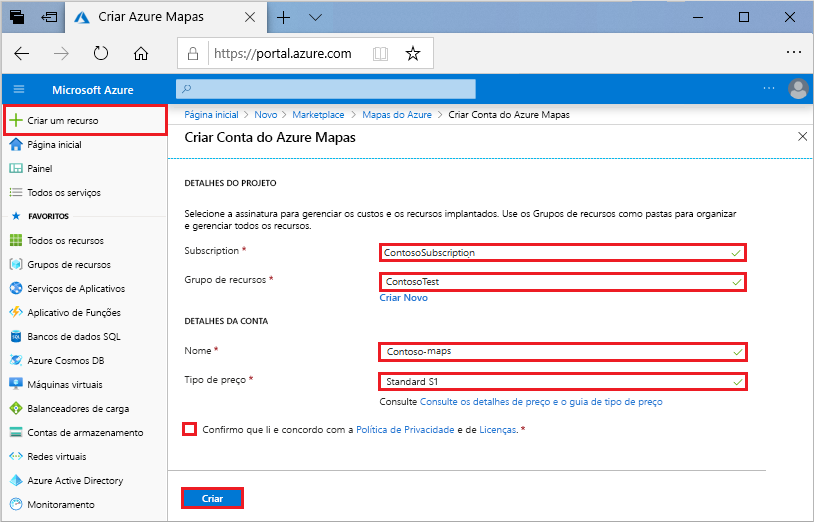
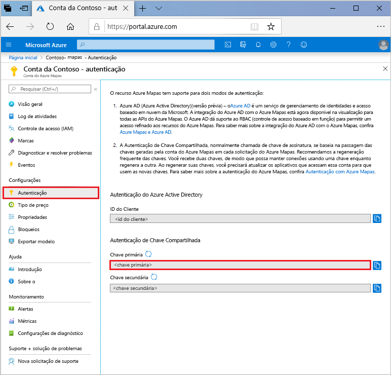

# Início Rápido: Criar um mapa de pesquisa interativo usando o Azure Mapas

Este artigo demonstra os recursos dos Mapas do Azure para criar um mapa que fornece aos usuários uma experiência de pesquisa interativa. Ele apresenta e explica as seguintes etapas básicas:
* Criar sua conta do Azure Mapas.
* Obter a chave de conta para usar no aplicativo Web de demonstração.

Se você não tiver uma assinatura do Azure, crie uma [conta gratuita](https://azure.microsoft.com/free/?WT.mc_id=A261C142F) antes de começar.

## Entre no Portal do Azure

Entre no [portal do Azure](https://portal.azure.com).

## Criar uma conta dos Mapas do Azure

Crie uma nova conta dos Mapas seguindo as etapas abaixo:

1. No canto superior esquerdo do [portal do Azure](https://portal.azure.com), clique em **Criar um recurso**.
2. No campo *Pesquisar no Marketplace*, digite **Mapas**.
3. Nos *Resultados*, selecione **Mapas**. Clique no botão **Criar** que aparece abaixo do mapa.
4. Na página **Criar Conta dos Mapas**, insira os seguintes valores:
    * A *Assinatura* que você deseja usar para a conta.
    * O nome do *Grupo de recursos* para a conta. Você pode optar por *Criar novo* ou *Usar existente* em relação ao grupo de recursos.
    * O *Nome* da sua nova conta.
    * A *Camada de preços* para essa conta.
    * Leia a *Política de Privacidade* e de *Licença* e marque a caixa de seleção para aceitar os termos.
    * Selecione o botão **Criar**.

## Obter a chave primária de sua conta

Depois de criar com êxito sua conta dos Mapas, recupere a chave que permite consultar as APIs dos Mapas. É recomendável usar a chave primária da sua conta como a chave de assinatura ao chamar os serviços do Azure Mapas.

1. Abra a sua conta dos Mapas no portal.
2. Na seção de configurações, selecione **Autenticação**.
3. Copie a **Chave Primária** para sua área de transferência. Salve-a localmente para usar depois neste tutorial.

## Fazer o download do aplicativo

1. Baixe ou copie o conteúdo do arquivo [interactiveSearch.html](https://github.com/Azure-Samples/AzureMapsCodeSamples/blob/master/AzureMapsCodeSamples/Tutorials/interactiveSearch.html).
2. Salve o conteúdo deste arquivo localmente como **AzureMapDemo.html**. Abra-o em um editor de texto.
3. Pesquise pela cadeia de caracteres `<Your Azure Maps Key>`. Substitua-o pelo valor **Chave primária** da seção anterior.

## Abra o aplicativo

1. Abra o arquivo **AzureMapDemo.html** em um navegador de sua escolha.
2. Observe o mapa mostrado da Cidade de Los Angeles. Amplie e reduza para ver como o mapa renderiza automaticamente com mais ou menos informações, dependendo do nível de zoom. 
3. Altere o centro padrão do mapa. No arquivo **AzureMapDemo.html**, procure a variável chamada **center**. Substitua o par de valores de latitude e longitude dessa variável pelos novos valores **[-74,0060; 40,7128]** . Salve o arquivo e atualize seu navegador.
4. Teste a experiência de pesquisa interativa. Na caixa de pesquisa no canto superior esquerdo do aplicativo Web da demonstração, pesquise **restaurantes**.
5. Mova o mouse sobre a lista de endereços e locais que aparecem abaixo da caixa de pesquisa. Observe como o marcador correspondente no mapa mostra informações sobre esse local. Para preservar a privacidade de empresas particulares, são mostrados endereços e nomes fictícios.

    

## Limpar os recursos

Os tutoriais entram em detalhes sobre como usar e configurar o Azure Mapas com sua conta. Se você planeja continuar com os tutoriais, não limpe os recursos criados neste início rápido. Se você não planeja continuar, siga estas etapas para limpar os recursos:

1. Feche o navegador que está executando o aplicativo Web **AzureMapDemo.html**.
2. No menu à esquerda no portal do Azure, selecione **Todos os recursos**. Em seguida, selecione sua conta do Azure Mapas. Na parte superior da folha **Todos os recursos**, marque **Excluir**.

## Próximas etapas

Neste início rápido, você criou sua conta do Azure Mapas e criou um aplicativo de demonstração. Confira os seguintes tutoriais para saber mais sobre os Azure Mapas:

> [!div class="nextstepaction"]
> [Pesquisar pontos de interesse próximos usando o Azure Mapas](tutorial-search-location.md)

Para obter mais exemplos de código e uma experiência interativa de codificação, consulte estes guias:

> [!div class="nextstepaction"]
> [Encontrar um endereço usando o serviço de pesquisa do Azure Mapas](how-to-search-for-address.md)

> [!div class="nextstepaction"]
> [Usar o Controle de Mapeamento do Azure Mapas](how-to-use-map-control.md)
