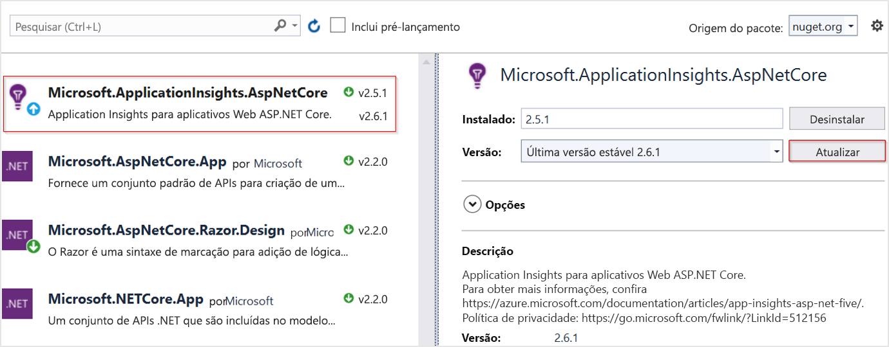

# <a name="application-insights-for-aspnet-core-applications"></a>Application Insights para aplicativos ASP.NET Core

Este artigo descreve como habilitar Application Insights para um aplicativo [ASP.NET Core](/aspnet/core) . Quando você concluir as instruções neste artigo, Application Insights coletará solicitações, dependências, exceções, contadores de desempenho, pulsações e logs do seu aplicativo ASP.NET Core.

O exemplo que usaremos aqui é um [aplicativo MVC](/aspnet/core/tutorials/first-mvc-app) que tem como destino `netcoreapp3.0` . Você pode aplicar essas instruções a todos os ASP.NET Core aplicativos. Se você estiver usando o [serviço de trabalho](/aspnet/core/fundamentals/host/hosted-services#worker-service-template), use as instruções [aqui](./worker-service.md).

## <a name="supported-scenarios"></a>Cenários com suporte

O [SDK do Application insights para ASP.NET Core](https://nuget.org/packages/Microsoft.ApplicationInsights.AspNetCore) pode monitorar seus aplicativos, independentemente de onde ou como eles são executados. Se seu aplicativo estiver em execução e tiver conectividade de rede com o Azure, a telemetria poderá ser coletada. Há suporte para o monitoramento de Application Insights em todos os lugares do .NET Core. O suporte abrange:
* **Sistema operacional**: Windows, Linux ou Mac.
* **Método de hospedagem**: em andamento ou fora do processo.
* **Método de implantação**: dependente da estrutura ou autossuficiente.
* **Servidor Web**: IIS (Internet Information Server) ou Kestrel.
* **Plataforma de hospedagem**: o recurso de aplicativos Web do Serviço de Aplicativo do Azure, VM do Azure, Docker, AKS (Serviço Kubernetes do Azure) e assim por diante.
* **Versão do .NET Core**: todas as versões do .NET Core [com suporte](https://dotnet.microsoft.com/download/dotnet-core) oficialmente.
* **IDE**: Visual Studio, vs Code ou linha de comando.

> [!NOTE]
> ASP.NET Core 3,1 requer [Application insights 2.8.0](https://www.nuget.org/packages/Microsoft.ApplicationInsights.AspNetCore/2.8.0) ou posterior.

## <a name="prerequisites"></a>Pré-requisitos

- Um aplicativo ASP.NET Core funcionando. Se você precisar criar um aplicativo ASP.NET Core, siga este [tutorial de ASP.NET Core](/aspnet/core/getting-started/).
- Uma chave de instrumentação de Application Insights válida. Essa chave é necessária para enviar qualquer telemetria para Application Insights. Se você precisar criar um novo recurso de Application Insights para obter uma chave de instrumentação, consulte [criar um recurso de Application insights](./create-new-resource.md).

> [!IMPORTANT]
> Novas regiões do Azure **exigem** o uso de cadeias de conexão em vez de chaves de instrumentação. A [cadeia de conexão](./sdk-connection-string.md?tabs=net) identifica o recurso ao qual você deseja associar os dados de telemetria. Ele também permite que você modifique os pontos de extremidade que o recurso usará como um destino para a telemetria. Você precisará copiar a cadeia de conexão e adicioná-la ao código do aplicativo ou a uma variável de ambiente.


## <a name="enable-application-insights-server-side-telemetry-visual-studio"></a>Habilitar Application Insights telemetria do lado do servidor (Visual Studio)

Por Visual Studio para Mac use as [diretrizes manuais](#enable-application-insights-server-side-telemetry-no-visual-studio). Somente a versão do Windows do Visual Studio dá suporte a esse procedimento.

1. Abra o projeto no Visual Studio.

    > [!TIP]
    > Se desejar, você pode configurar o controle do código-fonte para o seu projeto para poder acompanhar todas as alterações que Application Insights faz. Para habilitar o controle do código-fonte, selecione **arquivo**  >  **Adicionar ao controle do código-fonte**.

2. Selecione **projeto**  >  **Adicionar Application insights Telemetry**.

3. Selecione **Introdução**. O texto dessa seleção pode variar, dependendo da sua versão do Visual Studio. Em vez disso, algumas versões anteriores usam um botão **Iniciar gratuito** .

4. Selecione sua assinatura. Em seguida, selecione registro de **recursos**  >  .

5. Depois de adicionar Application Insights ao seu projeto, verifique se você está usando a versão estável mais recente do SDK. Vá para **projeto**  >  **gerenciar pacotes NuGet**  >  **Microsoft. ApplicationInsights. AspNetCore**. Se necessário, escolha **Atualizar**.

     

6. Se você seguiu a dica opcional e adicionou o projeto ao controle do código-fonte, acesse **Exibir**  >  **Team Explorer**  >  **alterações**. Em seguida, selecione cada arquivo para ver uma exibição de comparação das alterações feitas por Application Insights telemetria.

## <a name="enable-application-insights-server-side-telemetry-no-visual-studio"></a>Habilitar Application Insights telemetria do lado do servidor (sem o Visual Studio)

1. Instale o [pacote NuGet do SDK Application insights para ASP.NET Core](https://nuget.org/packages/Microsoft.ApplicationInsights.AspNetCore). Recomendamos que você sempre use a versão estável mais recente. Encontre notas de versão completas para o SDK no [repositório GitHub de código-fonte aberto](https://github.com/Microsoft/ApplicationInsights-dotnet/releases).

    O exemplo de código a seguir mostra as alterações a serem adicionadas ao arquivo do seu projeto `.csproj` .

    ```xml
        <ItemGroup>
          <PackageReference Include="Microsoft.ApplicationInsights.AspNetCore" Version="2.16.0" />
        </ItemGroup>
    ```

2. Adicione `services.AddApplicationInsightsTelemetry();` ao `ConfigureServices()` método em sua `Startup` classe, como neste exemplo:

    ```csharp
        // This method gets called by the runtime. Use this method to add services to the container.
        public void ConfigureServices(IServiceCollection services)
        {
            // The following line enables Application Insights telemetry collection.
            services.AddApplicationInsightsTelemetry();
    
            // This code adds other services for your application.
            services.AddMvc();
        }
    ```

3. Configure a chave de instrumentação.

    Embora seja possível fornecer a chave de instrumentação como um argumento para `AddApplicationInsightsTelemetry` , recomendamos que você especifique a chave de instrumentação na configuração. O exemplo de código a seguir mostra como especificar uma chave de instrumentação no `appsettings.json` . Certifique-se `appsettings.json` de que o seja copiado para a pasta raiz do aplicativo durante a publicação.

    ```json
        {
          "ApplicationInsights": {
            "InstrumentationKey": "putinstrumentationkeyhere"
          },
          "Logging": {
            "LogLevel": {
              "Default": "Warning"
            }
          }
        }
    ```

    Como alternativa, especifique a chave de instrumentação em qualquer uma das seguintes variáveis de ambiente:

    * `APPINSIGHTS_INSTRUMENTATIONKEY`

    * `ApplicationInsights:InstrumentationKey`

    Por exemplo:

    * `SET ApplicationInsights:InstrumentationKey=putinstrumentationkeyhere`

    * `SET APPINSIGHTS_INSTRUMENTATIONKEY=putinstrumentationkeyhere`

    * `APPINSIGHTS_INSTRUMENTATIONKEY` normalmente é usado em [aplicativos Web do Azure](./azure-web-apps.md?tabs=net), mas também pode ser usado em todos os locais em que há suporte para esse SDK. (Se você estiver fazendo um monitoramento de aplicativo Web sem código, esse formato será necessário se você não estiver usando cadeias de conexão.)

    Em vez de definir as chaves de instrumentação, agora você também pode usar [cadeias de conexão](./sdk-connection-string.md?tabs=net).

    > [!NOTE]
    > Uma chave de instrumentação especificada no código vence sobre a variável de ambiente `APPINSIGHTS_INSTRUMENTATIONKEY` , que vence em outras opções.

### <a name="user-secrets-and-other-configuration-providers"></a>Segredos do usuário e outros provedores de configuração

Se você quiser armazenar a chave de instrumentação em ASP.NET Core segredos de usuário ou recuperá-lo de outro provedor de configuração, poderá usar a sobrecarga com um `Microsoft.Extensions.Configuration.IConfiguration` parâmetro. Por exemplo, `services.AddApplicationInsightsTelemetry(Configuration);`.
A partir do Microsoft. ApplicationInsights. AspNetCore versão [2.15.0](https://www.nuget.org/packages/Microsoft.ApplicationInsights.AspNetCore), `services.AddApplicationInsightsTelemetry()` a chamada lerá automaticamente a chave de instrumentação do `Microsoft.Extensions.Configuration.IConfiguration` aplicativo. Não é necessário fornecer explicitamente o `IConfiguration` .

## <a name="run-your-application"></a>Execute seu aplicativo.

Execute seu aplicativo e faça solicitações a ele. A telemetria agora deve fluir para Application Insights. O SDK do Application Insights coleta automaticamente as solicitações da Web de entrada para seu aplicativo, juntamente com a telemetria a seguir também.

### <a name="live-metrics"></a>Live Metrics    

As [métricas dinâmicas](./live-stream.md) podem ser usadas para verificar rapidamente se Application insights monitoramento está configurado corretamente. Embora possa levar alguns minutos antes que a telemetria comece a aparecer no portal e na análise, as métricas ao vivo mostrarão o uso da CPU do processo em execução quase em tempo real. Ele também pode mostrar outras telemetrias, como solicitações, dependências, rastreamentos, etc.

### <a name="ilogger-logs"></a>Logs do ILogger

A configuração padrão coleta `ILogger` logs de severidade `Warning` e acima. Essa configuração pode ser [personalizada](#how-do-i-customize-ilogger-logs-collection).

### <a name="dependencies"></a>Dependências

A coleção de dependências é habilitada por padrão. [Este](asp-net-dependencies.md#automatically-tracked-dependencies) artigo explica as dependências coletadas automaticamente e também contém etapas para fazer o acompanhamento manual.

### <a name="performance-counters"></a>Contadores de desempenho

O suporte para [contadores de desempenho](./performance-counters.md) no ASP.NET Core é limitado:

* As versões 2.4.1 e posteriores do SDK coletarão contadores de desempenho se o aplicativo estiver sendo executado em aplicativos Web do Azure (Windows).
* As versões 2.7.1 e posteriores do SDK coletarão contadores de desempenho se o aplicativo estiver sendo executado no Windows e se destinar a `NETSTANDARD2.0` ou posterior.
* Para aplicativos destinados a .NET Framework, todas as versões do SDK dão suporte a contadores de desempenho.
* As versões 2.8.0 e posteriores do SDK dão suporte ao contador de CPU/memória no Linux. Nenhum outro contador tem suporte no Linux. A maneira recomendada para obter contadores do sistema no Linux (e em outros ambientes não Windows) é usando [EventCounters](#eventcounter)

### <a name="eventcounter"></a>EventCounter

`EventCounterCollectionModule` é habilitado por padrão. O tutorial do [EventCounter](eventcounters.md) tem instruções sobre como configurar a lista de contadores a serem coletados.

## <a name="enable-client-side-telemetry-for-web-applications"></a>Habilitar telemetria do lado do cliente para aplicativos Web

As etapas anteriores são suficientes para ajudá-lo a começar a coletar a telemetria do lado do servidor. Se seu aplicativo tiver componentes do lado do cliente, siga as próximas etapas para começar a coletar a [telemetria de uso](./usage-overview.md).

1. No `_ViewImports.cshtml` , adicione injeção:

```cshtml
    @inject Microsoft.ApplicationInsights.AspNetCore.JavaScriptSnippet JavaScriptSnippet
```

2. No `_Layout.cshtml` , insira `HtmlHelper` no final da `<head>` seção, mas antes de qualquer outro script. Se você quiser relatar qualquer telemetria personalizada do JavaScript da página, insira-a após este trecho:

```cshtml
    @Html.Raw(JavaScriptSnippet.FullScript)
    </head>
```

Como alternativa, o uso `FullScript` do `ScriptBody` está disponível a partir do SDK v 2.14. Use isso se você precisar controlar a `<script>` marca para definir uma política de segurança de conteúdo:

```cshtml
 <script> // apply custom changes to this script tag.
     @Html.Raw(JavaScriptSnippet.ScriptBody)
 </script>
```

Os `.cshtml` nomes de arquivo referenciados anteriormente são de um modelo de aplicativo MVC padrão. Por fim, se você quiser habilitar corretamente o monitoramento do lado do cliente para seu aplicativo, o trecho de código JavaScript deverá aparecer na `<head>` seção de cada página do aplicativo que você deseja monitorar. Você pode realizar essa meta para esse modelo de aplicativo adicionando o trecho de JavaScript ao `_Layout.cshtml` . 

Se o projeto não incluir `_Layout.cshtml` , você ainda poderá adicionar o [monitoramento do lado do cliente](./website-monitoring.md). Você pode fazer isso adicionando o trecho de JavaScript a um arquivo equivalente que controla o `<head>` de todas as páginas em seu aplicativo. Ou você pode adicionar o trecho a várias páginas, mas essa solução é difícil de manter e, em geral, não é recomendável.

## <a name="configure-the-application-insights-sdk"></a>Configurar o SDK do Application Insights

Você pode personalizar o SDK do Application Insights para ASP.NET Core para alterar a configuração padrão. Os usuários do Application Insights SDK do ASP.NET podem estar familiarizados com a alteração da configuração usando `ApplicationInsights.config` ou modificando `TelemetryConfiguration.Active` . Por ASP.NET Core, quase todas as alterações de configuração são feitas no `ConfigureServices()` método da sua `Startup.cs` classe, a menos que você seja direcionado de outra forma. As seções a seguir oferecem mais informações.

> [!NOTE]
> Em ASP.NET Core aplicativos, `TelemetryConfiguration.Active` não há suporte para alterar a configuração modificando.

### <a name="using-applicationinsightsserviceoptions"></a>Usando ApplicationInsightsServiceOptions

Você pode modificar algumas configurações comuns passando `ApplicationInsightsServiceOptions` para `AddApplicationInsightsTelemetry` , como neste exemplo:

```csharp
public void ConfigureServices(IServiceCollection services)
{
    Microsoft.ApplicationInsights.AspNetCore.Extensions.ApplicationInsightsServiceOptions aiOptions
                = new Microsoft.ApplicationInsights.AspNetCore.Extensions.ApplicationInsightsServiceOptions();
    // Disables adaptive sampling.
    aiOptions.EnableAdaptiveSampling = false;

    // Disables QuickPulse (Live Metrics stream).
    aiOptions.EnableQuickPulseMetricStream = false;
    services.AddApplicationInsightsTelemetry(aiOptions);
}
```

Lista completa de configurações em `ApplicationInsightsServiceOptions`

|Configuração | Descrição | Padrão
|---------------|-------|-------
|EnablePerformanceCounterCollectionModule  | Habilitar/desabilitar `PerformanceCounterCollectionModule` | true
|EnableRequestTrackingTelemetryModule   | Habilitar/desabilitar `RequestTrackingTelemetryModule` | true
|EnableEventCounterCollectionModule   | Habilitar/desabilitar `EventCounterCollectionModule` | true
|EnableDependencyTrackingTelemetryModule   | Habilitar/desabilitar `DependencyTrackingTelemetryModule` | true
|EnableAppServicesHeartbeatTelemetryModule  |  Habilitar/desabilitar `AppServicesHeartbeatTelemetryModule` | true
|EnableAzureInstanceMetadataTelemetryModule   |  Habilitar/desabilitar `AzureInstanceMetadataTelemetryModule` | true
|EnableQuickPulseMetricStream | Habilitar/desabilitar o recurso LiveMetrics | true
|EnableAdaptiveSampling | Habilitar/desabilitar amostragem adaptável | true
|EnableHeartbeat | Habilitar/desabilitar o recurso de pulsações, que periodicamente (padrão de 15 min) envia uma métrica personalizada chamada ' Heartbeatstate ' com informações sobre o tempo de execução como versão do .NET, informações de ambiente do Azure, se aplicável, etc. | true
|AddAutoCollectedMetricExtractor | Habilitar/desabilitar o extrator AutoCollectedMetrics, que é um TelemetryProcessor que envia métricas previamente agregadas sobre solicitações/dependências antes que a amostragem ocorra. | true
|RequestCollectionOptions.TrackExceptions | Habilitar/desabilitar o relatório de acompanhamento de exceção sem tratamento pelo módulo coleção de solicitações. | false no netstandard 2.0 (como as exceções são rastreadas com ApplicationInsightsLoggerProvider), caso contrário, true.
|EnableDiagnosticsTelemetryModule | Habilitar/desabilitar `DiagnosticsTelemetryModule` . Desabilitar isso fará com que as seguintes configurações sejam ignoradas; `EnableHeartbeat`, `EnableAzureInstanceMetadataTelemetryModule`, `EnableAppServicesHeartbeatTelemetryModule` | true

Consulte as [configurações configuráveis `ApplicationInsightsServiceOptions` no](https://github.com/microsoft/ApplicationInsights-dotnet/blob/develop/NETCORE/src/Shared/Extensions/ApplicationInsightsServiceOptions.cs) para obter a lista mais atualizada.

### <a name="configuration-recommendation-for-microsoftapplicationinsightsaspnetcore-sdk-2150--above"></a>Recomendação de configuração para Microsoft. ApplicationInsights. AspNetCore SDK 2.15.0 & acima

A partir do Microsoft. ApplicationInsights. AspNetCore SDK versão [2.15.0](https://www.nuget.org/packages/Microsoft.ApplicationInsights.AspNetCore/2.15.0), a recomendação é definir todas as configurações disponíveis no `ApplicationInsightsServiceOptions` , incluindo instrumentationkey usando a instância de aplicativos `IConfiguration` . As configurações devem estar na seção "ApplicationInsights", conforme mostrado no exemplo a seguir. A seção a seguir de appsettings.jsem configura a chave de instrumentação e também desabilita a amostragem adaptável e a coleta do contador de desempenho.

```json
{
    "ApplicationInsights": {
    "InstrumentationKey": "putinstrumentationkeyhere",
    "EnableAdaptiveSampling": false,
    "EnablePerformanceCounterCollectionModule": false
    }
}
```

Se `services.AddApplicationInsightsTelemetry(aiOptions)` for usado, ele substituirá as configurações de `Microsoft.Extensions.Configuration.IConfiguration` .

### <a name="sampling"></a>amostragem

O SDK do Application Insights para ASP.NET Core dá suporte à amostragem de taxa fixa e adaptável. A amostragem adaptável é habilitada por padrão.

Para obter mais informações, consulte [Configurar a amostragem adaptável para aplicativos ASP.NET Core](./sampling.md#configuring-adaptive-sampling-for-aspnet-core-applications).

### <a name="adding-telemetryinitializers"></a>Adicionando TelemetryInitializers

Use [inicializadores de telemetria](./api-filtering-sampling.md#addmodify-properties-itelemetryinitializer) quando desejar enriquecer a telemetria com informações adicionais.

Adicione qualquer novo `TelemetryInitializer` ao `DependencyInjection` contêiner, conforme mostrado no código a seguir. O SDK seleciona automaticamente qualquer que seja `TelemetryInitializer` adicionado ao `DependencyInjection` contêiner.

```csharp
public void ConfigureServices(IServiceCollection services)
{
    services.AddSingleton<ITelemetryInitializer, MyCustomTelemetryInitializer>();
}
```

> [!NOTE]
> `services.AddSingleton<ITelemetryInitializer, MyCustomTelemetryInitializer>();` funciona para inicializadores simples. Para outros, é necessário o seguinte: `services.AddSingleton(new MyCustomTelemetryInitializer() { fieldName = "myfieldName" });`
    
### <a name="removing-telemetryinitializers"></a>Removendo TelemetryInitializers

Os inicializadores de telemetria estão presentes por padrão. Para remover todos os inicializadores de telemetria específicos, use o código de exemplo a seguir *depois* de chamar `AddApplicationInsightsTelemetry()` .

```csharp
public void ConfigureServices(IServiceCollection services)
{
    services.AddApplicationInsightsTelemetry();

    // Remove a specific built-in telemetry initializer
    var tiToRemove = services.FirstOrDefault<ServiceDescriptor>
                        (t => t.ImplementationType == typeof(AspNetCoreEnvironmentTelemetryInitializer));
    if (tiToRemove != null)
    {
        services.Remove(tiToRemove);
    }

    // Remove all initializers
    // This requires importing namespace by using Microsoft.Extensions.DependencyInjection.Extensions;
    services.RemoveAll(typeof(ITelemetryInitializer));
}
```

### <a name="adding-telemetry-processors"></a>Adicionando processadores de telemetria

Você pode adicionar processadores de telemetria personalizados ao `TelemetryConfiguration` usando o método de extensão `AddApplicationInsightsTelemetryProcessor` no `IServiceCollection` . Você usa processadores de telemetria em [cenários de filtragem avançada](./api-filtering-sampling.md#itelemetryprocessor-and-itelemetryinitializer). Use o exemplo a seguir.

```csharp
public void ConfigureServices(IServiceCollection services)
{
    // ...
    services.AddApplicationInsightsTelemetry();
    services.AddApplicationInsightsTelemetryProcessor<MyFirstCustomTelemetryProcessor>();

    // If you have more processors:
    services.AddApplicationInsightsTelemetryProcessor<MySecondCustomTelemetryProcessor>();
}
```

### <a name="configuring-or-removing-default-telemetrymodules"></a>Configurando ou removendo TelemetryModules padrão

Application Insights usa módulos de telemetria para coletar automaticamente telemetria útil sobre cargas de trabalho específicas sem a necessidade de acompanhamento manual pelo usuário.

Os seguintes módulos de coleta automática estão habilitados por padrão. Esses módulos são responsáveis por coletar automaticamente a telemetria. Você pode desabilitá-los ou configurá-los para alterar seu comportamento padrão.

* `RequestTrackingTelemetryModule` -Coleta RequestTelemetry de solicitações de entrada da Web.
* `DependencyTrackingTelemetryModule` -Coleta [DependencyTelemetry](./asp-net-dependencies.md) de chamadas http de saída e chamadas SQL.
* `PerformanceCollectorModule` -Coleta os PerformanceCounters do Windows.
* `QuickPulseTelemetryModule` -Coleta a telemetria para exibição no portal de métricas ao vivo.
* `AppServicesHeartbeatTelemetryModule` -Coleta os batidas no coração (que são enviados como métricas personalizadas), sobre o ambiente de serviço Azure App em que o aplicativo está hospedado.
* `AzureInstanceMetadataTelemetryModule` -Coleta os batidas no coração (que são enviados como métricas personalizadas), sobre o ambiente de VM do Azure em que o aplicativo está hospedado.
* `EventCounterCollectionModule` -Coleta [EventCounters.](eventcounters.md) Este módulo é um novo recurso e está disponível no SDK versão 2.8.0 e superior.

Para configurar qualquer padrão `TelemetryModule` , use o método de extensão `ConfigureTelemetryModule<T>` em `IServiceCollection` , conforme mostrado no exemplo a seguir.

```csharp
using Microsoft.ApplicationInsights.DependencyCollector;
using Microsoft.ApplicationInsights.Extensibility.PerfCounterCollector;

public void ConfigureServices(IServiceCollection services)
{
    services.AddApplicationInsightsTelemetry();

    // The following configures DependencyTrackingTelemetryModule.
    // Similarly, any other default modules can be configured.
    services.ConfigureTelemetryModule<DependencyTrackingTelemetryModule>((module, o) =>
            {
                module.EnableW3CHeadersInjection = true;
            });

    // The following removes all default counters from EventCounterCollectionModule, and adds a single one.
    services.ConfigureTelemetryModule<EventCounterCollectionModule>(
            (module, o) =>
            {
                module.Counters.Add(new EventCounterCollectionRequest("System.Runtime", "gen-0-size"));
            }
        );

    // The following removes PerformanceCollectorModule to disable perf-counter collection.
    // Similarly, any other default modules can be removed.
    var performanceCounterService = services.FirstOrDefault<ServiceDescriptor>(t => t.ImplementationType == typeof(PerformanceCollectorModule));
    if (performanceCounterService != null)
    {
        services.Remove(performanceCounterService);
    }
}
```

A partir da versão 2.12.2, o [`ApplicationInsightsServiceOptions`](#using-applicationinsightsserviceoptions) contém uma opção fácil para desabilitar qualquer um dos módulos padrão.

### <a name="configuring-a-telemetry-channel"></a>Configurando um canal de telemetria

O [canal de telemetria](./telemetry-channels.md) padrão é `ServerTelemetryChannel` . Você pode substituí-lo como mostra o exemplo a seguir.

```csharp
using Microsoft.ApplicationInsights.Channel;

    public void ConfigureServices(IServiceCollection services)
    {
        // Use the following to replace the default channel with InMemoryChannel.
        // This can also be applied to ServerTelemetryChannel.
        services.AddSingleton(typeof(ITelemetryChannel), new InMemoryChannel() {MaxTelemetryBufferCapacity = 19898 });

        services.AddApplicationInsightsTelemetry();
    }
```

### <a name="disable-telemetry-dynamically"></a>Desabilitar telemetria dinamicamente

Se você quiser desabilitar a telemetria condicional e dinamicamente, poderá resolver `TelemetryConfiguration` a instância com ASP.NET Core contêiner de injeção de dependência em qualquer lugar em seu código e definir o `DisableTelemetry` sinalizador nela.

```csharp
    public void ConfigureServices(IServiceCollection services)
    {
        services.AddApplicationInsightsTelemetry();
    }

    public void Configure(IApplicationBuilder app, IHostingEnvironment env, TelemetryConfiguration configuration)
    {
        configuration.DisableTelemetry = true;
        ...
    }
```

O acima não impede que nenhum módulo de coleção automática colete telemetria. Somente o envio de telemetria para Application Insights é desabilitado com a abordagem acima. Se um módulo de coleção automática específico não for desejado, é melhor [remover o módulo de telemetria](#configuring-or-removing-default-telemetrymodules)

## <a name="frequently-asked-questions"></a>Perguntas frequentes

### <a name="does-application-insights-support-aspnet-core-3x"></a>Application Insights oferece suporte ao ASP.NET Core 3. X?

Sim. Atualize para [Application insights SDK para ASP.NET Core](https://nuget.org/packages/Microsoft.ApplicationInsights.AspNetCore) versão 2.8.0 ou superior. As versões mais antigas do SDK não dão suporte ao ASP.NET Core 3. X.

Além disso, se você estiver usando as instruções baseadas no Visual Studio [aqui](#enable-application-insights-server-side-telemetry-visual-studio), atualize para a versão mais recente do Visual Studio 2019 (16.3.0) para carregar. As versões anteriores do Visual Studio não dão suporte à integração automática para aplicativos ASP.NET Core 3. X.

### <a name="how-can-i-track-telemetry-thats-not-automatically-collected"></a>Como posso rastrear a telemetria que não é coletada automaticamente?

Obtenha uma instância do `TelemetryClient` usando injeção de construtor e chame o método necessário `TrackXXX()` nele. Não recomendamos criar novas `TelemetryClient` `TelemetryConfiguration` instâncias ou em um aplicativo ASP.NET Core. Uma instância singleton do `TelemetryClient` já está registrada no `DependencyInjection` contêiner, que compartilha `TelemetryConfiguration` com o restante da telemetria. A criação de uma nova `TelemetryClient` instância é recomendada apenas se precisar de uma configuração separada do restante da telemetria.

O exemplo a seguir mostra como acompanhar a telemetria adicional de um controlador.

```csharp
using Microsoft.ApplicationInsights;

public class HomeController : Controller
{
    private TelemetryClient telemetry;

    // Use constructor injection to get a TelemetryClient instance.
    public HomeController(TelemetryClient telemetry)
    {
        this.telemetry = telemetry;
    }

    public IActionResult Index()
    {
        // Call the required TrackXXX method.
        this.telemetry.TrackEvent("HomePageRequested");
        return View();
    }
```

Para obter mais informações sobre relatórios de dados personalizados em Application Insights, consulte [Application insights referência de API de métricas personalizadas](./api-custom-events-metrics.md). Uma abordagem semelhante pode ser usada para enviar métricas personalizadas para Application Insights usando a [API getmetric](./get-metric.md).

### <a name="how-do-i-customize-ilogger-logs-collection"></a>Como fazer personalizar a coleta de logs de ILogger?

Por padrão, somente os logs de severidade `Warning` e acima são capturados automaticamente. Para alterar esse comportamento, substitua explicitamente a configuração de log para o provedor, `ApplicationInsights` conforme mostrado abaixo.
A configuração a seguir permite que o ApplicationInsights Capture todos os logs de severidade `Information` e acima.

```json
{
  "Logging": {
    "LogLevel": {
      "Default": "Warning"
    },
    "ApplicationInsights": {
      "LogLevel": {
        "Default": "Information"
      }
    }
  }
}
```

É importante observar que o seguinte não fará com que o provedor de ApplicationInsights Capture `Information` logs. Isso ocorre porque o SDK adiciona um filtro de log padrão, instruindo `ApplicationInsights` a capturar apenas `Warning` e acima. Por isso, uma substituição explícita é necessária para ApplicationInsights.

```json
{
  "Logging": {
    "LogLevel": {
      "Default": "Information"
    }
  }
}
```

Leia mais sobre a [configuração do ILogger](ilogger.md#control-logging-level).

### <a name="some-visual-studio-templates-used-the-useapplicationinsights-extension-method-on-iwebhostbuilder-to-enable-application-insights-is-this-usage-still-valid"></a>Alguns modelos do Visual Studio usaram o método de extensão UseApplicationInsights () em IWebHostBuilder para habilitar Application Insights. Esse uso ainda é válido?

Embora o método de extensão `UseApplicationInsights()` ainda tenha suporte, ele é marcado como obsoleto no Application insights SDK versão 2.8.0 em diante. Ele será removido na próxima versão principal do SDK. A maneira recomendada para habilitar a telemetria de Application Insights é usando o `AddApplicationInsightsTelemetry()` porque ela fornece sobrecargas para controlar algumas configurações. Além disso, em ASP.NET Core aplicativos 3. X, `services.AddApplicationInsightsTelemetry()` é a única maneira de habilitar o Application insights.

### <a name="im-deploying-my-aspnet-core-application-to-web-apps-should-i-still-enable-the-application-insights-extension-from-web-apps"></a>Estou implantando meu aplicativo de ASP.NET Core em aplicativos Web. Ainda devo habilitar a extensão de Application Insights de aplicativos Web?

Se o SDK estiver instalado no momento da compilação, conforme mostrado neste artigo, você não precisará habilitar a [extensão de Application insights](./azure-web-apps.md) do portal do serviço de aplicativo. Mesmo que a extensão esteja instalada, ela será retirada quando detectar que o SDK já foi adicionado ao aplicativo. Se você habilitar Application Insights da extensão, não precisará instalar e atualizar o SDK. Porém, se você habilitar Application Insights seguindo as instruções neste artigo, terá mais flexibilidade porque:

   * Application Insights telemetria continuará a funcionar em:
       * Todos os sistemas operacionais, incluindo Windows, Linux e Mac.
       * Todos os modos de publicação, incluindo dependentes da estrutura ou independentes.
       * Todas as estruturas de destino, incluindo o .NET Framework completo.
       * Todas as opções de hospedagem, incluindo aplicativos Web, VMs, Linux, contêineres, serviço kubernetes do Azure e hospedagem não Azure.
       * Todas as versões do .NET Core, incluindo versões de visualização.
   * Você pode ver a telemetria localmente quando estiver Depurando do Visual Studio.
   * Você pode acompanhar a telemetria personalizada adicional usando a `TrackXXX()` API.
   * Você tem controle total sobre a configuração.

### <a name="can-i-enable-application-insights-monitoring-by-using-tools-like-status-monitor"></a>Posso habilitar o monitoramento de Application Insights usando ferramentas como Status Monitor?

Não. [Status monitor](./monitor-performance-live-website-now.md) e [status monitor v2](./status-monitor-v2-overview.md) atualmente dão suporte apenas a ASP.NET 4. x.

### <a name="if-i-run-my-application-in-linux-are-all-features-supported"></a>Se eu executar meu aplicativo no Linux, todos os recursos têm suporte?

Sim. O suporte a recursos para o SDK é o mesmo em todas as plataformas, com as seguintes exceções:

* O SDK coleta [contadores de eventos](./eventcounters.md) no Linux porque há suporte para os [contadores de desempenho](./performance-counters.md) apenas no Windows. A maioria das métricas são as mesmas.
* Embora `ServerTelemetryChannel` o esteja habilitado por padrão, se o aplicativo estiver sendo executado no Linux ou no MacOS, o canal não criará automaticamente uma pasta de armazenamento local para manter a telemetria temporariamente se houver problemas de rede. Devido a essa limitação, a telemetria é perdida quando há problemas temporários de rede ou servidor. Para contornar esse problema, configure uma pasta local para o canal:

```csharp
using Microsoft.ApplicationInsights.Channel;
using Microsoft.ApplicationInsights.WindowsServer.TelemetryChannel;

    public void ConfigureServices(IServiceCollection services)
    {
        // The following will configure the channel to use the given folder to temporarily
        // store telemetry items during network or Application Insights server issues.
        // User should ensure that the given folder already exists
        // and that the application has read/write permissions.
        services.AddSingleton(typeof(ITelemetryChannel),
                                new ServerTelemetryChannel () {StorageFolder = "/tmp/myfolder"});
        services.AddApplicationInsightsTelemetry();
    }
```

Essa limitação não é aplicável do [2.15.0](https://www.nuget.org/packages/Microsoft.ApplicationInsights.AspNetCore/2.15.0) e das versões mais recentes.

### <a name="is-this-sdk-supported-for-the-new-net-core-3x-worker-service-template-applications"></a>Há suporte para este SDK para os novos aplicativos de modelo de serviço de trabalho do .NET Core 3. X?

Esse SDK requer `HttpContext` e, portanto, não funciona em nenhum aplicativo não http, incluindo os aplicativos do serviço de trabalho do .NET Core 3. X. Consulte [este](worker-service.md) documento para habilitar o Application insights em tais aplicativos, usando o SDK Microsoft. ApplicationInsights. WorkerService recentemente lançado.

## <a name="open-source-sdk"></a>SDK do código-fonte aberto

* [Leia e colabore para o código](https://github.com/microsoft/ApplicationInsights-dotnet).

Para obter as atualizações mais recentes e as correções de bugs, [consulte as notas de versão](./release-notes.md).

## <a name="next-steps"></a>Próximas etapas

* [Explore os fluxos de usuário](./usage-flows.md) para entender como os usuários navegam pelo aplicativo.
* [Configure uma coleção de instantâneos](./snapshot-debugger.md) para ver o estado do código-fonte e as variáveis no momento em que uma exceção é lançada.
* [Use a API](./api-custom-events-metrics.md) para enviar seus próprios eventos e métricas para uma exibição detalhada do desempenho e do uso do seu aplicativo.
* Use os [Testes de disponibilidade](./monitor-web-app-availability.md) para verificar seu aplicativo constante em todo o mundo.
* [Injeção de dependência no ASP.NET Core](/aspnet/core/fundamentals/dependency-injection)
