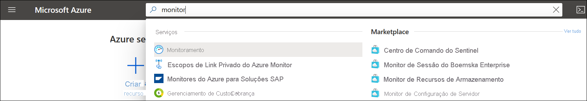
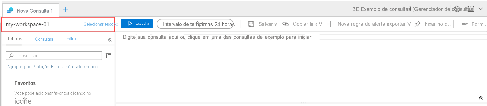

# <a name="quickstart-send-azure-activity-log-to-log-analytics-workspace-using-an-arm-template"></a>Início Rápido: Enviar o Log de atividades do Azure para workspace do Log Analytics usando um modelo do ARM

O log de atividades é um log de plataforma no Azure que fornece informações sobre eventos no nível de assinatura. Isso inclui informações como quando um recurso é modificado ou quando uma máquina virtual é iniciada. Você pode ver o log de atividades no portal do Azure ou recuperar entradas com o PowerShell e a CLI. Este guia de início rápido mostra como usar modelos do ARM (modelos do Azure Resource Manager) para criar um workspace do Log Analytics e uma configuração de diagnóstico para enviar o log de atividades para os Logs do Azure Monitor em que você pode analisá-los usando [consultas de log](../logs/log-query-overview.md) e habilitar outros recursos, como [alertas de log](../alerts/alerts-log-query.md) e [pastas de trabalho](../visualize/workbooks-overview.md).

[!INCLUDE [About Azure Resource Manager](../../../includes/resource-manager-quickstart-introduction.md)]

## <a name="prerequisites"></a>Pré-requisitos

- Se você não tiver uma assinatura do Azure, crie uma [conta gratuita](https://azure.microsoft.com/free/?WT.mc_id=A261C142F) antes de começar.
- Para executar os comandos do computador local, instale a CLI do Azure ou os módulos do Azure PowerShell. Para obter mais informações, confira [Instalar o CLI do Azure](/cli/azure/install-azure-cli) e [Instalar o Azure PowerShell](/powershell/azure/install-az-ps).

## <a name="create-a-log-analytics-workspace"></a>Criar um espaço de trabalho do Log Analytics

### <a name="review-the-template"></a>Examinar o modelo

O modelo a seguir cria um workspace do Log Analytics vazio. Salve esse modelo como *CreateWorkspace.json*.

```json
{
  "$schema": "https://schema.management.azure.com/schemas/2019-04-01/deploymentTemplate.json#",
  "contentVersion": "1.0.0.0",
  "parameters": {
    "workspaceName": {
      "type": "string",
      "metadata": {
        "description": "Name of the workspace."
      }
    },
    "sku": {
      "type": "string",
      "defaultValue": "pergb2018",
      "allowedValues": [
        "pergb2018",
        "Free",
        "Standalone",
        "PerNode",
        "Standard",
        "Premium"
      ],
      "metadata": {
        "description": "Pricing tier: PerGB2018 or legacy tiers (Free, Standalone, PerNode, Standard or Premium) which are not available to all customers."
      }
    },
    "location": {
      "type": "string",
      "allowedValues": [
        "australiacentral",
        "australiaeast",
        "australiasoutheast",
        "brazilsouth",
        "canadacentral",
        "centralindia",
        "centralus",
        "eastasia",
        "eastus",
        "eastus2",
        "francecentral",
        "japaneast",
        "koreacentral",
        "northcentralus",
        "northeurope",
        "southafricanorth",
        "southcentralus",
        "southeastasia",
        "switzerlandnorth",
        "switzerlandwest",
        "uksouth",
        "ukwest",
        "westcentralus",
        "westeurope",
        "westus",
        "westus2"
      ],
      "metadata": {
        "description": "Specifies the location for the workspace."
      }
    },
    "retentionInDays": {
      "type": "int",
      "defaultValue": 120,
      "metadata": {
        "description": "Number of days to retain data."
      }
    },
    "resourcePermissions": {
      "type": "bool",
      "defaultValue": true,
      "metadata": {
        "description": "true to use resource or workspace permissions. false to require workspace permissions."
      }
    }
  },
  "resources": [
    {
      "type": "Microsoft.OperationalInsights/workspaces",
      "apiVersion": "2020-08-01",
      "name": "[parameters('workspaceName')]",
      "location": "[parameters('location')]",
      "properties": {
        "sku": {
          "name": "[parameters('sku')]"
        },
        "retentionInDays": "[parameters('retentionInDays')]",
        "features": {
          "searchVersion": 1,
          "legacy": 0,
          "enableLogAccessUsingOnlyResourcePermissions": "[parameters('resourcePermissions')]"
        }
      }
    }
  ]
}
```

Este modelo define um recurso:

- [Microsoft.OperationalInsights/workspaces](/azure/templates/microsoft.operationalinsights/workspaces)

### <a name="deploy-the-template"></a>Implantar o modelo

Implante o modelo usando qualquer método padrão para [implantar um modelo do ARM](../../azure-resource-manager/templates/deploy-portal.md) como os exemplos a seguir usando a CLI e o PowerShell. Substitua os valores de exemplo para **Grupo de Recursos**, **workspaceName** e **location** pelos valores apropriados para o seu ambiente. O nome do workspace deve ser exclusivo entre todas as assinaturas do Azure.

# <a name="cli"></a>[CLI](#tab/CLI)

```azurecli
az login
az deployment group create \
    --name CreateWorkspace \
    --resource-group my-resource-group \
    --template-file CreateWorkspace.json \
    --parameters workspaceName='my-workspace-01' location='eastus'

```

# <a name="powershell"></a>[PowerShell](#tab/PowerShell)

```powershell
Connect-AzAccount
Select-AzSubscription -SubscriptionName my-subscription
New-AzResourceGroupDeployment -Name AzureMonitorDeployment -ResourceGroupName my-resource-group -TemplateFile CreateWorkspace.json -workspaceName my-workspace-01 -location eastus
```

---

### <a name="validate-the-deployment"></a>Validar a implantação

Verifique se o workspace foi criado usando um dos comandos a seguir. Substitua os valores de exemplo para **Grupo de Recursos** e **workspaceName** pelos valores que você usou acima.

# <a name="cli"></a>[CLI](#tab/CLI)

```azurecli
az monitor log-analytics workspace show --resource-group my-workspace-01 --workspace-name my-resource-group
```

# <a name="powershell"></a>[PowerShell](#tab/PowerShell)

```powershell
Get-AzOperationalInsightsWorkspace -Name my-workspace-01 -ResourceGroupName my-resource-group
```

---

## <a name="create-diagnostic-setting"></a>Criar configuração de diagnóstico

### <a name="review-the-template"></a>Examinar o modelo

O modelo a seguir cria uma configuração de diagnóstico que envia o log de atividades para um workspace do Log Analytics. Salve esse modelo como *CreateDiagnosticSetting.json*.

```json
{
  "$schema": "https://schema.management.azure.com/schemas/2019-04-01/deploymentTemplate.json#",
  "contentVersion": "1.0.0.0",
  "parameters": {
    "settingName": {
        "type": "String"
    },
    "workspaceId": {
        "type": "String"
    }
  },
  "resources": [
    {
      "type": "Microsoft.Insights/diagnosticSettings",
      "apiVersion": "2017-05-01-preview",
      "name": "[parameters('settingName')]",
      "dependsOn": [],
      "properties": {
        "workspaceId": "[parameters('workspaceId')]",
        "logs": [
          {
          "category": "Administrative",
          "enabled": true
          },
          {
          "category": "Alert",
          "enabled": true
          },
          {
          "category": "Autoscale",
          "enabled": true
          },
          {
          "category": "Policy",
          "enabled": true
          },
          {
          "category": "Recommendation",
          "enabled": true
          },
          {
          "category": "ResourceHealth",
          "enabled": true
          },
          {
          "category": "Security",
          "enabled": true
          },
          {
          "category": "ServiceHealth",
          "enabled": true
          }
        ]
      }
    }
  ]
}
```

Este modelo define um recurso:

- [Microsoft.Insights/diagnosticSettings](/azure/templates/microsoft.insights/diagnosticsettings)

### <a name="deploy-the-template"></a>Implantar o modelo

Implante o modelo usando qualquer método padrão para [implantar um modelo do ARM](../../azure-resource-manager/templates/deploy-portal.md) como os exemplos a seguir usando a CLI e o PowerShell. Substitua os valores de exemplo para **Grupo de Recursos**, **workspaceName** e **location** pelos valores apropriados para o seu ambiente. O nome do workspace deve ser exclusivo entre todas as assinaturas do Azure.

# <a name="cli"></a>[CLI](#tab/CLI)

```azurecli
az deployment sub create --name CreateDiagnosticSetting --location eastus --template-file CreateDiagnosticSetting.json --parameters settingName='Send Activity log to workspace' workspaceId='/subscriptions/00000000-0000-0000-0000-000000000000/resourcegroups/my-resource-group/providers/microsoft.operationalinsights/workspaces/my-workspace-01'

```

# <a name="powershell"></a>[PowerShell](#tab/PowerShell)

```powershell
New-AzSubscriptionDeployment -Name CreateDiagnosticSetting -location eastus -TemplateFile CreateDiagnosticSetting.json -settingName "Send Activity log to workspace" -workspaceId "/subscriptions/00000000-0000-0000-0000-000000000000/resourcegroups/my-resource-group/providers/microsoft.operationalinsights/workspaces/my-workspace-01"
```
---

### <a name="validate-the-deployment"></a>Validar a implantação

Verifique se a configuração de diagnóstico foi criada usando um dos comandos a seguir. Substitua os valores de exemplo da assinatura e o nome da configuração pelos valores que você usou acima.

> [!NOTE]
> No momento, não é possível recuperar as configurações de diagnóstico no nível da assinatura usando o PowerShell.

```azurecli
az monitor diagnostic-settings show --resource '/subscriptions/00000000-0000-0000-0000-000000000000' --name 'Send Activity log to workspace'
```

## <a name="generate-log-data"></a>Gerar dados de log

Somente as novas entradas do log de atividades serão enviadas ao workspace do Log Analytics; portanto, execute algumas ações na sua assinatura que serão registradas em log, como iniciar ou parar uma máquina virtual ou criar ou modificar outro recurso. Talvez seja necessário aguardar alguns minutos para que a configuração de diagnóstico seja criada e os dados sejam gravados inicialmente no workspace. Após esse atraso, todos os eventos gravados no log de atividades serão enviados ao workspace em alguns segundos.

## <a name="retrieve-data-with-a-log-query"></a>Recuperar dados com uma consulta de log

Use o portal do Azure para usar Log Analytics para recuperar dados do workspace. No portal do Azure, pesquise e selecione **Monitor**.



Selecione **Logs** no menu **Azure Monitor**. Feche a página **Consultas de exemplo**. Se o escopo não estiver definido como o workspace criado, clique em **Selecionar escopo** e localize-o.



Na janela de consulta, digite `AzureActivity` e clique em **Executar**. Essa é uma consulta simples que retorna todos os registros da tabela *AzureActivity*, que contém todos os registros enviados do log de atividades.


Expanda um dos registros para ver as propriedades detalhadas.


Experimente usar uma consulta mais complexa, como `AzureActivity | summarize count() by CategoryValue`, que fornece uma contagem de eventos resumidos pela categoria.


## <a name="clean-up-resources"></a>Limpar os recursos

Se planejar continuar trabalhando com os tutoriais e inícios rápidos subsequentes, deixe esses recursos onde estão. Quando não for mais necessário, exclua o grupo de recursos, o que excluirá a regra de alerta e os recursos relacionados. Para excluir o grupo de recursos usando a CLI do Azure ou o Azure PowerShell

# <a name="cli"></a>[CLI](#tab/CLI)

```azurecli
az group delete --name my-resource-group
```

# <a name="powershell"></a>[PowerShell](#tab/PowerShell)

```powershell
Remove-AzResourceGroup -Name my-resource-group
```

---

## <a name="next-steps"></a>Próximas etapas

Neste guia de início rápido, você configurou o log de atividades para ser enviado a um workspace do Log Analytics. Agora você pode configurar outros dados a serem coletados no workspace, em que você poderá analisá-los juntos usando [consultas de log](../logs/log-query-overview.md) no Azure Monitor e aproveitar recursos como [alertas de log](../alerts/alerts-log-query.md) e [pastas de trabalho](../visualize/workbooks-overview.md). Em seguida, reúna os [logs de recursos](../essentials/resource-logs.md) dos seus recursos do Azure, que complementam os dados do log de atividades, fornecendo insights sobre as operações que foram executadas em cada recurso.

> [!div class="nextstepaction"]
> [Coletar e analisar logs de recursos com o Azure Monitor](../essentials/tutorial-resource-logs.md)