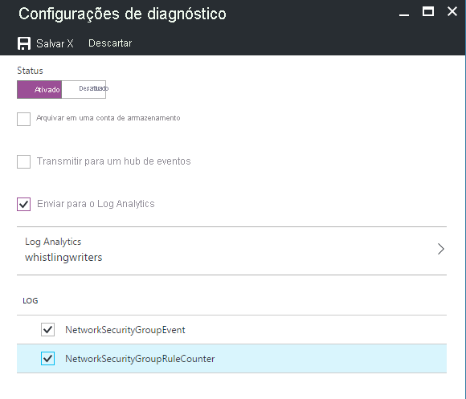
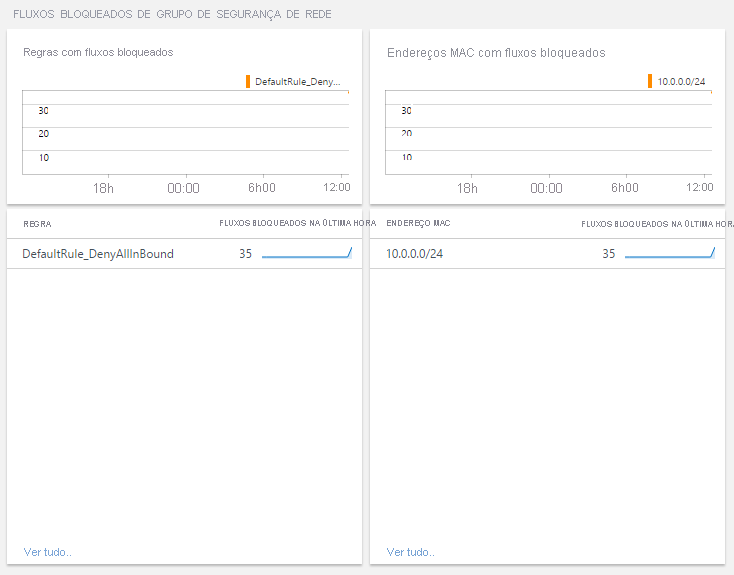
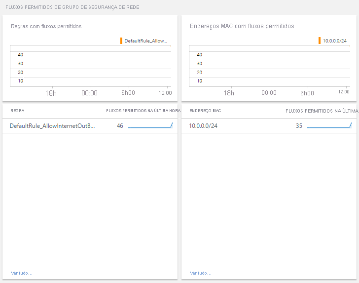

# <a name="azure-networking-monitoring-solutions-in-azure-monitor"></a>Soluções de monitoramento de rede do Azure no Azure Monitor

[!INCLUDE [updated-for-az](../../../includes/updated-for-az.md)]

O Azure Monitor oferece as seguintes soluções para monitorar suas redes:
* Monitor de Desempenho de Rede (NPM) para
    * Monitorar a integridade da sua rede
* Análise do Gateway de Aplicativo do Azure para revisão
    * Logs do Gateway de Aplicativo do Azure
    * Métricas do Gateway de Aplicativo do Azure
* Soluções para monitorar e auditar a atividade de rede na rede de nuvem
    * [Análise de Tráfego](../../networking/network-monitoring-overview.md#traffic-analytics) 
    * Análise de Grupo de Segurança de Rede do Azure

## <a name="network-performance-monitor-npm"></a>Monitor de Desempenho de Rede (NPM)

A solução de gerenciamento do [Monitor de Desempenho de Rede](../../networking/network-monitoring-overview.md) é uma solução de monitoramento de redes, que monitora a integridade, a disponibilidade e a acessibilidade das redes.  Ela é usada para monitorar a conectividade entre:

* Nuvem pública e local
* Data centers e locais de usuário (filiais)
* Sub-redes hospedando várias camadas de um aplicativo de várias camadas.

Para obter mais informações, confira [Monitor de Desempenho de Rede](../../networking/network-monitoring-overview.md).

## <a name="network-security-group-analytics"></a>Análise do grupo de segurança de rede

1. Adicione a solução de gerenciamento ao Azure Monitor e
2. Habilite o diagnóstico para direcioná-lo a um workspace do Log Analytics no Azure Monitor. Não é necessário gravar os logs no Armazenamento de Blobs do Azure.

Se os logs de diagnóstico não estiverem habilitados, as folhas do painel para esse recurso ficarão em branco e exibirão uma mensagem de erro.

## <a name="azure-application-gateway-analytics"></a>Análise do Gateway de Aplicativo do Azure

1. Habilite o diagnóstico para direcioná-lo a um workspace do Log Analytics no Azure Monitor.
2. Consuma o resumo detalhado do recurso usando o modelo de pasta de trabalho para o gateway de aplicativo.

Se os logs de diagnóstico não estiverem habilitados para o gateway de aplicativo, somente os dados de métrica padrão serão preenchidos na pasta de trabalho.


> [!NOTE]
> Em janeiro de 2017, o modo com suporte de envio de logs de Gateways de Aplicativo e Grupos de Segurança de Rede para um workspace do Log Analytics foi alterado. Se você vir a solução **Análise de Rede do Azure (preterida)** , consulte [Migrando da solução de Análise de Rede antiga](#migrating-from-the-old-networking-analytics-solution) para encontrar as etapas que devem ser seguidas.
>
>

## <a name="review-azure-networking-data-collection-details"></a>Examinar os detalhes da coleção de dados de rede do Azure
As soluções de gerenciamento de análise do Grupo de Segurança de Rede e de análise do Gateway de Aplicativo do Azure coletam logs de diagnóstico diretamente dos Gateways de Aplicativo do Azure e de Grupos de Segurança de Rede. Não é necessário gravar os logs no Armazenamento de Blobs do Azure e nenhum agente é necessário para a coleta de dados.

A tabela a seguir mostra os métodos de coleta de dados e outros detalhes sobre como os dados são coletados para a análise do Gateway de Aplicativo do Azure e a análise do Grupo de Segurança de Rede.

| Plataforma | Agente direto | Agente do Systems Center Operations Manager | Azure | Operations Manager necessário? | Dados de agente do Operations Manager enviados por meio do grupo de gerenciamento | Frequência de coleta |
| --- | --- | --- | --- | --- | --- | --- |
| Azure |  |  |&#8226; |  |  |quando conectado |


### <a name="enable-azure-application-gateway-diagnostics-in-the-portal"></a>Habilitar o diagnóstico de Gateway de Aplicativo do Azure no portal

1. No Portal do Azure, navegue até o recurso do Gateway de Aplicativo a ser monitorado.
2. Selecione *configurações de diagnóstico* para abrir a página a seguir.

   

   [](media/azure-networking-analytics/application-gateway-diagnostics-2.png#lightbox)

5. Clique na caixa de seleção para *Enviar ao Log Analytics*.
6. Selecione um workspace do Log Analytics existente ou crie um.
7. Clique na caixa de seleção em **Log** para cada um dos tipos de log a serem coletados.
8. Clique em *Salvar* para habilitar o registro em log de diagnóstico no Azure Monitor.

#### <a name="enable-azure-network-diagnostics-using-powershell"></a>Habilitar o diagnóstico de rede do Azure usando PowerShell

O script do PowerShell a seguir fornece um exemplo de como habilitar o registro em log de recursos em gateways de aplicativos.

```powershell
$workspaceId = "/subscriptions/d2e37fee-1234-40b2-5678-0b2199de3b50/resourcegroups/oi-default-east-us/providers/microsoft.operationalinsights/workspaces/rollingbaskets"

$gateway = Get-AzApplicationGateway -Name 'ContosoGateway'

Set-AzDiagnosticSetting -ResourceId $gateway.ResourceId  -WorkspaceId $workspaceId -Enabled $true
```

#### <a name="accessing-azure-application-gateway-analytics-via-azure-monitor-network-insights"></a>Acessando a análise de gateway Aplicativo Azure por meio do Azure Monitor insights de rede

O Application insights pode ser acessado por meio da guia insights no recurso do gateway de aplicativo.


A guia "Exibir métricas detalhadas" abrirá a pasta de trabalho preenchida previamente, resumindo os dados do seu gateway de aplicativo.

[](media/azure-networking-analytics/application-gateway-workbook.png#lightbox)

### <a name="new-capabilities-with-azure-monitor-network-insights-workbook"></a>Novos recursos com Azure Monitor pasta de trabalho do insights de rede

> [!NOTE]
> Não há custos adicionais associados à pasta de trabalho do insights Azure Monitor. Log Analytics espaço de trabalho continuará sendo cobrado de acordo com o uso.

A pasta de trabalho de informações de rede permite que você aproveite os recursos mais recentes de Azure Monitor e Log Analytics incluindo:

* Console centralizado para monitoramento e solução de problemas com dados de [métrica](../insights/network-insights-overview.md#resource-health-and-metrics) e de log.

* Tela flexível para dar suporte à criação de [visualizações](../visualize/workbooks-overview.md#visualizations)avançadas personalizadas.

* Capacidade de consumir e [compartilhar modelos de pasta de trabalho](../visualize/workbooks-overview.md#workbooks-versus-workbook-templates) com uma comunidade maior.

Para obter mais informações sobre os recursos da nova pasta de trabalho check-out de pastas de trabalho [-visão geral](../visualize/workbooks-overview.md)

## <a name="migrating-from-azure-gateway-analytics-solution-to-azure-monitor-workbooks"></a>Migrando da solução de análise de gateway do Azure para Azure Monitor pastas de trabalho

> [!NOTE]
> Azure Monitor pasta de trabalho de informações de rede é a solução recomendada para acessar a métrica e o log Analytics para os recursos do gateway de aplicativo.

1. Verifique se [as configurações de diagnóstico estão habilitadas](#enable-azure-application-gateway-diagnostics-in-the-portal) para armazenar os logs em um espaço de trabalho log Analytics. Se já estiver configurado, Azure Monitor pasta de trabalho de informações de rede poderá consumir dados do mesmo local e nenhuma alteração adicional será necessária.

> [!NOTE]
> Todos os dados anteriores já estão disponíveis na pasta de trabalho do ponto em que as configurações de diagnóstico foram originalmente habilitadas. Não há nenhuma transferência de dados necessária.

2. Acesse a [pasta de trabalho de informações padrão](#accessing-azure-application-gateway-analytics-via-azure-monitor-network-insights) para o recurso de gateway de aplicativo. Todas as informações existentes suportadas pela solução de análise do gateway de aplicativo já estarão presentes na pasta de trabalho. Você pode estender isso adicionando [visualizações](../visualize/workbooks-overview.md#visualizations) personalizadas com base na métrica & dados de log.

3. Depois que você conseguir ver todas as suas métricas e informações de log, para limpar a solução de análise de gateway do Azure do seu espaço de trabalho, você pode excluir a solução da página de recursos da solução.

[](media/azure-networking-analytics/application-gateway-analytics-delete.png#lightbox)

## <a name="azure-network-security-group-analytics-solution-in-azure-monitor"></a>Solução de análise de Grupo de Segurança de Rede do Azure no Azure Monitor


> [!NOTE]
> A solução de análise do Grupo de Segurança de Rede está sendo movida para o suporte da comunidade, pois sua funcionalidade foi substituída pela [Análise de Tráfego](../../network-watcher/traffic-analytics.md).
> - A solução agora está disponível nos [Modelos de Início Rápido do Azure](https://azure.microsoft.com/resources/templates/oms-azurensg-solution/) e, em breve, não estará mais disponível no Azure Marketplace.
> - Para os clientes existentes que já adicionaram a solução a seus workspaces, ela continuará funcionando sem alterações.
> - A Microsoft continuará a dar suporte ao envio de logs de recursos NSG para seu workspace usando as Configurações de Diagnóstico.

Nos grupos de segurança de rede, há suporte para os seguintes logs:

* NetworkSecurityGroupEvent
* NetworkSecurityGroupRuleCounter

### <a name="install-and-configure-the-solution"></a>Instale e configure a solução
Use as instruções a seguir para instalar e configurar a solução de Análise de Rede do Azure:

1. Habilite a solução de análise do Grupo de Segurança de Rede do Azure com o processo descrito em [Adicionar soluções do Azure Monitor na Galeria de Soluções](./solutions.md).
2. Habilite o registro em log de diagnóstico para os recursos de [Grupo de Segurança de Rede](../../virtual-network/virtual-network-nsg-manage-log.md) que deseja monitorar.

### <a name="enable-azure-network-security-group-diagnostics-in-the-portal"></a>Habilitar o diagnóstico de grupo de segurança de rede do Azure no portal

1. No Portal do Azure, navegue até o recurso de Grupo de Segurança de Rede a ser monitorado
2. Selecione *Logs de diagnóstico* para abrir a página seguinte

   
3. Clique em *Ativar diagnóstico* para abrir a página seguinte

   
4. Para ativar o diagnóstico, clique em *Ativar* em *Status*
5. Clique na caixa de seleção para *Enviar para o Log Analytics*
6. Selecione um espaço de trabalho do Log Analytics existente ou crie um espaço de trabalho
7. Clique na caixa de seleção em **Log** para cada um dos tipos de log a serem coletados
8. Clique em *Salvar* para habilitar o registro em log de diagnóstico para o Log Analytics

### <a name="enable-azure-network-diagnostics-using-powershell"></a>Habilitar o diagnóstico de rede do Azure usando PowerShell

O script do PowerShell a seguir fornece um exemplo de como habilitar o log de recursos para grupos de segurança de rede
```powershell
$workspaceId = "/subscriptions/d2e37fee-1234-40b2-5678-0b2199de3b50/resourcegroups/oi-default-east-us/providers/microsoft.operationalinsights/workspaces/rollingbaskets"

$nsg = Get-AzNetworkSecurityGroup -Name 'ContosoNSG'

Set-AzDiagnosticSetting -ResourceId $nsg.ResourceId  -WorkspaceId $workspaceId -Enabled $true
```

### <a name="use-azure-network-security-group-analytics"></a>Usar a análise de Grupo de Segurança de Rede do Azure
Depois de clicar no bloco **Análise do Grupo de Segurança de Rede do Azure** na Visão Geral, você pode exibir resumos dos seus logs e então aprofundar-se nos detalhes das seguintes categorias:

* Fluxos bloqueados no grupo de segurança de rede
  * Regras do grupo de segurança de rede com fluxos bloqueados
  * Endereços MAC com fluxos bloqueados
* Fluxos permitidos no grupo de segurança de rede
  * Regras com fluxos permitidos do grupo de segurança de rede
  * Endereços MAC com fluxos permitidos





No painel **Análise do Grupo de Segurança de Rede do Azure**, examine as informações resumidas em uma das folhas e, em seguida, clique em uma para exibir informações detalhadas na página pesquisa de logs.

Em qualquer uma das páginas de pesquisa de log, você pode exibir os resultados por tempo, resultados detalhados e o histórico de pesquisa de log. Você também pode filtrar por facetas para restringir os resultados.

## <a name="migrating-from-the-old-networking-analytics-solution"></a>Migrando da solução de Análise de Rede antiga
Em janeiro de 2017, o modo com suporte de envio de logs de Gateways de Aplicativo Azure e Grupos de Segurança de Rede do Azure para um workspace do Log Analytics foi alterado. Essas alterações oferecem as seguintes vantagens:
+ Os logs são gravados diretamente no Azure Monitor sem a necessidade de usar uma conta de armazenamento
+ Menor latência do momento em que os logs são gerados até eles serem disponibilizados no Azure Monitor
+ Menos etapas de configuração
+ Um formato comum para todos os tipos de diagnóstico do Azure

Para usar as soluções atualizadas:

1. [Configure o diagnóstico a ser enviado diretamente para o Azure Monitor pelo Gateway de Aplicativo do Azure](#enable-azure-application-gateway-diagnostics-in-the-portal)
2. [Configure o diagnóstico a ser enviado diretamente para o Azure Monitor pelos Grupos de Segurança de Rede do Azure](#enable-azure-network-security-group-diagnostics-in-the-portal)
2. Habilite a solução *Análise do Gateway de Aplicativo do Azure* e a solução *Análise do Grupo de Segurança de Rede do Azure* usando o processo descrito em [Adicionar soluções do Azure Monitor por meio da Galeria de Soluções](solutions.md)
3. Atualizar todas as consultas salvas, painéis ou alertas para usar o novo tipo de dados
   + Type é AzureDiagnostics. Você pode usar ResourceType para filtrar os logs de rede do Azure.

     | Em vez de: | Use: |
     | --- | --- |
     | NetworkApplicationgateways &#124; onde OperationName=="ApplicationGatewayAccess" | AzureDiagnostics &#124; em que ResourceType=="APPLICATIONGATEWAYS" e OperationName=="ApplicationGatewayAccess" |
     | NetworkApplicationgateways &#124; onde OperationName=="ApplicationGatewayPerformance" | AzureDiagnostics &#124; em que ResourceType=="APPLICATIONGATEWAYS" e OperationName=="ApplicationGatewayPerformance" |
     | NetworkSecurityGroups | AzureDiagnostics &#124; onde ResourceType=="NETWORKSECURITYGROUPS" |

   + Para qualquer campo que tenha um sufixo de \_s, \_d ou \_g no nome, altere o primeiro caractere para minúsculo
   + Para qualquer campo que tenha um sufixo de \_o no nome, os dados são divididos em campos individuais com base nos nomes de campos aninhados.
4. Remova a solução *Análise de Rede do Azure (preterida)* .
   + Se você estiver usando o PowerShell, use `Set-AzureOperationalInsightsIntelligencePack -ResourceGroupName <resource group that the workspace is in> -WorkspaceName <name of the log analytics workspace> -IntelligencePackName "AzureNetwork" -Enabled $false`

Os dados coletados antes da alteração não estão visíveis na nova solução. Você pode continuar a consultar esses dados usando os nomes de campo e tipo antigos.

## <a name="troubleshooting"></a>Solução de problemas
[!INCLUDE [log-analytics-troubleshoot-azure-diagnostics](../../../includes/log-analytics-troubleshoot-azure-diagnostics.md)]

## <a name="next-steps"></a>Próximas etapas
* Use [Consultas de log no Azure Monitor](../logs/log-query-overview.md) para exibir dados detalhados do Diagnóstico do Azure.

