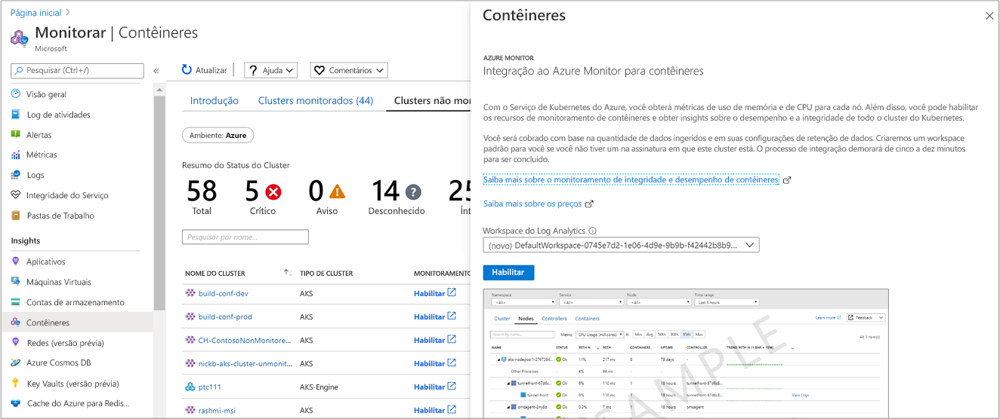

# <a name="enable-monitoring-of-azure-kubernetes-service-aks-cluster-already-deployed"></a>Habilitar o monitoramento do cluster AKS (serviço kubernetes do Azure) já implantado

Este artigo descreve como configurar Azure Monitor para contêineres para monitorar o cluster kubernetes gerenciado hospedado no [serviço kubernetes do Azure](https://docs.microsoft.com/azure/aks/) que já foi implantado em sua assinatura.

Você pode habilitar o monitoramento de um cluster AKS que já está implantado usando um dos métodos com suporte:

* Azure CLI
* Terraform
* [De Azure monitor](#enable-from-azure-monitor-in-the-portal) ou [diretamente do cluster AKs](#enable-directly-from-aks-cluster-in-the-portal) no portal do Azure 
* Com o [modelo de Azure Resource Manager fornecido](#enable-using-an-azure-resource-manager-template) usando o cmdlet Azure PowerShell `New-AzResourceGroupDeployment` ou com CLI do Azure. 

## <a name="sign-in-to-the-azure-portal"></a>Entrar no portal do Azure

Entre no [portal do Azure](https://portal.azure.com). 

## <a name="enable-using-azure-cli"></a>Habilitar usando CLI do Azure

A etapa a seguir habilita o monitoramento do cluster AKS usando CLI do Azure. Neste exemplo, não é necessário que você por criar ou especificar um espaço de trabalho existente. Esse comando simplifica o processo para você criando um espaço de trabalho padrão no grupo de recursos padrão da assinatura do cluster AKS, caso ainda não exista uma na região.  O espaço de trabalho padrão criado se assemelha ao formato *defaultworkspace-\<GUID >-\<Region >* .  

```azurecli
az aks enable-addons -a monitoring -n MyExistingManagedCluster -g MyExistingManagedClusterRG  
```

A saída será semelhante ao seguinte:

```azurecli
provisioningState       : Succeeded
```

### <a name="integrate-with-an-existing-workspace"></a>Integrar com um espaço de trabalho existente

Se você preferir integrar com um espaço de trabalho existente, execute as etapas a seguir para primeiro identificar a ID de recurso completo do seu espaço de trabalho de Log Analytics necessário para o parâmetro `--workspace-resource-id` e, em seguida, execute o comando para habilitar o complemento de monitoramento em relação ao espaço de trabalho especificado.  

1. Liste todas as assinaturas às quais você tem acesso usando o seguinte comando:

    ```azurecli
    az account list --all -o table
    ```

    A saída será semelhante ao seguinte:

    ```azurecli
    Name                                  CloudName    SubscriptionId                        State    IsDefault
    ------------------------------------  -----------  ------------------------------------  -------  -----------
    Microsoft Azure                       AzureCloud   68627f8c-91fO-4905-z48q-b032a81f8vy0  Enabled  True
    ```

    Copie o valor de **SubscriptionId**.

2. Alterne para a assinatura que hospeda o espaço de trabalho Log Analytics usando o seguinte comando:

    ```azurecli
    az account set -s <subscriptionId of the workspace>
    ```

3. O exemplo a seguir exibe a lista de espaços de trabalho em suas assinaturas no formato JSON padrão. 

    ```
    az resource list --resource-type Microsoft.OperationalInsights/workspaces -o json
    ```

    Na saída, localize o nome do espaço de trabalho e copie a ID de recurso completo do espaço de trabalho Log Analytics sob a **ID**do campo.
 
4. Execute o comando a seguir para habilitar o complemento de monitoramento, substituindo o valor do parâmetro `--workspace-resource-id`. O valor da cadeia de caracteres deve estar entre aspas duplas:

    ```azurecli
    az aks enable-addons -a monitoring -n ExistingManagedCluster -g ExistingManagedClusterRG --workspace-resource-id  “/subscriptions/<SubscriptionId>/resourceGroups/<ResourceGroupName>/providers/Microsoft.OperationalInsights/workspaces/<WorkspaceName>”
    ```

    A saída será semelhante ao seguinte:

    ```azurecli
    provisioningState       : Succeeded
    ```

## <a name="enable-using-terraform"></a>Habilitar usando Terraform

1. Adicionar o perfil de complemento **oms_agent** ao [recurso azurerm_kubernetes_cluster](https://www.terraform.io/docs/providers/azurerm/d/kubernetes_cluster.html#addon_profile) existente

   ```
   addon_profile {
    oms_agent {
      enabled                    = true
      log_analytics_workspace_id = "${azurerm_log_analytics_workspace.test.id}"
     }
   }
   ```

2. Adicione o [azurerm_log_analytics_solution](https://www.terraform.io/docs/providers/azurerm/r/log_analytics_solution.html) seguindo as etapas na documentação do Terraform.

## <a name="enable-from-azure-monitor-in-the-portal"></a>Habilitar de Azure Monitor no portal 

Para habilitar o monitoramento do cluster AKS no portal do Azure do Azure Monitor, faça o seguinte:

1. Na portal do Azure, selecione **Monitor**. 

2. Selecione **contêineres** na lista.

3. Na página **monitorar contêineres** , selecione **clusters não monitorados**.

4. Na lista de clusters não monitorados, localize o contêiner na lista e clique em **habilitar**.   

5. Na página **integração a Azure monitor para contêineres** , se você tiver um espaço de trabalho log Analytics existente na mesma assinatura que o cluster, selecione-o na lista suspensa.  
    A lista seleciona o espaço de trabalho padrão e o local no qual o contêiner AKS é implantado na assinatura. 

    

    >[!NOTE]
    >Se você quiser criar um novo espaço de trabalho Log Analytics para armazenar os dados de monitoramento do cluster, siga as instruções em [criar um espaço de trabalho do log Analytics](../../azure-monitor/learn/quick-create-workspace.md). Certifique-se de criar o espaço de trabalho na mesma assinatura em que o contêiner AKS é implantado. 
 
Depois de habilitar o monitoramento, pode levar cerca de 15 minutos para que você possa exibir as métricas de integridade do cluster. 

## <a name="enable-directly-from-aks-cluster-in-the-portal"></a>Habilitar diretamente do cluster AKS no portal

Para habilitar o monitoramento diretamente de um dos seus clusters AKS no portal do Azure, faça o seguinte:

1. Na portal do Azure, selecione **todos os serviços**. 

2. Na lista de recursos, comece digitando **contêineres**.  A lista filtra com base em sua entrada. 

3. Selecione **Serviços Kubernetess**.  

    

4. Na lista de contêineres, selecione um contêiner.

5. Na página Visão geral do contêiner, selecione **monitorar contêineres**.  

6. Na página **integração a Azure monitor para contêineres** , se você tiver um espaço de trabalho log Analytics existente na mesma assinatura que o cluster, selecione-o na lista suspensa.  
    A lista seleciona o espaço de trabalho padrão e o local no qual o contêiner AKS é implantado na assinatura. 

    

    >[!NOTE]
    >Se você quiser criar um novo espaço de trabalho Log Analytics para armazenar os dados de monitoramento do cluster, siga as instruções em [criar um espaço de trabalho do log Analytics](../../azure-monitor/learn/quick-create-workspace.md). Certifique-se de criar o espaço de trabalho na mesma assinatura em que o contêiner AKS é implantado. 
 
Depois de habilitar o monitoramento, pode levar cerca de 15 minutos para que você possa exibir os dados operacionais do cluster. 

## <a name="enable-using-an-azure-resource-manager-template"></a>Habilitar usando um modelo de Azure Resource Manager

Esse método inclui dois modelos JSON. Um modelo especifica a configuração para habilitar o monitoramento e o outro contém valores de parâmetro que você configura para especificar o seguinte:

* A ID de recurso do contêiner AKS. 
* O grupo de recursos no qual o cluster é implantado.

>[!NOTE]
>O modelo precisa ser implantado no mesmo grupo de recursos que o cluster.
>

O espaço de trabalho do Log Analytics deve ser criado antes de habilitar o monitoramento usando Azure PowerShell ou a CLI. Para criar o espaço de trabalho, você pode configurá-lo por meio do [Azure Resource Manager](../../azure-monitor/platform/template-workspace-configuration.md), por meio do [PowerShell](../scripts/powershell-sample-create-workspace.md?toc=%2fpowershell%2fmodule%2ftoc.json), ou na [portal do Azure](../../azure-monitor/learn/quick-create-workspace.md).

Se você não estiver familiarizado com o conceito de implantação de recursos usando um modelo, consulte:

* [Implantar recursos com modelos do Resource Manager e o Azure PowerShell](../../azure-resource-manager/resource-group-template-deploy.md)

* [Implantar recursos com modelos do Resource Manager e o CLI do Azure](../../azure-resource-manager/resource-group-template-deploy-cli.md)

Se você optar por usar o CLI do Azure, primeiro será necessário instalar e usar a CLI localmente. Você deve estar executando o CLI do Azure versão 2.0.59 ou posterior. Para identificar sua versão, execute `az --version`. Se você precisar instalar ou atualizar o CLI do Azure, consulte [instalar o CLI do Azure](https://docs.microsoft.com/cli/azure/install-azure-cli). 

### <a name="create-and-execute-a-template"></a>Criar e executar um modelo

1. Copie e cole a seguinte sintaxe JSON em seu arquivo:

    ```json
    {
      "$schema": "https://schema.management.azure.com/schemas/2015-01-01/deploymentTemplate.json#",
      "contentVersion": "1.0.0.0",
      "parameters": {
        "aksResourceId": {
          "type": "string",
          "metadata": {
            "description": "AKS Cluster Resource ID"
          }
        },
        "aksResourceLocation": {
          "type": "string",
          "metadata": {
            "description": "Location of the AKS resource e.g. \"East US\""
          }
        },
        "aksResourceTagValues": {
          "type": "object",
          "metadata": {
            "description": "Existing all tags on AKS Cluster Resource"
          }
        },
        "workspaceResourceId": {
          "type": "string",
          "metadata": {
            "description": "Azure Monitor Log Analytics Resource ID"
          }
        }
      },
      "resources": [
        {
          "name": "[split(parameters('aksResourceId'),'/')[8]]",
          "type": "Microsoft.ContainerService/managedClusters",
          "location": "[parameters('aksResourceLocation')]",
          "tags": "[parameters('aksResourceTagValues')]",
          "apiVersion": "2018-03-31",
          "properties": {
            "mode": "Incremental",
            "id": "[parameters('aksResourceId')]",
            "addonProfiles": {
              "omsagent": {
                "enabled": true,
                "config": {
                  "logAnalyticsWorkspaceResourceID": "[parameters('workspaceResourceId')]"
                }
              }
            }
          }
        }
      ]
    }
    ```

2. Salve esse arquivo como **existingClusterOnboarding. JSON** em uma pasta local.

3. Cole a seguinte sintaxe JSON em seu arquivo:

    ```json
    {
      "$schema": "https://schema.management.azure.com/schemas/2015-01-01/deploymentParameters.json#",
      "contentVersion": "1.0.0.0",
      "parameters": {
        "aksResourceId": {
          "value": "/subscriptions/<SubscriptionId>/resourcegroups/<ResourceGroup>/providers/Microsoft.ContainerService/managedClusters/<ResourceName>"
        },
        "aksResourceLocation": {
          "value": "<aksClusterLocation>"
        },
        "workspaceResourceId": {
          "value": "/subscriptions/<SubscriptionId>/resourceGroups/<ResourceGroup>/providers/Microsoft.OperationalInsights/workspaces/<workspaceName>"
        },
        "aksResourceTagValues": {
          "value": {
            "<existing-tag-name1>": "<existing-tag-value1>",
            "<existing-tag-name2>": "<existing-tag-value2>",
            "<existing-tag-nameN>": "<existing-tag-valueN>"
          }
        }
      }
    }
    ```

4. Edite os valores de **aksResourceId** e **aksResourceLocation** usando os valores na página de **visão geral do AKS** para o cluster AKs. O valor de **workspaceResourceId** é a ID de recurso completa do seu espaço de trabalho log Analytics, que inclui o nome do espaço de trabalho. 

    Edite os valores de **aksResourceTagValues** para corresponder aos valores de marca existentes especificados para o cluster AKs.

5. Salve esse arquivo como **existingClusterParam. JSON** em uma pasta local.

6. Você está pronto para implantar este modelo. 

   * Para implantar com Azure PowerShell, use os seguintes comandos na pasta que contém o modelo:

       ```powershell
       New-AzResourceGroupDeployment -Name OnboardCluster -ResourceGroupName <ResourceGroupName> -TemplateFile .\existingClusterOnboarding.json -TemplateParameterFile .\existingClusterParam.json
       ```
       
       A alteração de configuração pode levar alguns minutos para ser concluída. Quando for concluído, será exibida uma mensagem semelhante à seguinte e inclui o resultado:

       ```powershell
       provisioningState       : Succeeded
       ```

   * Para implantar com o CLI do Azure, execute os seguintes comandos:
    
       ```azurecli
       az login
       az account set --subscription "Subscription Name"
       az group deployment create --resource-group <ResourceGroupName> --template-file ./existingClusterOnboarding.json --parameters @./existingClusterParam.json
       ```

       A alteração de configuração pode levar alguns minutos para ser concluída. Quando for concluído, será exibida uma mensagem semelhante à seguinte e inclui o resultado:

       ```azurecli
       provisioningState       : Succeeded
       ```
     
       Depois de habilitar o monitoramento, pode levar cerca de 15 minutos para que você possa exibir as métricas de integridade do cluster. 

## <a name="verify-agent-and-solution-deployment"></a>Verificar a implantação do agente e da solução

Com o Agent versão *06072018* ou posterior, você pode verificar se o agente e a solução foram implantados com êxito. Com versões anteriores do agente, você pode verificar apenas a implantação do agente.

### <a name="agent-version-06072018-or-later"></a>Versão do agente 06072018 ou posterior

Execute o comando a seguir para verificar se o agente foi implantado com êxito. 

```
kubectl get ds omsagent --namespace=kube-system
```

A saída deve se parecer com o seguinte, que indica que foi implantada corretamente:

```
User@aksuser:~$ kubectl get ds omsagent --namespace=kube-system 
NAME       DESIRED   CURRENT   READY     UP-TO-DATE   AVAILABLE   NODE SELECTOR                 AGE
omsagent   2         2         2         2            2           beta.kubernetes.io/os=linux   1d
```  

Para verificar a implantação da solução, execute o seguinte comando:

```
kubectl get deployment omsagent-rs -n=kube-system
```

A saída deve se parecer com o seguinte, que indica que foi implantada corretamente:

```
User@aksuser:~$ kubectl get deployment omsagent-rs -n=kube-system 
NAME       DESIRED   CURRENT   UP-TO-DATE   AVAILABLE    AGE
omsagent   1         1         1            1            3h
```

### <a name="agent-version-earlier-than-06072018"></a>Versão do agente anterior a 06072018

Para verificar se a versão do agente de Log Analytics liberada antes de *06072018* é implantada corretamente, execute o seguinte comando:  

```
kubectl get ds omsagent --namespace=kube-system
```

A saída deve se parecer com o seguinte, que indica que foi implantada corretamente:  

```
User@aksuser:~$ kubectl get ds omsagent --namespace=kube-system 
NAME       DESIRED   CURRENT   READY     UP-TO-DATE   AVAILABLE   NODE SELECTOR                 AGE
omsagent   2         2         2         2            2           beta.kubernetes.io/os=linux   1d
```  

## <a name="view-configuration-with-cli"></a>Exibir a configuração com a CLI

Use o comando `aks show` para obter detalhes, como a solução está habilitada ou não, qual é a ResourceId do espaço de trabalho Log Analytics e detalhes resumidos sobre o cluster.  

```azurecli
az aks show -g <resourceGroupofAKSCluster> -n <nameofAksCluster>
```

Após alguns minutos, o comando é concluído e retorna informações formatadas em JSON sobre a solução.  Os resultados do comando devem mostrar o perfil do complemento de monitoramento e se assemelham ao seguinte exemplo de saída:

```
"addonProfiles": {
    "omsagent": {
      "config": {
        "logAnalyticsWorkspaceResourceID": "/subscriptions/<WorkspaceSubscription>/resourceGroups/<DefaultWorkspaceRG>/providers/Microsoft.OperationalInsights/workspaces/<defaultWorkspaceName>"
      },
      "enabled": true
    }
  }
```

## <a name="next-steps"></a>Próximos passos

* Se você tiver problemas ao tentar carregar a solução, examine o [Guia de solução de problemas](container-insights-troubleshoot.md)

* Com o monitoramento habilitado para capturar métricas de integridade para os nós de cluster AKS e pods, essas métricas de integridade estão disponíveis no portal do Azure. Para saber como usar Azure Monitor para contêineres, consulte [exibir a integridade do serviço kubernetes do Azure](container-insights-analyze.md).
