# <a name="using-service-map-solution-in-azure"></a>Usando Mapa do Serviço solução no Azure

O Mapa do Serviço detecta automaticamente os componentes de aplicativos em sistemas Windows e Linux e mapeia a comunicação entre os serviços. Com o Mapa do Serviço é possível exibir seus servidores da maneira desejada: como sistemas interconectados que fornecem serviços críticos. O Mapa do Serviço mostra conexões entre servidores, processos, latência de conexão de entrada e saída e portas em qualquer arquitetura conectada a TCP, sem a necessidade de configuração, exceto a instalação de um agente.

Este artigo descreve os detalhes de integração e uso de Mapa do Serviço. Para obter informações sobre como configurar os pré-requisitos para essa solução, consulte [habilitar a Azure monitor para VMs visão geral](vminsights-enable-overview.md#prerequisites). Para resumir, você precisa do seguinte:

* Um espaço de trabalho Log Analytics para habilitar essa solução.

* O agente de Log Analytics instalado no computador Windows ou no servidor Linux configurado para relatar o mesmo espaço de trabalho com o qual você habilitou a solução.

* O Dependency Agent instalado no computador Windows ou no servidor Linux.

>[!NOTE]
>Se você já implantou o Mapa do Serviço, agora você também pode exibir seus mapas no Azure Monitor para VMs, que inclui recursos adicionais para monitorar a integridade e o desempenho da VM. Para saber mais, confira [Azure monitor para VMs visão geral](../../azure-monitor/insights/vminsights-overview.md). Para saber mais sobre as diferenças entre a solução de Mapa do Serviço e o recurso de mapa de Azure Monitor para VMs, consulte as [perguntas frequentes](vminsights-faq.md#how-is-azure-monitor-for-vms-map-feature-different-from-service-map)a seguir.

## <a name="sign-in-to-azure"></a>Entrar no Azure

Entre no portal do Azure em [https://portal.azure.com](https://portal.azure.com).

## <a name="enable-service-map"></a>Habilitar Mapa do Serviço

1. Habilite a solução de Mapa do Serviço do [Azure Marketplace](https://azuremarketplace.microsoft.com/marketplace/apps/Microsoft.ServiceMapOMS?tab=Overview) ou usando o processo descrito em [Adicionar soluções de monitoramento do Galeria de soluções](solutions.md).
1. [Instale o Dependency Agent no Windows](vminsights-enable-hybrid-cloud.md#install-the-dependency-agent-on-windows) ou [Instale o Dependency Agent no Linux](vminsights-enable-hybrid-cloud.md#install-the-dependency-agent-on-linux) em cada computador em que você deseja obter dados. O Dependency Agent pode monitorar conexões com vizinhos imediatos, portanto, talvez você não precise de um agente em todos os computadores.

Você acessa Mapa do Serviço no portal do Azure de seu espaço de trabalho do Log Analytics e seleciona a opção **soluções** no painel esquerdo.<br><br> 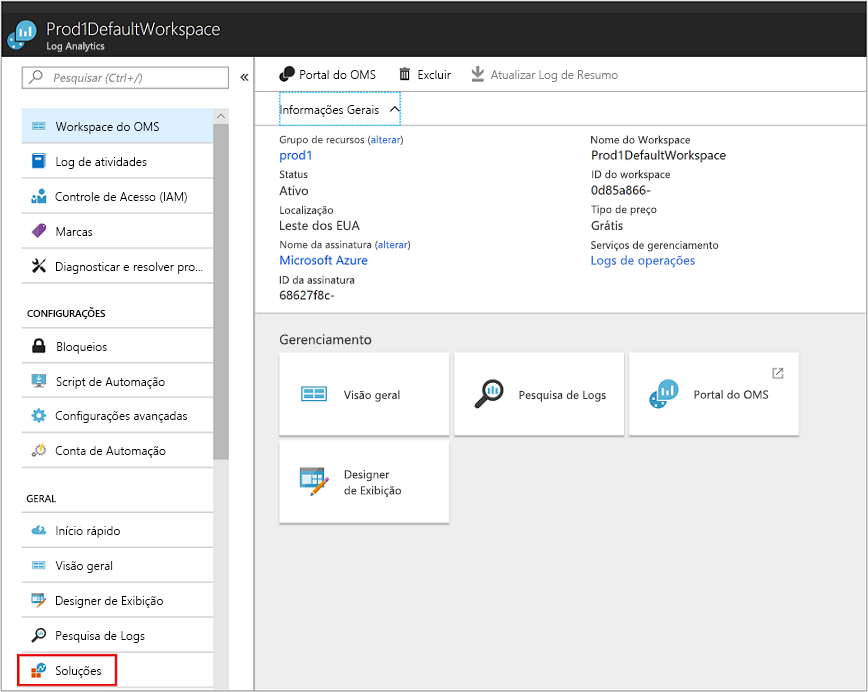 de espaço de trabalho.<br> Na lista de soluções, selecione **ServiceMap (WorkspaceName)** e, na página Visão geral da solução mapa do serviço, clique no bloco resumo de mapa do serviço.<br><br> ](./media/service-map/service-map-summary-tile.png) de bloco de resumo do mapa de ![Service.

## <a name="use-cases-make-your-it-processes-dependency-aware"></a>Casos de uso: torne seus processos de ti cientes da dependência

### <a name="discovery"></a>Descoberta

O Mapa do Serviço compila automaticamente um mapa de referência comum de dependências em seus servidores, processos e serviços de terceiros. Ele descobre e mapeia todas as dependências de TCP, identificando conexões surpresa, sistemas remotos de terceiros dos quais você depende e dependências para áreas escuras tradicionais da sua rede, como Active Directory. Mapa do Serviço descobre conexões de rede com falha que os sistemas gerenciados estão tentando fazer, ajudando você a identificar possíveis erros de configuração, interrupção do serviço e problemas de rede.

### <a name="incident-management"></a>Gerenciamento de incidentes

O Mapa do Serviço ajuda a eliminar as suposições de isolamento do problema, mostrando a você como os sistemas estão conectados e afetando uns aos outros. Além de identificar conexões com falha, ele ajuda a identificar balanceadores de carga configurados incorretamente, carga surpreendente ou excessiva em serviços críticos e clientes não autorizados, como computadores de desenvolvedor conversando com sistemas de produção. Usando fluxos de trabalho integrados com Controle de Alterações, você também pode ver se um evento de alteração em um computador de back-end ou serviço explica a causa raiz de um incidente.

### <a name="migration-assurance"></a>Garantia de migração

Usando Mapa do Serviço, você pode efetivamente planejar, acelerar e validar migrações do Azure, o que ajuda a garantir que nada seja deixado para trás e interrupções surpresa não ocorram. Você pode descobrir todos os sistemas interdependentes que precisam migrar juntos, avaliar a capacidade e a configuração do sistema e identificar se um sistema em execução ainda está atendendo aos usuários ou é candidato para encerramento em vez de migração. Depois que a movimentação for concluída, você poderá verificar a carga e a identidade do cliente para verificar se os sistemas de teste e os clientes estão se conectando. Se as definições de firewall e de planejamento de sub-rede tiverem problemas, as conexões com falha no Mapa do Serviço mapas apontarão para os sistemas que precisam de conectividade.

### <a name="business-continuity"></a>Continuidade dos negócios

Se você estiver usando o Azure Site Recovery e precisar de ajuda para definir a sequência de recuperação para seu ambiente de aplicativo, o Mapa do Serviço poderá mostrar automaticamente como os sistemas dependem uns dos outros para assegurar que seu plano de recuperação seja confiável. Ao escolher um servidor ou grupo crítico e exibir seus clientes, você pode identificar quais sistemas front-end serão recuperados depois que o servidor for restaurado e estiver disponível. Por outro lado, examinando as dependências de back-end dos servidores críticos, você pode identificar quais sistemas serão recuperados antes de seus sistemas de foco serem restaurados.

### <a name="patch-management"></a>Gerenciamento de patches

Mapa do Serviço aprimora o uso da avaliação de atualização do sistema, mostrando quais outras equipes e servidores dependem de seu serviço, para que você possa notificá-los com antecedência antes de desligar seus sistemas para aplicação de patches. O Mapa do Serviço também aprimora o gerenciamento de patches mostrando se os serviços estão disponíveis e conectados corretamente após serem corrigidos e reiniciados.

## <a name="mapping-overview"></a>Visão geral do mapeamento

Os agentes de Mapa do Serviço coletam informações sobre todos os processos conectados a TCP no servidor onde estão instalados e detalhes sobre as conexões de entrada e saída de cada processo.

Na lista no painel esquerdo, você pode selecionar computadores ou grupos que têm agentes de Mapa do Serviço para visualizar suas dependências em um intervalo de tempo especificado. Os mapas de dependência de máquina se concentram em um computador específico e mostram todos os computadores que são clientes TCP diretos ou servidores desse computador.  Os mapas do grupo de computadores mostram conjuntos de servidores e suas dependências.

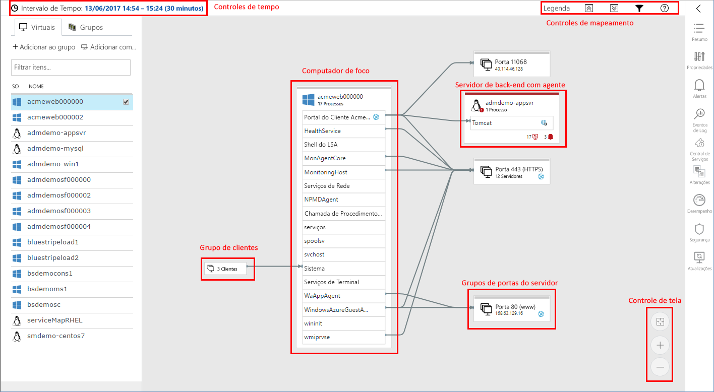

Os computadores podem ser expandidos no mapa para mostrar os grupos de processos e processos em execução com conexões de rede ativas durante o intervalo de tempo selecionado. Quando um computador remoto com um agente de Mapa do Serviço é expandido para mostrar os detalhes do processo, somente os processos que se comunicam com o computador de foco são mostrados. A contagem de computadores front-end sem agente que se conectam ao computador de foco é indicada no lado esquerdo dos processos aos quais se conectam. Se o computador de foco estiver fazendo uma conexão com um computador de back-end que não tem nenhum agente, o servidor back-end será incluído em um grupo de portas do servidor, juntamente com outras conexões com o mesmo número de porta.

Por padrão, os mapas do Mapa do Serviço mostram os últimos 30 minutos de informações de dependência. Usando os controles de tempo no canto superior esquerdo, você pode consultar mapas de intervalos de tempo históricos de até uma hora para mostrar como as dependências foram examinadas no passado (por exemplo, durante um incidente ou antes da ocorrência de uma alteração). Os dados do Mapa do Serviço são armazenados por 30 dias em workspaces pagos, e por sete dias em workspaces gratuitos.

## <a name="status-badges-and-border-coloring"></a>Notificações de status e cor da borda

Na parte inferior de cada servidor no mapa, pode haver uma lista de notificações de status que transmitem informações de status sobre o servidor. As notificações indicam que há algumas informações relevantes para o servidor de uma das integrações da solução. Clicar em uma notificação leva você diretamente aos detalhes do status no painel direito. As notificações de status disponíveis no momento incluem alertas, central de serviços, alterações, segurança e atualizações.

Dependendo da gravidade das notificações de status, as bordas de nó de computador podem ser coloridas em vermelho (crítico), amarelo (aviso) ou azul (informativo). A cor representa o status mais grave de qualquer uma das notificações de status. Uma borda cinza indica um nó que não tem nenhum indicador de status.

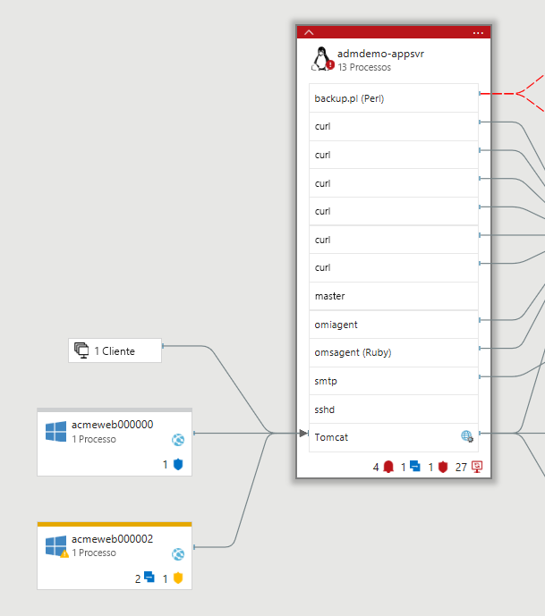

## <a name="process-groups"></a>Grupos de processos

Os grupos de processos combinam processos associados a um produto ou serviço comum em um grupo de processos.  Quando um nó de computador é expandido, ele exibirá processos autônomos juntamente com os grupos de processos.  Se houver falha em conexões de entrada e de saída para um processo dentro de um grupo de processos, a conexão será mostrada como falha para o grupo de processos inteiro.

## <a name="machine-groups"></a>Grupos de computadores

Os grupos de computadores permitem ver mapas centralizados em um conjunto de servidores, não apenas um, para que você possa ver todos os membros de um aplicativo de várias camadas ou cluster de servidores em um mapa.

Os usuários selecionam quais servidores pertencem a um grupo juntos e escolhem um nome para o grupo.  Você pode optar por exibir o grupo com todos os seus processos e conexões, ou exibi-lo apenas com os processos e conexões diretamente relacionados aos outros membros do grupo.

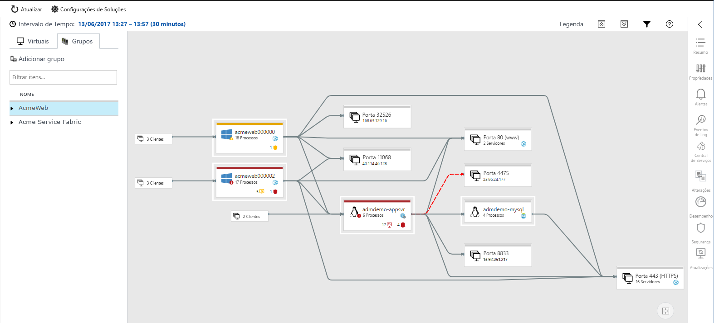

### <a name="creating-a-machine-group"></a>Criando um grupo de computadores

Para criar um grupo, selecione o computador ou os computadores que você deseja na lista Computadores e clique em **Adicionar ao grupo**.

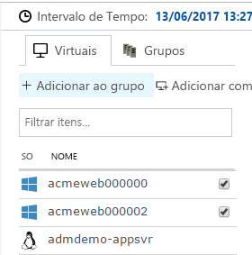

Nesse ponto, é possível escolher **Criar novo** e atribuir ao grupo um nome.

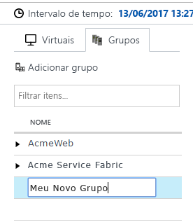

>[!NOTE]
>Os grupos de computadores são limitados a 10 servidores.

### <a name="viewing-a-group"></a>Exibindo um grupo

Depois de criar alguns grupos, você pode exibi-los escolhendo a guia grupos.

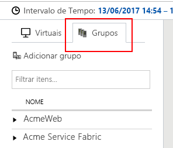

Em seguida, selecione o nome do grupo para exibir o mapa desse grupo de computadores.
 Os computadores que pertencem ao grupo são contornados em branco no mapa.

Expandir o grupo listará os computadores que compõem o grupo de computadores.

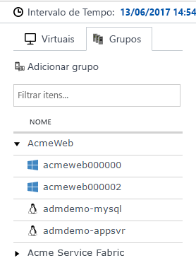

### <a name="filter-by-processes"></a>Filtrar por processos

Você pode alternar a exibição de mapa entre mostrar todos os processos e conexões no grupo e apenas aqueles que se relacionam diretamente com o grupo de computadores.  A exibição padrão é mostrar todos os processos.  Você pode alterar o modo de exibição clicando no ícone de filtro acima do mapa.

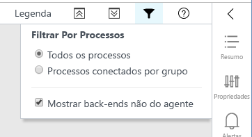

Quando **Todos os processos** estiver selecionado, o mapa incluirá todos os processos e conexões em cada um dos computadores no Grupo.

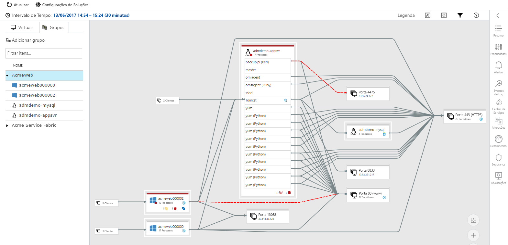

Se você alterar a exibição para mostrar apenas os **processos conectados por grupo** , o mapa será inoperante apenas para os processos e conexões diretamente conectados a outros computadores do grupo, criando uma exibição simplificada.

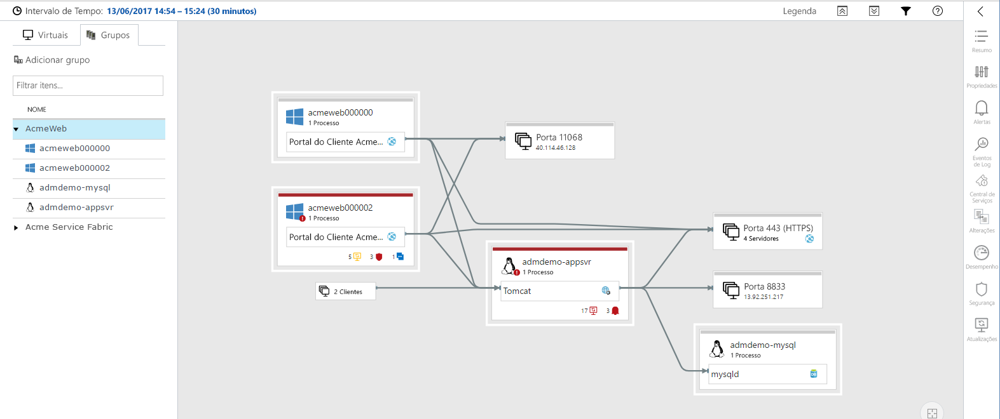
 
### <a name="adding-machines-to-a-group"></a>Adicionando computadores a um grupo

Para adicionar computadores a um grupo existente, marque as caixas ao lado dos computadores que deseja e clique em **Adicionar ao grupo**.  Em seguida, escolha o grupo ao qual você deseja adicionar os computadores.
 
### <a name="removing-machines-from-a-group"></a>Removendo computadores de um grupo

Na lista grupos, expanda o nome do grupo para listar os computadores no grupo de computadores.  Em seguida, clique no menu de reticências próximo ao computador que deseja remover e escolha **Remover**.

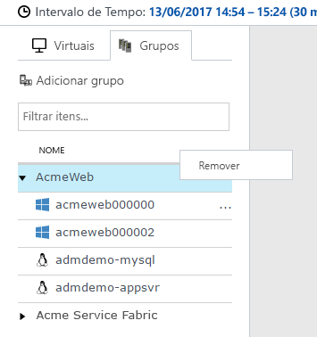

### <a name="removing-or-renaming-a-group"></a>Removendo ou renomeando um grupo

Clique no menu de reticências ao lado do nome do grupo na lista de grupos.

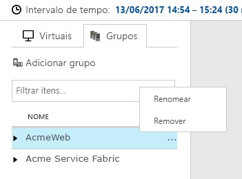


## <a name="role-icons"></a>Ícones de função

Determinados processos atendem a funções específicas em computadores: servidores Web, servidores de aplicativos, banco de dados e assim por diante. Mapa do Serviço anota as caixas processo e máquina com ícones de função para ajudar a identificar rapidamente a função que um processo ou servidor desempenha.

| Ícone de função | Descrição |
|:--|:--|
|  | Servidor Web |
|  | Servidor de aplicativos |
|  | Servidor de banco de dados |
|  | Servidor LDAP |
|  | Servidor SMB |

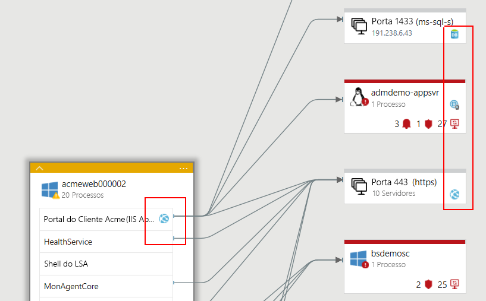


## <a name="failed-connections"></a>Conexões com falha

As conexões com falha são mostradas no Mapa do Serviço Maps para processos e computadores, com uma linha vermelha tracejada indicando que um sistema cliente está falhando em alcançar um processo ou uma porta. As conexões com falha são relatadas de qualquer sistema com um agente de Mapa do Serviço implantado se esse sistema for o que está tentando a conexão com falha. Mapa do Serviço mede esse processo observando os soquetes TCP que falham ao estabelecer uma conexão. Essa falha pode resultar de um firewall, uma configuração incorreta no cliente ou servidor, ou um serviço remoto estar indisponível.

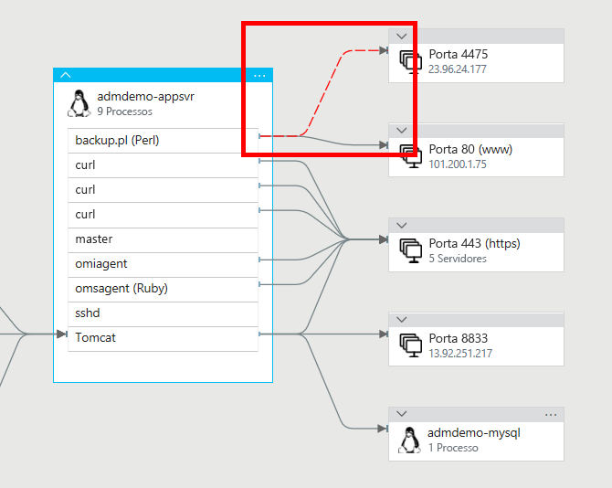

A compreensão de conexões com falha pode ajudar na solução de problemas, validação de migração, análise de segurança e compreensão geral da arquitetura. As conexões com falha são algumas vezes inofensivas, mas elas geralmente apontam diretamente para um problema, como um ambiente de failover que está ficando inacessível repentinamente ou duas camadas de aplicativo não podem se comunicar após uma migração de nuvem.

## <a name="client-groups"></a>Grupos de clientes

Grupos de clientes são caixas no mapa que representam computadores cliente que não têm agentes de dependência. Um único grupo de clientes representa os clientes de um computador ou processo individual.

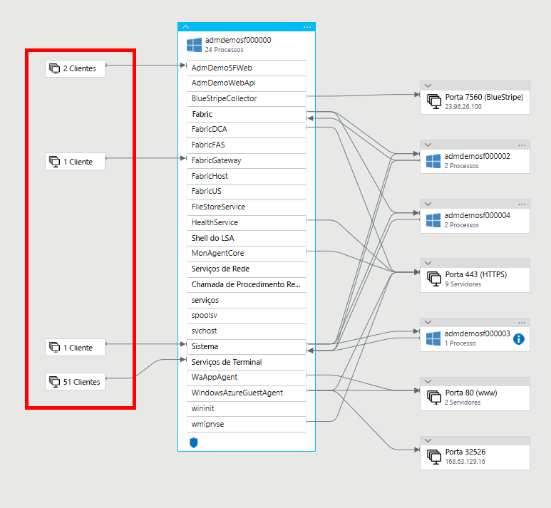

Para ver os endereços IP dos servidores em um Grupo de Clientes, selecione o grupo. O conteúdo do grupo está listado no painel **Propriedades do Grupo de Clientes**.

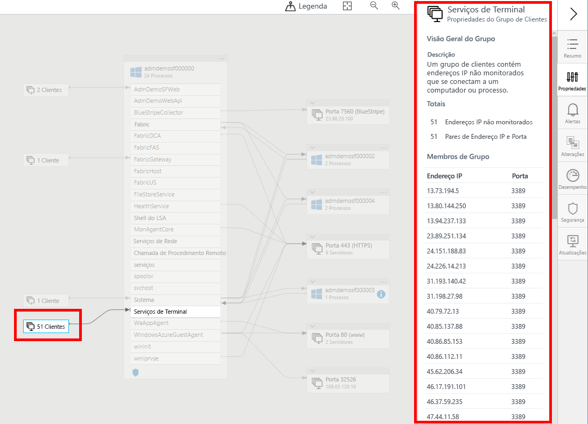

## <a name="server-port-groups"></a>Grupos de portas do servidor

Os grupos de portas do servidor são caixas que representam portas de servidor em servidores que não têm agentes de dependência. A caixa contém a porta do servidor e uma contagem do número de servidores com conexões com essa porta. Expanda a caixa para ver os servidores e as conexões individuais. Se houver apenas um servidor na caixa, o nome ou o endereço IP será listado.

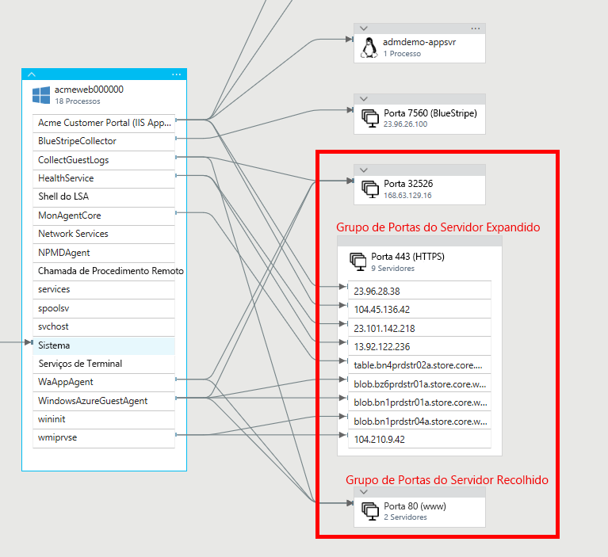

## <a name="context-menu"></a>Menu de contexto

Clicar nas reticências (...) na parte superior direita de qualquer servidor exibe o menu de contexto desse servidor.

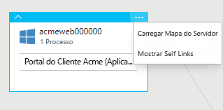

### <a name="load-server-map"></a>Carregar mapa do servidor

Ao clicar em **Carregar Mapa do Servidor**, você será direcionado para um novo mapa com o servidor selecionado como um novo computador de foco.

### <a name="show-self-links"></a>Mostrar Self-links

Ao clicar em **Mostrar Self-Links** redefine o nó de servidor, incluindo quaisquer self-links, que são conexões TCP que iniciam e finalizam em processos dentro do servidor. Se os self-links forem mostrados, o comando de menu irá alterar para **Ocultar Self-Links**, de modo que você possa desativá-los.

## <a name="computer-summary"></a>Resumo do computador

O painel **Resumo da máquina** inclui uma visão geral do sistema operacional de um servidor, contagens de dependência e dados de outras soluções. Esses dados incluem métricas de desempenho, tíquetes de central de serviços, controle de alterações, segurança e atualizações.

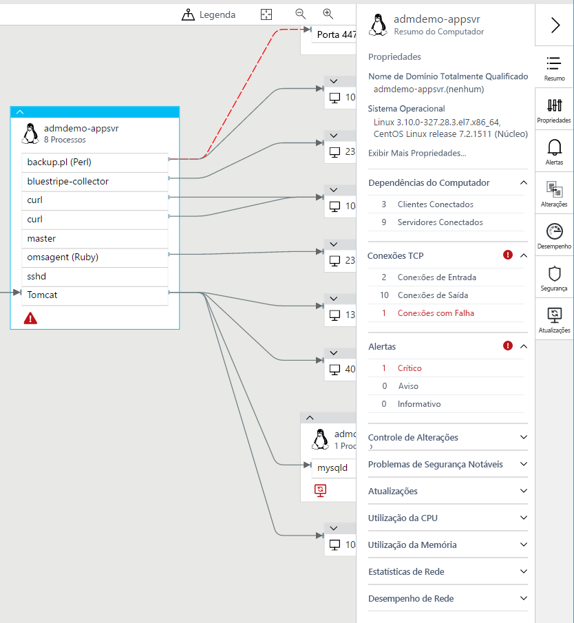

## <a name="computer-and-process-properties"></a>Propriedades do computador e do processo

Ao navegar em um mapa de Mapa do Serviço, você pode selecionar computadores e processos para obter contexto adicional sobre suas propriedades. Os computadores fornecem informações sobre o nome DNS, os endereços IPv4, a capacidade de CPU e memória, o tipo de VM, o sistema operacional e a versão, a hora da última reinicialização e as IDs de seus agentes do OMS e do Mapa do Serviço.

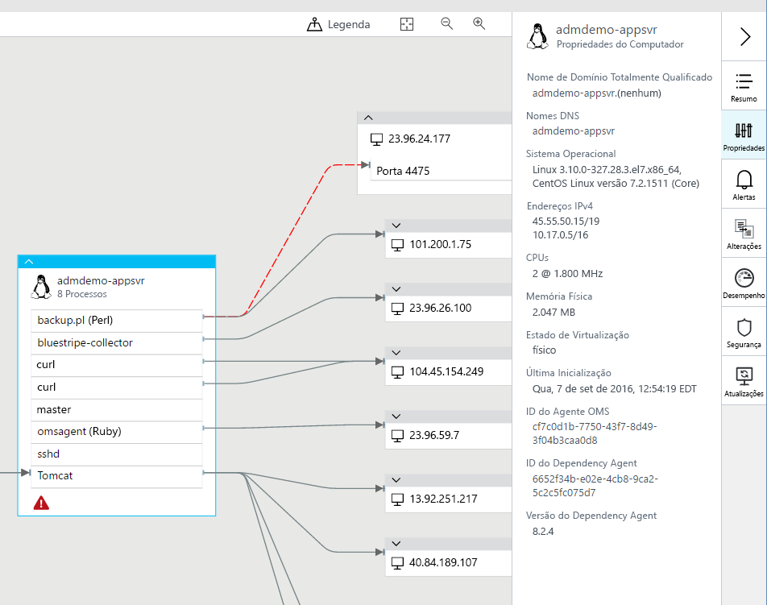

Você pode coletar detalhes do processo de metadados do sistema operacional sobre processos em execução, incluindo nome do processo, descrição do processo, nome de usuário e domínio (no Windows), nome da empresa, nome do produto, versão do produto, diretório de trabalho, linha de comando e processo hora de início.

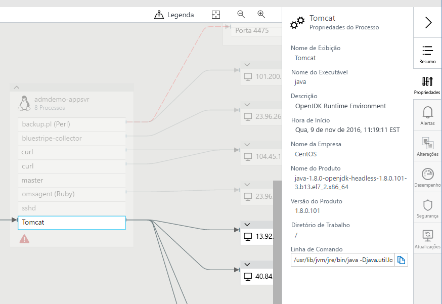

O painel **Resumo do Processo** fornece informações adicionais sobre a conectividade do processo, incluindo suas portas associadas, conexões de entrada e saída e conexões com falha.

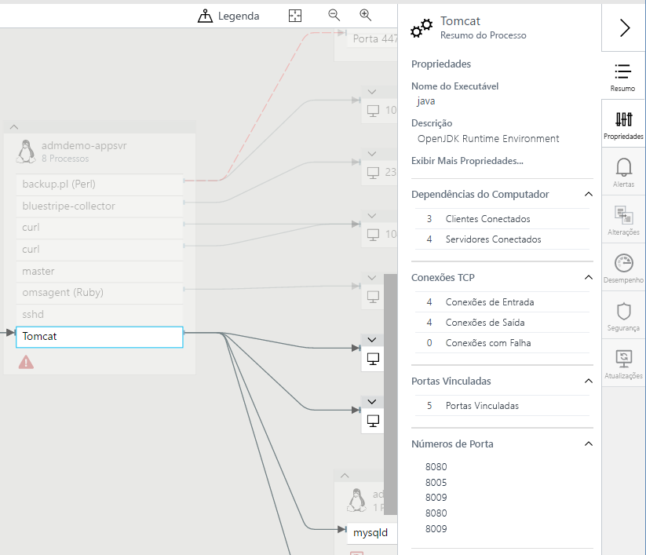

## <a name="alerts-integration"></a>Integração de alertas

Mapa do Serviço integra-se com os alertas do Azure para mostrar os alertas acionados para o servidor selecionado no intervalo de tempo selecionado. Se houver alertas atuais, o servidor exibirá um ícone e o painel **Alertas do Computador** listará os alertas.

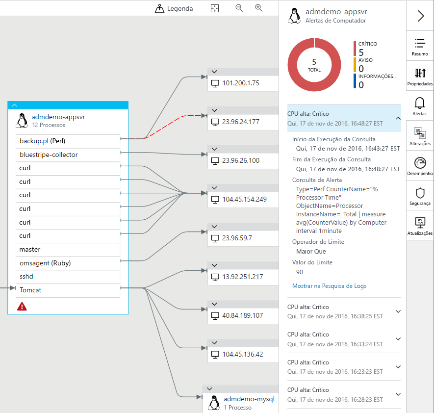

Para permitir que Mapa do Serviço exiba alertas relevantes, crie uma regra de alerta que seja acionada para um computador específico. Para criar alertas adequados:
- Inclua uma cláusula para agrupar por computador (por exemplo, **por intervalo de computador 1 minuto**).
- Opte por alertar com base na medição da métrica.

## <a name="log-events-integration"></a>Integração de eventos de log

O Mapa do Serviço integra-se à Pesquisa de Logs para mostrar uma contagem de todos os eventos de log disponíveis para o servidor selecionado no intervalo de tempo selecionado. Você pode clicar em qualquer linha na lista de contagens de eventos para saltar para a pesquisa de logs e ver os eventos de log individuais.

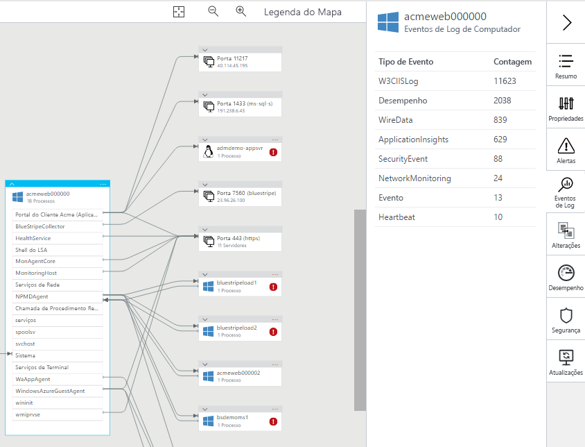

## <a name="service-desk-integration"></a>Integração da central de serviços

A integração do Mapa do Serviço com o Conector de Gerenciamento de Serviços de TI é automática quando ambas as soluções estão habilitadas e configuradas em seu espaço de trabalho do Log Analytics. A integração no Mapa do Serviço é rotulada "central de serviços". Para obter mais informações, consulte [Gerenciar itens de trabalho de ITSM de forma centralizada usando o Conector de Gerenciamento de Serviço de TI](https://docs.microsoft.com/azure/log-analytics/log-analytics-itsmc-overview).

O painel **Central de Serviços do Computador** lista todos os eventos de Gerenciamento de Serviço de TI para o servidor selecionado no intervalo de tempo selecionado. O servidor exibirá um ícone se houver itens atuais e o painel central de serviços da máquina os listar.

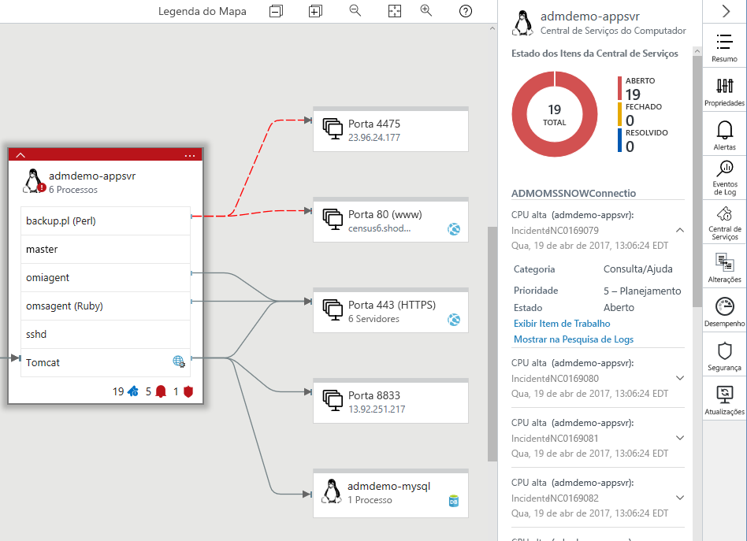

Para abrir o item na sua solução ITSM conectada, clique em **Exibir Item de Trabalho**.

Para exibir os detalhes do item na Pesquisa de Logs, clique em **Mostrar na Pesquisa de Logs**.
As métricas de conexão são gravadas em duas novas tabelas no Log Analytics 

## <a name="change-tracking-integration"></a>Integração do Controle de Alterações

A integração do Mapa do Serviço com o Controle de Alterações é automática quando ambas as soluções estão habilitadas e configuradas em seu espaço de trabalho do Log Analytics.

O painel **Controle de Alterações do Computador** lista todas as alterações, as mais recentes primeiro, juntamente com um link para fazer busca detalhada da Pesquisa de Logs para obter detalhes adicionais.

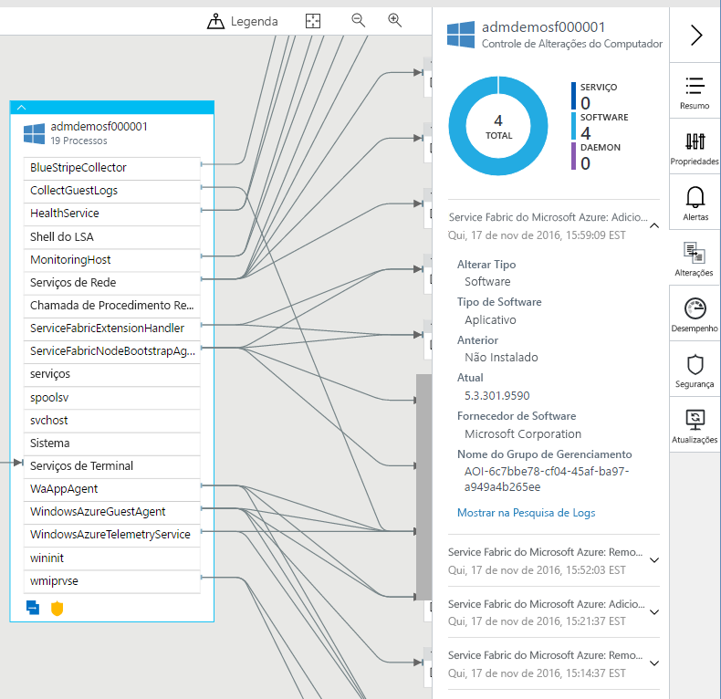

A imagem a seguir é uma exibição detalhada de um evento ConfigurationChange que poderá ser exibido após selecionar **Mostrar no Log Analytics**.

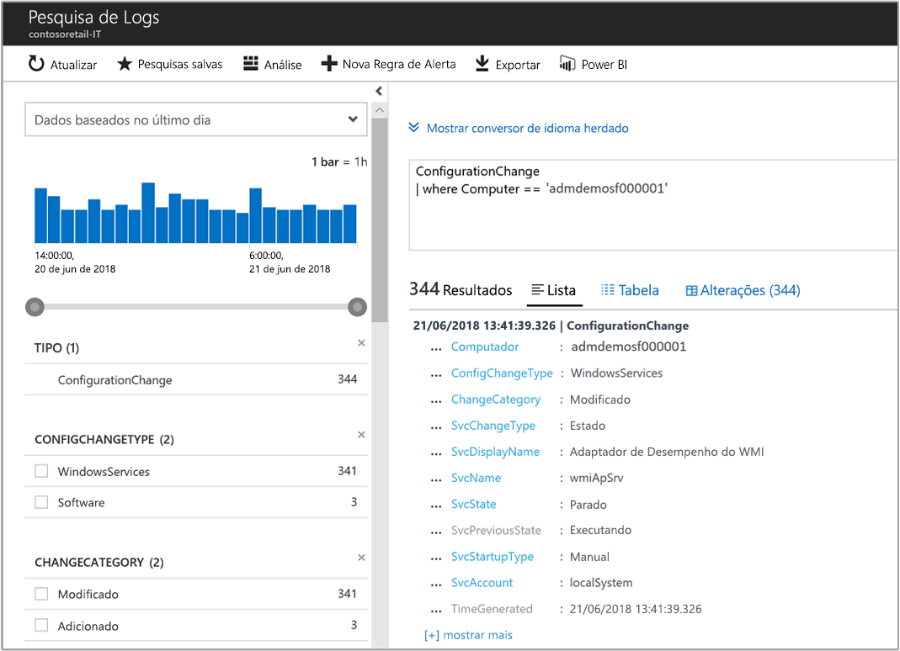

## <a name="performance-integration"></a>Integração de desempenho

O painel **Desempenho do Computador** exibe métricas de desempenho padrão para o servidor selecionado. As métricas incluem utilização de CPU, utilização de memória, bytes de rede enviados e recebidos e uma lista dos principais processos por bytes de rede enviados e recebidos.

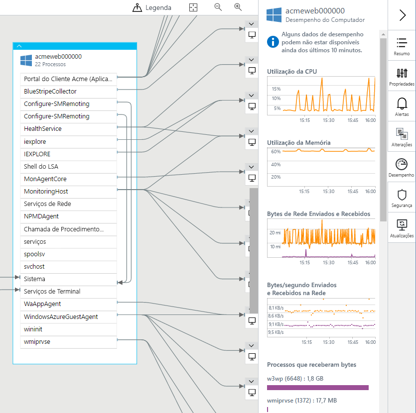

Para ver os dados de desempenho, talvez seja necessário [habilitar os contadores de desempenho apropriados de log Analytics](https://docs.microsoft.com/azure/log-analytics/log-analytics-data-sources-performance-counters).  Os contadores que você deseja habilitar:

Windows
- Processador (*) \\% tempo do processador
- Memória \\% de bytes confirmados em uso
- Adaptador de rede (*) \\Bytes enviados/s
- Adaptador de rede (*) \\Bytes recebidos/s

Linux
- Processador (*) \\% tempo do processador
- Memória (*) \\% de memória usada
- Adaptador de rede (*) \\Bytes enviados/s
- Adaptador de rede (*) \\Bytes recebidos/s

Para obter os dados de desempenho de rede, você também deve ter habilitado a solução Wire Data 2.0 em seu espaço de trabalho.
 
## <a name="security-integration"></a>Integração de segurança

A integração do Mapa do Serviço com o Segurança e Auditoria é automática quando ambas as soluções estão habilitadas e configuradas em seu espaço de trabalho do Log Analytics.

O painel **segurança do computador** mostra dados da solução segurança e auditoria para o servidor selecionado. O painel lista um resumo de quaisquer problemas de segurança pendentes para o servidor durante o intervalo de tempo selecionado. Clicar em qualquer um dos problemas de segurança faz uma busca detalhada em uma pesquisa de log para obter detalhes sobre eles.

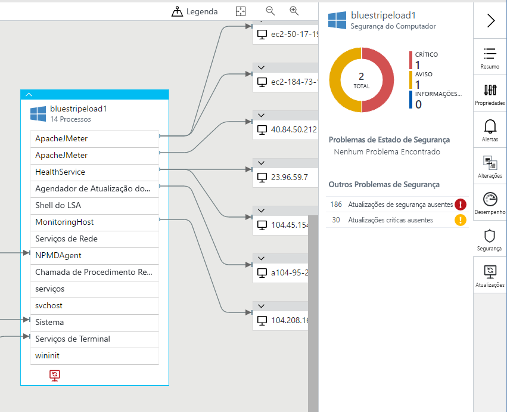

## <a name="updates-integration"></a>Integração de atualizações

A integração do Mapa do Serviço com o Gerenciamento de Atualizações é automática quando ambas as soluções estão habilitadas e configuradas em seu espaço de trabalho do Log Analytics.

O painel **atualizações do computador** exibe dados da solução gerenciamento de atualizações para o servidor selecionado. O painel lista um resumo de todas as atualizações ausentes para o servidor durante o intervalo de tempo selecionado.

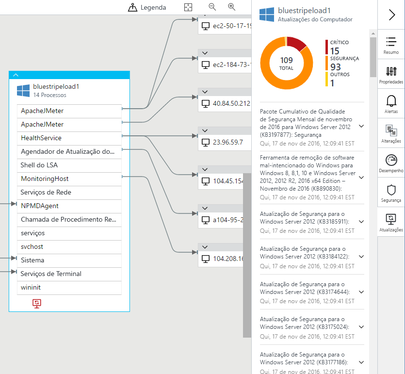

## <a name="log-analytics-records"></a>Registros de Log Analytics

Dados de inventário do processo e do computador do Mapa do Serviço estão disponíveis para [pesquisa](../../azure-monitor/log-query/log-query-overview.md) no Log Analytics. Você pode aplicar esses dados a cenários que incluem planejamento de migração, análise de capacidade, descoberta e solução de problemas de desempenho sob demanda.

Um registro é gerado por hora para cada computador e processo exclusivo, além dos registros que são gerados quando um processo ou computador é iniciado ou integrado ao Mapa do Serviço. Esses registros têm as propriedades descritas nas tabelas a seguir. Os campos e valores nos eventos ServiceMapComputer_CL são mapeados para os campos do recurso de máquina na API do ServiceMap Azure Resource Manager. Os campos e valores nos eventos ServiceMapProcess_CL são mapeados para os campos do recurso de processo na API do ServiceMap Azure Resource Manager. O campo ResourceName_s corresponde ao campo de nome no recurso do Resource Manager correspondente. 

>[!NOTE]
>À medida que os recursos do Mapa do Serviço crescem, esses campos estão sujeitos a alterações.

Há propriedades geradas internamente que você pode usar para identificar computadores e processos exclusivos:

- Computador: use *ResourceId* ou *ResourceName_s* para identificar exclusivamente um computador em um espaço de trabalho log Analytics.
- Processo: use *ResourceId* para identificar exclusivamente um processo em um espaço de trabalho log Analytics. *ResourceName_s* é exclusivo no contexto do computador no qual o processo está em execução (MachineResourceName_s) 

Como vários registros podem existir para um processo especificado e um computador em um intervalo de tempo especificado, as consultas podem retornar mais de um registro para o mesmo computador ou processo. Para incluir apenas o registro mais recente, adicione "| eliminação de duplicatas "para a consulta.

### <a name="connections"></a>conexões

As métricas de conexão são gravadas em uma nova tabela em Log Analytics-VMConnection. Esta tabela fornece informações sobre as conexões de um computador (entrada e saída). As métricas de conexão também são expostas com APIs que fornecem os meios para obter uma métrica específica durante uma janela de tempo.  As conexões TCP resultantes de "*Accept*-ing em um soquete de escuta são de entrada, enquanto as criadas pelo *Connect*-ing para um determinado IP e porta são de saída. A direção de uma conexão é representada pela propriedade Direction, que pode ser definida como de **entrada** ou de **saída**. 

Os registros nessas tabelas são gerados a partir de dados relatados pelo Dependency Agent. Cada registro representa uma observação sobre um intervalo de tempo de um minuto. A Propriedade TimeGenerated indica o início do intervalo de tempo. Cada registro contém informações para identificar a respectiva entidade, ou seja, conexão ou porta, bem como métricas associadas a essa entidade. Atualmente, apenas a atividade de rede que ocorre usando TCP sobre IPv4 é relatada.

Para gerenciar o custo e a complexidade, os registros de conexão não representam conexões de rede física individuais. Várias conexões de rede física são agrupadas em uma conexão lógica, que é refletida na respectiva tabela.  Ou seja, os registros na tabela *VMConnection* representam um agrupamento lógico e não as conexões físicas individuais que estão sendo observadas. A conexão de rede física que compartilha o mesmo valor para os seguintes atributos durante um determinado intervalo de um minuto, é agregada em um único registro lógico em *VMConnection*. 

| Propriedade | Descrição |
|:--|:--|
| `Direction` |Direção da conexão, o valor é de *entrada* ou de *saída* |
| `Machine` |O FQDN do computador |
| `Process` |Identidade do processo ou grupos de processos, iniciando/aceitando a conexão |
| `SourceIp` |Endereço IP da origem |
| `DestinationIp` |Endereço IP do destino |
| `DestinationPort` |Número da porta do destino |
| `Protocol` |Protocolo usado para a conexão.  Os valores são *TCP*. |

Para considerar o impacto do agrupamento, as informações sobre o número de conexões físicas agrupadas são fornecidas nas seguintes propriedades do registro:

| Propriedade | Descrição |
|:--|:--|
| `LinksEstablished` |O número de conexões de rede física que foram estabelecidas durante a janela de tempo de relatório |
| `LinksTerminated` |O número de conexões de rede física que foram terminadas durante a janela de tempo de relatório |
| `LinksFailed` |O número de conexões de rede física que falharam durante a janela de tempo de relatório. Atualmente, essas informações estão disponíveis apenas para conexões de saída. |
| `LinksLive` |O número de conexões de rede física que estavam abertas no final da janela de tempo de relatório|

#### <a name="metrics"></a>Métricas

Além das métricas de contagem de conexão, as informações sobre o volume de dados enviados e recebidos em uma determinada conexão lógica ou porta de rede também estão incluídas nas seguintes propriedades do registro:

| Propriedade | Descrição |
|:--|:--|
| `BytesSent` |Número total de bytes que foram enviados durante a janela de tempo de relatório |
| `BytesReceived` |Número total de bytes recebidos durante a janela de tempo de relatório |
| `Responses` |O número de respostas observadas durante a janela de tempo de relatório. 
| `ResponseTimeMax` |O maior tempo de resposta (milissegundos) observado durante a janela de tempo de relatório.  Se nenhum valor, a propriedade ficará em branco.|
| `ResponseTimeMin` |O menor tempo de resposta (milissegundos) observado durante a janela de tempo de relatório.  Se nenhum valor, a propriedade ficará em branco.|
| `ResponseTimeSum` |A soma de todos os tempos de resposta (milissegundos) observados durante a janela de tempo de relatório.  Se nenhum valor, a propriedade estará em branco|

O terceiro tipo de dados que estão sendo relatados é o tempo de resposta – quanto tempo um chamador gasta aguardando uma solicitação enviada por uma conexão a ser processada e respondida pelo ponto de extremidade remoto. O tempo de resposta relatado é uma estimativa do tempo de resposta verdadeiro do protocolo de aplicativo subjacente. Ele é calculado usando heurística com base na observação do fluxo de dados entre a extremidade de origem e destino de uma conexão de rede física. Conceitualmente, é a diferença entre a hora em que o último byte de uma solicitação deixa o remetente e a hora em que o último byte da resposta chega a ele. Esses dois carimbos de data/hora são usados para delinear eventos de solicitação e resposta em uma determinada conexão física. A diferença entre eles representa o tempo de resposta de uma única solicitação. 

Nesta primeira versão desse recurso, nosso algoritmo é uma aproximação que pode funcionar com um grau variável de sucesso, dependendo do protocolo de aplicativo usado para uma determinada conexão de rede. Por exemplo, a abordagem atual funciona bem para protocolos baseados em solicitação-resposta, como HTTP (S), mas não funciona com protocolos unidirecionais e baseados em fila de mensagens.

Aqui estão alguns pontos importantes a considerar:

1. Se um processo aceitar conexões no mesmo endereço IP, mas em várias interfaces de rede, um registro separado para cada interface será relatado. 
2. Os registros com IP curinga não conterá nenhuma atividade. Eles são incluídos para representar o fato de que uma porta no computador está aberta para o tráfego de entrada.
3. Para reduzir o detalhamento e o volume de dados, os registros com IP curinga serão omitidos quando houver um registro correspondente (para o mesmo processo, porta e protocolo) com um endereço IP específico. Quando um registro de IP curinga for omitido, a propriedade de registro IsWildcardBind com o endereço IP específico será definida como "true" para indicar que a porta está exposta em todas as interfaces da máquina de relatórios.
4. As portas que são associadas somente em uma interface específica têm IsWildcardBind definido como "false".

#### <a name="naming-and-classification"></a>Nomenclatura e classificação

Para sua conveniência, o endereço IP da extremidade remota de uma conexão é incluído na propriedade RemoteIp. Para conexões de entrada, RemoteIp é o mesmo que SourceIp, enquanto para conexões de saída, é o mesmo que DestinationIp. A propriedade RemoteDnsCanonicalNames representa os nomes canônicos de DNS relatados pelo computador para RemoteIp. As propriedades RemoteDnsQuestions e RemoteClassification são reservadas para uso futuro. 

#### <a name="geolocation"></a>Geolocalização

O *VMConnection* também inclui informações de localização geográfica para a extremidade remota de cada registro de conexão nas seguintes propriedades do registro: 

| Propriedade | Descrição |
|:--|:--|
| `RemoteCountry` |O nome do país/região que hospeda o RemoteIp.  Por exemplo, *Estados Unidos* |
| `RemoteLatitude` |A latitude de geolocalização.  Por exemplo, *47,68* |
| `RemoteLongitude` |A longitude da geolocalização.  Por exemplo, *-122,12* |

#### <a name="malicious-ip"></a>IP mal-intencionado

Todas as propriedades RemoteIp na tabela *VMConnection* são verificadas em relação a um conjunto de IPS com atividade mal-intencionada conhecida. Se o RemoteIp for identificado como mal-intencionado, as propriedades a seguir serão preenchidas (estão vazias, quando o IP não for considerado mal-intencionado) nas seguintes propriedades do registro:

| Propriedade | Descrição |
|:--|:--|
| `MaliciousIp` |O endereço RemoteIp |
| `IndicatorThreadType` |O indicador de ameaça detectado é um dos seguintes valores: *botnet*, *C2*, *CryptoMining*, *Darknet*, *DDoS*, *MaliciousUrl*, *malware*, *phishing*, *proxy*, *pua*,  *Inspeção de variáveis*.   |
| `Description` |Descrição da ameaça observada. |
| `TLPLevel` |O nível do protocolo TLP (Traffic Light Protocol) é um dos valores definidos, *branco*, *verde*, *âmbar*e *vermelho*. |
| `Confidence` |Os valores são *0 a 100*. |
| `Severity` |Os valores são *0 – 5*, em que *5* é o mais grave e *0* não é grave. O valor padrão é *3*.  |
| `FirstReportedDateTime` |A primeira vez que o provedor reportou o indicador. |
| `LastReportedDateTime` |A última vez em que o indicador foi visto por interflow. |
| `IsActive` |Indica que os indicadores são desativados com o valor *verdadeiro* ou *falso* . |
| `ReportReferenceLink` |Links para relatórios relacionados a um determinado observed. |
| `AdditionalInformation` |Fornece informações adicionais, se aplicável, sobre a ameaça observada. |

### <a name="servicemapcomputer_cl-records"></a>Registros ServiceMapComputer_CL

Registros com um tipo de *ServiceMapComputer_CL* têm dados de inventário para servidores com agentes do Mapa do Serviço. Esses registros têm as propriedades na tabela a seguir:

| Propriedade | Descrição |
|:--|:--|
| `Type` | *ServiceMapComputer_CL* |
| `SourceSystem` | *OpsManager* |
| `ResourceId` | O identificador exclusivo de um computador dentro do espaço de trabalho |
| `ResourceName_s` | O identificador exclusivo de um computador dentro do espaço de trabalho |
| `ComputerName_s` | O FQDN do computador |
| `Ipv4Addresses_s` | Uma lista de endereços IPv4 do servidor |
| `Ipv6Addresses_s` | Uma lista de endereços IPv6 do servidor |
| `DnsNames_s` | Uma matriz de nomes DNS |
| `OperatingSystemFamily_s` | Windows ou Linux |
| `OperatingSystemFullName_s` | O nome completo do sistema operacional  |
| `Bitness_s` | O bit de bits do computador (32 bits ou 64 bits)  |
| `PhysicalMemory_d` | A memória física em MB |
| `Cpus_d` | O número de CPUs |
| `CpuSpeed_d` | A velocidade da CPU em MHz|
| `VirtualizationState_s` | *desconhecido*, *físico*, *virtual*, *hipervisor* |
| `VirtualMachineType_s` | *hyperv*, *vmware*, e assim por diante |
| `VirtualMachineNativeMachineId_g` | A ID da VM como atribuída por seu hipervisor |
| `VirtualMachineName_s` | O nome da VM |
| `BootTime_t` | O tempo de inicialização |

### <a name="servicemapprocess_cl-type-records"></a>Registros do tipo ServiceMapProcess_CL

Registros com um tipo de *ServiceMapProcess_CL* têm dados de inventário para processos conectados com TCP em servidores com agentes do Mapa do Serviço. Esses registros têm as propriedades na tabela a seguir:

| Propriedade | Descrição |
|:--|:--|
| `Type` | *ServiceMapProcess_CL* |
| `SourceSystem` | *OpsManager* |
| `ResourceId` | O identificador exclusivo de um processo no espaço de trabalho |
| `ResourceName_s` | O identificador exclusivo de um processo no computador em que está sendo executado|
| `MachineResourceName_s` | O nome do recurso do computador |
| `ExecutableName_s` | O nome do executável do processo |
| `StartTime_t` | A hora de início do pool de processos |
| `FirstPid_d` | O primeiro PID no pool de processos |
| `Description_s` | A descrição do processo |
| `CompanyName_s` | O nome da empresa |
| `InternalName_s` | O nome interno |
| `ProductName_s` | O nome do produto |
| `ProductVersion_s` | A versão do produto |
| `FileVersion_s` | A versão do arquivo |
| `CommandLine_s` | A linha de comando |
| `ExecutablePath _s` | O caminho para o arquivo executável |
| `WorkingDirectory_s` | O diretório de trabalho |
| `UserName` | A conta sob a qual o processo está sendo executado |
| `UserDomain` | O domínio no qual o processo está sendo executado |

## <a name="sample-log-searches"></a>Pesquisas de log de exemplo

### <a name="list-all-known-machines"></a>Listar todos os computadores conhecidos

ServiceMapComputer_CL | resumir ARG_MAX (TimeGenerated, *) por ResourceId

### <a name="list-the-physical-memory-capacity-of-all-managed-computers"></a>Lista a capacidade de memória física de todos os computadores gerenciados.

ServiceMapComputer_CL | resumir ARG_MAX (TimeGenerated, *) por ResourceId | projeto PhysicalMemory_d, ComputerName_s

### <a name="list-computer-name-dns-ip-and-os"></a>Listar nome do computador, DNS, IP e sistema operacional.

ServiceMapComputer_CL | resumir ARG_MAX (TimeGenerated, *) por ResourceId | projeto ComputerName_s, OperatingSystemFullName_s, DnsNames_s, Ipv4Addresses_s

### <a name="find-all-processes-with-sql-in-the-command-line"></a>Localizar todos os processos com "sql" na linha de comando

ServiceMapProcess_CL | em que CommandLine_s contains_cs "SQL" | resumir ARG_MAX (TimeGenerated, *) por ResourceId

### <a name="find-a-machine-most-recent-record-by-resource-name"></a>Localizar um computador (registro mais recente) por nome de recurso

Pesquisar em (ServiceMapComputer_CL) "m-4b9c93f9-bc37-46DF-b43c-899ba829e07b" | resumir ARG_MAX (TimeGenerated, *) por ResourceId

### <a name="find-a-machine-most-recent-record-by-ip-address"></a>Localizar um computador (registro mais recente) por endereço IP

Pesquisar em (ServiceMapComputer_CL) "10.229.243.232" | resumir ARG_MAX (TimeGenerated, *) por ResourceId

### <a name="list-all-known-processes-on-a-specified-machine"></a>Listar todos os processos conhecidos em um computador especificado

ServiceMapProcess_CL | em que MachineResourceName_s = = "m-559dbcd8-3130-454D-8d1d-f624e57961bc" | resumir ARG_MAX (TimeGenerated, *) por ResourceId

### <a name="list-all-computers-running-sql"></a>Listar todos os computadores que executam SQL

ServiceMapComputer_CL | onde ResourceName_s ((Pesquisar em (ServiceMapProcess_CL) "\*sql \*" | DISTINCT MachineResourceName_s)) | ComputerName_s distinto

### <a name="list-all-unique-product-versions-of-curl-in-my-datacenter"></a>Listar todas as versões de produto exclusivas da ondulação em meu datacenter

ServiceMapProcess_CL | em que ExecutableName_s = = "Ondulação" | ProductVersion_s distinto

### <a name="create-a-computer-group-of-all-computers-running-centos"></a>Criar um grupo de computador de todos os computadores que executam o CentOS

ServiceMapComputer_CL | em que OperatingSystemFullName_s contains_cs "CentOS" | ComputerName_s distinto

### <a name="summarize-the-outbound-connections-from-a-group-of-machines"></a>Resumir as conexões de saída de um grupo de computadores

```
// the machines of interest
let machines = datatable(m: string) ["m-82412a7a-6a32-45a9-a8d6-538354224a25"];
// map of ip to monitored machine in the environment
let ips=materialize(ServiceMapComputer_CL
| summarize ips=makeset(todynamic(Ipv4Addresses_s)) by MonitoredMachine=ResourceName_s
| mvexpand ips to typeof(string));
// all connections to/from the machines of interest
let out=materialize(VMConnection
| where Machine in (machines)
| summarize arg_max(TimeGenerated, *) by ConnectionId);
// connections to localhost augmented with RemoteMachine
let local=out
| where RemoteIp startswith "127."
| project ConnectionId, Direction, Machine, Process, ProcessName, SourceIp, DestinationIp, DestinationPort, Protocol, RemoteIp, RemoteMachine=Machine;
// connections not to localhost augmented with RemoteMachine
let remote=materialize(out
| where RemoteIp !startswith "127."
| join kind=leftouter (ips) on $left.RemoteIp == $right.ips
| summarize by ConnectionId, Direction, Machine, Process, ProcessName, SourceIp, DestinationIp, DestinationPort, Protocol, RemoteIp, RemoteMachine=MonitoredMachine);
// the remote machines to/from which we have connections
let remoteMachines = remote | summarize by RemoteMachine;
// all augmented connections
(local)
| union (remote)
//Take all outbound records but only inbound records that come from either //unmonitored machines or monitored machines not in the set for which we are computing dependencies.
| where Direction == 'outbound' or (Direction == 'inbound' and RemoteMachine !in (machines))
| summarize by ConnectionId, Direction, Machine, Process, ProcessName, SourceIp, DestinationIp, DestinationPort, Protocol, RemoteIp, RemoteMachine
// identify the remote port
| extend RemotePort=iff(Direction == 'outbound', DestinationPort, 0)
// construct the join key we'll use to find a matching port
| extend JoinKey=strcat_delim(':', RemoteMachine, RemoteIp, RemotePort, Protocol)
// find a matching port
| join kind=leftouter (VMBoundPort 
| where Machine in (remoteMachines) 
| summarize arg_max(TimeGenerated, *) by PortId 
| extend JoinKey=strcat_delim(':', Machine, Ip, Port, Protocol)) on JoinKey
// aggregate the remote information
| summarize Remote=makeset(iff(isempty(RemoteMachine), todynamic('{}'), pack('Machine', RemoteMachine, 'Process', Process1, 'ProcessName', ProcessName1))) by ConnectionId, Direction, Machine, Process, ProcessName, SourceIp, DestinationIp, DestinationPort, Protocol
```

## <a name="rest-api"></a>API REST

Todos os dados do servidor, do processo e de dependência no Mapa do Serviço estão disponíveis por meio da [API REST do Mapa do Serviço](https://docs.microsoft.com/rest/api/servicemap/).

## <a name="diagnostic-and-usage-data"></a>Dados de uso e de diagnóstico

A Microsoft coleta automaticamente dados de uso e de desempenho por meio do uso do serviço de Mapa do Serviço. A Microsoft usa esses dados para fornecer e aprimorar a qualidade, a segurança e a integridade do serviço Mapa do Serviço. Para fornecer recursos de solução de problemas precisos e eficientes, os dados incluem informações sobre a configuração do software, como sistema operacional e versão, endereço IP, nome DNS e nome da estação de trabalho. A Microsoft não coleta nomes, endereços ou outras informações de contato.

Para obter mais informações sobre a coleta e uso de dados, consulte a [Política de privacidade do Microsoft Online Services](https://go.microsoft.com/fwlink/?LinkId=512132).

## <a name="next-steps"></a>Próximos passos

Saiba mais sobre [pesquisas de logs](../../azure-monitor/log-query/log-query-overview.md) no Log Analytics para recuperar dados coletados pelo Mapa do Serviço.

## <a name="troubleshooting"></a>solução de problemas

Se você enfrentar problemas ao instalar ou executar o Mapa do Serviço, esta seção poderá lhe ajudar. Se ainda não for possível resolver o problema, entre em contato com o Suporte da Microsoft.

### <a name="dependency-agent-installation-problems"></a>Problemas de instalação do agente de dependência

#### <a name="installer-prompts-for-a-reboot"></a>O instalador solicita uma reinicialização
O agente de dependência *geralmente* não requer uma reinicialização após a instalação ou remoção. No entanto, em alguns casos raros, o Windows Server exige uma reinicialização para continuar com uma instalação. Isso acontece quando uma dependência, geralmente, a biblioteca C++ redistribuível do Microsoft Visual requer uma reinicialização devido a um arquivo bloqueado.

#### <a name="message-unable-to-install-dependency-agent-visual-studio-runtime-libraries-failed-to-install-code--code_number-appears"></a>Mensagem "não é possível instalar o agente de dependência: as bibliotecas de tempo de execução do Visual Studio não puderam ser instaladas (código = [code_number])" aparece

O Microsoft Dependency Agent foi criado no Microsoft Visual Studio bibliotecas de tempo de execução. Você receberá uma mensagem se houver um problema durante a instalação das bibliotecas. 

Os instaladores da biblioteca de tempo de execução criam logs na pasta %LOCALAPPDATA%\temp. O arquivo é `dd_vcredist_arch_yyyymmddhhmmss.log`, em que *Arch* é `x86` ou `amd64` e *AAAAMMDDHHMMSS* é a data e a hora (relógio de 24 horas) quando o log foi criado. O log fornece detalhes sobre o problema que está bloqueando a instalação.

Pode ser útil instalar primeiro as [bibliotecas de tempo de execução mais recentes](https://support.microsoft.com/help/2977003/the-latest-supported-visual-c-downloads) .

A tabela a seguir lista números de código e soluções sugeridas.

| Codificar | Descrição | Resolução |
|:--|:--|:--|
| 0x17 | O instalador da biblioteca exige uma atualização do Windows que não foi instalada. | Procure no log do instalador de biblioteca mais recente.<br><br>Se uma referência a `Windows8.1-KB2999226-x64.msu` for seguida por uma linha `Error 0x80240017: Failed to execute MSU package,` você não terá os pré-requisitos para instalar o KB2999226. Siga as instruções na seção pré-requisitos no artigo [tempo de execução universal C no Windows](https://support.microsoft.com/kb/2999226) . Talvez seja necessário executar o Windows Update e reiniciar várias vezes para instalar os pré-requisitos.<br><br>Execute o instalador do Microsoft Dependency Agent novamente. |

### <a name="post-installation-issues"></a>Problemas pós-instalação

#### <a name="server-doesnt-appear-in-service-map"></a>O servidor não aparece no Mapa do Serviço

Se a instalação do agente de dependência for bem-sucedida, mas você não vir seu computador na solução Mapa do Serviço:
* O agente de dependência foi instalado com êxito? Você pode validar isso verificando se o serviço está instalado e em execução.<br><br>
**Windows**: Procure o serviço chamado **Microsoft Dependency Agent**.
**Linux**: Procure o processo em execução **Microsoft-Dependency-Agent**.

* Você está na [camada gratuita log Analytics](https://azure.microsoft.com/pricing/details/monitor/)? O plano gratuito permite até cinco máquinas Mapa do Serviço exclusivas. Quaisquer computadores subsequentes não aparecerão no Mapa do Serviço, mesmo que os cinco anteriores não estejam mais enviando dados.

* O servidor está enviando dados de log e desempenho para Azure Monitor logs? Vá para o Azure Monitor\Logs e execute a seguinte consulta para o seu computador: 

    ```kusto
    Usage | where Computer == "admdemo-appsvr" | summarize sum(Quantity), any(QuantityUnit) by DataType
    ```

Você obteve uma variedade de eventos nos resultados? Os dados são recentes? Nesse caso, seu agente de Log Analytics está operando corretamente e se comunicando com o espaço de trabalho. Caso contrário, verifique o agente em seu computador: [log Analytics agente para solução de problemas do Windows](../platform/agent-windows-troubleshoot.md) ou solução [de problemas do agente log Analytics para Linux](../platform/agent-linux-troubleshoot.md).

#### <a name="server-appears-in-service-map-but-has-no-processes"></a>O servidor aparece no Mapa do Serviço, mas sem processos

Se você vir seu computador no Mapa do Serviço, mas ele não tem nenhum processo ou dados de conexão, isso indica que o agente de dependência está instalado e em execução, mas o driver do kernel não foi carregado. 

Verifique o `C:\Program Files\Microsoft Dependency Agent\logs\wrapper.log file` (Windows) ou `/var/opt/microsoft/dependency-agent/log/service.log file` (Linux). As últimas linhas do arquivo devem indicar por que o kernel não foi carregado. Por exemplo, se o kernel tiver sido atualizado por você, talvez o Linux não dê suporte a ele.

## <a name="feedback"></a>Comentários

Você tem algum comentário para nós sobre Mapa do Serviço ou esta documentação?  Visita nossa [página Voz do Usuário](https://feedback.azure.com/forums/267889-log-analytics/category/184492-service-map), onde você pode sugerir recursos ou votar em sugestões existentes.
