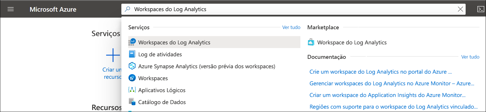
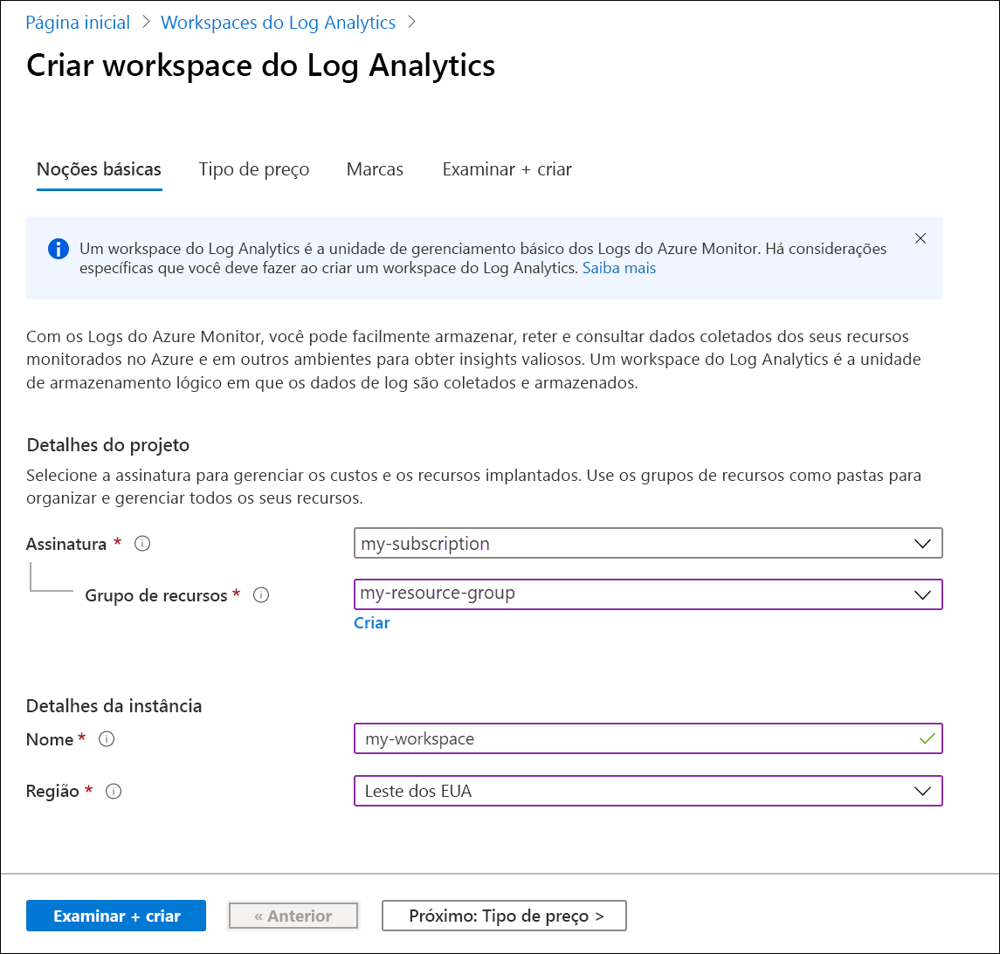
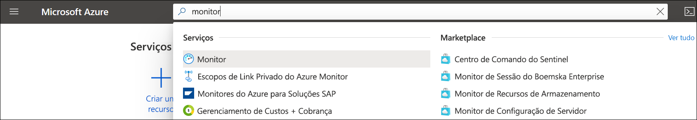
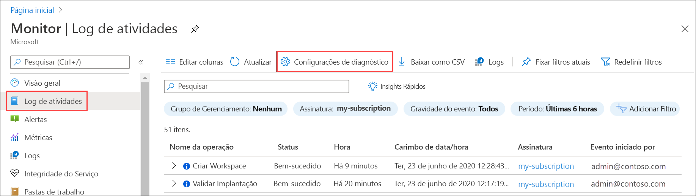
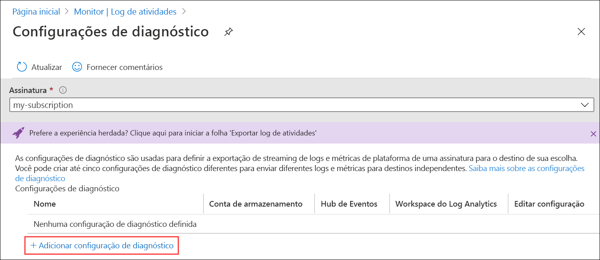
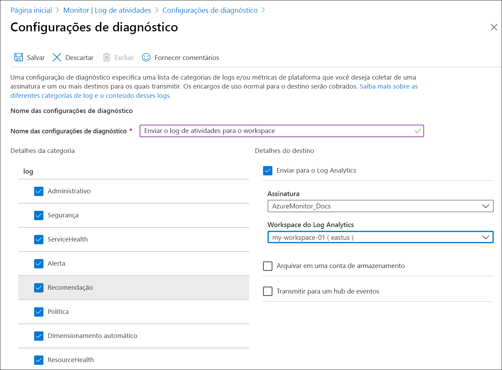
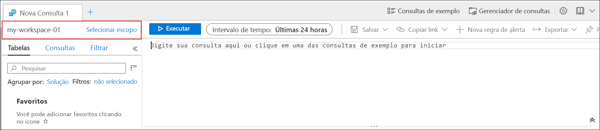
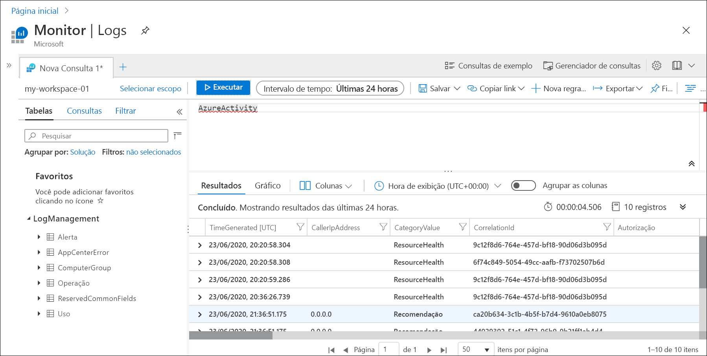
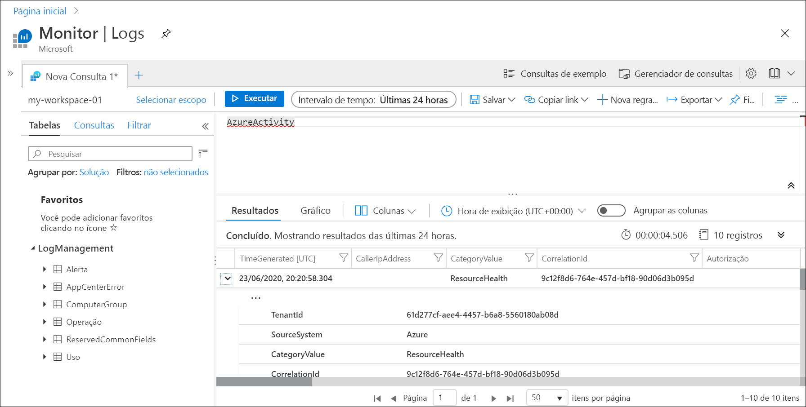
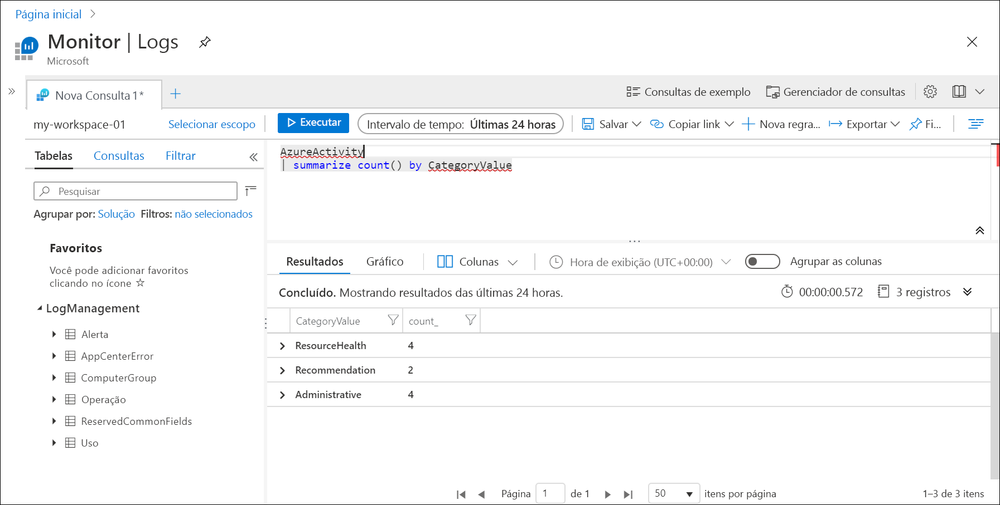

# Enviar o log de atividades do Azure para o workspace do Log Analytics usando o portal do Azure
O log de atividades é um log de plataforma no Azure que fornece insights sobre eventos no nível de assinatura. Isso inclui informações como quando um recurso é modificado ou quando uma máquina virtual é iniciada. Veja o log de atividades no portal do Azure ou recupere as entradas com o PowerShell e a CLI. Este guia de início rápido mostra como usar o portal do Azure para criar um workspace do Log Analytics e uma configuração de diagnóstico para enviar o log de atividades para os Logs do Azure Monitor, em que você poderá analisá-los usando [consultas de log](../log-query/log-query-overview.md) e habilitar outros recursos, como [alertas de log](../platform/alerts-log-query.md) e [pastas de trabalho](../platform/workbooks-overview.md). 

## Entre no portal do Azure
Entre no Portal do Azure em [https://portal.azure.com](https://portal.azure.com). 

## Criar um espaço de trabalho do Log Analytics
No portal do Azure, procure e selecione **Workspaces do Log Analytics**. 

  
Clique em **Adicionar** e forneça valores para o **Grupo de recursos**, o workspace **Nome** e a **Localização**. O nome do workspace precisa ser exclusivo em todas as assinaturas do Azure.

Clique em **Examinar + criar** para examinar as configurações e em **Criar** para criar o workspace. Isso selecionará o tipo de preço padrão **Pagamento Conforme o Uso**, o que não vai gerar nenhum custo até você começar a coletar um volume suficiente de dados. Não há nenhum custo para a coleta do log de atividades.

## Criar configuração de diagnóstico
No portal do Azure, procure e selecione **Monitor**. 

Selecione **Log de atividades**. Você verá os eventos recentes da assinatura atual. Clique em **Configurações de diagnóstico** para ver as configurações de diagnóstico da assinatura.

Clique em **Adicionar configuração de diagnóstico** para criar uma configuração. 

Digite um nome como *Enviar Log de atividades para o workspace*. Selecione cada uma das categorias. Escolha **Enviar para o Log Analytics** como o único destino e especifique o workspace criado. Clique em **Salvar** para criar a configuração de diagnóstico e feche a página.

## Gerar dados de log
Somente as novas entradas do log de atividades serão enviadas ao workspace do Log Analytics; portanto, execute algumas ações na sua assinatura que serão registradas em log, como iniciar ou parar uma máquina virtual ou criar ou modificar outro recurso. Talvez seja necessário aguardar alguns minutos para que a configuração de diagnóstico seja criada e os dados sejam gravados inicialmente no workspace. Após esse atraso, todos os eventos gravados no log de atividades serão enviados ao workspace em alguns segundos.

## Recuperar dados com uma consulta de log

Selecione **Logs** no menu do **Azure Monitor**. Feche a página **Consultas de exemplo**. Se o escopo não estiver definido como o workspace criado, clique em **Selecionar escopo** e localize-o.

Na janela de consulta, digite `AzureActivity` e clique em **Executar**. Essa é uma consulta simples que retorna todos os registros da tabela *AzureActivity*, que contém todos os registros enviados do log de atividades.

Expanda um dos registros para ver as propriedades detalhadas.

Experimente usar uma consulta mais complexa, como `AzureActivity | summarize count() by CategoryValue`, que fornece uma contagem de eventos resumidos pela categoria.

## Próximas etapas
Neste guia de início rápido, você configurou o log de atividades para ser enviado a um workspace do Log Analytics. Agora você pode configurar outros dados a serem coletados no workspace, em que você poderá analisá-los juntos usando [consultas de log](../log-query/log-query-overview.md) no Azure Monitor e aproveitar recursos como [alertas de log](../platform/alerts-log-query.md) e [pastas de trabalho](../platform/workbooks-overview.md). Em seguida, reúna os [logs de recursos](../platform/resource-logs.md) dos seus recursos do Azure, que complementam os dados do log de atividades, fornecendo insights sobre as operações que foram executadas em cada recurso.

> [!div class="nextstepaction"]
> [Coletar e analisar logs de recursos com o Azure Monitor](tutorial-resource-logs.md)
