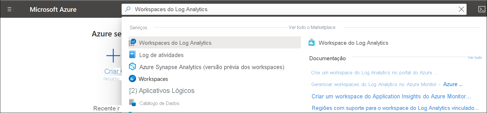

# Criar um espaço de trabalho do Log Analytics no Portal do Azure
Use o menu **Espaços de trabalho do Log Analytics** para criar um espaço de trabalho do Log Analytics usando o portal do Azure. Um espaço de trabalho do Log Analytics é um ambiente exclusivo para dados de log do Azure Monitor. Cada workspace tem seu próprio repositório de dados e configuração. As fontes de dados e as soluções são configuradas para armazenar seus dados em um determinado workspace. Você precisa de um espaço de trabalho do Log Analytics se pretender coletar dados das seguintes fontes:

* Recursos do Azure em sua assinatura
* Computadores locais monitorados pelo System Center Operations Manager
* Coleções de dispositivos do Configuration Manager 
* Dados de diagnóstico ou de log do armazenamento do Azure

Para outras fontes, como as VMs do Azure e as VMs do Windows ou do Linux em seu ambiente, veja os tópicos a seguir:

*  [Coletar dados de máquinas virtuais do Azure](../vm/quick-collect-azurevm.md) 
*  [Coletar dados de um computador Linux híbrido](../vm/quick-collect-linux-computer.md)
*  [Coletar dados de um computador Windows híbrido](../vm/quick-collect-windows-computer.md)

Se você não tiver uma assinatura do Azure, crie uma [conta gratuita](https://azure.microsoft.com/free/?WT.mc_id=A261C142F) antes de começar.

## Entre no portal do Azure
Entre no Portal do Azure em [https://portal.azure.com](https://portal.azure.com). 

## Criar um workspace
No portal do Azure, clique em **Todos os serviços**. Na lista de recursos, digite **Log Analytics**. Quando você começa a digitar, a lista é filtrada com base em sua entrada. Escolha **workspaces do Log Analytics**.

  
Clique em **Adicionar** e forneça valores para as seguintes opções:

   * Selecione uma **Assinatura** a vincular escolhendo uma na lista suspensa, se a selecionada por padrão não é adequada.
   * Para o **Grupo de Recursos**, escolha entre usar um grupo de recursos existente já configurado ou criar um novo.  
   * Forneça um nome para o novo **Espaço de Trabalho do Log Analytics**, como *DefaultLAWorkspace*. Esse nome deve ser globalmente exclusivo em todas as assinaturas do Azure Monitor.
   * Selecione uma **região** disponível.  Para obter mais informações, confira em quais [regiões em que o Log Analytics está disponível](https://azure.microsoft.com/regions/services/) e pesquise Azure Monitor no campo **Pesquisar por um produto**.  

          

Clique em **Examinar + criar** para examinar as configurações e em **Criar** para criar o workspace. Isso selecionará o tipo de preço padrão Pagamento Conforme o Uso, o que não vai gerar nenhum custo até você começar a coletar um volume suficiente de dados. Para obter mais informações sobre outros tipos de preço, consulte [log Analytics detalhes de preços](https://azure.microsoft.com/pricing/details/log-analytics/).

## Solução de problemas
Quando você cria um workspace que foi excluído nos últimos 14 dias e está no [estado de exclusão reversível](../logs/delete-workspace.md#soft-delete-behavior), a operação pode ter um resultado diferente, dependendo da configuração do seu workspace:
1. Se você fornecer o mesmo nome do workspace, grupo de recursos, assinatura e região como no workspace excluído, seu workspace será recuperado, incluindo seus dados, configuração e agentes conectados.
2. Se você usar o mesmo nome de workspace, mas outro grupo de recursos, assinatura ou região, receberá o erro *Esse nome de workspace já está em uso. Tente escolher outro*. Para substituir a exclusão reversível e excluir permanentemente o workspace e criar um novo workspace com o mesmo nome, siga estas etapas para recuperar o workspace primeiro e executar a exclusão permanente:
   - [Recuperar](../logs/delete-workspace.md#recover-workspace) seu workspace
   - [Excluir permanentemente](../logs/delete-workspace.md#permanent-workspace-delete) seu espaço de trabalho
   - Criar um workspace usando o mesmo nome

## Próximas etapas
Agora que já tem um workspace disponível, você pode configurar a coleta de monitoramento de telemetria, executar pesquisas de logs para analisar os dados e adicionar uma solução de gerenciamento para fornecer dados adicionais e informações analíticas. 

* Consulte [monitorar a integridade do log Analytics espaço de trabalho em Azure monitor](../logs/monitor-workspace.md) criar regras de alerta para monitorar a integridade do seu espaço de trabalho. 
* Consulte [coletar logs e métricas de serviço do Azure para uso no log Analytics](../essentials/resource-logs.md#send-to-log-analytics-workspace) para habilitar a coleta de dados de recursos do azure com diagnóstico do Azure ou armazenamento do Azure.
