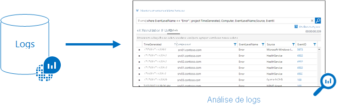
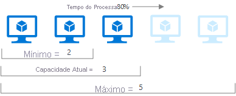

# Visão geral do Azure Monitor

O Azure Monitor ajuda a maximizar a disponibilidade e o desempenho de seus aplicativos e serviços. Ele fornece uma solução abrangente para coleta, análise e ação com base na telemetria em seus ambientes de nuvem e locais. Essas informações ajudam a entender o desempenho de seus aplicativos, além de identificar de maneira proativa os problemas que os estão afetando e os recursos dos quais eles dependem.

Apenas alguns exemplos do que você pode fazer com o Azure Monitor incluem:

- Detecte e diagnostique problemas entre aplicativos e dependências com o [Application Insights](app/app-insights-overview.md).
- Correlacione os problemas de infraestrutura com os [insights da VM](vm/vminsights-overview.md) e [insights do contêiner](containers/container-insights-overview.md).
- Aprofunde-se nos dados de monitoramento com o [Log Analytics](logs/log-query-overview.md) para solução de problemas e diagnósticos detalhados.
- Suporte a operações em escala com [alertas inteligentes](alerts/alerts-smartgroups-overview.md) e [ações automatizadas](alerts/alerts-action-rules.md).
- Crie visualizações com [painéis](visualize/tutorial-logs-dashboards.md) do Azure e [pastas de trabalho](visualize/workbooks-overview.md).
- Colete os dados de [recursos monitorados](./monitor-reference.md) usando as [Métricas do Azure Monitor](./essentials/data-platform-metrics.md).

> [!VIDEO https://www.microsoft.com/en-us/videoplayer/embed/RE4qXeL]

[!INCLUDE [azure-lighthouse-supported-service](../../includes/azure-lighthouse-supported-service.md)]

## Visão geral

O diagrama a seguir fornece uma visão geral do Azure Monitor. No centro do diagrama estão os armazenamentos de dados para métricas e logs, que são os dois tipos fundamentais de dados usados pelo Azure Monitor. À esquerda estão as [fontes de dados de monitoramento](agents/data-sources.md) que populam esses [armazenamentos de dados](data-platform.md). À direita estão as diferentes funções que o Azure Monitor executa com esses dados coletados. Isso inclui ações como análise, alertas e streaming para sistemas externos.

## Plataforma de dados de monitoramento

Todos os dados coletados pelo Azure Monitor se enquadram em um dos dois tipos fundamentais, [métricas e logs](data-platform.md). As [Métricas](essentials/data-platform-metrics.md) são valores numéricos que descrevem algum aspecto de um sistema em um ponto específico no tempo. Elas são leves e podem dar suporte a cenários quase em tempo real. Os [Logs](logs/data-platform-logs.md) contêm diferentes tipos de dados organizados em registros com diferentes conjuntos de propriedades para cada um. Os dados telemétricos, como eventos e rastreamentos, são armazenados como logs acrescidos dos dados de desempenho, de modo que possam todos ser combinados para análise.

Para muitos recursos do Azure, você verá os dados coletados pelo Azure Monitor diretamente em sua página de visão geral no portal do Azure. Dê uma olhada em uma máquina virtual, por exemplo, e você verá vários gráficos que exibem as métricas de desempenho. Clique em um dos gráficos para abrir os dados no [Metrics Explorer](essentials/metrics-charts.md), no portal do Azure, que permite fazer o gráfico dos valores de várias métricas ao longo do tempo.  É possível exibir os gráficos interativamente ou fixá-los em um painel para exibi-los com outras visualizações.

Os dados do log coletados pelo Azure Monitor podem ser analisados com [consultas](logs/log-query-overview.md) que recuperam, consolidam e analisam rapidamente esses dados.  Você pode criar e testar consultas usando o [Log Analytics](./logs/log-query-overview.md) no portal do Azure. É possível analisar diretamente os dados usando ferramentas diferentes ou salvar consultas para uso com [visualizações](visualizations.md) ou [regras de alerta](alerts/alerts-overview.md).

O Azure Monitor usa uma versão da [linguagem de consulta Kusto](/azure/kusto/query/) adequada para consultas de log simples, mas também inclui funcionalidades avançadas como agregações, junções e análises inteligentes. É possível aprender a linguagem de consulta rapidamente por meio de [várias lições](logs/get-started-queries.md).  São fornecidas orientações específicas para usuários que já estão familiarizados com [SQL](/azure/data-explorer/kusto/query/sqlcheatsheet) e [Splunk](/azure/data-explorer/kusto/query/splunk-cheat-sheet).

## Quais dados são coletados pelo Azure Monitor?

O Azure Monitor pode coletar dados de [várias fontes](monitor-reference.md). Elas abrangem seu aplicativo, qualquer sistema operacional e serviços em que ele se baseia e a própria plataforma. O Azure Monitor coleta dados de cada uma dos seguintes camadas:

- **Dados de monitoramento de aplicativo**: dados sobre o desempenho e a funcionalidade do código que você escreveu, independentemente da plataforma.
- **Dados de monitoramento de SO convidado**: dados sobre o sistema operacional no qual o aplicativo é executado. Ele pode estar em execução no Azure, em outra nuvem ou localmente. 
- **Dados de monitoramento de recursos do Azure**: dados sobre a operação de um recurso do Azure.
- **Dados de monitoramento de assinatura do Azure**: dados sobre a operação e o gerenciamento de uma assinatura do Azure, além de dados sobre a integridade e a operação do próprio Azure. 
- **Dados de monitoramento do inquilino do Azure**: dados sobre a operação de serviços do Azure no nível do locatário, como o Azure Active Directory.

Assim que você cria uma assinatura do Azure e começa a adicionar recursos como máquinas virtuais e aplicativos Web, o Azure Monitor começará a coletar dados.  Os [logs de atividades](essentials/platform-logs-overview.md) registram quando os recursos são criados ou modificados. As [métricas](essentials/data-platform-metrics.md) indicam o desempenho do recurso e os recursos que ele está consumindo. 

[Habilite o diagnóstico](essentials/platform-logs-overview.md) para estender os dados que você está coletando para a operação interna dos recursos.  [Adicione um agente](agents/agents-overview.md) aos recursos de computação para coletar a telemetria dos sistemas operacionais convidados deles. 

Habilite o monitoramento do seu aplicativo com o [Application Insights](app/app-insights-overview.md) para coletar informações detalhadas incluindo exibições de página, solicitações de aplicativo e exceções. Verifique a disponibilidade do aplicativo configurando um [teste de disponibilidade](app/monitor-web-app-availability.md) para simular o tráfego de usuários.

### Fontes personalizadas

O Azure Monitor pode coletar dados de log de qualquer cliente REST usando a [API do Coletor de Dados](logs/data-collector-api.md). Isso permite que você crie cenários de monitoramento personalizados e estenda o monitoramento a recursos que não expõem a telemetria por outras fontes.

## Insights
Os dados de monitoramento só serão úteis se puderem aumentar sua visibilidade em relação ao funcionamento do ambiente de computação. Os [insights](monitor-reference.md#insights-and-core-solutions) fornecem uma experiência de monitoramento personalizada para determinados serviços do Azure. Eles exigem configuração mínima e aumentam sua visibilidade sobre a operação de recursos críticos.

### Application Insights
O [Application Insights](app/app-insights-overview.md) monitora a disponibilidade, o desempenho e o uso do seu aplicativo, seja hospedado na nuvem ou localmente. Ele aproveita a plataforma avançada de análise de dados no Azure Monitor para fornecer insights detalhados sobre as operações do aplicativo. Com ele, você pode diagnosticar erros sem esperar que um usuário os relate. O Application Insights inclui pontos de conexão com uma variedade de ferramentas de desenvolvimento e integra-se ao Visual Studio para dar suporte a seus processos de DevOps.

### Insights do contêiner
Os [insights do contêiner](containers/container-insights-overview.md) monitoram o desempenho de cargas de trabalho de contêiner implantadas em clusters do Kubernetes gerenciado hospedados no AKS (Serviço de Kubernetes do Azure). Ela oferece visibilidade de desempenho coletando métricas de controladores, nós e contêineres disponíveis no Kubernetes por meio da API de Métricas. Os logs do contêiner também são coletados.  Após habilitar o monitoramento a partir de clusters do Kubernetes, essas métricas e logs serão coletados automaticamente para você por meio de uma versão em contêiner do agente do Log Analytics para Linux.

### Insights da VM
Os [insights da VM](vm/vminsights-overview.md) monitoram as VMs (máquinas virtuais) do Azure em escala. Ele analisa o desempenho e a integridade de suas VMs do Windows e Linux e identifica os diferentes processos delas e as dependências de processos externos interconectadas. A solução inclui suporte para monitorar o desempenho e as dependências de aplicativos nas VMs hospedadas localmente ou em outro provedor de nuvem.  

## Respondendo a situações críticas
Além de permitir que você analise interativamente os dados de monitoramento, uma solução de monitoramento eficaz deve ser capaz de responder proativamente a condições críticas identificadas nos dados coletados. Isso pode envolver enviar um texto ou email a um administrador responsável para investigar um problema. Você também pode iniciar um processo automatizado para tentar corrigir uma condição de erro.

### Alertas
Os [alertas no Azure Monitor](alerts/alerts-overview.md) notificam proativamente sobre condições críticas e podem tentar tomar as medidas corretivas necessárias. As regras de alerta baseadas em métricas fornecem alertas quase em tempo real baseados em valores numéricos. As regras baseadas em logs permitem uma lógica complexa entre os dados de várias fontes.

As regras de alerta no Azure Monitor usam [grupos de ação](alerts/action-groups.md), que contêm conjuntos exclusivos de destinatários e ações que podem ser compartilhados entre várias regras. De acordo com suas necessidades, os grupos de ação podem executar ações como usar web hooks para fazer com que os alertas iniciem ações externas ou se integrem às ferramentas ITSM.

### Autoscale
O dimensionamento automático permite ter a quantidade certa de recursos em execução para lidar com a carga em seu aplicativo. Crie regras que usam métricas coletadas pelo Azure Monitor para determinar quando adicionar recursos automaticamente quando a carga aumentar. Economize dinheiro removendo os recursos que estão ociosos. Especifique um número mínimo e máximo de instâncias e a lógica de quando aumentar ou diminuir os recursos.

## Visualizando dados de monitoramento
As [Visualizações](visualizations.md), como tabelas e gráficos, são ferramentas eficientes para resumir dados de monitoramento e apresentá-los para públicos diferentes. O Azure Monitor tem seus próprios recursos para visualizar os dados de monitoramento e aproveita outros serviços do Azure para mostrá-los a públicos diferentes.

### Painéis
Os [painéis do Azure](../azure-portal/azure-portal-dashboards.md) permitem combinar diferentes tipos de dados em um painel no [portal do Azure](https://portal.azure.com). Você pode compartilhar o painel com outros usuários do Azure. Adicione a saída de qualquer consulta de log ou gráfico de métricas a um painel do Azure. Por exemplo, é possível criar um painel que combine blocos que mostrem um gráfico de métricas, uma tabela de logs de atividades, um gráfico de uso do Application Insights e a saída de uma consulta de log.

### Pastas de trabalho
As [pastas de trabalho](visualize/workbooks-overview.md) oferecem uma tela flexível para análise de dados e a criação de relatórios visuais avançados no portal do Azure. Com elas, você pode explorar várias fontes de dados em todo o Azure e combiná-las em experiências interativas unificadas. Use pastas de trabalho fornecidas com Insights ou crie as próprias com base em modelos predefinidos.

### Power BI
O [Power BI](https://powerbi.microsoft.com) é um serviço de análise de negócios que fornece visualizações interativas em uma variedade de fontes de dados. É um meio eficaz de disponibilizar dados para outras pessoas dentro e fora da sua organização. Você pode configurar o Power BI para [importar dados de log automaticamente do Azure Monitor](./visualize/powerbi.md) a fim de aproveitar essas visualizações adicionais.

## Integrar e exportar dados
Geralmente, você terá o requisito de integrar o Azure Monitor a outros sistemas e de criar soluções personalizadas que usam os dados de monitoramento. Outros serviços do Azure funcionam com o Azure Monitor para fornecer essa integração.

### Hub de evento
Os [Hubs de Eventos do Azure](../event-hubs/index.yml) são uma plataforma de streaming e um serviço de ingestão de eventos. Eles podem transformar e armazenar dados usando qualquer provedor de análise em tempo real ou adaptadores de armazenamento/envio em lote. Use os Hubs de Eventos para [transmitir dados do Azure Monitor](essentials/stream-monitoring-data-event-hubs.md) a ferramentas de monitoramento e SIEM de parceiros.

### Aplicativos Lógicos
O [Aplicativo Lógico](https://azure.microsoft.com/services/logic-apps) é um serviço que permite automatizar tarefas e processos de negócios usando fluxos de trabalho que se integram a diversos sistemas e serviços. Há atividades disponíveis que leem e gravam métricas e logs no Azure Monitor. Isso permite que você crie fluxos de trabalho integrando-se a uma variedade de outros sistemas.

### API
Várias APIs estão disponíveis para ler e gravar logs e métricas do e para o Azure Monitor, além de acessar os alertas gerados. Você também pode configurar e recuperar alertas. Isso permite possibilidades ilimitadas para criar soluções personalizadas que se integram ao Azure Monitor.

## Próximas etapas
Saiba mais sobre:

* [Métricas e logs](./data-platform.md#metrics) para os dados coletados pelo Azure Monitor.
* [Fontes de dados](agents/data-sources.md) para a maneira como os diferentes componentes do seu aplicativo enviam telemetria.
* [Consultas de log](logs/log-query-overview.md) para analisar dados coletados.
* [Melhores práticas](/azure/architecture/best-practices/monitoring) para monitorar aplicativos e serviços em nuvem.