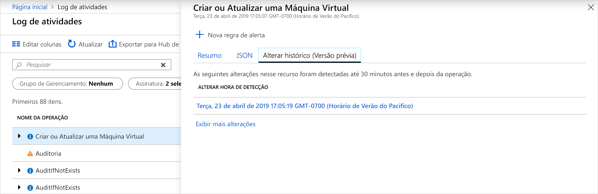
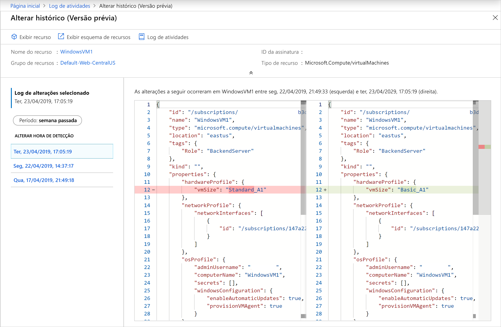
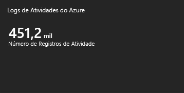
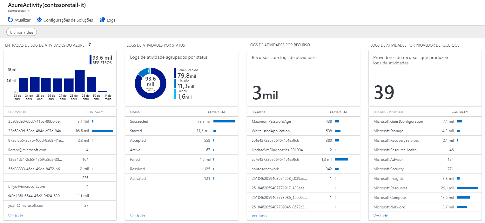

# <a name="view-and-retrieve-azure-activity-log-events"></a>Exibir e recuperar eventos de registro de atividades do Azure

O [Azure Activity Log](platform-logs-overview.md) fornece informações sobre eventos de nível de assinatura que ocorreram no Azure. Este artigo fornece detalhes sobre diferentes métodos para visualizar e recuperar eventos do Registro de Atividades.

## <a name="azure-portal"></a>Portal do Azure
Exibir o Registro de Atividades para todos os recursos do menu **Monitor** no portal Azure. Exibir o Registro de atividades para um recurso específico da opção Registro de **atividades** no menu desse recurso.


Você pode filtrar eventos do Registro de Atividades pelos seguintes campos:

* **Timespan**: O horário de início e fim dos eventos.
* **Categoria**: A categoria do evento conforme descrito em [Categorias no Registro de Atividades](activity-log-view.md#categories-in-the-activity-log).
* **Assinatura**: Um ou mais nomes de assinatura do Azure.
* **Grupo de recursos**: Um ou mais grupos de recursos dentro das assinaturas selecionadas.
* **Recurso (nome)**: - O nome de um recurso específico.
* **Tipo de**recurso : O tipo de recurso, por exemplo _Microsoft.Compute/virtualmachines_.
* **Nome de operação** - O nome de uma operação do Azure Resource Manager, por _exemplo, Microsoft.SQL/servers/Write_.
* **Gravidade**: O nível de gravidade do evento. Os valores disponíveis são _Informativos,_ _Aviso,_ _Erro,_ _Crítico._
* **Evento iniciado por**: O usuário que realizou a operação.
* **Abrir pesquisa**: Abra a caixa de pesquisa de texto que procura por essa seqüência em todos os campos em todos os eventos.

## <a name="categories-in-the-activity-log"></a>Categorias no registro de atividades
Cada evento no Registro de Atividades tem uma categoria específica que está descrita na tabela a seguir. Para obter todos os detalhes sobre o esquema dessas categorias, veja o [esquema de eventos de Log de Atividades do Azure](activity-log-schema.md). 

| Categoria | Descrição |
|:---|:---|
| Administrativo | Contém o registro de todas as operações de criação, atualização, exclusão e ação realizadas através do Gerenciador de Recursos. Exemplos de eventos administrativos incluem _criar máquina virtual_ e excluir grupo de segurança de _rede_.<br><br>Todas as ações tomadas por um usuário ou aplicativo usando o Resource Manager são modeladas como uma operação em um determinado tipo de recurso. Se o tipo de operação for _Write_, _Delete_ou _Action_, os registros do início e do sucesso ou falha dessa operação são registrados na categoria Administrativa. Eventos administrativos também incluem quaisquer alterações no controle de acesso baseado em função em uma assinatura. |
| Integridade do Serviço | Contém o registro de quaisquer incidentes de saúde que tenham ocorrido no Azure. Um exemplo de um evento de Saúde de Serviço _SQL Azure no leste dos EUA está experimentando tempo de inatividade_. <br><br>Os eventos de Saúde do Serviço vêm em seis variedades: _Ação Necessária,_ _Recuperação Assistida,_ _Incidente,_ _Manutenção,_ _Informação_ou _Segurança_. Esses eventos só são criados se você tiver um recurso na assinatura que seria impactado pelo evento.
| Integridade de recursos | Contém o registro de quaisquer eventos de saúde de recursos que tenham ocorrido aos seus recursos do Azure. Um exemplo de evento de saúde de recursos é _o status de saúde da Máquina Virtual alterado para indisponível_.<br><br>Os eventos de Saúde de Recursos podem representar um dos quatro status de saúde: _Disponível_, _Indisponível,_ _Degradado_e _Desconhecido_. Além disso, os eventos de Saúde de Recursos podem ser categorizados como sendo _Iniciados por Plataforma_ ou _Iniciadopelo Usuário._ |
| Alerta | Contém o registro de ativações para alertas Do Zure. Um exemplo de evento alert é _cpu % no myVM tem sido mais de 80 nos últimos 5 minutos_.|
| Autoscale | Contém o registro de quaisquer eventos relacionados à operação do mecanismo de escala automática com base em quaisquer configurações de escala automática definidas em sua assinatura. Um exemplo de evento autoscale é a falha de _ação de escala de escala auto-scale_. |
| Recomendação | Contém eventos de recomendação do Azure Advisor. |
| Segurança | Contém o registro de quaisquer alertas gerados pelo Azure Security Center. Um exemplo de um evento de segurança é _o arquivo de extensão dupla suspeito executado_. |
| Política | Contém registros de todas as operações de ação de efeito realizadas pela Azure Policy. Exemplos de eventos de política incluem _Auditoria_ e _Negar_. Cada ação tomada pelo Policy é modelada como uma operação em um recurso. |

## <a name="view-change-history"></a>Exibir histórico de alterações

Ao revisar o Registro de Atividades, ele pode ajudar a ver quais mudanças aconteceram durante esse tempo de evento. Você pode visualizar essas informações com **o histórico de alteração**. Selecione um evento no Registro de Atividades em que você deseja investigar mais profundamente. Selecione a guia **Histórico de alteração (Visualização)** para exibir quaisquer alterações associadas a esse evento.



Se houver alguma alteração associada ao evento, você verá uma lista de alterações que você pode selecionar. Isso abre a página **'Alterar histórico' (Visualização).** Nesta página você vê as alterações no recurso. Como você pode ver no exemplo a seguir, podemos ver não apenas que a VM mudou de tamanho, mas o tamanho da VM anterior era antes da mudança e para o que foi alterado.



Para saber mais sobre o histórico de alterações, consulte [Obter alterações de recursos](../../governance/resource-graph/how-to/get-resource-changes.md).


## <a name="powershell"></a>PowerShell
Use o [cmdlet Get-AzLog](https://docs.microsoft.com/powershell/module/az.monitor/get-azlog) para recuperar o registro de atividades do PowerShell. A seguir estão alguns exemplos comuns.

> [!NOTE]
> `Get-AzLog` fornece apenas 15 dias de histórico. Use o parâmetro **-MaxEvents** para consultar os últimos eventos N além de 15 dias. Para acessar eventos com mais de 15 dias, use a API REST ou SDK. Se você não incluir **StartTime**, o valor padrão será **EndTime** menos uma hora. Se você não incluir **EndTime**, o valor padrão será a hora atual. Todas as horas estão no padrão UTC.


Obter entradas de log criadas após uma determinada data:

```powershell
Get-AzLog -StartTime 2016-03-01T10:30
```

Obtenha entradas de registro entre um intervalo de data:

```powershell
Get-AzLog -StartTime 2015-01-01T10:30 -EndTime 2015-01-01T11:30
```

Obter entradas de log de um grupo de recursos específico:

```powershell
Get-AzLog -ResourceGroup 'myrg1'
```

Obtenha entradas de log de um provedor de recursos específico entre um intervalo de data:

```powershell
Get-AzLog -ResourceProvider 'Microsoft.Web' -StartTime 2015-01-01T10:30 -EndTime 2015-01-01T11:30
```

Obtenha entradas de log com um chamador específico:

```powershell
Get-AzLog -Caller 'myname@company.com'
```

Receba os últimos 1000 eventos:

```powershell
Get-AzLog -MaxEvents 1000
```


## <a name="cli"></a>CLI
Use [o registro de atividades](cli-samples.md#view-activity-log-for-a-subscription) do monitor az para recuperar o registro de atividades da CLI. A seguir estão alguns exemplos comuns.


Veja todas as opções disponíveis.

```azurecli
az monitor activity-log list -h
```

Obter entradas de log de um grupo de recursos específico:

```azurecli
az monitor activity-log list --resource-group <group name>
```

Obtenha entradas de log com um chamador específico:

```azurecli
az monitor activity-log list --caller myname@company.com
```

Obtenha logs por chamador em um tipo de recurso, dentro de um intervalo de datas:

```azurecli
az monitor activity-log list --resource-provider Microsoft.Web \
    --caller myname@company.com \
    --start-time 2016-03-08T00:00:00Z \
    --end-time 2016-03-16T00:00:00Z
```

## <a name="rest-api"></a>API REST
Use a [API REST do Monitor Azure](https://docs.microsoft.com/rest/api/monitor/) para recuperar o Registro de atividades de um cliente REST. A seguir estão alguns exemplos comuns.

Obtenha registros de atividades com filtro:

``` HTTP
GET https://management.azure.com/subscriptions/089bd33f-d4ec-47fe-8ba5-0753aa5c5b33/providers/microsoft.insights/eventtypes/management/values?api-version=2015-04-01&$filter=eventTimestamp ge '2018-01-21T20:00:00Z' and eventTimestamp le '2018-01-23T20:00:00Z' and resourceGroupName eq 'MSSupportGroup'
```

Obtenha registros de atividades com filtro e selecione:

```HTTP
GET https://management.azure.com/subscriptions/089bd33f-d4ec-47fe-8ba5-0753aa5c5b33/providers/microsoft.insights/eventtypes/management/values?api-version=2015-04-01&$filter=eventTimestamp ge '2015-01-21T20:00:00Z' and eventTimestamp le '2015-01-23T20:00:00Z' and resourceGroupName eq 'MSSupportGroup'&$select=eventName,id,resourceGroupName,resourceProviderName,operationName,status,eventTimestamp,correlationId,submissionTimestamp,level
```

Obtenha registros de atividades com seleção:

```HTTP
GET https://management.azure.com/subscriptions/089bd33f-d4ec-47fe-8ba5-0753aa5c5b33/providers/microsoft.insights/eventtypes/management/values?api-version=2015-04-01&$select=eventName,id,resourceGroupName,resourceProviderName,operationName,status,eventTimestamp,correlationId,submissionTimestamp,level
```

Obtenha registros de atividades sem filtro ou selecione:

```HTTP
GET https://management.azure.com/subscriptions/089bd33f-d4ec-47fe-8ba5-0753aa5c5b33/providers/microsoft.insights/eventtypes/management/values?api-version=2015-04-01
```


## <a name="activity-logs-analytics-monitoring-solution"></a>Solução de monitoramento do Activity Logs Analytics
A solução de monitoramento do Azure Log Analytics inclui várias consultas de log e visualizações para analisar os registros do Registro de Atividades em seu espaço de trabalho do Log Analytics.

### <a name="prerequisites"></a>Pré-requisitos
Você deve criar uma configuração de diagnóstico para enviar o registro de atividades para sua assinatura em um espaço de trabalho do Log Analytics. Consulte [os logs da plataforma Collect Azure no espaço de trabalho log analytics no Azure Monitor](resource-logs-collect-workspace.md).

### <a name="install-the-solution"></a>Instalar a solução
Use o procedimento em [Instalar uma solução de monitoramento](../insights/solutions.md#install-a-monitoring-solution) para instalar a solução Activity Log **Analytics.** Não é necessária uma configuração adicional.

### <a name="use-the-solution"></a>Usar a solução
Clique em **Logs** na parte superior da página do Registro de **Atividades** para abrir a [solução de monitoramento do Activity Log Analytics](activity-log-collect.md) para a assinatura. Ou acesse todas as soluções de monitoramento no menu **do Monitor** de assinatura no portal Azure. Selecione **Mais** na seção **'Insights'** para abrir a página **Visão geral** com os ladrilhos da solução. O **azulejo Azure Activity Logs** exibe uma contagem do número de registros do **AzureActivity** em seu espaço de trabalho.




Clique no **bloco Azure Activity Logs** para abrir a exibição **Logs de atividade do Azure.** A visualização inclui as partes de visualização na tabela a seguir. Cada peça lista até 10 itens que correspondem aos critérios das peças para o intervalo de tempo especificado. Você pode executar uma consulta de log que retorna todos os registros correspondentes clicando em **Ver tudo** na parte inferior da peça.



| Parte de visualização | Descrição |
| --- | --- |
| Entradas de log de atividades do Azure | Mostra um gráfico de barras dos principais totais de registro de entrada do Azure Activity Log para a faixa de data que você selecionou e mostra uma lista dos 10 principais chamadores de atividades. Clique no gráfico de barras para executar uma pesquisa de logs para `AzureActivity`. Clique em um item de chamada para executar uma pesquisa de log retornando todas as entradas do Registro de Atividades para esse item. |
| Logs de atividade por status | Mostra um gráfico de rosquinhas para o status do Azure Activity Log para a faixa de data selecionada e uma lista dos dez principais registros de status. Clique no gráfico para executar `AzureActivity | summarize AggregatedValue = count() by ActivityStatus`uma consulta de log para . Clique em um item de status para executar uma pesquisa de log retornando todas as entradas do Registro de atividades para esse registro de status. |
| Logs de atividade por recurso | Mostra o número total de recursos com Registros de Atividades e lista os dez principais recursos com contagem de registros para cada recurso. Clique na área total para executar uma pesquisa de logs de `AzureActivity | summarize AggregatedValue = count() by Resource`, que mostra todos os recursos do Azure disponíveis para a solução. Clique em um recurso para executar uma consulta de log retornando todos os registros de atividades para esse recurso. |
| Logs de atividade por provedor de recursos | Mostra o número total de provedores de recursos que produzem Registros de Atividades e lista os dez primeiros. Clique na área total para executar `AzureActivity | summarize AggregatedValue = count() by ResourceProvider`uma consulta de log para , que mostra todos os provedores de recursos do Azure. Clique em um provedor de recursos para executar uma consulta de log retornando todos os registros de atividades para o provedor. |


## <a name="next-steps"></a>Próximas etapas

* [Leia uma visão geral dos logs da plataforma](platform-logs-overview.md)
* [Criar configuração de diagnóstico para enviar logs de atividade para outros destinos](diagnostic-settings.md)
