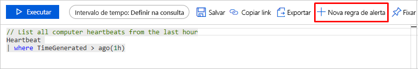
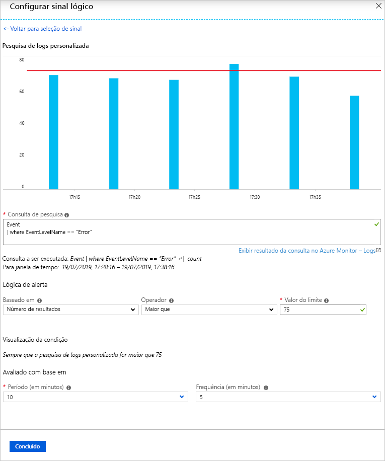
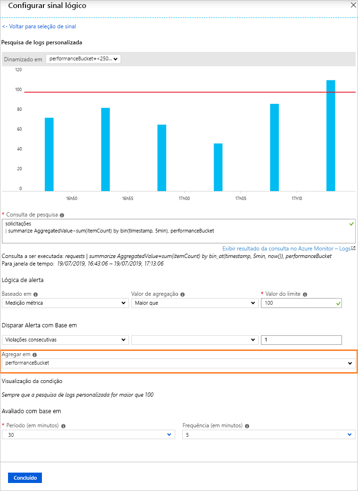
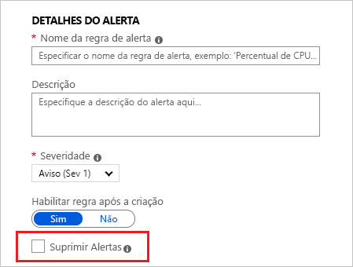
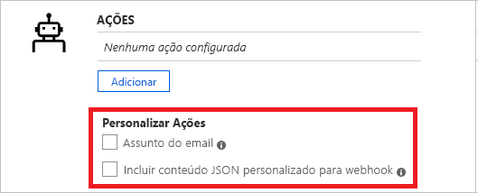
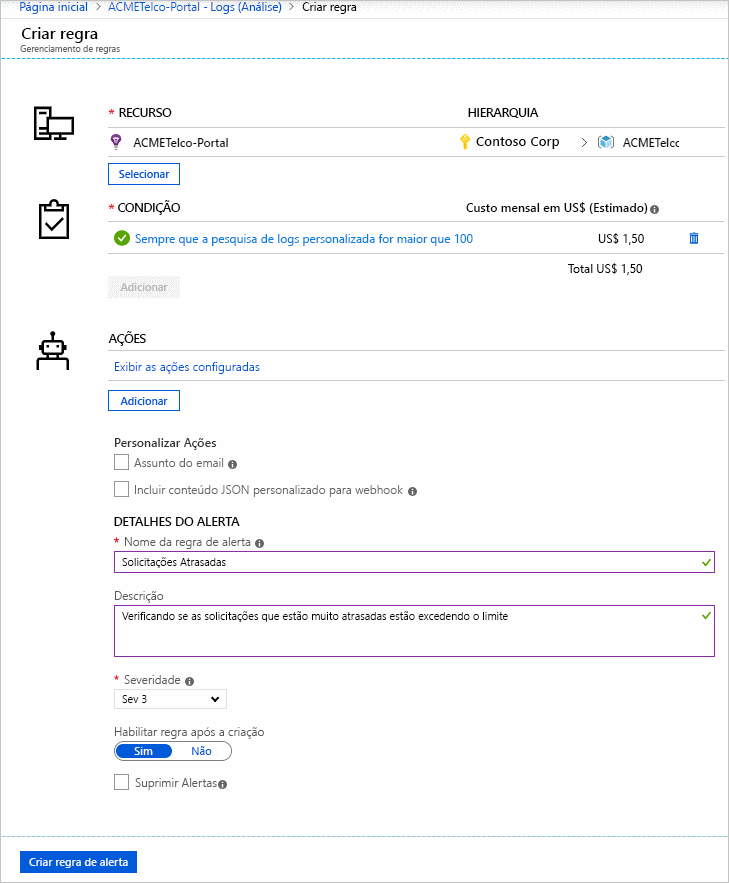
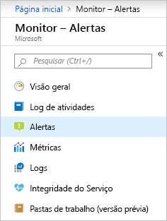
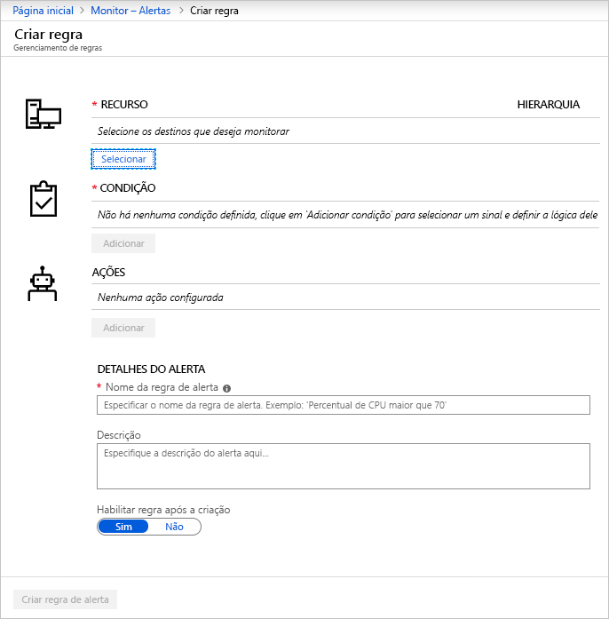
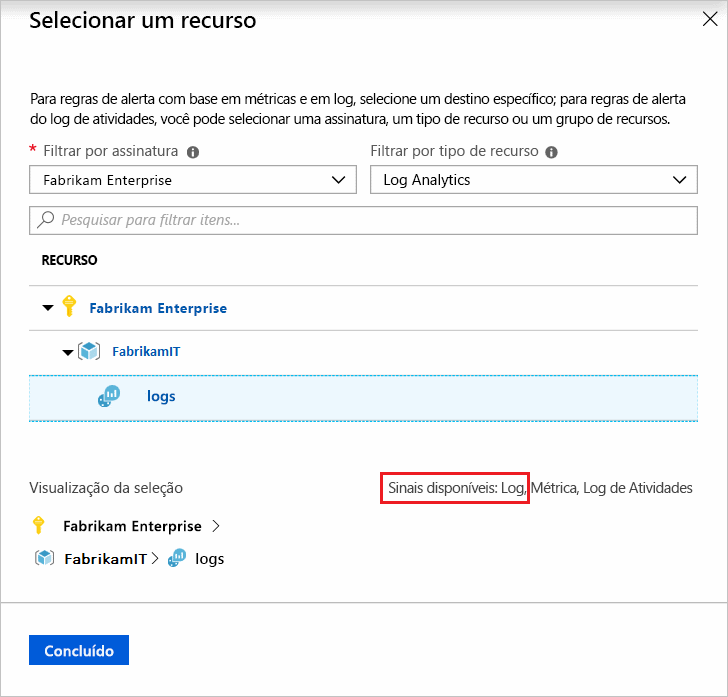
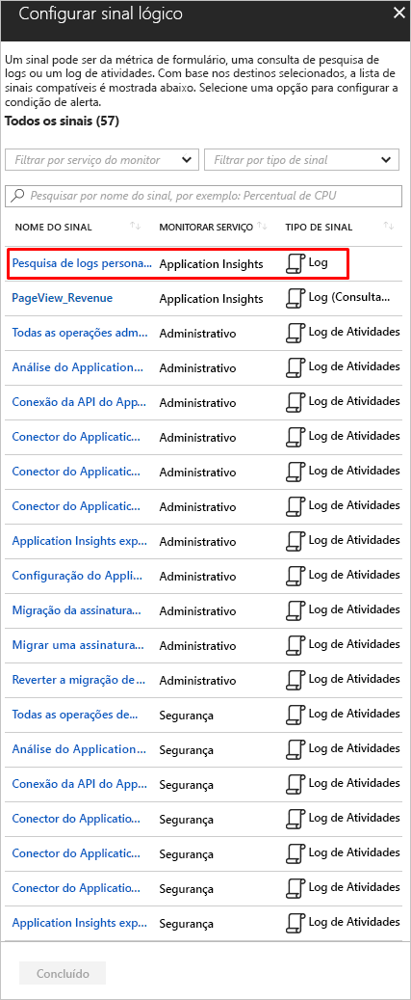

# <a name="create-view-and-manage-log-alerts-using-azure-monitor"></a>Criar, exibir e gerenciar alertas de log usando o Azure Monitor

## <a name="overview"></a>Visão geral

Os alertas de log permitem que os usuários usem uma consulta [log Analytics](../log-query/log-analytics-tutorial.md) para avaliar os logs de recursos a cada frequência definida e acionar um alerta com base nos resultados. As regras podem disparar uma ou mais ações usando [grupos de ações](./action-groups.md). [Saiba mais sobre a funcionalidade e a terminologia de alertas de log](alerts-unified-log.md).

Este artigo mostra como criar e gerenciar alertas de log usando o Azure Monitor. As regras de alerta são definidas por três componentes:
- Destino: um recurso específico do Azure a ser monitorado.
- Critérios: lógica a ser avaliada. Se for atendido, o alerta será disparado.  
- Ação: notificações ou automação-email, SMS, webhook e assim por diante.

Você também pode criar regras de alerta de log usando modelos de Azure Resource Manager, que são descritos em [um artigo separado](alerts-log-create-templates.md).

> [!NOTE]
> Os dados de log de um [espaço de trabalho log Analytics](../log-query/log-analytics-tutorial.md) podem ser enviados para o repositório de métricas de Azure monitor. Os alertas de métricas têm [comportamento diferente](alerts-metric-overview.md), o que pode ser mais desejável, dependendo dos dados com os quais você está trabalhando. Para obter informações sobre o que e como você pode rotear logs para métricas, consulte [alerta de métrica para logs](alerts-metric-logs.md).

## <a name="create-a-log-alert-rule-with-the-azure-portal"></a>Criar uma regra de alerta de log com o portal do Azure

Aqui estão as etapas para começar a escrever consultas para alertas:

1. Vá para o recurso no qual você gostaria de alertar. Considere configurar regras de alerta em vários recursos selecionando uma assinatura ou um escopo de grupo de recursos sempre que possível. O alerta em vários recursos reduz os custos e a necessidade de gerenciar várias regras de alerta.
1. Em **Monitor**, selecione **logs**.
1. Consulte os dados de log que podem indicar o problema. Você pode usar o [tópico Exemplos de consulta de alerta](../log-query/example-queries.md) para entender o que você pode descobrir ou começar [a escrever sua própria consulta](../log-query/log-analytics-tutorial.md). Além disso, [saiba como criar consultas de alerta otimizadas](alerts-log-query.md).
1. Pressione o botão ' + nova regra de alerta ' para iniciar o fluxo de criação de alerta.

    

> [!NOTE]
> É recomendável que você crie alertas em escala, ao usar o modo de acesso a recursos para logs, que é executado em vários recursos usando um grupo de recursos ou um escopo de assinatura. Os alertas em escala reduzem a sobrecarga de gerenciamento de regras. Para poder direcionar os recursos, inclua a coluna ID do recurso nos resultados. [Saiba mais sobre como dividir alertas por dimensões](alerts-unified-log.md#split-by-alert-dimensions).

### <a name="log-alert-for-log-analytics-and-application-insights"></a>Alerta de log para Log Analytics e Application Insights

1. Se a sintaxe da consulta estiver correta, os dados históricos da consulta aparecerão como um grafo com a opção de ajustar o período do gráfico das últimas seis horas até a última semana.
 
    Se os resultados da consulta contiverem dados resumidos ou colunas específicas do [projeto](/azure/kusto/query/projectoperator) sem a coluna de tempo, o gráfico mostrará um único valor.

    

1. Escolha o intervalo de tempo sobre o qual avaliar a condição especificada, usando a opção [**período**](alerts-unified-log.md#query-time-range) .

1. Os alertas de log podem ser baseados em dois tipos de [**medidas**](alerts-unified-log.md#measure):
    1. **Número de resultados** -contagem de registros retornados pela consulta.
    1. **Medição métrica**  -  *Valor agregado* calculado usando resumir agrupado por expressões escolhidas e a seleção [de bin ()](/azure/kusto/query/binfunction) . Por exemplo:

    ```Kusto
    // Reported errors
    union Event, Syslog // Event table stores Windows event records, Syslog stores Linux records
    | where EventLevelName == "Error" // EventLevelName is used in the Event (Windows) records
    or SeverityLevel== "err" // SeverityLevel is used in Syslog (Linux) records
    | summarize AggregatedValue = count() by Computer, bin(TimeGenerated, 15m)
    ```

1. Para a lógica de alerta de medições métricas, você pode opcionalmente especificar como [dividir os alertas por dimensões](alerts-unified-log.md#split-by-alert-dimensions) usando a opção **agregar em** . A expressão de agrupamento de linhas deve ser exclusiva e classificada.

    > [!NOTE]
    > Como [bin ()](/azure/kusto/query/binfunction) pode resultar em intervalos de tempo desiguais, o serviço de alerta converterá automaticamente a função [bin ()](/azure/kusto/query/binfunction) na função [bin_at ()](/azure/kusto/query/binatfunction) com o tempo apropriado em tempo de execução, para garantir os resultados com um ponto fixo.

    > [!NOTE]
    > As dimensões de divisão por alerta só estão disponíveis para a API scheduledQueryRules atual. Se você usar a [API de alerta do log Analytics](api-alerts.md)herdado, será necessário alternar. [Saiba mais sobre como alternar](./alerts-log-api-switch.md). Os alertas centrados em recursos em escala só têm suporte na versão da API `2020-05-01-preview` e acima.

    

1. Em seguida, com base nos dados de visualização, defina o [ **operador**, o **valor do limite**](alerts-unified-log.md#threshold-and-operator)e a [**frequência**](alerts-unified-log.md#frequency).

1. Opcionalmente, você também pode definir o [número de violações para disparar um alerta](alerts-unified-log.md#number-of-violations-to-trigger-alert) usando as **violações totais ou consecutivas**.

1. Selecione **Concluído**. 

1. Defina o **nome da regra de alerta**, a **Descrição** e selecione a **severidade** do alerta. Esses detalhes são usados em todas as ações de alerta. Além disso, você pode optar por não ativar a regra de alerta na criação selecionando **habilitar regra na criação**.

1. Escolha se deseja suprimir as ações de regra para um tempo após o acionamento de um alerta, use a opção [**suprimir alertas**](alerts-unified-log.md#state-and-resolving-alerts) . A regra ainda será executada e criará alertas, mas as ações não serão disparadas para evitar ruídos. O valor de ações de mudo deve ser maior que a frequência de alerta para ser eficaz.

    

1. Especifique se a regra de alerta deve disparar um ou mais [**grupos de ações**](action-groups.md#webhook) quando a condição de alerta for atendida.

    > [!NOTE]
    > Consulte os [limites do serviço de assinatura do Azure](../../azure-resource-manager/management/azure-subscription-service-limits.md) para obter limites sobre as ações que podem ser executadas.  

1. Opcionalmente, você pode personalizar ações em regras de alerta de log:

    - **Assunto do email personalizado**: substitui o *assunto do email* de ações de email. Você não pode modificar o corpo do email e esse campo **não é para endereços de email**.
    - **Incluir carga JSON personalizada**: substitui o JSON de webhook usado por grupos de ação supondo que o grupo de ações contenha uma ação de webhook. Saiba mais sobre [a ação de webhook para alertas de log](./alerts-log-webhook.md).

    

1. Se todos os campos estiverem definidos corretamente, o botão **criar regra de alerta** poderá ser clicado e um alerta será criado.

    Em alguns minutos, o alerta estará ativo e disparará conforme descrito anteriormente.

    

#### <a name="creating-log-alert-for-log-analytics-and-application-insights-from-the-alerts-management"></a>Criando alerta de log para Log Analytics e Application Insights do gerenciamento de alertas

> [!NOTE]
> Atualmente, não há suporte para a criação do gerenciamento de alertas para logs centrados no recurso

1. No [portal](https://portal.azure.com/), selecione **Monitor** e escolha **alertas**.

    

1. Selecione **nova regra de alerta**. 

    

1. O painel **criar alerta** é exibido. Ele tem quatro partes: 
    - O recurso ao qual o alerta se aplica.
    - A condição a ser verificada.
    - As ações a serem executadas se a condição for verdadeira.
    - Os detalhes para nomear e descrever o alerta. 

    

1. Pressione no botão **selecionar recurso** . Filtre escolhendo a *assinatura*, o *tipo de recurso* e selecione um recurso. Verifique se o recurso tem logs disponíveis.

   

1. Em seguida, use o botão Adicionar **condição** para exibir a lista de opções de sinal disponíveis para o recurso. Selecione a opção **pesquisa de logs personalizada** .

   

   > [!NOTE]
   > O portal de alertas lista as consultas salvas de Log Analytics e Application Insights e elas podem ser usadas como consultas de alerta de modelo.

1. Uma vez selecionada, escreva, Cole ou edite a consulta de alerta no campo de **consulta de pesquisa** .

1. Prossiga para as próximas etapas descritas na [última seção](#log-alert-for-log-analytics-and-application-insights).

### <a name="log-alert-for-all-other-resource-types"></a>Alerta de log para todos os outros tipos de recurso

> [!NOTE]
> No momento, não há encargos adicionais para a versão da API `2020-05-01-preview` e alertas de log centrados no recurso.  Os preços para os recursos que estão na versão prévia serão anunciados no futuro e um aviso fornecido antes do início da cobrança. Se você optar por continuar usando a nova versão da API e alertas de log centrados no recurso após o período de aviso, você será cobrado na taxa aplicável.

1. Inicie na guia **condição** :

    1. Verifique se a [**medida**](alerts-unified-log.md#measure), o [**tipo de agregação**](alerts-unified-log.md#aggregation-type)e a [**granularidade de agregação**](alerts-unified-log.md#aggregation-granularity) estão corretos. 
        1. Por padrão, a regra conta o número de resultados nos últimos 5 minutos.
        1. Se detectarmos resultados de consulta resumidos, a regra será atualizada automaticamente em alguns segundos para capturá-la.

    1. Escolha [a divisão de alerta por dimensões](alerts-unified-log.md#split-by-alert-dimensions), se necessário: 
       - A **coluna ID de recurso** é selecionada automaticamente, se detectada, e altera o contexto do alerta acionado para o recurso do registro. 
       - A **coluna ID de recurso** pode ser desmarcada para acionar alertas em grupos de recursos ou de assinatura. A remoção de seleção é útil quando os resultados da consulta são baseados em recursos cruzados. Por exemplo, uma consulta que verifica se 80% das máquinas virtuais do grupo de recursos estão apresentando alto uso da CPU.
       - Até seis divisores também podem ser selecionados para qualquer tipo de colunas de texto ou número usando a tabela de dimensões.
       - Os alertas são acionados separadamente de acordo com a divisão com base em combinações exclusivas e a carga de alerta inclui essas informações.
    
        

    1. O gráfico de **Visualização** mostra resultados de avaliações de consulta ao longo do tempo. Você pode alterar o período do gráfico ou selecionar uma série temporal diferente resultante da divisão de alerta exclusiva por dimensões.

        

    1. Em seguida, com base nos dados de visualização, defina a **lógica de alerta**; [ **Operador**, **valor de limite**](alerts-unified-log.md#threshold-and-operator)e [**frequência**](alerts-unified-log.md#frequency).

        

    1. Opcionalmente, você pode definir [**o número de violações para disparar o alerta**](alerts-unified-log.md#number-of-violations-to-trigger-alert) na seção **Opções avançadas** .
    
        

1. Na guia **ações** , selecione ou crie os grupos de [ações](action-groups.md)necessários.

    

1. Na guia **detalhes** , defina os **detalhes da regra de alerta** e os detalhes do **projeto**. Opcionalmente, você pode definir se deseja não **iniciar a execução agora** ou fazer o [**mudo de ações**](alerts-unified-log.md#state-and-resolving-alerts) para um período após a regra de alerta ser acionada.

    > [!NOTE]
    > Atualmente, as regras de alerta de log são sem estado e acionam uma ação sempre que um alerta é criado, a menos que o mudo seja definido.

    

1. Na guia **marcas** , defina todas as marcas necessárias no recurso de regra de alerta.

    

1. Na guia **revisar + criar** , uma validação será executada e informará sobre quaisquer problemas. Examine e aprove a definição de regra.
1. Se todos os campos estiverem corretos, selecione o botão **criar** e conclua a criação da regra de alerta. Todos os alertas podem ser exibidos no gerenciamento de alertas.
 
    

## <a name="view--manage-log-alerts-in-azure-portal"></a>Exibir e gerenciar alertas de log no portal do Azure

1. No [portal](https://portal.azure.com/), selecione o recurso relevante ou o serviço **Monitor** . Em seguida, selecione **alertas** na seção monitorar.

1. O gerenciamento de alertas exibe todos os alertas que foram acionados. [Saiba mais sobre o gerenciamento de alertas](alerts-managing-alert-instances.md).

    > [!NOTE]
    > Atualmente, as regras [de alerta de log não têm estado e não são resolvidas](alerts-unified-log.md#state-and-resolving-alerts).

1. Selecione o botão **gerenciar regras de alerta** na barra superior para editar as regras:

    

## <a name="managing-log-alerts-using-powershell"></a>Gerenciando alertas de log usando o PowerShell

[!INCLUDE [updated-for-az](../../../includes/updated-for-az.md)]

> [!NOTE]
> No momento, não há suporte para o PowerShell na versão da API `2020-05-01-preview`

Os cmdlets do PowerShell listados abaixo estão disponíveis para gerenciar regras com a [API de regras de consulta agendada](/rest/api/monitor/scheduledqueryrules/).

- [New-AzScheduledQueryRule](/powershell/module/az.monitor/new-azscheduledqueryrule) : cmdlet do PowerShell para criar uma nova regra de alerta de log.
- [Set-AzScheduledQueryRule](/powershell/module/az.monitor/set-azscheduledqueryrule) : cmdlet do PowerShell para atualizar uma regra de alerta de log existente.
- [New-AzScheduledQueryRuleSource](/powershell/module/az.monitor/new-azscheduledqueryrulesource) : cmdlet do PowerShell para criar ou atualizar um objeto especificando parâmetros de origem para um alerta de log. Usado como entrada pelo cmdlet [New-AzScheduledQueryRule](/powershell/module/az.monitor/new-azscheduledqueryrule) e [set-AzScheduledQueryRule](/powershell/module/az.monitor/set-azscheduledqueryrule) .
- [New-AzScheduledQueryRuleSchedule](/powershell/module/az.monitor/new-azscheduledqueryruleschedule): cmdlet do PowerShell para criar ou atualizar objeto especificando parâmetros de agendamento para um alerta de log. Usado como entrada pelo cmdlet [New-AzScheduledQueryRule](/powershell/module/az.monitor/new-azscheduledqueryrule) e [set-AzScheduledQueryRule](/powershell/module/az.monitor/set-azscheduledqueryrule) .
- [New-AzScheduledQueryRuleAlertingAction](/powershell/module/az.monitor/new-azscheduledqueryrulealertingaction) : cmdlet do PowerShell para criar ou atualizar objeto especificando parâmetros de ação para um alerta de log. Usado como entrada pelo cmdlet [New-AzScheduledQueryRule](/powershell/module/az.monitor/new-azscheduledqueryrule) e [set-AzScheduledQueryRule](/powershell/module/az.monitor/set-azscheduledqueryrule) .
- [New-AzScheduledQueryRuleAznsActionGroup](/powershell/module/az.monitor/new-azscheduledqueryruleaznsactiongroup) : cmdlet do PowerShell para criar ou atualizar objetos especificando parâmetros de grupos de ação para um alerta de log. Usado como entrada pelo cmdlet [New-AzScheduledQueryRuleAlertingAction](/powershell/module/az.monitor/new-azscheduledqueryrulealertingaction) .
- [New-AzScheduledQueryRuleTriggerCondition](/powershell/module/az.monitor/new-azscheduledqueryruletriggercondition) : cmdlet do PowerShell para criar ou atualizar objeto especificando parâmetros de condição de gatilho para alerta de log. Usado como entrada pelo cmdlet [New-AzScheduledQueryRuleAlertingAction](/powershell/module/az.monitor/new-azscheduledqueryrulealertingaction) .
- [New-AzScheduledQueryRuleLogMetricTrigger](/powershell/module/az.monitor/new-azscheduledqueryrulelogmetrictrigger) : cmdlet do PowerShell para criar ou atualizar objeto especificando parâmetros de condição de gatilho de métrica para o [alerta de log do tipo de medição métrica](./alerts-unified-log.md#calculation-of-measure-based-on-a-numeric-column-such-as-cpu-counter-value). Usado como entrada pelo cmdlet [New-AzScheduledQueryRuleTriggerCondition](/powershell/module/az.monitor/new-azscheduledqueryruletriggercondition) .
- [Get-AzScheduledQueryRule](/powershell/module/az.monitor/get-azscheduledqueryrule) : cmdlet do PowerShell para listar regras de alerta de log existentes ou uma regra de alerta de log específica
- [Update-AzScheduledQueryRule](/powershell/module/az.monitor/update-azscheduledqueryrule) : cmdlet do PowerShell para habilitar ou desabilitar a regra de alerta de log
- [Remove-AzScheduledQueryRule](/powershell/module/az.monitor/remove-azscheduledqueryrule): cmdlet do PowerShell para excluir uma regra de alerta de log existente

> [!NOTE]
> Os cmdlets do PowerShell do ScheduledQueryRules só podem gerenciar regras criadas na [API de regras de consulta agendada](/rest/api/monitor/scheduledqueryrules/)atual. As regras de alerta de log criadas usando a [API de alerta log Analytics](api-alerts.md) herdado só podem ser gerenciadas usando o PowerShell depois [de alternar para a API de regras de consulta agendada](alerts-log-api-switch.md).

Aqui estão exemplos de etapas para criar uma regra de alerta de log usando o PowerShell:

```powershell
$source = New-AzScheduledQueryRuleSource -Query 'Heartbeat | summarize AggregatedValue = count() by bin(TimeGenerated, 5m), _ResourceId' -DataSourceId "/subscriptions/a123d7efg-123c-1234-5678-a12bc3defgh4/resourceGroups/contosoRG/providers/microsoft.OperationalInsights/workspaces/servicews"

$schedule = New-AzScheduledQueryRuleSchedule -FrequencyInMinutes 15 -TimeWindowInMinutes 30

$metricTrigger = New-AzScheduledQueryRuleLogMetricTrigger -ThresholdOperator "GreaterThan" -Threshold 2 -MetricTriggerType "Consecutive" -MetricColumn "_ResourceId"

$triggerCondition = New-AzScheduledQueryRuleTriggerCondition -ThresholdOperator "LessThan" -Threshold 5 -MetricTrigger $metricTrigger

$aznsActionGroup = New-AzScheduledQueryRuleAznsActionGroup -ActionGroup "/subscriptions/a123d7efg-123c-1234-5678-a12bc3defgh4/resourceGroups/contosoRG/providers/microsoft.insights/actiongroups/sampleAG" -EmailSubject "Custom email subject" -CustomWebhookPayload "{ `"alert`":`"#alertrulename`", `"IncludeSearchResults`":true }"

$alertingAction = New-AzScheduledQueryRuleAlertingAction -AznsAction $aznsActionGroup -Severity "3" -Trigger $triggerCondition

New-AzScheduledQueryRule -ResourceGroupName "contosoRG" -Location "Region Name for your Application Insights App or Log Analytics Workspace" -Action $alertingAction -Enabled $true -Description "Alert description" -Schedule $schedule -Source $source -Name "Alert Name"
```

Você também pode criar o alerta de log usando um [modelo e](./alerts-log-create-templates.md) arquivos de parâmetros usando o PowerShell:

```powershell
Connect-AzAccount

Select-AzSubscription -SubscriptionName <yourSubscriptionName>

New-AzResourceGroupDeployment -Name AlertDeployment -ResourceGroupName ResourceGroupofTargetResource `
  -TemplateFile mylogalerttemplate.json -TemplateParameterFile mylogalerttemplate.parameters.json
```

## <a name="managing-log-alerts-using-cli"></a>Gerenciando alertas de log usando a CLI

> [!NOTE]
> CLI do Azure suporte só está disponível para a versão da API scheduledQueryRules `2020-05-01-preview` e acima. A versão da API do anterior pode usar a CLI do Azure Resource Manager com modelos, conforme descrito abaixo. Se você usar a [API de alerta do log Analytics](api-alerts.md)herdado, será necessário alternar para usar a CLI. [Saiba mais sobre como alternar](./alerts-log-api-switch.md).

As seções anteriores descreveram como criar, exibir e gerenciar regras de alerta de log usando portal do Azure. Esta seção descreve como fazer o mesmo usando a [CLI do Azure](/cli/azure/get-started-with-azure-cli) de multiplataforma. O modo mais rápido de começar a usar a CLI do Azure é com o [Azure Cloud Shell](../../cloud-shell/overview.md). Para este artigo, usaremos Cloud Shell.

1. Vá para portal do Azure, selecione **Cloud Shell**.

1. No prompt, você pode usar comandos com a opção ``--help`` para saber mais sobre o comando e como usá-lo. Por exemplo, o comando a seguir mostra a lista de comandos disponíveis para criar, exibir e gerenciar alertas de log:

    ```azurecli
    az monitor scheduled-query --help
    ```

1. Você pode criar uma regra de alerta de log que monitora a contagem de erros de evento do sistema:

    ```azurecli
    az monitor scheduled-query create -g {ResourceGroup} -n {nameofthealert} --scopes {vm_id} --condition "count \'union Event, Syslog | where TimeGenerated > ago(1h) | where EventLevelName == \"Error\" or SeverityLevel== \"err\"\' > 2" --description {descriptionofthealert}
    ```

1. Você pode exibir todos os alertas de log em um grupo de recursos usando o seguinte comando:

    ```azurecli
    az monitor scheduled-query list -g {ResourceGroup}
    ```

1. Você pode ver os detalhes de uma regra de alerta de log específica usando o nome ou a ID de recurso da regra:

    ```azurecli
    az monitor scheduled-query show -g {ResourceGroup} -n {AlertRuleName}
    ```

    ```azurecli
    az monitor scheduled-query show --ids {RuleResourceId}
    ```

1. Você pode desabilitar uma regra de alerta de log usando o seguinte comando:

    ```azurecli
    az monitor scheduled-query update -g {ResourceGroup} -n {AlertRuleName} --enabled false
    ```

1. Você pode excluir uma regra de alerta de log usando o seguinte comando:

    ```azurecli
    az monitor scheduled-query delete -g {ResourceGroup} -n {AlertRuleName}
    ```

Você também pode usar a CLI do Azure Resource Manager com arquivos de [modelos](./alerts-log-create-templates.md) :

```azurecli
az login

az deployment group create \
    --name AlertDeployment \
    --resource-group ResourceGroupofTargetResource \
    --template-file mylogalerttemplate.json \
    --parameters @mylogalerttemplate.parameters.json
```

Em caso de sucesso para a criação, 201 é retornado. Em caso de sucesso para atualização, 200 é retornado.

## <a name="next-steps"></a>Próximas etapas

* Saiba mais sobre [alertas de log](./alerts-unified-log.md).
* Crie alertas de log usando [modelos de Azure Resource Manager](./alerts-log-create-templates.md).
* Entenda as [ações de webhook para alertas de log](./alerts-log-webhook.md).
* Saiba mais sobre [consultas de log](../log-query/log-query-overview.md).
