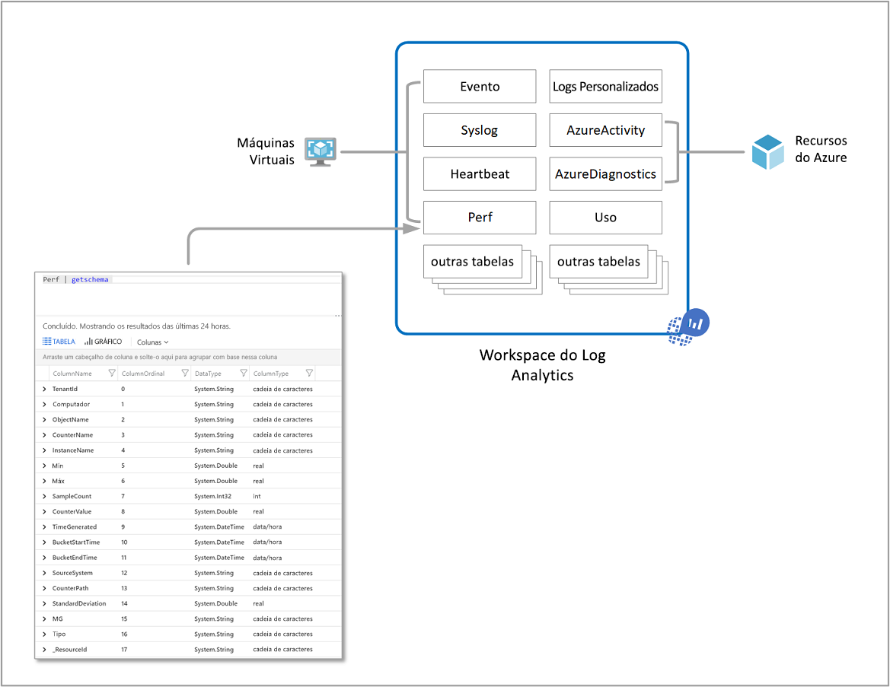
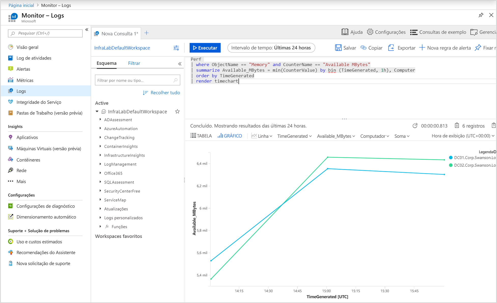
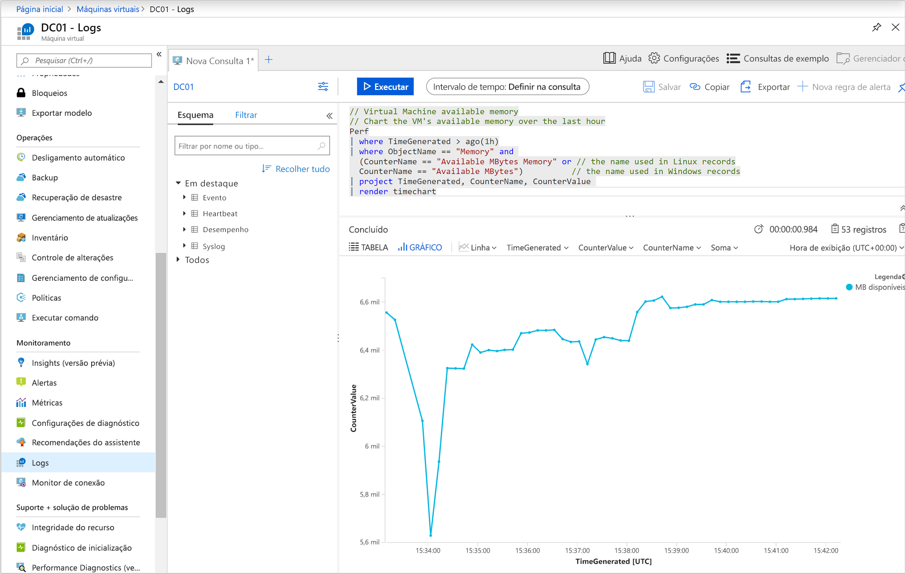
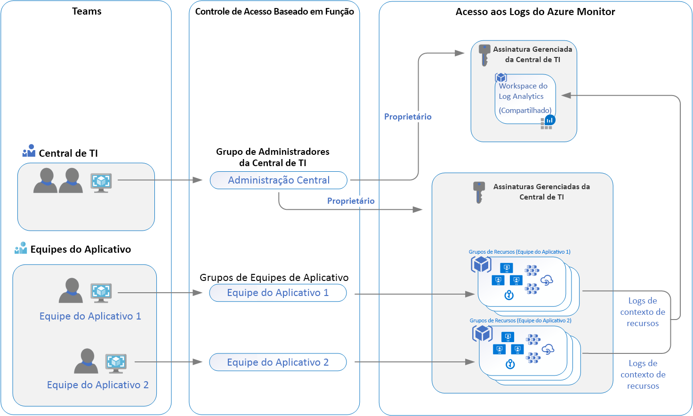

# <a name="designing-your-azure-monitor-logs-deployment"></a>Projetando sua implantação de Logs do Monitor do Azure

O Azure Monitor armazena dados [de registro](data-platform-logs.md) em um espaço de trabalho do Log Analytics, que é um recurso do Azure e um contêiner onde os dados são coletados, agregados e servem como um limite administrativo. Embora você possa implantar um ou mais espaços de trabalho em sua assinatura do Azure, existem várias considerações que você deve entender para garantir que sua implantação inicial esteja seguindo nossas diretrizes para fornecer-lhe um custo-benefício, gerenciável e escalável implantação atendendo às necessidades de suas organizações.

Os dados em um espaço de trabalho são organizados em tabelas, cada uma das quais armazena diferentes tipos de dados e tem seu próprio conjunto único de propriedades com base no recurso que gera os dados. A maioria das fontes de dados gravará em suas próprias tabelas em um espaço de trabalho do Log Analytics.



Um espaço de trabalho do Log Analytics fornece:

* Uma localização geográfica para armazenamento de dados.
* Isolamento de dados, concedendo a diferentes usuários direitos de acesso seguindo uma de nossas estratégias de design recomendadas.
* Escopo para configuração de configurações como [nível de precificação,](https://docs.microsoft.com/azure/azure-monitor/platform/manage-cost-storage#changing-pricing-tier) [retenção](https://docs.microsoft.com/azure/azure-monitor/platform/manage-cost-storage#change-the-data-retention-period)e [cobertura de dados](https://docs.microsoft.com/azure/azure-monitor/platform/manage-cost-storage#manage-your-maximum-daily-data-volume).

Este artigo fornece uma visão geral detalhada das considerações de design e migração, visão geral do controle de acesso e uma compreensão das implementações de design que recomendamos para sua organização de TI.


## <a name="important-considerations-for-an-access-control-strategy"></a>Considerações importantes para uma estratégia de controle de acesso

Identificar o número de espaços de trabalho necessários é influenciado por um ou mais dos seguintes requisitos:

* Você é uma empresa global e precisa de dados de log armazenados em regiões específicas por motivos de soberania de dados ou conformidade.
* Você usa o Azure e deseja evitar encargos de transferência de dados de saída com um workspace na mesma região que os recursos do Azure que ele gerencia.
* Você gerencia vários departamentos ou grupos de negócios, e quer que cada um veja seus próprios dados, mas não dados de outros. Além disso, não há exigência comercial para uma visão consolidada de departamento ou grupo de negócios.

As organizações de TI hoje são modeladas seguindo um híbrido centralizado, descentralizado ou intermediário de ambas as estruturas. Como resultado, os seguintes modelos de implantação de espaço de trabalho têm sido comumente usados para mapear uma dessas estruturas organizacionais:

* **Centralizado**: Todos os logs são armazenados em um espaço de trabalho central e administrados por uma única equipe, com o Azure Monitor fornecendo acesso diferenciado por equipe. Neste cenário, é fácil gerenciar, pesquisar através de recursos e cruzar registros. O espaço de trabalho pode crescer significativamente dependendo da quantidade de dados coletados a partir de vários recursos em sua assinatura, com despesas administrativas adicionais para manter o controle de acesso a diferentes usuários. Este modelo é conhecido como "hub and spoke".
* **Descentralizado**: Cada equipe tem seu próprio espaço de trabalho criado em um grupo de recursos que possui e gerencia, e os dados de log são segregados por recurso. Neste cenário, o espaço de trabalho pode ser mantido seguro e o controle de acesso é consistente com o acesso a recursos, mas é difícil cruzar logs. Os usuários que precisam de uma visão ampla de muitos recursos não podem analisar os dados de forma significativa.
* **Híbrido**: Os requisitos de conformidade de auditoria de segurança complicam ainda mais esse cenário porque muitas organizações implementam ambos os modelos de implantação em paralelo. Isso geralmente resulta em uma configuração complexa, cara e difícil de manter com lacunas na cobertura de logs.

Ao usar os agentes do Log Analytics para coletar dados, você precisa entender o seguinte para planejar a implantação do seu agente:

* Para coletar dados de agentes do Windows, você pode [configurar cada agente para reportar a um ou mais espaços de trabalho,](../../azure-monitor/platform/agent-windows.md)mesmo enquanto ele está reportando a um grupo de gerenciamento do System Center Operations Manager. O agente do Windows pode reportar até quatro espaços de trabalho.
* O agente Linux não suporta multi-homing e só pode reportar a um único espaço de trabalho.

Se você estiver usando o System Center Operations Manager 2012 R2 ou posterior:

* Cada grupo de gerenciamento do Gerente de Operações pode ser [conectado a apenas um espaço de trabalho](../platform/om-agents.md). 
* Os computadores Linux reportados a um grupo de gerenciamento devem ser configurados para reportar diretamente a um espaço de trabalho do Log Analytics. Se seus computadores Linux já estiverem reportando diretamente a um espaço de trabalho e você quiser monitorá-los com o Gerente de Operações, siga essas etapas [para reportar a um grupo de gerenciamento do Operations Manager](agent-manage.md#configure-agent-to-report-to-an-operations-manager-management-group). 
* Você pode instalar o agente Log Analytics Windows no computador Windows e fazê-lo relatar tanto ao Operations Manager integrado com um espaço de trabalho quanto a um espaço de trabalho diferente.

## <a name="access-control-overview"></a>Visão geral do controle de acesso

Com o RBAC (Role-Based Access Control), você pode conceder aos usuários e grupos apenas a quantidade de acesso necessária para trabalhar com dados de monitoramento em um espaço de trabalho. Isso permite que você se alinhe com seu modelo operacional de organização de TI usando um único espaço de trabalho para armazenar dados coletados habilitados em todos os seus recursos. Por exemplo, você concede acesso à sua equipe responsável pelos serviços de infra-estrutura hospedados em máquinas virtuais (VMs) do Azure e, como resultado, eles terão acesso apenas aos logs gerados pelas VMs. Isso está seguindo nosso novo modelo de registro de contexto de recursos. A base para este modelo é para cada registro de registro emitido por um recurso do Azure, ele está automaticamente associado a esse recurso. Os registros são encaminhados para um espaço de trabalho central que respeita o escopo e o RBAC com base nos recursos.

Os dados a que um usuário tem acesso são determinados por uma combinação de fatores que estão listados na tabela a seguir. Cada um é descrito nas seções abaixo.

| Fator | Descrição |
|:---|:---|
| [Modo de acesso](#access-mode) | Método que o usuário usa para acessar o espaço de trabalho.  Define o escopo dos dados disponíveis e o modo de controle de acesso aplicado. |
| [Modo de controle de acesso](#access-control-mode) | Configuração no espaço de trabalho que define se as permissões são aplicadas no espaço de trabalho ou no nível de recursos. |
| [Permissões](manage-access.md) | Permissões aplicadas a indivíduos ou grupos de usuários para o espaço de trabalho ou recurso. Define quais dados o usuário terá acesso. |
| [Nível de tabela RBAC](manage-access.md#table-level-rbac) | Permissões granulares opcionais que se aplicam a todos os usuários, independentemente do seu modo de acesso ou modo de controle de acesso. Define quais tipos de dados um usuário pode acessar. |

## <a name="access-mode"></a>Modo de acesso

O *modo de acesso* refere-se à forma como um usuário acessa um espaço de trabalho do Log Analytics e define o escopo de dados que pode acessar. 

Os usuários têm duas opções para acessar os dados:

* **Contexto do espaço de trabalho**: Você pode visualizar todos os logs no espaço de trabalho para o que você tem permissão. As consultas neste modo são escopo de todos os dados em todas as tabelas no espaço de trabalho. Este é o modo de acesso usado quando os logs são acessados com o espaço de trabalho como escopo, como quando você seleciona **Logs** do menu **Azure Monitor** no portal Azure.

    

* **Contexto de recursos**: Quando você acessa o espaço de trabalho para um determinado recurso, grupo de recursos ou assinatura, como quando você seleciona **Logs** de um menu de recursos no portal Azure, você pode exibir logs apenas para recursos em todas as tabelas às que você tenha acesso. As consultas neste modo são escopo apenas de dados associados a esse recurso. Este modo também permite RBAC granular.

    

    > [!NOTE]
    > Os logs estão disponíveis para consultas de contexto de recursos apenas se estiverem devidamente associados ao recurso relevante. Atualmente, os seguintes recursos têm limitações:
    > - Computadores fora do Azure
    > - Service Fabric
    > - Application Insights
    >
    > Você pode testar se os logs estão devidamente associados ao seu recurso executando uma consulta e inspecionando os registros em que você está interessado. Se o ID de recurso correto estiver na propriedade [_ResourceId,](log-standard-properties.md#_resourceid) os dados estão disponíveis para consultas centradas em recursos.

O Azure Monitor determina automaticamente o modo certo, dependendo do contexto de que você executa a pesquisa de log. O escopo é sempre apresentado na seção superior esquerda do Log Analytics.

### <a name="comparing-access-modes"></a>Comparando modos de acesso

A tabela a seguir resume os modos de acesso:

| | Contexto do espaço de trabalho | Contexto de recursos |
|:---|:---|:---|
| Para quem cada modelo se destina? | Administração central. Administradores que precisam configurar a coleta de dados e usuários que precisam de acesso a uma ampla variedade de recursos. Também é necessário atualmente para usuários que precisam acessar logs para recursos fora do Azure. | Equipes de aplicação. Administradores de recursos do Azure sendo monitorados. |
| O que um usuário precisa para visualizar logs? | Permissões para o espaço de trabalho. Consulte **as permissões do espaço de trabalho** no Gerenciar acesso usando [permissões de espaço de trabalho](manage-access.md#manage-access-using-workspace-permissions). | Leia o acesso ao recurso. Consulte **permissões de recursos** no Gerenciar acesso usando [permissões do Azure](manage-access.md#manage-access-using-azure-permissions). As permissões podem ser herdadas (como do grupo de recursos que contém) ou diretamente atribuídas ao recurso. A permissão para os logs do recurso será atribuída automaticamente. |
| Qual é o escopo das permissões? | Espaço. Users with access to the workspace can query all logs in the workspace from tables that they have permissions to. Ver [controle de acesso à tabela](manage-access.md#table-level-rbac) | Recurso azure. O usuário pode consultar logs de recursos específicos, grupos de recursos ou assinatura a que tem acesso a qualquer espaço de trabalho, mas não pode consultar logs para outros recursos. |
| Como o usuário pode acessar logs? | <ul><li>Inicie **logs** do menu **do Monitor Azure.**</li></ul> <ul><li>Iniciar **logs** a partir de espaços de trabalho do **Log Analytics**.</li></ul> <ul><li>Da Azure Monitor [Workbooks](../visualizations.md#workbooks).</li></ul> | <ul><li>Iniciar **logs** do menu para o recurso Azure</li></ul> <ul><li>Inicie **logs** do menu **do Monitor Azure.**</li></ul> <ul><li>Iniciar **logs** a partir de espaços de trabalho do **Log Analytics**.</li></ul> <ul><li>Da Azure Monitor [Workbooks](../visualizations.md#workbooks).</li></ul> |

## <a name="access-control-mode"></a>Modo de controle de acesso

O *modo de controle de acesso* é uma configuração em cada espaço de trabalho que define como as permissões são determinadas para o espaço de trabalho.

* **Exigir permissões de espaço de trabalho**: Este modo de controle não permite RBAC granular. Para que um usuário acesse o espaço de trabalho, eles devem receber permissões para o espaço de trabalho ou para tabelas específicas.

    Se um usuário acessar o espaço de trabalho seguindo o modo de contexto do espaço de trabalho, ele terá acesso a todos os dados em qualquer tabela a que foi concedido acesso. Se um usuário acessar o espaço de trabalho seguindo o modo de contexto de recursos, ele terá acesso apenas a dados para esse recurso em qualquer tabela a que tenha sido concedido acesso.

    Esta é a configuração padrão para todos os espaços de trabalho criados antes de março de 2019.

* **Use permissões de recursos ou espaço de trabalho**: Este modo de controle permite rBAC granular. Os usuários podem ter acesso apenas a dados associados aos `read` recursos que podem visualizar atribuindo a permissão do Azure. 

    Quando um usuário acessa o espaço de trabalho no modo de contexto do espaço de trabalho, as permissões do espaço de trabalho se aplicam. Quando um usuário acessa o espaço de trabalho no modo de contexto de recursos, apenas permissões de recursos são verificadas e as permissões do espaço de trabalho são ignoradas. Habilite o RBAC para um usuário removendo-os das permissões do espaço de trabalho e permitindo que suas permissões de recursos sejam reconhecidas.

    Esta é a configuração padrão para todos os espaços de trabalho criados após março de 2019.

    > [!NOTE]
    > Se um usuário tiver apenas permissões de recursos para o espaço de trabalho, ele só poderá acessar o espaço de trabalho usando o modo de contexto de recurso assumindo que o modo de acesso ao espaço de trabalho esteja definido para **usar permissões de recursos ou espaço de trabalho**.

Para saber como alterar o modo de controle de acesso no portal, com o PowerShell ou usando um modelo de Gerenciador de Recursos, consulte [Configurar o modo de controle de acesso](manage-access.md#configure-access-control-mode).

## <a name="ingestion-volume-rate-limit"></a>Limite de taxa de volume de ingestão

O Azure Monitor é um serviço de dados de grande escala que atende milhares de clientes que enviam terabytes de dados por mês em um ritmo cada vez maior. O limite de taxa de ingestão padrão é definido como **6 GB/min** por espaço de trabalho. Este é um valor aproximado, uma vez que o tamanho real pode variar entre os tipos de dados, dependendo do comprimento do registro e sua razão de compressão. Esse limite não se aplica aos dados enviados de agentes ou [a API de coleta](data-collector-api.md)de dados .

Se você enviar dados a uma taxa mais alta para um único espaço de trabalho, alguns dados serão descartados e um evento será enviado para a tabela *Operação* em seu espaço de trabalho a cada 6 horas, enquanto o limite continua a ser excedido. Se o volume de ingestão continuar a exceder o limite de taxa ou você estiver esperando alcançá-lo em breve, você pode solicitar um aumento para o seu espaço de trabalho abrindo uma solicitação de suporte.
 
Para ser notificado em tal evento em seu espaço de trabalho, crie uma regra de [alerta de log](alerts-log.md) usando a seguinte consulta com base lógica de alerta no número de resultados mais de zero.

``` Kusto
Operation
|where OperationCategory == "Ingestion"
|where Detail startswith "The rate of data crossed the threshold"
``` 


## <a name="recommendations"></a>Recomendações



Esse cenário abrange um único design de espaço de trabalho em suas organizações de TI que não é limitado pela soberania de dados ou conformidade normativa, ou precisa mapear para as regiões em que seus recursos são implantados. Ele permite às equipes de segurança e administração de TI de suas organizações a capacidade de aproveitar a integração aprimorada com o gerenciamento de acesso do Azure e um controle de acesso mais seguro.

Todos os recursos, soluções de monitoramento e Insights, como O Insights de Aplicativos e o Monitor Do Azure para VMs, o suporte à infra-estrutura e aplicativos mantidos pelas diferentes equipes são configurados para encaminhar seus dados de log coletados para as organizações de TI espaço de trabalho compartilhado centralizado. Os usuários de cada equipe têm acesso a logs para os recursos aos os que tiveram acesso.

Depois de implantar sua arquitetura de espaço de trabalho, você pode impor isso nos recursos do Azure com [a Política do Azure](../../governance/policy/overview.md). Ele fornece uma maneira de definir políticas e garantir o cumprimento dos recursos do Azure para que eles enviem todos os seus registros de recursos para um determinado espaço de trabalho. Por exemplo, com máquinas virtuais do Azure ou conjuntos de escala de máquinas virtuais, você pode usar políticas existentes que avaliam a conformidade do espaço de trabalho e os resultados do relatório ou personalizar para remediar se não forem compatíveis.  

## <a name="workspace-consolidation-migration-strategy"></a>Estratégia de migração de consolidação de espaço de trabalho

Para clientes que já implantaram vários espaços de trabalho e estão interessados em consolidar o modelo de acesso ao contexto de recursos, recomendamos que você adote uma abordagem incremental para migrar para o modelo de acesso recomendado, e você não tente alcançar isso rapidamente ou agressivamente. Seguir uma abordagem em fases para planejar, migrar, validar e se aposentar seguindo um cronograma razoável ajudará a evitar quaisquer incidentes não planejados ou impacto inesperado em suas operações na nuvem. Se você não tiver uma política de retenção de dados por conformidade ou razões comerciais, você precisa avaliar o tempo adequado para reter dados no espaço de trabalho de onde está migrando durante o processo. Enquanto você está reconfigurando recursos para reportar ao espaço de trabalho compartilhado, você ainda pode analisar os dados no espaço de trabalho original conforme necessário. Uma vez que a migração esteja concluída, se você for regido para reter dados no espaço de trabalho original antes do fim do período de retenção, não os exclua.

Ao planejar sua migração para este modelo, considere o seguinte:

* Entenda quais regulamentos do setor e políticas internas em relação à retenção de dados que você deve cumprir.
* Certifique-se de que suas equipes de aplicativos possam trabalhar dentro da funcionalidade de contexto de recurso existente.
* Identifique o acesso concedido aos recursos para suas equipes de aplicativos e teste em um ambiente de desenvolvimento antes de implementar na produção.
* Configure o espaço de trabalho para habilitar **o uso de permissões de recursos ou espaço de trabalho**.
* Remova a permissão das equipes de aplicativos para ler e consultar o espaço de trabalho.
* Habilite e configure quaisquer soluções de monitoramento, insights como o Monitor Azure para contêineres e/ou Monitor Azure para VMs, suas contas de automação e soluções de gerenciamento, como Gerenciamento de Atualizações, VMs start/stop, etc., que foram implantados no espaço de trabalho original.

## <a name="next-steps"></a>Próximas etapas

Para implementar as permissões e controles de segurança recomendados neste guia, [revise o acesso a logs](manage-access.md).
