# <a name="quickstart-set-up-azure-netapp-files-and-create-an-nfs-volume"></a>Início Rápido: Configurar o Azure NetApp Files e criar um volume do NFS

Este artigo mostra como configurar rapidamente o Azure NetApp Files e criar um volume.

Neste início rápido, você configurará os seguintes itens:

- Registro no Azure NetApp Files e no provedor de recursos do NetApp
- Uma conta do NetApp
- Um pool de capacidade
- Um volume NFS para Azure NetApp Files

Se você não tiver uma assinatura do Azure, crie uma [conta gratuita](https://azure.microsoft.com/free/?WT.mc_id=A261C142F) antes de começar.

## <a name="before-you-begin"></a>Antes de começar

> [!IMPORTANT]
> Você precisa ter acesso ao serviço Azure NetApp Files. Para solicitar acesso ao serviço, consulte a [página de envio de lista de espera do Azure NetApp Files](https://aka.ms/azurenetappfiles).  Você deve esperar um email de confirmação oficial da equipe do Azure NetApp Files antes de continuar.

---

## <a name="register-for-azure-netapp-files-and-netapp-resource-provider"></a>Registrar-se no Azure NetApp Files e no provedor de recursos do NetApp

> [!NOTE]
> O processo de registro pode levar algum tempo para ser concluído.
>

# <a name="portal"></a>[Portal](#tab/azure-portal)

Para obter as etapas de registro usando o Portal, abra uma sessão do Cloud Shell conforme indicado acima e siga estas etapas da CLI do Azure:

[!INCLUDE [azure-netapp-files-cloudshell-include](../../includes/azure-netapp-files-azure-cloud-shell-window.md)]

# <a name="powershell"></a>[PowerShell](#tab/azure-powershell)

Este artigo de instruções requer o módulo do Azure PowerShell, versão Az 2.6.0 ou posterior. Execute `Get-Module -ListAvailable Az` para localizar a versão atual. Se você precisar instalá-lo ou atualizá-lo, confira [Instalar o módulo do Azure PowerShell](/powershell/azure/install-Az-ps). Se preferir, poderá usar o console do Cloud Shell em uma sessão do PowerShell.

1. Em um prompt de comando do PowerShell (ou em uma sessão do Cloud Shell do PowerShell), especifique a assinatura que foi aprovada para o Azure NetApp Files:
    ```powershell-interactive
    Select-AzSubscription -Subscription <subscriptionId>
    ```

2. Registre o provedor de recursos do Azure:
    ```powershell-interactive
    Register-AzResourceProvider -ProviderNamespace Microsoft.NetApp
    ```

# <a name="azure-cli"></a>[CLI do Azure](#tab/azure-cli)

Prepare seu ambiente para a CLI do Azure.

[!INCLUDE [azure-cli-prepare-your-environment-no-header.md](../../includes/azure-cli-prepare-your-environment-no-header.md)]

[!INCLUDE [azure-netapp-files-cloudshell-include](../../includes/azure-netapp-files-azure-cloud-shell-window.md)]

# <a name="template"></a>[Modelo](#tab/template)

Nenhum.

Use o portal do Azure, o PowerShell ou a CLI do Azure para se registrar no Azure NetApp Files e no Provedor de Recursos do NetApp.

Confira [Como se registrar no Azure NetApp Files](azure-netapp-files-register.md) para obter mais informações.

---

## <a name="create-a-netapp-account"></a>Criar uma conta do NetApp

# <a name="portal"></a>[Portal](#tab/azure-portal)

1. Na caixa de pesquisa do portal do Azure, insira **Azure NetApp Files** e, em seguida, selecione **Azure NetApp Files** na lista exibida.

      

2. Clique em **+ Adicionar** para criar uma nova conta do NetApp.

     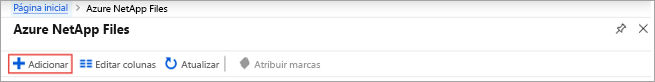

3. Na janela Nova Conta do NetApp, forneça as seguintes informações:
   1. Insira **myaccount1** para o nome da conta.
   2. Selecione sua assinatura.
   3. Selecione **Criar novo** para criar o grupo de recursos. Insira **myRG1** para o nome do grupo de recursos. Clique em **OK**.
   4. Selecione a localização da conta.

      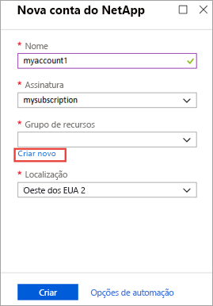

      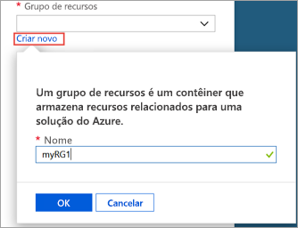

4. Clique em **Criar** para criar sua conta do NetApp.

# <a name="powershell"></a>[PowerShell](#tab/azure-powershell)

1. Defina algumas variáveis para podermos consultá-las durante o restante dos exemplos:

    ```powershell-interactive
    $resourceGroup = "myRG1"
    $location = "eastus"
    $anfAccountName = "myaccount1"
    ```

    > [!NOTE]
    > Veja os [Produtos disponíveis por região](https://azure.microsoft.com/global-infrastructure/services/?products=netapp&regions=all) para obter uma lista de regiões compatíveis.
    > Para obter o nome da região compatível com nossas ferramentas de linha de comando, use `Get-AzLocation | select Location`
    >

1. Crie um grupo de recursos usando o comando [New-AzResourceGroup](/powershell/module/az.resources/new-azresourcegroup):

    ```powershell-interactive
    New-AzResourceGroup -Name $resourceGroup -Location $location
    ```

2. Crie uma conta do Azure NetApp Files com o comando [New-AzNetAppFilesAccount](/powershell/module/az.netappfiles/New-AzNetAppFilesAccount):

    ```powershell-interactive
    New-AzNetAppFilesAccount -ResourceGroupName $resourceGroup -Location $location -Name $anfAccountName
    ```

# <a name="azure-cli"></a>[CLI do Azure](#tab/azure-cli)

1. Defina algumas variáveis para podermos consultá-las durante o restante dos exemplos:

    ```azurecli-interactive
    RESOURCE_GROUP="myRG1"
    LOCATION="eastus"
    ANF_ACCOUNT_NAME="myaccount1"
    ```

    > [!NOTE]
    > Veja os [Produtos disponíveis por região](https://azure.microsoft.com/global-infrastructure/services/?products=netapp&regions=all) para obter uma lista de regiões compatíveis.
    > Para obter o nome da região compatível com nossas ferramentas de linha de comando, use `az account list-locations --query "[].{Region:name}" --out table`
    >

2. Crie um grupo de recursos usando o comando [az group create](/cli/azure/group#az-group-create):

    ```azurecli-interactive
    az group create \
        --name $RESOURCE_GROUP \
        --location $LOCATION
    ```

3. Crie uma conta do Azure NetApp Files com o comando [az netappfiles account create](/cli/azure/netappfiles/account#az-netappfiles-account-create):

    ```azurecli-interactive
    az netappfiles account create \
        --resource-group $RESOURCE_GROUP \
        --location $LOCATION \
        --account-name $ANF_ACCOUNT_NAME
    ```

# <a name="template"></a>[Modelo](#tab/template)

[!INCLUDE [About Azure Resource Manager](../../includes/resource-manager-quickstart-introduction.md)]

O snippet de código a seguir mostrará como criar uma conta do NetApp em um modelo ARM (modelo do Azure Resource Manager) usando o recurso [Microsoft.NetApp/netAppAccounts](/azure/templates/microsoft.netapp/netappaccounts). Para executar o código, baixe o [modelo ARM completo](https://github.com/Azure/azure-quickstart-templates/blob/master/101-anf-nfs-volume/azuredeploy.json) de nosso repositório GitHub.

:::code language="json" source="~/quickstart-templates/101-anf-nfs-volume/azuredeploy.json" range="177-183":::

<!-- Block begins with "type": "Microsoft.NetApp/netAppAccounts", -->

---

## <a name="set-up-a-capacity-pool"></a>Configurar um pool de capacidade

# <a name="portal"></a>[Portal](#tab/azure-portal)

1. Na folha de gerenciamento do Azure NetApp Files, selecione sua conta do NetApp (**myaccount1**).

    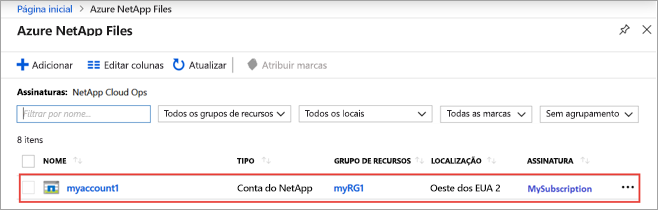

2. Na folha de gerenciamento do Azure NetApp Files de sua conta do NetApp, clique em **Pools de capacidade**.

    

3. Clique em **+ Adicionar pools**.

    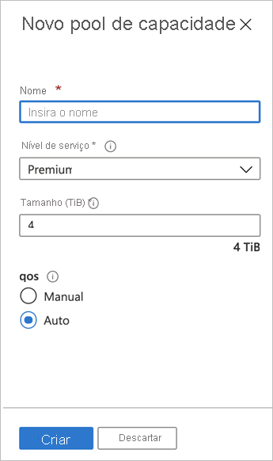

4. Forneça informações para o pool de capacidade:
    * Insira **mypool1** como o nome do pool.
    * Selecione **Premium** para o nível de serviço.
    * Especifique **4 (TiB)** como o tamanho do pool.
    * Use o tipo QoS **Automático**.

5. Clique em **Criar**.

# <a name="powershell"></a>[PowerShell](#tab/azure-powershell)

1. Definir algumas novas variáveis para referência futura

    ```powershell-interactive
    $poolName = "mypool1"
    $poolSizeBytes = 4398046511104 # 4TiB
    $serviceLevel = "Premium" # Valid values are Standard, Premium and Ultra
    ```

1. Crie um pool de capacidade usando o [New-AzNetAppFilesPool](/powershell/module/az.netappfiles/new-aznetappfilespool)

    ```powershell-interactive
    New-AzNetAppFilesPool -ResourceGroupName $resourceGroup -Location $location -AccountName $anfAccountName -Name $poolName -PoolSize $poolSizeBytes -ServiceLevel $serviceLevel
    ```

# <a name="azure-cli"></a>[CLI do Azure](#tab/azure-cli)

1. Definir algumas novas variáveis para referência futura

    ```azurecli-interactive
    POOL_NAME="mypool1"
    POOL_SIZE_TiB=4 # Size in Azure CLI needs to be in TiB unit (minimum 4 TiB)
    SERVICE_LEVEL="Premium" # Valid values are Standard, Premium and Ultra
    ```

2. Crie um pool de capacidade usando o [az netappfiles pool create](/cli/azure/netappfiles/pool#az-netappfiles-pool-create)

    ```azurecli-interactive
    az netappfiles pool create \
        --resource-group $RESOURCE_GROUP \
        --location $LOCATION \
        --account-name $ANF_ACCOUNT_NAME \
        --pool-name $POOL_NAME \
        --size $POOL_SIZE_TiB \
        --service-level $SERVICE_LEVEL
    ```

# <a name="template"></a>[Modelo](#tab/template)

<!-- [!INCLUDE [About Azure Resource Manager](../../includes/resource-manager-quickstart-introduction.md)] -->

O snippet de código a seguir mostrará como criar um pool de capacidade em um modelo ARM (modelo do Azure Resource Manager) usando o recurso [Microsoft.NetApp/netAppAccounts/capacityPools](/azure/templates/microsoft.netapp/netappaccounts/capacitypools). Para executar o código, baixe o [modelo ARM completo](https://github.com/Azure/azure-quickstart-templates/blob/master/101-anf-nfs-volume/azuredeploy.json) de nosso repositório GitHub.

:::code language="json" source="~/quickstart-templates/101-anf-nfs-volume/azuredeploy.json" range="184-196":::

<!-- LN 185, block begins with  "type": "Microsoft.NetApp/netAppAccounts/capacityPools", -->

---

## <a name="create-nfs-volume-for-azure-netapp-files"></a>Criar um volume NFS para Azure NetApp Files

# <a name="portal"></a>[Portal](#tab/azure-portal)

1. Na folha de gerenciamento do Azure NetApp Files de sua conta do NetApp, clique em **Volumes**.

    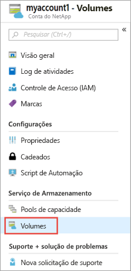

2. Clique em **+ Adicionar volume**.

    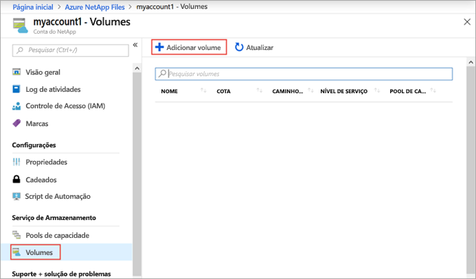

3. Na janela Criar um Volume, forneça informações para o volume:
   1. Insira **myvol1** como o nome do volume.
   2. Selecione o pool de capacidade (**mypool1**).
   3. Use o valor padrão para a cota.
   4. Na rede virtual, clique em **Criar nova** para criar uma VNET (rede virtual) do Azure.  Em seguida, preencha as seguintes informações:
       * Insira **myvnet1** como o nome da VNET.
       * Especifique um espaço de endereço para a configuração, por exemplo, 10.7.0.0/16
       * Insira **myANFsubnet** como o nome da sub-rede.
       * Especifique o intervalo de endereços da sub-rede, por exemplo, 10.7.0.0/24. Não é possível compartilhar a sub-rede dedicada com outros recursos.
       * Selecione **Microsoft.NetApp/volumes** para a delegação da sub-rede.
       * Clique em **OK** para criar a VNET.
   5. Na sub-rede, selecione a VNET recém-criada (**myvnet1**) como a sub-rede delegada.

      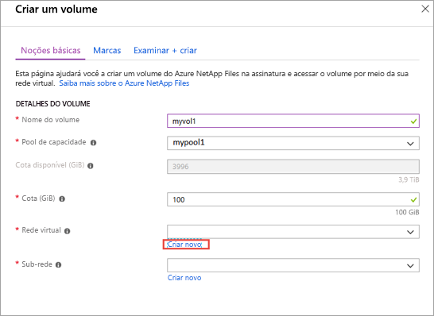

      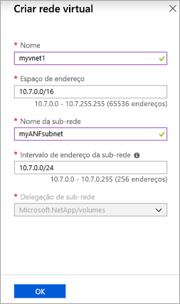

4. Clique em **Protocolo** e, em seguida, conclua as seguintes ações:
    * Selecione **NFS** como o tipo de protocolo para o volume.
    * Insira **myfilepath1** como o caminho do arquivo que será usado para criar o caminho de exportação para o volume.
    * Selecione a versão do NFS (**NFSv3** ou **NFSv4.1**) para o volume.
      Confira [considerações](azure-netapp-files-create-volumes.md#considerations) e [melhor prática](azure-netapp-files-create-volumes.md#best-practice) sobre versões de NFS.

    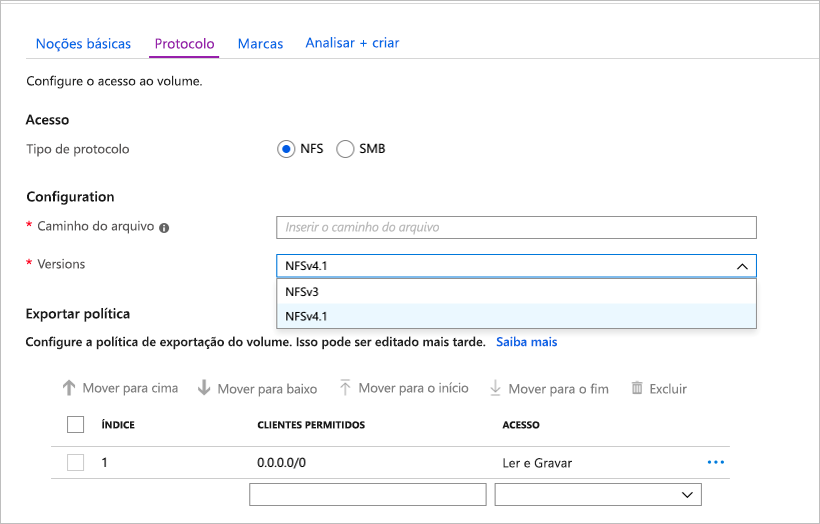

5. Clique em **Revisar + Criar**.

    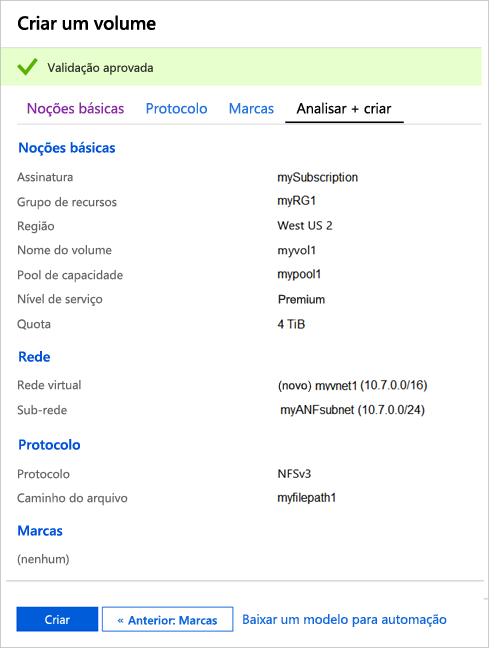

6. Examine as informações do volume e, em seguida, clique em **Criar**.
    O volume criado será exibido na folha Volumes.

    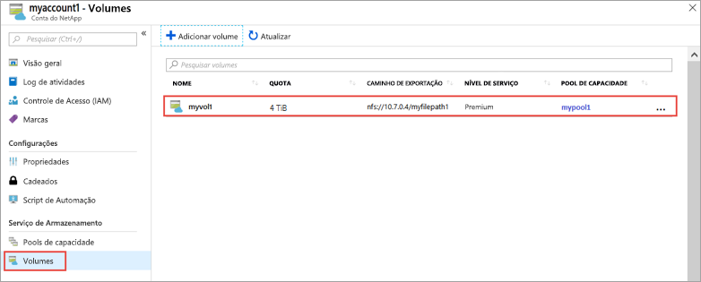

# <a name="powershell"></a>[PowerShell](#tab/azure-powershell)

1. Crie uma delegação de sub-rede para “Microsoft.NetApp/volumes” com o comando [New-AzDelegation](/powershell/module/az.network/new-azdelegation).

    ```powershell-interactive
    $anfDelegation = New-AzDelegation -Name ([guid]::NewGuid().Guid) -ServiceName "Microsoft.NetApp/volumes"
    ```

2. Crie uma configuração de sub-rede usando o comando [New-AzVirtualNetworkSubnetConfig](/powershell/module/az.network/new-azvirtualnetworksubnetconfig).

    ```powershell-interactive
    $subnet = New-AzVirtualNetworkSubnetConfig -Name "myANFSubnet" -AddressPrefix "10.7.0.0/24" -Delegation $anfDelegation
    ```

3. Crie a rede virtual usando o comando [New-AzVirtualNetwork](/powershell/module/az.network/new-azvirtualnetwork).

    ```powershell-interactive
    $vnet = New-AzVirtualNetwork -Name "myvnet1" -ResourceGroupName $resourceGroup -Location $location -AddressPrefix "10.7.0.0/16" -Subnet $subnet
    ```

4. Crie o volume usando o comando [New-AzNetAppFilesVolume](/powershell/module/az.netappfiles/new-aznetappfilesvolume).

    ```powershell-interactive
    $volumeSizeBytes = 1099511627776 # 100GiB
    $subnetId = $vnet.Subnets[0].Id

    New-AzNetAppFilesVolume -ResourceGroupName $resourceGroup `
        -Location $location `
        -AccountName $anfAccountName `
        -PoolName $poolName `
        -Name "myvol1" `
        -UsageThreshold $volumeSizeBytes `
        -SubnetId $subnetId `
        -CreationToken "myfilepath1" `
        -ServiceLevel $serviceLevel `
        -ProtocolType NFSv3
    ```

# <a name="azure-cli"></a>[CLI do Azure](#tab/azure-cli)

1. Definir algumas variáveis para uso futuro.

    ```azurecli-interactive
    VNET_NAME="myvnet1"
    SUBNET_NAME="myANFSubnet"
    ```

1. Crie uma rede virtual sem sub-rede usando o comando [az network vnet create](/cli/azure/network/vnet#az-network-vnet-create).

    ```azurecli-interactive
    az network vnet create \
        --resource-group $RESOURCE_GROUP \
        --name $VNET_NAME \
        --location $LOCATION \
        --address-prefix "10.7.0.0/16"

    ```

2. Crie uma sub-rede delegada usando o comando [az network vnet subnet create](/cli/azure/network/vnet/subnet#az-network-vnet-subnet-create).

    ```azurecli-interactive
    az network vnet subnet create \
        --resource-group $RESOURCE_GROUP \
        --vnet-name $VNET_NAME \
        --name $SUBNET_NAME \
        --address-prefixes "10.7.0.0/24" \
        --delegations "Microsoft.NetApp/volumes"
    ```

3. Crie o volume usando o comando [az netappfiles volume create](/cli/azure/netappfiles/volume#az-netappfiles-volume-create).

    ```azurecli-interactive
    VNET_ID=$(az network vnet show --resource-group $RESOURCE_GROUP --name $VNET_NAME --query "id" -o tsv)
    SUBNET_ID=$(az network vnet subnet show --resource-group $RESOURCE_GROUP --vnet-name $VNET_NAME --name $SUBNET_NAME --query "id" -o tsv)
    VOLUME_SIZE_GiB=100 # 100 GiB
    UNIQUE_FILE_PATH="myfilepath2" # Please note that creation token needs to be unique within subscription and region

    az netappfiles volume create \
        --resource-group $RESOURCE_GROUP \
        --location $LOCATION \
        --account-name $ANF_ACCOUNT_NAME \
        --pool-name $POOL_NAME \
        --name "myvol1" \
        --service-level $SERVICE_LEVEL \
        --vnet $VNET_ID \
        --subnet $SUBNET_ID \
        --usage-threshold $VOLUME_SIZE_GiB \
        --file-path $UNIQUE_FILE_PATH \
        --protocol-types "NFSv3"
    ```

# <a name="template"></a>[Modelo](#tab/template)

<!-- [!INCLUDE [About Azure Resource Manager](../../includes/resource-manager-quickstart-introduction.md)] -->

Os snippets de código a seguir mostrarão como configurar uma VNet e criar um volume do Azure NetApp Files em um modelo ARM (modelo do Azure Resource Manager). A configuração da VNet usará o recurso [Microsoft.Network/virtualNetworks](/azure/templates/Microsoft.Network/virtualNetworks). A criação de volume usará o recurso [Microsoft.NetApp/netAppAccounts/capacityPools/volumes](/azure/templates/microsoft.netapp/netappaccounts/capacitypools/volumes). Para executar o código, baixe o [modelo ARM completo](https://github.com/Azure/azure-quickstart-templates/blob/master/101-anf-nfs-volume/azuredeploy.json) de nosso repositório GitHub.

:::code language="json" source="~/quickstart-templates/101-anf-nfs-volume/azuredeploy.json" range="148-176":::

<!-- Block begins with  "type": "Microsoft.Network/virtualNetworks", -->

:::code language="json" source="~/quickstart-templates/101-anf-nfs-volume/azuredeploy.json" range="197-229":::

<!-- Block begins with  "type": "Microsoft.NetApp/netAppAccounts/capacityPools/volumes", -->

---

## <a name="clean-up-resources"></a>Limpar os recursos

# <a name="portal"></a>[Portal](#tab/azure-portal)

Quando você terminar, e se quiser, poderá excluir o grupo de recursos. A ação de exclusão de um grupo de recursos é irreversível.

> [!IMPORTANT]
> Todos os recursos dentro dos grupos de recursos serão excluídos permanentemente e não será possível desfazer essa ação.

1. Na caixa de pesquisa do portal do Azure, insira **Azure NetApp Files** e, em seguida, selecione **Azure NetApp Files** na lista exibida.

2. Na lista de assinaturas, clique no grupo de recursos (myRG1) que você quer excluir.

    


3. Na página de grupo de recursos, clique em **Excluir grupo de recursos**.

    

    Uma janela é aberta e exibe um aviso sobre os recursos que serão excluídos com o grupo de recursos.

4. Insira o nome do grupo de recursos (myRG1) para confirmar que você deseja excluir permanentemente o grupo de recursos e todos os recursos contidos nele e, em seguida, clique em **Excluir**.

    

# <a name="powershell"></a>[PowerShell](#tab/azure-powershell)

Quando você terminar, e se quiser, poderá excluir o grupo de recursos. A ação de exclusão de um grupo de recursos é irreversível.

> [!IMPORTANT]
> Todos os recursos dentro dos grupos de recursos serão excluídos permanentemente e não será possível desfazer essa ação.

1. Exclua o grupo de recursos usando o comando [Remove-AzResourceGroup](/powershell/module/az.resources/remove-azresourcegroup).

    ```powershell-interactive
    Remove-AzResourceGroup -Name $resourceGroup
    ```

# <a name="azure-cli"></a>[CLI do Azure](#tab/azure-cli)

Quando você terminar, e se quiser, poderá excluir o grupo de recursos. A ação de exclusão de um grupo de recursos é irreversível.

> [!IMPORTANT]
> Todos os recursos dentro dos grupos de recursos serão excluídos permanentemente e não será possível desfazer essa ação.

1. Exclua o grupo de recursos usando o comando [az group delete](/cli/azure/group#az-group-delete).

    ```azurecli-interactive
    az group delete \
        --name $RESOURCE_GROUP
    ```

# <a name="template"></a>[Modelo](#tab/template)

Nenhum.

Use o portal do Azure, o PowerShell ou a CLI do Azure para excluir o grupo de recursos.

---

## <a name="next-steps"></a>Próximas etapas

> [!div class="nextstepaction"]
> [Hierarquia de armazenamento do Azure NetApp Files](azure-netapp-files-understand-storage-hierarchy.md)

> [!div class="nextstepaction"]
> [Níveis de serviço do Azure NetApp Files](azure-netapp-files-service-levels.md)

> [!div class="nextstepaction"]
> [Criar um volume NFS](azure-netapp-files-create-volumes.md)
