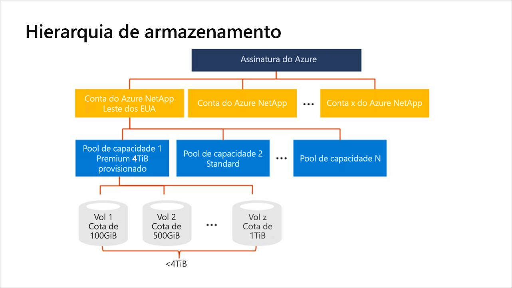

# Hierarquia de armazenamento do Azure NetApp Files

Antes de criar um volume no Azure NetApp Files, você deve adquirir e configurar um pool de capacidade provisionada.  Para configurar um pool de capacidade, é preciso ter uma conta do NetApp. Entender a hierarquia de armazenamento ajuda a configurar e gerenciar os recursos do Azure NetApp Files.

> [!IMPORTANT] 
> No momento, o Azure NetApp Files não dá suporte à migração de recursos entre assinaturas.

## Contas do NetApp

- Uma conta do NetApp serve como um agrupamento administrativo de pools de capacidade constituintes.  
- Uma conta da NetApp não é igual à sua conta geral de armazenamento do Azure. 
- Uma conta do NetApp é regional no escopo.   
- Você pode ter várias contas da NetApp em uma região, mas cada conta do NetApp é vinculada a apenas uma única região.

## Pools de capacidade

Entender como os pools de capacidade funcionam ajuda você a selecionar os tipos de pool de capacidade corretos para suas necessidades de armazenamento. 

### Regras gerais dos pools de capacidade

- Um pool de capacidade é medido pela sua capacidade provisionada.   
    Confira [Tipos de QoS](#qos_types) para obter informações adicionais.  
- A capacidade é provisionada pelos SKUs fixos comprados (por exemplo, uma capacidade de 4 TB).
- Um pool de capacidade só pode ter um nível de serviço.  
- Cada pool de capacidade pode pertencer a apenas uma conta do NetApp. No entanto, é possível ter vários pools de capacidade dentro de uma conta do NetApp.  
- Os pools de capacidade não podem ser movidos pelas contas do NetApp.   
  Por exemplo, no [Diagrama conceitual da hierarquia de armazenamento](#conceptual_diagram_of_storage_hierarchy) abaixo, o Pool de capacidade 1 não pode ser movido da conta do NetApp do Leste dos EUA para a conta do NetApp do Oeste dos EUA 2.  
- Um pool de capacidade não pode ser excluído até que todos os volumes dentro do pool de capacidade tenham sido excluídos.

### Tipos de QoS (Qualidade de Serviço) para os pools de capacidade

O tipo de QoS é um atributo de um pool de capacidade. O Azure NetApp Files fornece dois tipos de QoS de pools de capacidade. 

- Tipo de QoS *automático (ou auto)*  

    Quando você cria um pool de capacidade, o tipo de QoS padrão é o automático.

    Em um pool de capacidade com QoS automático, a taxa de transferência é atribuída automaticamente aos volumes no pool, proporcionalmente à cota de tamanho atribuída aos volumes. 

    A taxa de transferência máxima alocada a um volume depende do nível de serviço do pool de capacidade e da cota de tamanho do volume. Confira em [Níveis de serviço do Azure NetApp Files](azure-netapp-files-service-levels.md) um exemplo de cálculo.

- Tipo de QoS *manual*  

     > [!IMPORTANT] 
     > O uso do tipo de QoS manual para um pool de capacidade requer um registro.  Confira [Gerenciar um pool de capacidade com QoS manual](manage-manual-qos-capacity-pool.md).  

    Você tem a opção de usar o tipo de QoS manual para um pool de capacidade.

    Em um pool de capacidade com QoS manual, é possível atribuir a capacidade e a taxa de transferência a um volume de modo independente. A taxa de transferência total de todos os volumes criados com um pool de capacidade com QoS manual é limitada pela taxa de transferência total do pool.  Esse valor é determinado pela combinação do tamanho do pool com a taxa de transferência no nível do serviço. 

    Por exemplo, um pool de capacidade de 4 TiB com o nível de serviço Ultra tem uma capacidade de taxa de transferência total de 512 MiB/s (4 TiB x 128 MiB/s/TiB) disponível para os volumes.

## Volumes

- Um volume é medido pelo consumo da capacidade lógica e é dimensionável. 
- O consumo de capacidade de um volume conta contra a capacidade provisionada do pool desse volume.
- O consumo de taxa de transferência do volume é contabilizado com relação à taxa de transferência disponível do pool. Confira [Tipo de QoS manual](#manual_qos_type).
- Cada volume pertence a apenas um pool, mas um pool pode conter vários volumes. 

## Diagrama conceitual da hierarquia de armazenamento 
O exemplo a seguir mostra as relações da assinatura do Azure, contas do NetApp, pools de capacidade e volumes.   

## Próximas etapas

- [Limites de recursos do Azure NetApp Files](azure-netapp-files-resource-limits.md)
- [Registro no Azure NetApp Files](azure-netapp-files-register.md)
- [Níveis de serviço do Azure NetApp Files](azure-netapp-files-service-levels.md)
- [Considerações de desempenho para o Azure NetApp Files](azure-netapp-files-performance-considerations.md)
- [Configurar um pool de capacidade](azure-netapp-files-set-up-capacity-pool.md)
- [Gerenciar um pool de capacidade de QoS manual](manage-manual-qos-capacity-pool.md)
