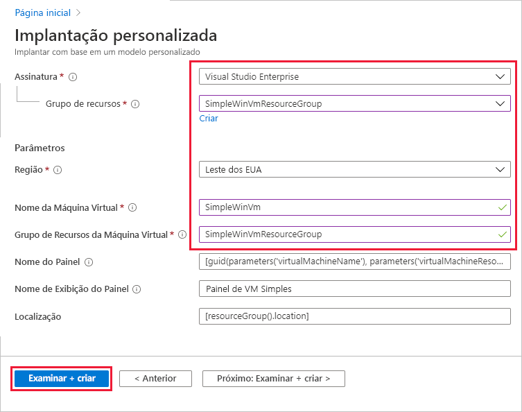
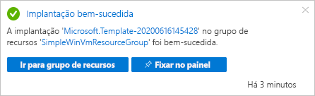
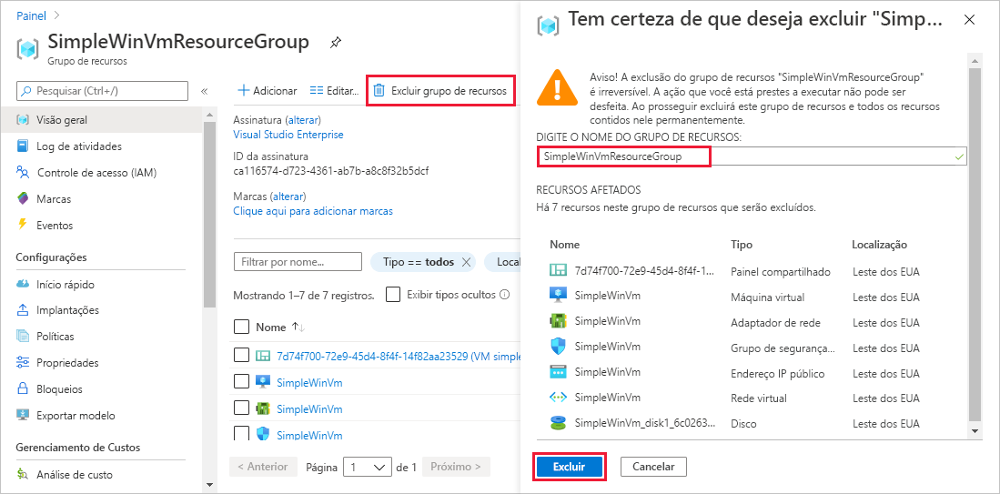

# <a name="quickstart-create-a-dashboard-in-the-azure-portal-by-using-an-arm-template"></a>Início Rápido: Criar um painel no portal do Azure usando um modelo do Resource Manager

Um painel no portal do Azure é uma exibição concentrada e organizada dos seus recursos da nuvem. Este guia de início rápido tem como foco o processo de implantação de um modelo do Azure Resource Manager para criação de um painel. O painel mostra o desempenho de uma VM (máquina virtual), bem como algumas informações e links estáticos.

[!INCLUDE [About Azure Resource Manager](../../includes/resource-manager-quickstart-introduction.md)]

Se seu ambiente atender aos pré-requisitos e você estiver familiarizado com o uso de modelos ARM, selecione o botão **Implantar no Azure**. O modelo será aberto no portal do Azure.

[](https://portal.azure.com/#create/Microsoft.Template/uri/https%3A%2F%2Fraw.githubusercontent.com%2FAzure%2Fazure-quickstart-templates%2Fmaster%2F101-azure-portal-dashboard%2Fazuredeploy.json)

## <a name="prerequisites"></a>Pré-requisitos

- Se você não tiver uma assinatura do Azure, crie uma [conta gratuita](https://azure.microsoft.com/free/?WT.mc_id=A261C142F) antes de começar.
- Uma VM existente.

## <a name="create-a-virtual-machine"></a>Criar uma máquina virtual

O painel que você criará na próxima parte deste guia de início rápido exige uma VM existente. Crie uma VM seguindo estas etapas.

1. No portal do Azure, selecione **Cloud Shell**.

    

1. Na janela **Cloud Shell**, selecione a opção **PowerShell**.

    

1. Copie o comando a seguir e insira-o no prompt de comando para criar um grupo de recursos.

    ```powershell
    New-AzResourceGroup -Name SimpleWinVmResourceGroup -Location EastUS
    ```

    

1. Copie o comando a seguir e insira-o no prompt de comando para criar uma VM no grupo de recursos.

    ```powershell
    New-AzVm `
        -ResourceGroupName "SimpleWinVmResourceGroup" `
        -Name "SimpleWinVm" `
        -Location "East US" 
    ```

1. Insira um nome de usuário e uma senha para a VM. Esse é um novo nome de usuário e uma nova senha; não é, por exemplo, a conta que você usa para entrar no Azure. Para obter mais informações, confira [Requisitos de nome de usuário](../virtual-machines/windows/faq.md#what-are-the-username-requirements-when-creating-a-vm) e [Requisitos de senha](../virtual-machines/windows/faq.md#what-are-the-password-requirements-when-creating-a-vm).

    A implantação da VM agora é iniciada e normalmente leva alguns minutos para ser concluída. Após a conclusão da implantação, vá para a próxima seção.

## <a name="review-the-template"></a>Examinar o modelo

O modelo usado neste início rápido é proveniente dos [Modelos de Início Rápido do Azure](https://azure.microsoft.com/resources/templates/101-azure-portal-dashboard/). O modelo deste artigo é muito longo para ser mostrado aqui. Para ver o modelo, confira [azuredeploy.json](https://raw.githubusercontent.com/Azure/azure-quickstart-templates/master/101-azure-portal-dashboard/azuredeploy.json). Um recurso do Azure é definido no modelo [Microsoft.Portal/dashboards](/azure/templates/microsoft.portal/dashboards) – Criar um painel no portal do Azure.

## <a name="deploy-the-template"></a>Implantar o modelo

1. Selecione a imagem a seguir para entrar no Azure e abrir um modelo.

    [](https://portal.azure.com/#create/Microsoft.Template/uri/https%3A%2F%2Fraw.githubusercontent.com%2FAzure%2Fazure-quickstart-templates%2Fmaster%2F101-azure-portal-dashboard%2Fazuredeploy.json)

1. Selecione ou insira os valores a seguir e escolha **Examinar + criar**.

    

    A menos que o valor seja especificado, use os valores padrão para criar o painel.

    * **Assinatura**: selecione uma assinatura do Azure.
    * **Grupo de recursos**: selecione **SimpleWinVmResourceGroup**.
    * **Localização**: selecione **Leste dos EUA**.
    * **Nome da Máquina Virtual**: insira **SimpleWinVm**.
    * **Grupo de Recursos da Máquina Virtual**: insira **SimpleWinVmResourceGroup**.

1. Selecione **Criar** ou **Comprar**. Depois que o painel for implantado com êxito, você receberá uma notificação:

    

O portal do Azure foi usado para implantar o modelo. Além do portal do Azure, você também pode usar o Azure PowerShell, a CLI do Azure e a API REST. Para saber mais sobre outros métodos de implantação, confira [Implantar modelos](../azure-resource-manager/templates/deploy-powershell.md).

## <a name="review-deployed-resources"></a>Examinar os recursos implantados

[!INCLUDE [azure-portal-review-deployed-resources](../../includes/azure-portal-review-deployed-resources.md)]

## <a name="clean-up-resources"></a>Limpar os recursos

Caso deseje remover a VM e o painel associado, exclua o grupo de recursos que os contém.

1. No portal do Azure, procure **SimpleWinVmResourceGroup** e selecione-o nos resultados da pesquisa.

1. Na página **SimpleWinVmResourceGroup**, selecione **Excluir grupo de recursos**, insira o nome do grupo de recursos para confirmá-lo e escolha **Excluir**.

    

## <a name="next-steps"></a>Próximas etapas

Para obter mais informações sobre os painéis no portal do Azure, confira:

> [!div class="nextstepaction"]
> [Criar e compartilhar painéis no portal do Azure](azure-portal-dashboards.md)