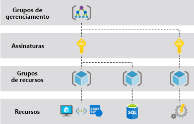

# O que é o Azure Resource Manager?

O Azure Resource Manager é p serviço de implantação e gerenciamento do Azure. Ele fornece uma camada de gerenciamento que lhe permite criar, atualizar e excluir recursos em sua conta do Azure. Use recursos de gerenciamento, como controle de acesso, bloqueios e marcas, para proteger e organizar seus recursos após a implantação.

Para saber mais sobre os modelos do ARM (Azure Resource Manager), confira a [visão geral da implantação de modelo](../templates/overview.md).

## Camada de gerenciamento consistente

Quando um usuário envia uma solicitação de ferramentas, APIs ou SDKs do Azure, o Resource Manager recebe a solicitação. Ele autentica e autoriza a solicitação. O Resource Manager envia a solicitação para o serviço do Azure, que executa a ação solicitada. Como todas as solicitações são manipuladas por meio da mesma API, você verá funcionalidades e resultados uniformes em todas as diferentes ferramentas.

A imagem a seguir mostra o papel que o Azure Resource Manager desempenha na manipulação de solicitações do Azure.

Todos as funcionalidades disponíveis no portal também estão disponíveis por meio do PowerShell, da CLI do Azure, das APIs REST e dos SDKs de cliente. A funcionalidade inicialmente lançada por meio de APIs será representada no portal em até 180 dias depois da versão inicial.

## Terminologia

Se você for um novo usuário do Azure Resource Manager, há alguns termos com os quais talvez você não esteja familiarizado.

* **recurso** -um item gerenciável que está disponível por meio do Azure. Máquinas virtuais, contas de armazenamento, aplicativos Web, bancos de dados e redes virtuais são exemplos de recursos. Grupos de recursos, assinaturas, grupos de gerenciamento e marcas também são exemplos de recursos.
* **grupo de recursos** - Um contêiner que mantém os recursos relacionados a uma solução do Azure. O grupo de recursos inclui esses recursos que você deseja gerenciar como um grupo. Você decide quais recursos pertencem a um grupo de recursos com base no que faz mais sentido para sua organização. Confira [Grupos de recursos](#resource-groups).
* **provedor de recursos** – um serviço que fornece recursos do Azure. Por exemplo, um provedor de recursos comum é `Microsoft.Compute`, que fornece o recurso de máquina virtual. `Microsoft.Storage` é outro provedor de recursos comum. Confira [Provedores e tipos de recurso](resource-providers-and-types.md).
* **Modelo do Resource Manager** – um arquivo JSON (JavaScript Object Notation) que define um ou mais recursos para implantação em um grupo de recursos, assinatura, grupo de gerenciamento ou locatário. O modelo pode ser usado para implantar os recursos de forma consiste e repetida. Confira [Visão geral da implantação de modelo](../templates/overview.md).
* **sintaxe declarativa** - sintaxe que permite a declaração "Isso é o que pretendo criar" sem precisar escrever a sequência de comandos de programação para criá-la. O modelo do Resource Manager é um exemplo de sintaxe declarativa. No arquivo, você define as propriedades da infraestrutura a ser implantada no Azure.  Confira [Visão geral da implantação de modelo](../templates/overview.md).

## Os benefícios de usar o Gerenciador de Recursos

Com o Resource Manager, você pode:

* Gerenciar sua infraestrutura por meio de modelos declarativos em vez de scripts.

* Implantar, gerenciar e monitorar todos os recursos da sua solução como um grupo em vez de tratá-los individualmente.

* Implantar novamente a solução em todo seu ciclo de vida de desenvolvimento e com a confiança de que seus recursos serão implantados em um estado consistente.

* Definir as dependências entre os recursos para que eles sejam implantados na ordem correta.

* Aplicar o controle de acesso a todos os serviços, pois o RBAC do Azure (controle de acesso baseado em função do Azure) é integrado nativamente à plataforma de gerenciamento.

* Aplicar marcas aos recursos para organizar de modo lógico todos os recursos em sua assinatura.

* Esclarecer a cobrança da sua organização exibindo os custos para um grupo de recursos que compartilha a mesma tag.

## Compreender o escopo

O Azure fornece quatro níveis de escopo: [grupos de gerenciamento](../../governance/management-groups/overview.md), assinaturas, [grupos de recursos](#resource-groups) e recursos. A imagem a seguir mostra um exemplo dessas camadas.

As configurações de gerenciamento são aplicadas em qualquer desses níveis de escopo. O nível que você seleciona determina o quão amplamente a configuração é aplicada. Os níveis inferiores herdam as configurações de níveis superiores. Por exemplo, ao aplicar uma [política](../../governance/policy/overview.md) à assinatura, ela será aplicada a todos os grupos de recursos e recursos em sua assinatura. Ao aplicar uma política no grupo de recursos, ela será aplicada ao grupo de recursos e a todos os recursos. No entanto, outro grupo de recursos não terá essa atribuição de política.

Você pode implantar modelos a locatários, grupos de gerenciamento, assinaturas ou grupos de recursos.

## Grupos de recursos

Existem alguns fatores importantes a considerar ao definir seu grupo de recursos:

* Todos os recursos do grupo de recursos devem compartilhar o ciclo de vida. Você os implanta, atualiza e exclui juntos. Se um recurso, como um servidor, precisar existir em um ciclo de implantação diferente, ele deverá estar em outro grupo de recursos.

* Cada recurso pode existir apenas em um grupo de recursos.

* Você pode adicionar ou remover um recurso de um grupo de recursos a qualquer momento.

* Você pode mover um recurso de um grupo de recursos para outro grupo. Para saber mais, confira [Mover recursos para um novo grupo de recursos ou assinatura](move-resource-group-and-subscription.md).

* Os recursos de um grupo de recursos podem estar localizados em regiões diferentes do grupo de recursos.

* Ao criar um grupo de recursos, você precisará fornecer um local para ele. Você pode estar se perguntando: "Por que um grupo de recursos precisa de um local? E, se os recursos podem ter locais diferentes do grupo de recursos, por que o local do grupo de recursos importa?" O grupo de recursos armazena metadados sobre os recursos. Quando você especifica uma localização para o grupo de recursos, você especifica onde os metadados são armazenados. Por motivos de conformidade, você precisa fazer com que os dados sejam armazenados em determinada região.

   Se a região do grupo de recursos está temporariamente indisponível, você não pode atualizar os recursos no grupo de recursos porque os metadados não estão disponíveis. Os recursos em outras regiões ainda funcionarão conforme o esperado, mas não será possível atualizá-los. Saiba mais sobre a criação de aplicativos confiáveis em [Desenvolver aplicativos do Azure confiáveis](/azure/architecture/checklist/resiliency-per-service).

* Um grupo de recursos pode ser usado para definir o escopo de controle de acesso para ações administrativas. Para gerenciar um grupo de recursos, você pode atribuir [Políticas do Azure](../../governance/policy/overview.md), [funções do Azure](../../role-based-access-control/role-assignments-portal.md) ou [bloqueios de recursos](lock-resources.md).

* Você pode [aplicar marcas](tag-resources.md) a um grupo de recursos. Os recursos do grupo de recursos não herdam essas marcas.

* Um recurso pode interagir com os recursos de outros grupos de recursos. Esse cenário é comum quando os dois recursos estão relacionados, mas não compartilham o ciclo de vida. Por exemplo, você pode ter um aplicativo Web que se conecta a um banco de dados em outro grupo de recursos.

* Quando você exclui um grupo de recursos, todos os recursos do grupo de recursos também são excluídos. Para obter informações sobre como o Azure Resource Manager orquestra essas exclusões, confira [Exclusão de grupo de recursos e recursos do Azure Resource Manager](delete-resource-group.md).

* Você pode implantar até 800 instâncias de um tipo de recurso em cada grupo de recursos. Alguns tipos de recursos são [isentos do limite de 800 instâncias](resources-without-resource-group-limit.md). Para obter mais informações, confira [limites do grupo de recursos](azure-subscription-service-limits.md#resource-group-limits).

* Alguns recursos podem existir fora de um grupo de recursos. Esses recursos são implantados na [assinatura](../templates/deploy-to-subscription.md), no [grupo de gerenciamento](../templates/deploy-to-management-group.md) ou no [locatário](../templates/deploy-to-tenant.md). Somente tipos de recursos específicos têm suporte nesses escopos.

* Para criar um grupo de recursos, use o [portal](manage-resource-groups-portal.md#create-resource-groups), o [PowerShell](manage-resource-groups-powershell.md#create-resource-groups), a [CLI do Azure](manage-resource-groups-cli.md#create-resource-groups) ou um [modelo do ARM](../templates/deploy-to-subscription.md#resource-groups).

## Resiliência do Azure Resource Manager

O serviço do Azure Resource Manager foi projetado para resiliência e disponibilidade contínua. As operações do Resource Manager e do painel de controle (solicitações enviadas para `management.azure.com`) na API REST são:

* Distribuídas entre regiões. Alguns serviços são regionais.

* Distribuídas entre Zonas de Disponibilidade (e regiões) em localizações que têm várias Zonas de Disponibilidade.

* Não dependem de um datacenter lógico único.

* Nunca são desativadas para atividades de manutenção.

Essa resiliência se aplica aos serviços que recebem solicitações por meio do Resource Manager. Por exemplo, o Key Vault se beneficia dessa resiliência.

## Próximas etapas

* Para saber mais sobre os limites aplicados aos serviços do Azure, confira [assinatura do Azure e limites de serviço, cotas e restrições](azure-subscription-service-limits.md).

* Para saber mais sobre como mover recursos, consulte [Mover recursos para o novo grupo de recursos ou assinatura](move-resource-group-and-subscription.md).

* Para saber mais sobre a marcação de recursos, confira [Usar marcas para organizar os recursos do Azure](tag-resources.md).

* Para saber mais sobre como bloquear recursos, confira [Bloquear recursos para impedir alterações inesperadas](lock-resources.md).
