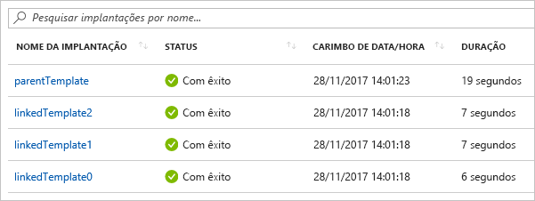

# <a name="using-linked-and-nested-templates-when-deploying-azure-resources"></a>Usando modelos vinculados e aninhados ao implantar os recursos do Azure

Para implantar soluções complexas, você pode dividir seu modelo de Azure Resource Manager (modelo ARM) em muitos modelos relacionados e implantá-los juntos por meio de um modelo principal. Os modelos relacionados podem ser arquivos separados ou a sintaxe de modelo que é inserida no modelo principal. Este artigo usa o termo **vinculado modelo** para se referir a um arquivo de modelo separado que é referenciado por meio de um link do modelo principal. Ele usa o termo **modelo aninhado** para se referir à sintaxe de modelo incorporado no modelo principal.

Para pequenas e médias soluções, um único modelo é mais fácil de entender e manter. Você pode ver todos os recursos e valores em um único arquivo. Para cenários avançados, os modelos vinculados permitem que você detalhe a solução em componentes de destino. Você pode reutilizar esses modelos para outros cenários com facilidade.

Para obter um tutorial, consulte [tutorial: implantar um modelo vinculado](./deployment-tutorial-linked-template.md).

> [!NOTE]
> Para modelos vinculados ou aninhados, você só pode definir o modo de implantação como [incremental](deployment-modes.md). No entanto, o modelo principal pode ser implantado no modo completo. Se você implantar o modelo principal no modo completo e o modelo vinculado ou aninhado tiver como alvo o mesmo grupo de recursos, os recursos implantados no modelo vinculado ou aninhado serão incluídos na avaliação para a implantação do modo completo. A coleção combinada de recursos implantados no modelo principal e em modelos vinculados ou aninhados é comparada com os recursos existentes no grupo de recursos. Todos os recursos não incluídos nessa coleção combinada são excluídos.
>
> Se o modelo vinculado ou aninhado tiver como alvo um grupo de recursos diferente, essa implantação usará o modo incremental.
>

## <a name="nested-template"></a>Modelo aninhado

Para aninhar um modelo, adicione um [recurso de implantações](/azure/templates/microsoft.resources/deployments) ao seu modelo principal. Na `template` propriedade, especifique a sintaxe do modelo.

```json
{
  "$schema": "https://schema.management.azure.com/schemas/2019-04-01/deploymentTemplate.json#",
  "contentVersion": "1.0.0.0",
  "parameters": {},
  "variables": {},
  "resources": [
    {
      "type": "Microsoft.Resources/deployments",
      "apiVersion": "2019-10-01",
      "name": "nestedTemplate1",
      "properties": {
        "mode": "Incremental",
        "template": {
          <nested-template-syntax>
        }
      }
    }
  ],
  "outputs": {
  }
}
```

O exemplo a seguir implanta uma conta de armazenamento por meio de um modelo aninhado.

```json
{
  "$schema": "https://schema.management.azure.com/schemas/2019-04-01/deploymentTemplate.json#",
  "contentVersion": "1.0.0.0",
  "parameters": {
    "storageAccountName": {
      "type": "string"
    }
  },
  "resources": [
    {
      "type": "Microsoft.Resources/deployments",
      "apiVersion": "2019-10-01",
      "name": "nestedTemplate1",
      "properties": {
        "mode": "Incremental",
        "template": {
          "$schema": "https://schema.management.azure.com/schemas/2019-04-01/deploymentTemplate.json#",
          "contentVersion": "1.0.0.0",
          "resources": [
            {
              "type": "Microsoft.Storage/storageAccounts",
              "apiVersion": "2019-04-01",
              "name": "[parameters('storageAccountName')]",
              "location": "West US",
              "sku": {
                "name": "Standard_LRS"
              },
              "kind": "StorageV2"
            }
          ]
        }
      }
    }
  ],
  "outputs": {
  }
}
```

### <a name="expression-evaluation-scope-in-nested-templates"></a>Escopo de avaliação de expressão em modelos aninhados

Ao usar um modelo aninhado, você pode especificar se as expressões de modelo serão avaliadas dentro do escopo do modelo pai ou do próprio modelo aninhado. O escopo determina como os parâmetros, as variáveis e as funções, como o [resourcegroup](template-functions-resource.md#resourcegroup) e a [assinatura](template-functions-resource.md#subscription) , são resolvidos.

Você define o escopo por meio da `expressionEvaluationOptions` propriedade. Por padrão, a `expressionEvaluationOptions` propriedade é definida como `outer` , o que significa que ele usa o escopo do modelo pai. Defina o valor como `inner` para fazer com que as expressões sejam avaliadas dentro do escopo do modelo aninhado.

```json
{
  "type": "Microsoft.Resources/deployments",
  "apiVersion": "2019-10-01",
  "name": "nestedTemplate1",
  "properties": {
    "expressionEvaluationOptions": {
      "scope": "inner"
    },
  ...
```

> [!NOTE]
>
> Quando o escopo é definido como `outer` , não é possível usar a `reference` função na seção de saídas de um modelo aninhado para um recurso que você implantou no modelo aninhado. Para retornar os valores de um recurso implantado em um modelo aninhado, use `inner` Scope ou Converta seu modelo aninhado em um modelo vinculado.

O modelo a seguir demonstra como as expressões de modelo são resolvidas de acordo com o escopo. Ele contém uma variável chamada `exampleVar` que é definida no modelo pai e no modelo aninhado. Ele retorna o valor da variável.

```json
{
  "$schema": "https://schema.management.azure.com/schemas/2019-04-01/deploymentTemplate.json#",
  "contentVersion": "1.0.0.0",
  "parameters": {
  },
  "variables": {
    "exampleVar": "from parent template"
  },
  "resources": [
    {
      "type": "Microsoft.Resources/deployments",
      "apiVersion": "2019-10-01",
      "name": "nestedTemplate1",
      "properties": {
        "expressionEvaluationOptions": {
          "scope": "inner"
        },
        "mode": "Incremental",
        "template": {
          "$schema": "https://schema.management.azure.com/schemas/2019-04-01/deploymentTemplate.json#",
          "contentVersion": "1.0.0.0",
          "variables": {
            "exampleVar": "from nested template"
          },
          "resources": [
          ],
          "outputs": {
            "testVar": {
              "type": "string",
              "value": "[variables('exampleVar')]"
            }
          }
        }
      }
    }
  ],
  "outputs": {
    "messageFromLinkedTemplate": {
      "type": "string",
      "value": "[reference('nestedTemplate1').outputs.testVar.value]"
    }
  }
}
```

O valor de `exampleVar` alterações dependendo do valor da `scope` propriedade em `expressionEvaluationOptions` . A tabela a seguir mostra os resultados para ambos os escopos.

| Escopo da avaliação | Saída |
| ----- | ------ |
| interna | do modelo aninhado |
| externo (ou padrão) | do modelo pai |

O exemplo a seguir implanta um SQL Server e recupera um segredo do Key Vault a ser usado para a senha. O escopo é definido como `inner` porque cria dinamicamente a ID do cofre de chaves (consulte `adminPassword.reference.keyVault` nos modelos externos `parameters` ) e a passa como um parâmetro para o modelo aninhado.

```json
{
  "$schema": "https://schema.management.azure.com/schemas/2019-04-01/deploymentTemplate.json#",
  "contentVersion": "1.0.0.0",
  "parameters": {
    "location": {
      "type": "string",
      "defaultValue": "[resourceGroup().location]",
      "metadata": {
        "description": "The location where the resources will be deployed."
      }
    },
    "vaultName": {
      "type": "string",
      "metadata": {
        "description": "The name of the keyvault that contains the secret."
      }
    },
    "secretName": {
      "type": "string",
      "metadata": {
        "description": "The name of the secret."
      }
    },
    "vaultResourceGroupName": {
      "type": "string",
      "metadata": {
        "description": "The name of the resource group that contains the keyvault."
      }
    },
    "vaultSubscription": {
      "type": "string",
      "defaultValue": "[subscription().subscriptionId]",
      "metadata": {
        "description": "The name of the subscription that contains the keyvault."
      }
    }
  },
  "resources": [
    {
      "type": "Microsoft.Resources/deployments",
      "apiVersion": "2019-10-01",
      "name": "dynamicSecret",
      "properties": {
        "mode": "Incremental",
        "expressionEvaluationOptions": {
          "scope": "inner"
        },
        "parameters": {
          "location": {
            "value": "[parameters('location')]"
          },
          "adminLogin": {
            "value": "ghuser"
          },
          "adminPassword": {
            "reference": {
              "keyVault": {
                "id": "[resourceId(parameters('vaultSubscription'), parameters('vaultResourceGroupName'), 'Microsoft.KeyVault/vaults', parameters('vaultName'))]"
              },
              "secretName": "[parameters('secretName')]"
            }
          }
        },
        "template": {
          "$schema": "https://schema.management.azure.com/schemas/2019-04-01/deploymentTemplate.json#",
          "contentVersion": "1.0.0.0",
          "parameters": {
            "adminLogin": {
              "type": "string"
            },
            "adminPassword": {
              "type": "securestring"
            },
            "location": {
              "type": "string"
            }
          },
          "variables": {
            "sqlServerName": "[concat('sql-', uniqueString(resourceGroup().id, 'sql'))]"
          },
          "resources": [
            {
              "type": "Microsoft.Sql/servers",
              "apiVersion": "2018-06-01-preview",
              "name": "[variables('sqlServerName')]",
              "location": "[parameters('location')]",
              "properties": {
                "administratorLogin": "[parameters('adminLogin')]",
                "administratorLoginPassword": "[parameters('adminPassword')]"
              }
            }
          ],
          "outputs": {
            "sqlFQDN": {
              "type": "string",
              "value": "[reference(variables('sqlServerName')).fullyQualifiedDomainName]"
            }
          }
        }
      }
    }
  ],
  "outputs": {
  }
}
```

Tenha cuidado ao usar valores de parâmetros seguros em um modelo aninhado. Se você definir o escopo como externo, os valores seguros serão armazenados como texto sem formatação no histórico de implantação. Um usuário que exibe o modelo no histórico de implantação pode ver os valores seguros. Em vez disso, use o escopo interno ou adicione ao modelo pai os recursos que precisam de valores seguros.

O trecho a seguir mostra quais valores são seguros e quais não são seguros.

```json
{
  "$schema": "https://schema.management.azure.com/schemas/2019-04-01/deploymentTemplate.json#",
  "contentVersion": "1.0.0.0",
  "parameters": {
    "adminUsername": {
      "type": "string",
      "metadata": {
        "description": "Username for the Virtual Machine."
      }
    },
    "adminPasswordOrKey": {
      "type": "securestring",
      "metadata": {
        "description": "SSH Key or password for the Virtual Machine. SSH key is recommended."
      }
    }
  },
  ...
  "resources": [
    {
      "type": "Microsoft.Compute/virtualMachines",
      "apiVersion": "2020-06-01",
      "name": "mainTemplate",
      "properties": {
        ...
        "osProfile": {
          "computerName": "mainTemplate",
          "adminUsername": "[parameters('adminUsername')]",
          "adminPassword": "[parameters('adminPasswordOrKey')]" // Yes, secure because resource is in parent template
        }
      }
    },
    {
      "name": "outer",
      "type": "Microsoft.Resources/deployments",
      "apiVersion": "2019-10-01",
      "properties": {
        "expressionEvaluationOptions": {
          "scope": "outer"
        },
        "mode": "Incremental",
        "template": {
          "$schema": "https://schema.management.azure.com/schemas/2019-04-01/deploymentTemplate.json#",
          "contentVersion": "1.0.0.0",
          "resources": [
            {
              "type": "Microsoft.Compute/virtualMachines",
              "apiVersion": "2020-06-01",
              "name": "outer",
              "properties": {
                ...
                "osProfile": {
                  "computerName": "outer",
                  "adminUsername": "[parameters('adminUsername')]",
                  "adminPassword": "[parameters('adminPasswordOrKey')]" // No, not secure because resource is in nested template with outer scope
                }
              }
            }
          ]
        }
      }
    },
    {
      "name": "inner",
      "type": "Microsoft.Resources/deployments",
      "apiVersion": "2019-10-01",
      "properties": {
        "expressionEvaluationOptions": {
          "scope": "inner"
        },
        "mode": "Incremental",
        "parameters": {
          "adminPasswordOrKey": {
              "value": "[parameters('adminPasswordOrKey')]"
          },
          "adminUsername": {
              "value": "[parameters('adminUsername')]"
          }
        },
        "template": {
          "$schema": "https://schema.management.azure.com/schemas/2019-04-01/deploymentTemplate.json#",
          "contentVersion": "1.0.0.0",
          "parameters": {
            "adminUsername": {
              "type": "string",
              "metadata": {
                "description": "Username for the Virtual Machine."
              }
            },
            "adminPasswordOrKey": {
              "type": "securestring",
              "metadata": {
                "description": "SSH Key or password for the Virtual Machine. SSH key is recommended."
              }
            }
          },
          "resources": [
            {
              "type": "Microsoft.Compute/virtualMachines",
              "apiVersion": "2020-06-01",
              "name": "inner",
              "properties": {
                ...
                "osProfile": {
                  "computerName": "inner",
                  "adminUsername": "[parameters('adminUsername')]",
                  "adminPassword": "[parameters('adminPasswordOrKey')]" // Yes, secure because resource is in nested template and scope is inner
                }
              }
            }
          ]
        }
      }
    }
  ]
}
```

## <a name="linked-template"></a>Modelo vinculado

Para vincular um modelo, adicione um [recurso de implantações](/azure/templates/microsoft.resources/deployments) ao seu modelo principal. Na `templateLink` propriedade, especifique o URI do modelo a ser incluído. O exemplo a seguir contém links para um modelo que está em uma conta de armazenamento.

```json
{
  "$schema": "https://schema.management.azure.com/schemas/2019-04-01/deploymentTemplate.json#",
  "contentVersion": "1.0.0.0",
  "parameters": {},
  "variables": {},
  "resources": [
    {
      "type": "Microsoft.Resources/deployments",
      "apiVersion": "2019-10-01",
      "name": "linkedTemplate",
      "properties": {
        "mode": "Incremental",
        "templateLink": {
          "uri":"https://mystorageaccount.blob.core.windows.net/AzureTemplates/newStorageAccount.json",
          "contentVersion":"1.0.0.0"
        }
      }
    }
  ],
  "outputs": {
  }
}
```

Ao fazer referência a um modelo vinculado, o valor de `uri` não pode ser um arquivo local ou um arquivo que está disponível apenas em sua rede local. Azure Resource Manager deve ser capaz de acessar o modelo. Forneça um valor de URI que pode ser baixado como HTTP ou HTTPS.

Você pode referenciar modelos usando parâmetros que incluem HTTP ou HTTPS. Por exemplo, um padrão comum é usar o `_artifactsLocation` parâmetro. Você pode definir o modelo vinculado com uma expressão como:

```json
"uri": "[concat(parameters('_artifactsLocation'), '/shared/os-disk-parts-md.json', parameters('_artifactsLocationSasToken'))]"
```

Se você estiver vinculando a um modelo no GitHub, use a URL bruta. O link tem o formato: `https://raw.githubusercontent.com/Azure/azure-docs-json-samples/master/get-started-with-templates/quickstart-template/azuredeploy.json` . Para obter o link bruto, selecione **RAW**.

:::image type="content" source="./media/linked-templates/select-raw.png" alt-text="Selecionar URL bruta":::

### <a name="parameters-for-linked-template"></a>Parâmetros para o modelo vinculado

Você pode fornecer os parâmetros para o modelo vinculado, seja em um arquivo externo ou embutido. Ao fornecer um arquivo de parâmetro externo, use a `parametersLink` Propriedade:

```json
"resources": [
  {
    "type": "Microsoft.Resources/deployments",
    "apiVersion": "2019-10-01",
    "name": "linkedTemplate",
    "properties": {
      "mode": "Incremental",
      "templateLink": {
        "uri": "https://mystorageaccount.blob.core.windows.net/AzureTemplates/newStorageAccount.json",
        "contentVersion": "1.0.0.0"
      },
      "parametersLink": {
        "uri": "https://mystorageaccount.blob.core.windows.net/AzureTemplates/newStorageAccount.parameters.json",
        "contentVersion": "1.0.0.0"
      }
    }
  }
]
```

Para passar valores de parâmetro embutidos, use a `parameters` propriedade.

```json
"resources": [
  {
    "type": "Microsoft.Resources/deployments",
    "apiVersion": "2019-10-01",
    "name": "linkedTemplate",
    "properties": {
      "mode": "Incremental",
      "templateLink": {
        "uri": "https://mystorageaccount.blob.core.windows.net/AzureTemplates/newStorageAccount.json",
        "contentVersion": "1.0.0.0"
      },
      "parameters": {
        "storageAccountName": {
          "value": "[parameters('storageAccountName')]"
        }
      }
    }
  }
]
```

Você não pode usar os dois parâmetros inline e um link para um arquivo de parâmetros. A implementação falha com um erro quando `parametersLink` e `parameters` são especificados.

### <a name="use-relative-path-for-linked-templates"></a>Usar caminho relativo para modelos vinculados

A `relativePath` propriedade de `Microsoft.Resources/deployments` torna mais fácil criar modelos vinculados. Essa propriedade pode ser usada para implantar um modelo vinculado remoto em um local relativo ao pai. Esse recurso requer que todos os arquivos de modelo sejam preparados e estejam disponíveis em um URI remoto, como o GitHub ou a conta de armazenamento do Azure. Quando o modelo principal é chamado usando um URI de Azure PowerShell ou CLI do Azure, o URI de implantação filho é uma combinação de pai e relativePath.

> [!NOTE]
> Ao criar um templateSpec, todos os modelos referenciados pela `relativePath` propriedade são empacotados no recurso templateSpec por Azure PowerShell ou CLI do Azure. Ele não exige que os arquivos sejam preparados. Para obter mais informações, consulte [criar uma especificação de modelo com modelos vinculados](./template-specs.md#create-a-template-spec-with-linked-templates).

Suponha uma estrutura de pastas como esta:


O modelo a seguir mostra como *mainTemplate.jsno* implanta *nestedChild.jssobre* ilustrado na imagem anterior.

```json
{
  "$schema": "https://schema.management.azure.com/schemas/2019-04-01/deploymentTemplate.json#",
  "contentVersion": "1.0.0.0",
  "parameters": {},
  "functions": [],
  "variables": {},
  "resources": [
    {
      "type": "Microsoft.Resources/deployments",
      "apiVersion": "2020-10-01",
      "name": "childLinked",
      "properties": {
        "mode": "Incremental",
        "templateLink": {
          "relativePath": "children/nestedChild.json"
        }
      }
    }
  ],
  "outputs": {}
}
```

Na implantação a seguir, o URI do modelo vinculado no modelo anterior é **https://raw.githubusercontent.com/Azure/azure-docs-json-samples/master/linked-template-relpath/children/nestedChild.json** .

# <a name="powershell"></a>[PowerShell](#tab/azure-powershell)

```azurepowershell
New-AzResourceGroupDeployment `
  -Name linkedTemplateWithRelativePath `
  -ResourceGroupName "myResourceGroup" `
  -TemplateUri "https://raw.githubusercontent.com/Azure/azure-docs-json-samples/master/linked-template-relpath/mainTemplate.json"
```

# <a name="azure-cli"></a>[CLI do Azure](#tab/azure-cli)

```azurecli
az deployment group create \
  --name linkedTemplateWithRelativePath \
  --resource-group myResourceGroup \
  --template-uri "https://raw.githubusercontent.com/Azure/azure-docs-json-samples/master/linked-template-relpath/mainTemplate.json"
```

---

Para implantar modelos vinculados com caminho relativo armazenado em uma conta de armazenamento do Azure, use o `QueryString` / `query-string` parâmetro para especificar o token SAS a ser usado com o parâmetro TemplateUri. Só há suporte para esse parâmetro no CLI do Azure versão 2,18 ou posterior e Azure PowerShell versão 5,4 ou posterior.

# <a name="powershell"></a>[PowerShell](#tab/azure-powershell)

```azurepowershell
New-AzResourceGroupDeployment `
  -Name linkedTemplateWithRelativePath `
  -ResourceGroupName "myResourceGroup" `
  -TemplateUri "https://stage20210126.blob.core.windows.net/template-staging/mainTemplate.json" `
  -QueryString $sasToken
```

# <a name="azure-cli"></a>[CLI do Azure](#tab/azure-cli)

```azurecli
az deployment group create \
  --name linkedTemplateWithRelativePath \
  --resource-group myResourceGroup \
  --template-uri "https://stage20210126.blob.core.windows.net/template-staging/mainTemplate.json" \
  --query-string $sasToken
```

---

Verifique se não há "?" à esquerda em QueryString. A implantação adiciona uma ao montar o URI para as implantações.

## <a name="template-specs"></a>Especificações de modelo

Em vez de manter seus modelos vinculados em um ponto de extremidade acessível, você pode criar uma [especificação de modelo](template-specs.md) que empacota o modelo principal e seus modelos vinculados em uma única entidade que você pode implantar. A especificação do modelo é um recurso em sua assinatura do Azure. Ele facilita o compartilhamento seguro do modelo com usuários em sua organização. Use o controle de acesso baseado em função do Azure (RBAC do Azure) para conceder acesso à especificação do modelo. Este recurso está atualmente em visualização.

Para obter mais informações, consulte:

- [Tutorial: criar uma especificação de modelo com modelos vinculados](./template-specs-create-linked.md).
- [Tutorial: implantar uma especificação de modelo como um modelo vinculado](./template-specs-deploy-linked-template.md).

## <a name="dependencies"></a>Dependências

Assim como ocorre com outros tipos de recursos, você pode definir dependências entre os modelos vinculados. Se os recursos em um modelo vinculado precisarem ser implantados antes dos recursos em um segundo modelo vinculado, defina o segundo modelo dependente do primeiro.

:::code language="json" source="~/resourcemanager-templates/azure-resource-manager/linkedtemplates/linked-dependency.json" highlight="10,22,24":::

## <a name="contentversion"></a>contentVersion

Você não precisa fornecer a `contentVersion` propriedade para a `templateLink` propriedade ou `parametersLink` . Se você não fornecer um `contentVersion` , a versão atual do modelo será implantada. Se você fornecer um valor para a versão do conteúdo, ele deve corresponder à versão do modelo vinculado; caso contrário, a implantação falhará com um erro.

## <a name="using-variables-to-link-templates"></a>Usando variáveis para vincular modelos

Os exemplos anteriores mostraram valores codificados de URL para os vínculos de modelo. Essa abordagem pode funcionar para um modelo simples, mas não funciona bem para um grande conjunto de modelos modulares. Em vez disso, você pode criar uma variável estática que armazena uma URL de base para o modelo principal e, em seguida, criar dinamicamente URLs para os modelos vinculados dessa URL de base. O benefício dessa abordagem é que você pode facilmente mover ou bifurcar o modelo porque precisa alterar apenas a variável estática no modelo principal. O modelo principal passa os URIs corretos em todo o modelo decomposto.

O exemplo a seguir mostra como usar uma URL base para criar duas URLs para modelos vinculados ( `sharedTemplateUrl` e `vmTemplateUrl` ).

```json
"variables": {
  "templateBaseUrl": "https://raw.githubusercontent.com/Azure/azure-quickstart-templates/master/postgresql-on-ubuntu/",
  "sharedTemplateUrl": "[uri(variables('templateBaseUrl'), 'shared-resources.json')]",
  "vmTemplateUrl": "[uri(variables('templateBaseUrl'), 'database-2disk-resources.json')]"
}
```

Você também pode usar [deployment()](template-functions-deployment.md#deployment) para obter a URL base para o modelo atual e usá-lo para obter a URL para outros modelos no mesmo local. Essa abordagem será útil se o local do modelo é alterado ou para evitar embutir URLs no arquivo de modelo. A `templateLink` propriedade só é retornada ao vincular a um modelo remoto com uma URL. Se você estiver usando um modelo local, essa propriedade não estará disponível.

```json
"variables": {
  "sharedTemplateUrl": "[uri(deployment().properties.templateLink.uri, 'shared-resources.json')]"
}
```

Por fim, você usaria a variável na `uri` propriedade de uma `templateLink` propriedade.

```json
"templateLink": {
 "uri": "[variables('sharedTemplateUrl')]",
 "contentVersion":"1.0.0.0"
}
```

## <a name="using-copy"></a>Usando a cópia

Para criar várias instâncias de um recurso com um modelo aninhado, adicione o `copy` elemento no nível do `Microsoft.Resources/deployments` recurso. Ou, se o escopo for `inner` , você poderá adicionar a cópia dentro do modelo aninhado.

O modelo de exemplo a seguir mostra como usar `copy` com um modelo aninhado.

```json
"resources": [
  {
    "type": "Microsoft.Resources/deployments",
    "apiVersion": "2019-10-01",
    "name": "[concat('nestedTemplate', copyIndex())]",
    // yes, copy works here
    "copy": {
      "name": "storagecopy",
      "count": 2
    },
    "properties": {
      "mode": "Incremental",
      "expressionEvaluationOptions": {
        "scope": "inner"
      },
      "template": {
        "$schema": "https://schema.management.azure.com/schemas/2019-04-01/deploymentTemplate.json#",
        "contentVersion": "1.0.0.0",
        "resources": [
          {
            "type": "Microsoft.Storage/storageAccounts",
            "apiVersion": "2019-04-01",
            "name": "[concat(variables('storageName'), copyIndex())]",
            "location": "West US",
            "sku": {
              "name": "Standard_LRS"
            },
            "kind": "StorageV2"
            // Copy works here when scope is inner
            // But, when scope is default or outer, you get an error
            // "copy": {
            //   "name": "storagecopy",
            //   "count": 2
            // }
          }
        ]
      }
    }
  }
]
```

## <a name="get-values-from-linked-template"></a>Obter valores de modelos vinculados

Para obter um valor de saída de um modelo vinculado, recupere o valor da propriedade com uma sintaxe semelhante a: `"[reference('deploymentName').outputs.propertyName.value]"`.

Ao obter uma propriedade de saída de um modelo vinculado, o nome da propriedade não deve incluir um traço.

Os exemplos a seguir demonstram como fazer referência a um modelo vinculado e recuperar um valor de saída. O modelo vinculado retorna uma mensagem simples. Primeiro, o modelo vinculado:

:::code language="json" source="~/resourcemanager-templates/azure-resource-manager/linkedtemplates/helloworld.json":::

O modelo principal implanta o modelo vinculado e obtém o valor retornado. Observe que ele faz referência aos recursos de implantação por nome, e ele usa o nome da propriedade retornada pelo modelo vinculado.

:::code language="json" source="~/resourcemanager-templates/azure-resource-manager/linkedtemplates/helloworldparent.json" highlight="10,23":::

O exemplo a seguir mostra um modelo que implanta um endereço IP público e retorna a ID de recurso do recurso do Azure para esse IP público:

:::code language="json" source="~/resourcemanager-templates/azure-resource-manager/linkedtemplates/public-ip.json" highlight="27":::

Para usar o endereço IP público do modelo anterior ao implantar um balanceador de carga, vincule ao modelo e declare uma dependência no `Microsoft.Resources/deployments` recurso. O endereço IP público no balanceador de carga é definido como o valor de saída do modelo vinculado.

:::code language="json" source="~/resourcemanager-templates/azure-resource-manager/linkedtemplates/public-ip-parentloadbalancer.json" highlight="28,41":::

## <a name="deployment-history"></a>Histórico de implantações

O Gerenciador de Recursos trata cada modelo como uma implantação separada no histórico de implantações. Um modelo principal com três modelos vinculados ou aninhados aparece no histórico de implantação como:



Você pode usar essas entradas separadas no histórico para recuperar valores de saída após a implantação. O modelo a seguir cria um endereço IP público e gera o endereço IP:

```json
{
  "$schema": "https://schema.management.azure.com/schemas/2019-04-01/deploymentTemplate.json#",
  "contentVersion": "1.0.0.0",
  "parameters": {
    "publicIPAddresses_name": {
      "type": "string"
    }
  },
  "variables": {},
  "resources": [
    {
      "type": "Microsoft.Network/publicIPAddresses",
      "apiVersion": "2018-11-01",
      "name": "[parameters('publicIPAddresses_name')]",
      "location": "southcentralus",
      "properties": {
        "publicIPAddressVersion": "IPv4",
        "publicIPAllocationMethod": "Static",
        "idleTimeoutInMinutes": 4,
        "dnsSettings": {
          "domainNameLabel": "[concat(parameters('publicIPAddresses_name'), uniqueString(resourceGroup().id))]"
        }
      },
      "dependsOn": []
    }
  ],
  "outputs": {
    "returnedIPAddress": {
      "type": "string",
      "value": "[reference(parameters('publicIPAddresses_name')).ipAddress]"
    }
  }
}
```

Os seguintes links de modelo para o modelo anterior. Ele cria três endereços IP públicos.

```json
{
  "$schema": "https://schema.management.azure.com/schemas/2019-04-01/deploymentTemplate.json#",
  "contentVersion": "1.0.0.0",
  "parameters": {
  },
  "variables": {},
  "resources": [
    {
      "type": "Microsoft.Resources/deployments",
      "apiVersion": "2019-10-01",
      "name": "[concat('linkedTemplate', copyIndex())]",
      "copy": {
        "count": 3,
        "name": "ip-loop"
      },
      "properties": {
        "mode": "Incremental",
        "templateLink": {
        "uri": "[uri(deployment().properties.templateLink.uri, 'static-public-ip.json')]",
        "contentVersion": "1.0.0.0"
        },
        "parameters":{
          "publicIPAddresses_name":{"value": "[concat('myip-', copyIndex())]"}
        }
      }
    }
  ]
}
```

Após a implantação, você pode recuperar os valores de saída com o seguinte script do PowerShell:

```azurepowershell-interactive
$loopCount = 3
for ($i = 0; $i -lt $loopCount; $i++)
{
  $name = 'linkedTemplate' + $i;
  $deployment = Get-AzResourceGroupDeployment -ResourceGroupName examplegroup -Name $name
  Write-Output "deployment $($deployment.DeploymentName) returned $($deployment.Outputs.returnedIPAddress.value)"
}
```

Ou, script da CLI do Azure em um shell Bash:

```azurecli-interactive
#!/bin/bash

for i in 0 1 2;
do
  name="linkedTemplate$i";
  deployment=$(az deployment group show -g examplegroup -n $name);
  ip=$(echo $deployment | jq .properties.outputs.returnedIPAddress.value);
  echo "deployment $name returned $ip";
done
```

## <a name="securing-an-external-template"></a>Proteger um modelo externo

Embora o modelo vinculado precise estar disponível externamente, ele não precisa estar disponível para o público. Você pode adicionar o modelo a uma conta de armazenamento privada que pode ser acessada somente pelo proprietário da conta de armazenamento. Em seguida, você cria um token SAS (assinatura de acesso compartilhado) para permitir o acesso durante a implantação. Você pode adicionar esse token SAS ao URI para o modelo vinculado. Embora o token seja transmitido como uma cadeia de caracteres segura, o URI do modelo vinculado, incluindo o token SAS, é registrado nas operações de implantação. Para limitar a exposição, defina uma expiração para o token.

O arquivo de parâmetro também pode ter o acesso limitado por meio de um token SAS.

No momento, não é possível vincular a um modelo em uma conta de armazenamento que está atrás de um [Firewall de armazenamento do Azure](../../storage/common/storage-network-security.md).

> [!IMPORTANT]
> Em vez de proteger seu modelo vinculado com um token SAS, considere a criação de uma [especificação de modelo](template-specs.md). A especificação do modelo armazena com segurança o modelo principal e seus modelos vinculados como um recurso em sua assinatura do Azure. Você usa o Azure RBAC para conceder acesso a usuários que precisam implantar o modelo.

O exemplo a seguir mostra como passar um token SAS ao vincular a um modelo:

```json
{
  "$schema": "https://schema.management.azure.com/schemas/2019-04-01/deploymentTemplate.json#",
  "contentVersion": "1.0.0.0",
  "parameters": {
    "containerSasToken": { "type": "securestring" }
  },
  "resources": [
    {
      "type": "Microsoft.Resources/deployments",
      "apiVersion": "2019-10-01",
      "name": "linkedTemplate",
      "properties": {
        "mode": "Incremental",
        "templateLink": {
          "uri": "[concat(uri(deployment().properties.templateLink.uri, 'helloworld.json'), parameters('containerSasToken'))]",
          "contentVersion": "1.0.0.0"
        }
      }
    }
  ],
  "outputs": {
  }
}
```

No PowerShell, você obtém um token para o contêiner e implanta os modelos com os comandos a seguir. Observe que o `containerSasToken` parâmetro é definido no modelo. Não é um parâmetro no `New-AzResourceGroupDeployment` comando.

```azurepowershell-interactive
Set-AzCurrentStorageAccount -ResourceGroupName ManageGroup -Name storagecontosotemplates
$token = New-AzStorageContainerSASToken -Name templates -Permission r -ExpiryTime (Get-Date).AddMinutes(30.0)
$url = (Get-AzStorageBlob -Container templates -Blob parent.json).ICloudBlob.uri.AbsoluteUri
New-AzResourceGroupDeployment -ResourceGroupName ExampleGroup -TemplateUri ($url + $token) -containerSasToken $token
```

Para a CLI do Azure em um shell Bash, você obtém um token para o contêiner e implanta os modelos com o seguinte código:

```azurecli-interactive
#!/bin/bash

expiretime=$(date -u -d '30 minutes' +%Y-%m-%dT%H:%MZ)
connection=$(az storage account show-connection-string \
  --resource-group ManageGroup \
  --name storagecontosotemplates \
  --query connectionString)
token=$(az storage container generate-sas \
  --name templates \
  --expiry $expiretime \
  --permissions r \
  --output tsv \
  --connection-string $connection)
url=$(az storage blob url \
  --container-name templates \
  --name parent.json \
  --output tsv \
  --connection-string $connection)
parameter='{"containerSasToken":{"value":"?'$token'"}}'
az deployment group create --resource-group ExampleGroup --template-uri $url?$token --parameters $parameter
```

## <a name="example-templates"></a>Modelos de exemplo

Os exemplos a seguir mostram os usos comuns dos modelos vinculados.

|Modelo principal  |Modelo vinculado |Descrição  |
|---------|---------| ---------|
|[Olá, Mundo](https://github.com/Azure/azure-docs-json-samples/blob/master/azure-resource-manager/linkedtemplates/helloworldparent.json) |[modelo vinculado](https://github.com/Azure/azure-docs-json-samples/blob/master/azure-resource-manager/linkedtemplates/helloworld.json) | Retorna a cadeia de caracteres do modelo vinculado. |
|[Azure Load Balancer com o endereço IP público](https://github.com/Azure/azure-docs-json-samples/blob/master/azure-resource-manager/linkedtemplates/public-ip-parentloadbalancer.json) |[modelo vinculado](https://github.com/Azure/azure-docs-json-samples/blob/master/azure-resource-manager/linkedtemplates/public-ip.json) |Retorna o endereço IP público do modelo vinculado e define esse valor no balanceador de carga. |
|[Vários endereços IP](https://github.com/Azure/azure-docs-json-samples/blob/master/azure-resource-manager/linkedtemplates/static-public-ip-parent.json) | [modelo vinculado](https://github.com/Azure/azure-docs-json-samples/blob/master/azure-resource-manager/linkedtemplates/static-public-ip.json) |Cria vários endereços IP públicos no modelo vinculado.  |

## <a name="next-steps"></a>Próximas etapas

* Para percorrer um tutorial, consulte [tutorial: implantar um modelo vinculado](./deployment-tutorial-linked-template.md).
* Para saber mais sobre como definir a ordem de implantação para seus recursos, consulte [definir a ordem de implantação de recursos em modelos ARM](define-resource-dependency.md).
* Para saber como definir um recurso, mas criar várias instâncias dele, consulte [iteração de recurso em modelos ARM](copy-resources.md).
* Para obter as etapas sobre como configurar um modelo em uma conta de armazenamento e gerar um token SAS, consulte [implantar recursos com modelos ARM e Azure PowerShell](deploy-powershell.md) ou [implantar recursos com modelos ARM e CLI do Azure](deploy-cli.md).
