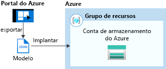
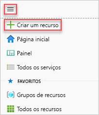
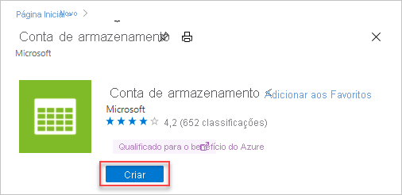
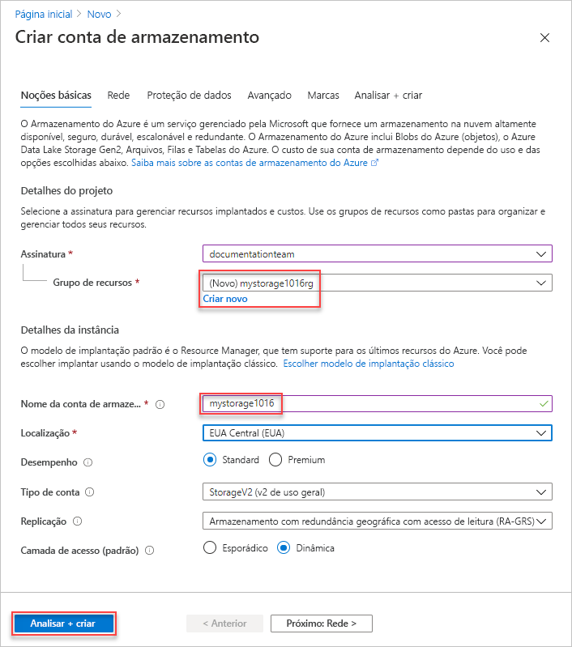
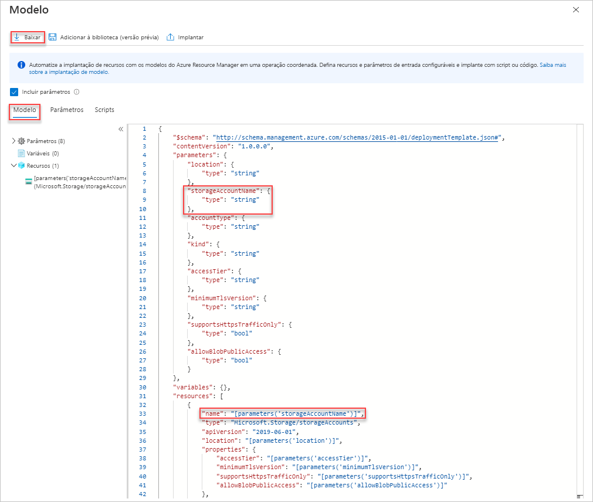
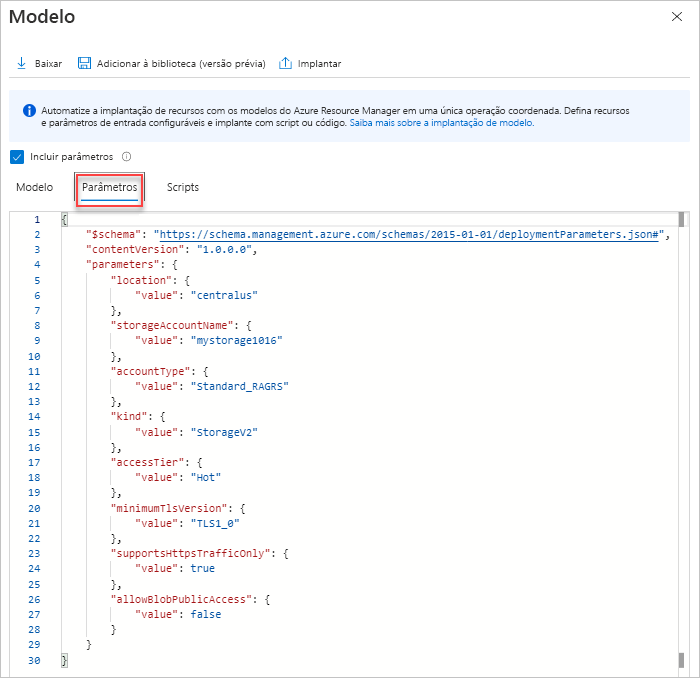
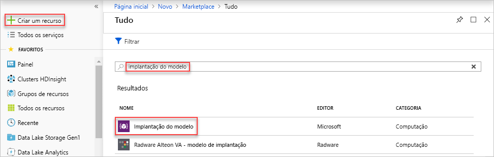
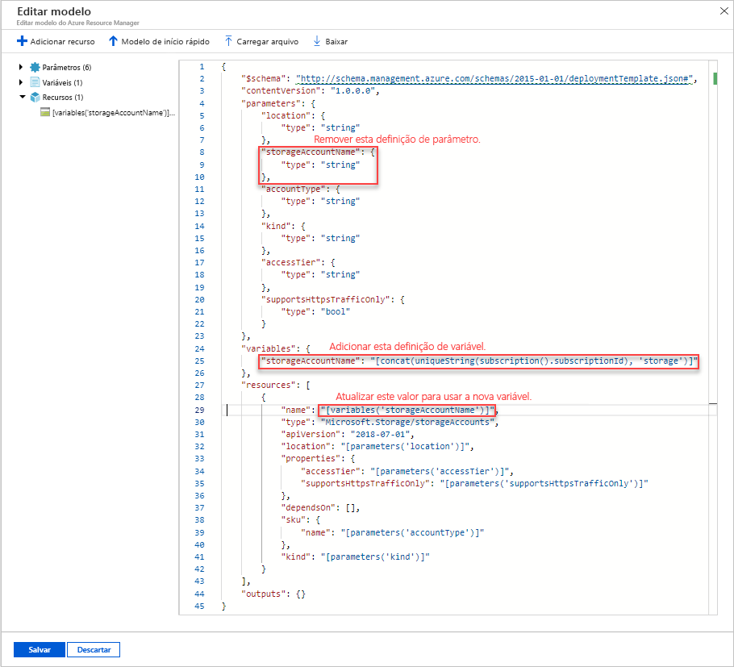
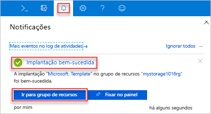
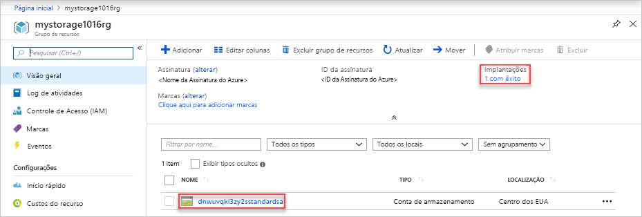

# <a name="quickstart-create-and-deploy-arm-templates-by-using-the-azure-portal"></a>Início Rápido: Criar e implantar modelos do ARM usando o portal do Azure

Saiba como gerar um modelo do ARM (Azure Resource Manager) usando o portal do Azure e conheça o processo de edição e implantação do modelo por meio do portal. Os modelos do ARM são arquivos JSON que definem os recursos necessários para implantar sua solução. Para entender os conceitos associados à implantação e ao gerenciamento de soluções do Azure, confira a [visão geral da implantação de modelo](overview.md).

Depois de concluir o tutorial, você implantará uma conta do Armazenamento do Azure. O mesmo processo pode ser usado para implantar outros recursos do Azure.



Se você não tiver uma assinatura do Azure, [crie uma conta gratuita](https://azure.microsoft.com/free/) antes de começar.

## <a name="generate-a-template-using-the-portal"></a>Gerar um modelo usando o portal do Azure

Criar um modelo do ARM do zero não é uma tarefa fácil, especialmente se você não está familiarizado com a implantação do Azure nem com o formato JSON. Usando o portal do Azure, você pode configurar um recurso, por exemplo, uma conta do Armazenamento do Azure. Antes de implantar o recurso, você pode exportar a configuração para um modelo. Você pode salvar o modelo e reutilizá-lo no futuro.

Muitos desenvolvedores de modelos experientes usam esse método para gerar modelos quando tentam implantar recursos do Azure com os quais não estão familiarizados. Para obter mais informações sobre como exportar modelos usando o portal, consulte [Exportar grupos de recursos para modelos](../management/manage-resource-groups-portal.md#export-resource-groups-to-templates). A outra forma de localizar um modelo de trabalho é a partir dos [Modelos de Início Rápido do Azure](https://azure.microsoft.com/resources/templates/).

1. Em um navegador da Web, prossiga para o [portal do Azure](https://portal.azure.com) e entre.
1. No menu do portal do Azure, selecione **Criar um recurso**.

    

1. Na caixa de pesquisa, digite **conta de armazenamento** e pressione **[ENTER]** .
1. Selecione a seta para baixo ao lado de **Criar**. Depois selecione **Conta de armazenamento**.

    

1. Insira as seguintes informações:

    |Nome|Valor|
    |----|----|
    |**Grupo de recursos**|Selecione **Criar** e especifique um nome de grupo de recursos de sua escolha. Na captura de tela, o nome do grupo de recursos é *mystorage1016rg*. Um grupo de recursos é um contêiner para os recursos do Azure. O grupo de recursos facilita o gerenciamento de recursos do Azure. |
    |**Nome**|Dê um nome exclusivo à conta de armazenamento. O nome da conta de armazenamento deve ser exclusivo em todo o Azure e conter apenas letras minúsculas e números. O nome deve ter entre 3 e 24 caracteres. Se você receber uma mensagem de erro informando "O nome da conta de armazenamento 'mystorage1016' já foi preenchido", tente usar **&lt;seu nome>storage&lt;Data de hoje em MMDD>** , por exemplo **joaodolestorage1016**. Para obter mais informações, consulte [Regras e restrições de nomenclatura](/azure/architecture/best-practices/resource-naming).|

    Você pode usar valores padrão para as outras propriedades.

    

    > [!NOTE]
    > Alguns dos modelos exportados exigem algumas edições antes da implantação.

1. Selecione **Revisar + criar** na parte inferior da tela. Não selecione **Criar** na próxima etapa.
1. Selecione **Baixar um modelo para automação** na parte inferior da tela. O portal mostra o modelo gerado:

    

    O painel principal mostra o modelo. É um arquivo JSON com seis elementos de nível superior – `schema`, `contentVersion`, `parameters`, `variables`, `resources` e `output`. Para obter mais informações, confira [Noções básicas de estrutura e da sintaxe dos modelos do ARM](./template-syntax.md)

    Há nove parâmetros definidos. Um deles é chamado **storageAccountName**. A segunda parte realçada na captura de tela anterior mostra como referenciar esse parâmetro no modelo. Na próxima seção, você deve editar o modelo para usar um nome gerado para a conta de armazenamento.

    No modelo, um recurso do Azure é definido. O tipo é `Microsoft.Storage/storageAccounts`. Examine como o recurso é definido e a estrutura de definição.
1. Selecione **Baixar** na parte superior da tela.
1. Abra o arquivo zip baixado e salve **template.json** no computador. Na próxima seção, você pode usar uma ferramenta de implantação de modelo para editar o modelo.
1. Selecione a guia **Parâmetro** para ver os valores fornecidos para os parâmetros. Anote esses valores, você precisará deles na próxima seção quando implantar o modelo.

    

    Usando o arquivo de modelo e o arquivo de parâmetros é possível criar um recurso, neste tutorial, uma conta de armazenamento do Azure.

## <a name="edit-and-deploy-the-template"></a>Editar e implantar o modelo

O portal do Azure pode ser usado para executar uma edição básica do modelo. Neste início rápido, você usa uma ferramenta do portal chamada *Implantação de modelo*. A *Implantação de Modelo* é usada neste tutorial; portanto, você pode concluir todo o tutorial usando uma só interface – o portal do Azure. Para editar um modelo mais complexo, considere o uso do [Visual Studio Code](quickstart-create-templates-use-visual-studio-code.md), que fornece funcionalidades mais avançadas de edição.

> [!IMPORTANT]
> A Implantação de modelo fornece uma interface para testar modelos simples. Não é recomendável usar esse recurso na produção. Em vez disso, armazene seus modelos em uma conta de armazenamento do Azure ou um repositório de código-fonte, como GitHub.

O Azure exige que cada serviço do Azure tenha um nome exclusivo. A implantação poderá falhar se você inserir um nome de conta de armazenamento que já existe. Para evitar esse problema, você modificará o modelo, de modo que ele use uma chamada de função de modelo `uniquestring()` para gerar um nome exclusivo de conta de armazenamento.

1. No menu do portal do Azure, na caixa de pesquisa, digite **implantar** e selecione **Implantar um modelo personalizado**.

    

1. Selecione **Criar seu próprio modelo no editor**.
1. Selecione **Carregar arquivo** e, em seguida, siga as instruções para carregar o template.json que você baixou na última seção.
1. Faça as três alterações a seguir no modelo:

    

   - Remova o parâmetro **storageAccountName**, conforme mostrado na captura de tela anterior.
   - Adicione uma variável chamada **storageAccountName**, conforme mostrado na captura de tela anterior:

      ```json
      "storageAccountName": "[concat(uniqueString(subscription().subscriptionId), 'storage')]"
      ```

      Duas funções de modelo são usadas aqui: `concat()` e `uniqueString()`.
   - Atualize o elemento de nome do recurso **Storage/storageaccounts** para usar a variável definida recentemente em vez do parâmetro:

      ```json
      "name": "[variables('storageAccountName')]",
      ```

      O modelo final deverá ficar assim:

      ```json
      {
        "$schema": "http://schema.management.azure.com/schemas/2015-01-01/deploymentTemplate.json#",
        "contentVersion": "1.0.0.0",
        "parameters": {
          "location": {
            "type": "string"
          },
          "accountType": {
            "type": "string"
          },
          "kind": {
            "type": "string"
          },
          "accessTier": {
            "type": "string"
          },
          "minimumTlsVersion": {
            "type": "string"
          },
          "supportsHttpsTrafficOnly": {
            "type": "bool"
          },
          "allowBlobPublicAccess": {
            "type": "bool"
          },
          "allowSharedKeyAccess": {
            "type": "bool"
          }
        },
        "variables": {
          "storageAccountName": "[concat(uniqueString(subscription().subscriptionId), 'storage')]"
        },
        "resources": [
          {
            "name": "[variables('storageAccountName')]",
            "type": "Microsoft.Storage/storageAccounts",
            "apiVersion": "2019-06-01",
            "location": "[parameters('location')]",
            "properties": {
              "accessTier": "[parameters('accessTier')]",
              "minimumTlsVersion": "[parameters('minimumTlsVersion')]",
              "supportsHttpsTrafficOnly": "[parameters('supportsHttpsTrafficOnly')]",
              "allowBlobPublicAccess": "[parameters('allowBlobPublicAccess')]",
              "allowSharedKeyAccess": "[parameters('allowSharedKeyAccess')]"
            },
            "dependsOn": [],
            "sku": {
              "name": "[parameters('accountType')]"
            },
            "kind": "[parameters('kind')]",
            "tags": {}
          }
        ],
        "outputs": {}
      }
      ```

1. Clique em **Salvar**.
1. Insira os valores a seguir:

    |Nome|Valor|
    |----|----|
    |**Grupo de recursos**|Selecione o nome do grupo de recursos criado na última seção. |
    |**Região**|Selecione um local para o grupo de recursos. Por exemplo, **Centro dos EUA**. |
    |**Localidade**|Selecione um local para a conta de armazenamento. Por exemplo, **Centro dos EUA**. |
    |**Tipo de conta**|Insira **Standard_LRS** para este início rápido. |
    |**Tipo**|Insira **StorageV2** para este início rápido. |
    |**Camada de acesso**|Insira **Quente** para este início rápido. |
    |**Versão mínima do TLS**|Insira **TLS1_0**. |
    |**Somente dá suporte ao Tráfego HTTPS**| Selecione **true** para este início rápido. |
    |**Permitir Acesso Público ao Blob**| Selecione **false** para este início rápido. |
    |**Conceder Acesso à Chave Compartilhada**| Selecione **true** para este início rápido. |

1. Selecione **Examinar + criar**.
1. Selecione **Criar**.
1. Selecione o ícone de sino (notificações) na parte superior da tela para ver o status da implantação. Você deverá ver a mensagem **Implantação em andamento**. Aguarde até a conclusão da implantação.

    

1. Selecione **Ir para o grupo de recursos** no painel de notificação. Você verá uma tela semelhante a:

    

    Veja que a implantação foi bem-sucedida, e há apenas uma conta de armazenamento no grupo de recursos. O nome da conta de armazenamento é uma cadeia de caracteres exclusiva gerada pelo modelo. Para saber mais sobre como usar as contas de armazenamento do Azure, confira [Início rápido: carregar, baixar e listar blobs usando o portal do Azure](../../storage/blobs/storage-quickstart-blobs-portal.md).

## <a name="clean-up-resources"></a>Limpar os recursos

Quando os recursos do Azure já não forem necessários, limpe os recursos implantados excluindo o grupo de recursos.

1. No portal do Azure, selecione **Grupos de recursos** no menu esquerdo.
1. No campo **Filtrar por nome**, insira o nome do grupo de recursos.
1. Selecione o nome do grupo de recursos.  Você deverá ver a conta de armazenamento no grupo de recursos.
1. Selecione **Excluir grupo de recursos** no menu superior.

## <a name="next-steps"></a>Próximas etapas

Neste tutorial, você aprendeu a gerar um modelo no portal do Azure e a implantar o modelo usando o portal. O modelo usado neste Início Rápido é um modelo simples com um recurso do Azure. Quando o modelo é complexo, é mais fácil usar o Visual Studio Code ou o Visual Studio para desenvolvê-lo. Para saber mais sobre o desenvolvimento de modelos, confira nossa nova série de tutoriais para iniciantes:

> [!div class="nextstepaction"]
> [Tutoriais para iniciante](./template-tutorial-create-first-template.md)
